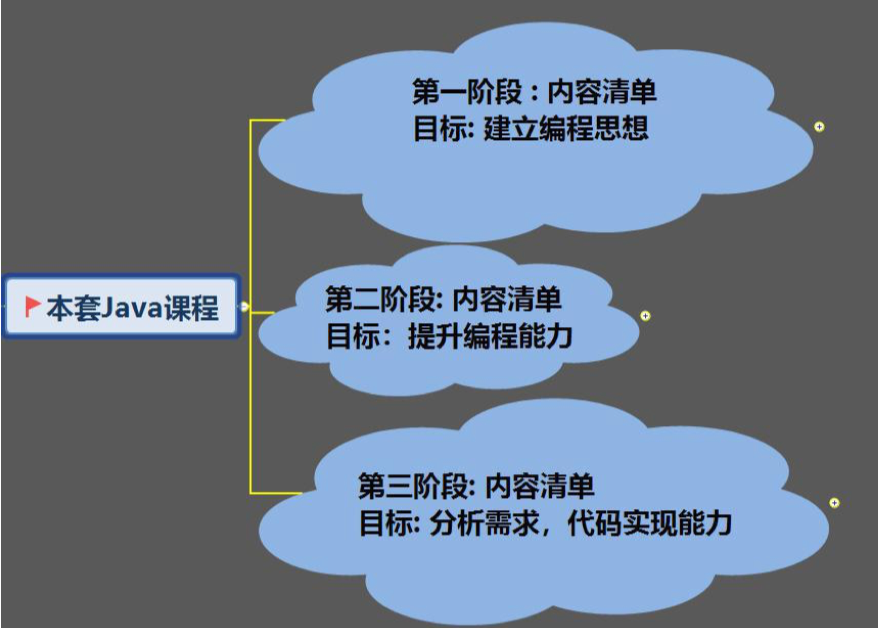
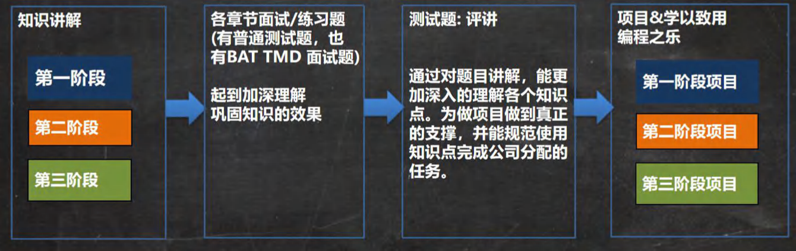
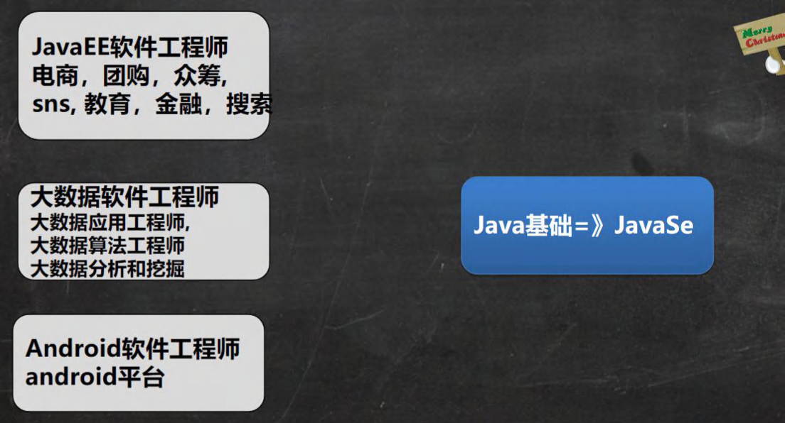
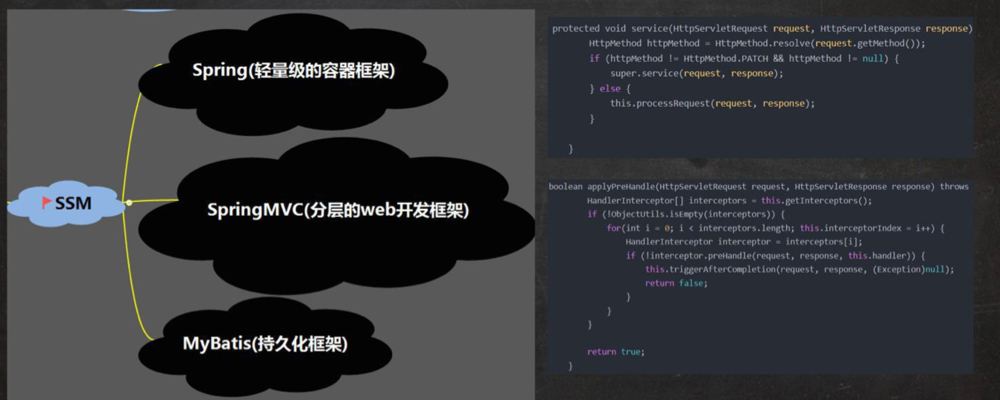
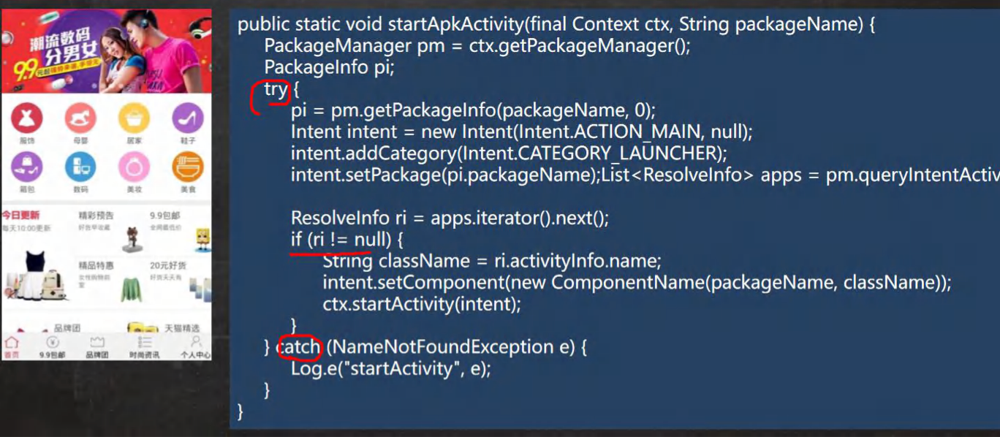
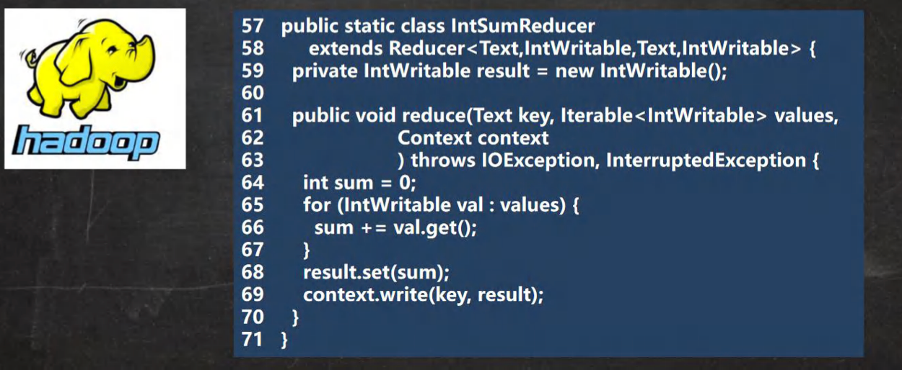
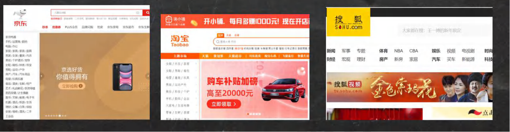

## 第1章 内容介绍

### 1.1 本套Java课程内容

#### 1.1.1课程的三个阶段

#### 1.1.2 关于课程的说明

关于这套课程，老韩要给小伙伴们说：

1. 以培养编程思想、提升编程能力为核心目标，达到能分析业务需求，并能用代码实现水平
2. 抛弃传统的以强灌知识点授课方式，每个阶段都有多个项目把知识点真正应用到项目中, 小伙伴在学习过程中有满 满成就感，充分体会编程乐趣
3. 课程成完整体系，超全，超详细。
4. 充分考虑零基础小伙伴，通俗易懂
5. 宁肯慢点，也不遗漏细节。[包括软件安装、开发环境配置和使用]
6. 项目是从小到大的过程，项目分解成不同的功能模块，随功能的增加,将知识点融入到项目，整个过程是循序渐进的。 让大家轻松的学，高效的学。
7. 为减轻小伙伴学习压力，将课程分为三个阶段，小伙伴可以根据当前水平，选择从某个阶段开始学习
8. 零基础的小伙伴，老韩强烈建议从第一阶段开始学习.
9. 因为课程内容非常全，录制周期长，老韩也会根据实际情况做微调

#### 1.1.3 课程特色

### 1.2 Java就业方向

### 1.3 Java 开发场景举例 1：SSM

### 1.4 Java 开发场景举例 2：Android 核心代码

### 1.5 Java 开发场景举例 3：大数据-hadoop

### 1.6 Java 的应用领域

#### 1.6.1 企业级应用

​	主要指复杂的大企业的软件系统、各种类型的网站。应用领域包括金融、电信、交通、电子商务等。

#### 1.6.2 Android平台应用

​	Android 应用程序使用 Java 语言编写。Android 开发水平的高低很大程度上取决于 Java 语言核心能力是否扎实。

#### 1.6.3 移动领域应用

​	主要表现在消费和嵌入式领域，是指在各种小型设备上的应用，包括机顶盒、车载的大屏影音娱乐设备、汽车通信设备、扫码的 POS 机等。

