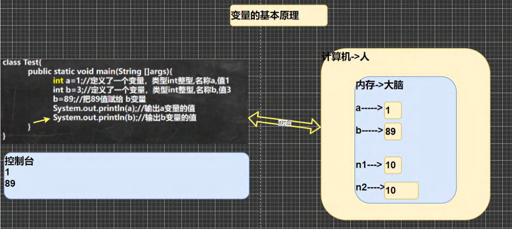
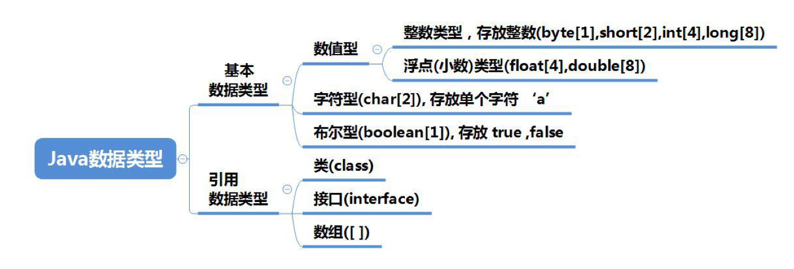
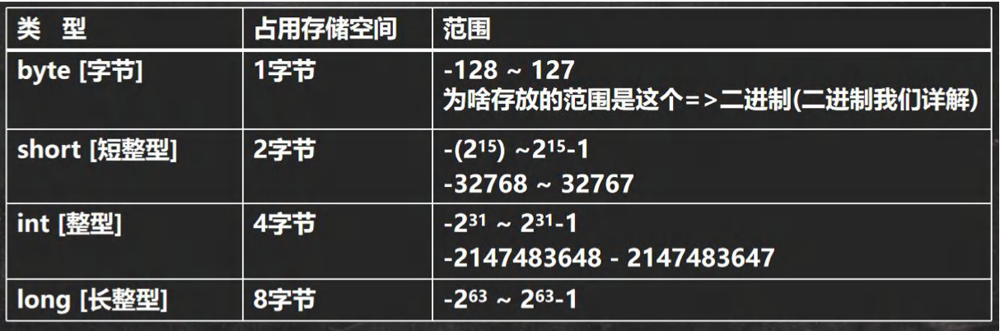
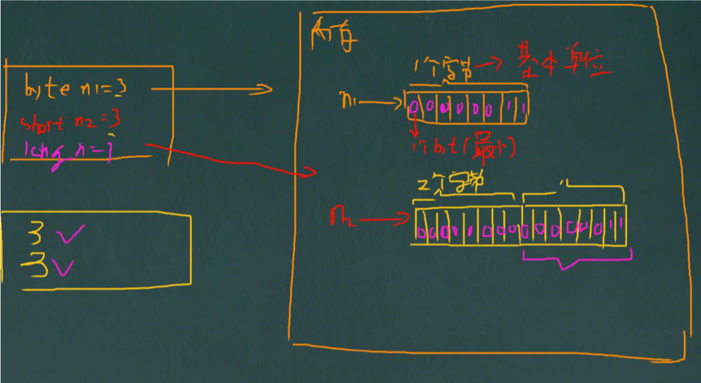
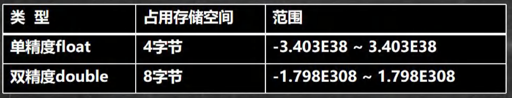
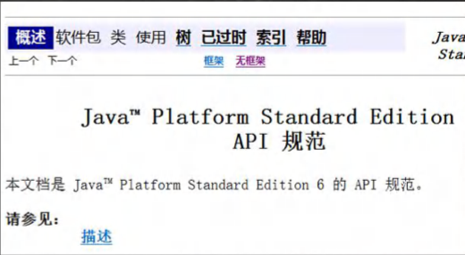
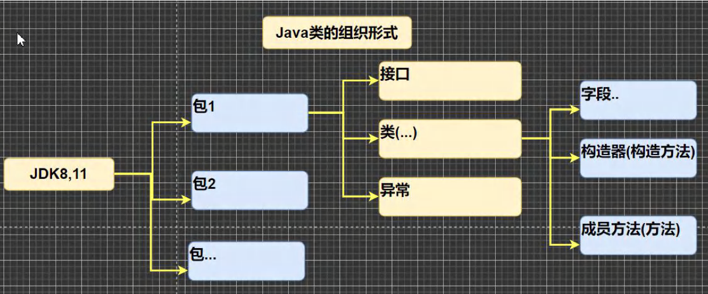
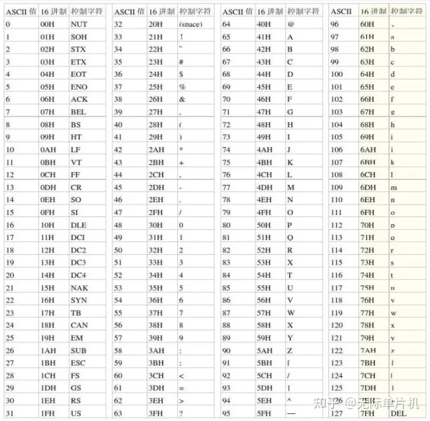
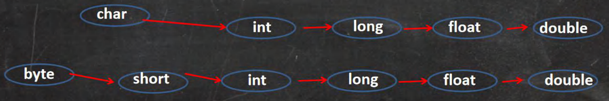

## 第3章 变量

### 3.1 为什么需要变量

#### 3.1.1 一个程序就是一个世界


#### 3.1.2 变量是程序的基本组成单位

不论是使用哪种高级程序语言编写程序，变量都是其程序的基本组成单位比如：

```java
//变量有三个基本要素(类型+名称+值)
class Test{
  public static void main(String []args){
    int a = 1;//定义了一个变量，类型int整型，名称a，值1
    int b = 3;//定义了一个变量，类型int整型，名称b，值3
    b = 89;//把89值赋给b变量
    System.out.println(a);//输出a变量的值
    System.out.println(b);//输出b变量的值
  }
}
```

#### 3.1.3 简单的原理示意图



### 3.2 变(变化)量(值)的介绍

#### 3.2.1 概念

​	变量相当于内存中一个数据存储空间的表示，你可以把变量看作是一个房间的门牌号，通过门牌号我们可以找到房间，而通过变量名可以访问到变量(值)。

#### 3.2.2 变量使用的基本步骤

1）声明变量

> int a;

2）赋值

> a = 60; //应该这么说：把60赋给a

3）使用System.out.println(a);

//也可以一步到位[int a = 60;通常我们是一步完成]

### 3.3 变量快速入门

​	变量使用入门案例

​	看演示并对代码进行说明， 演示记录 人的信息的代码

```java
public class Var02 {
	public static void main(String[] args) {
		//记录人的信息
		int age = 30;
		double score = 88.9;
		char gender = '男';
		String name = "king";
		//输出信息
		System.out.println("人的信息如下:");
		System.out.println(name);
		System.out.println(age);
		System.out.println(score);
		System.out.println(gender);
	}
}
```

### 3.4 变量使用注意事项

1. 变量表示内存中的一个存储区域[不同的变量，类型不同，占用的空间大小不同，比如：int 4个字节，double就是8个字节]
2. 该区域有自己的名称[变量名]和类型[数据类型]
3. 变量必须先声明，后使用，即有顺序
4. 该区域的数据可以在同一类型范围内不断变化
5. 变量在同一个作用域内不能重名
6. 变量 = 变量名 + 值 + 数据类型，变量三要素。

### 3.5 程序中+的使用

1. 当左右两边都是数值型时，则做加法运算
2. 当左右两边有一方为字符串，则做拼接运算
3. 运算顺序，是从左到右

> 下面代码输出什么？

```java
System.out.println(100+98);//198
System.out.println("100"+98);//10098
System.out.println(100+3+"hello");//103hello
System.out.println("hello"+100+3);//hello1003
```

### 3.6 数据类型

​	每一种数据都定义了明确的数据类型，在内存中分配了不同大小的内存空间(字节)。



> 1. java 数据类型分为两大类 基本数据类型，引用类型
> 2. 基本数据类型有8种 数值型[byte，short，int，long，float，double] char，boolean
> 3. 引用类型[类，接口，数组]

Tip：String 不是基本数据类型，而是一个类！！！

### 3.7 整数类型

#### 3.7.1 基本介绍

​	Java 的整数类型就是用于存放整数值的，比如 12,30,3456等等

#### 3.7.2 案例演示：

```java
byte n1 = 10;//1个字节
short n2 = 10;//2个字节
int n3 =10;//4个字节
long n4 = 10;//8个字节
```

#### 3.7.3 整型的类型



#### 3.7.4 整型的使用细节 IntDetail.java

1. Java各整数类型有固定的范围和字段长度，不受具体OS[操作系统]的影响，以保证java程序的可移植性。
2. Java的整型常量（具体值）默认为 **int** 型，声明 long 型常量须后加 **'I'** 或 **'L'**
3. Java程序中变量常声明为 int 型，除非不足以表示大数，才使用long
4. bit：计算机中的最小存储单元。byte：计算机中基本存储单元，1byte = 8 bit。



```java
public class IntDetail {
	public static void main(String[] args) {
		
		//Java的整型常量（具体值）默认为 int 型，声明 long 型常量须后加 'I' 或 'L'
		int n1 = 1;//4个字节
		//int n2 = 1L;//对不对？不对！
		long n3 = 1L;//对
	}
}
```

### 3.8 浮点类型

#### 3.8.1 基本介绍

​	Java的浮点类型可以表示一个小数，比如123.4，7.8，0.12等等

#### 3.8.2 案例演示

```java
double score = 88.9;
```

#### 3.8.3 浮点型的分类



#### 3.8.4 说明一下

1）关于浮点数在机器中存放形式的简单说明，浮点数 = 符号位 + 指数位 + 尾数位

2）尾数部分可能丢失，造成精度损失(小数都是近似值)。

#### 3.8.5 浮点类型使用细节 FloatDetail.java

1. 与整数类型类似，Java浮点类型也有固定的范围和字段长度，不受具体OS的影响。[float 4 个字节 double 是 8 个字节]

2. Java 的浮点型常量(具体值)默认为double型，声明float型常量，须后加 'f' 或 'F'

3. 浮点型常量有**两种表示形式**

   > 十进制数形式：如：5.12	512.0f	.512	（必须有小数点）
   >
   > 科学计数法形式：如：5.12e2 [5.12*10的2次方]    5.12E-2   [5.12/10的2次方]

4. 通常情况下，应该使用double型，因为它比float型更精确。[举例说明]

   ```java
   double num9 = 2.1234567851;
   float num10 = 2.1234567851F;
   ```

5. 浮点数使用陷阱：`2.7` 和 `8.1 / 3` 比较

```java

public class FloatDetail {
	public static void main(String[] args) {

		//Java 的浮点型常量(具体值)默认为double型，声明float型常量，须后加 'f' 或 'F'
		//float num1 = 1.1;	//对不对？错误
		float num2 = 1.1F;	//对的
		double num3 = 1.1;	//对
		double num4 = 1.1f; //对

		//十进制数形式：如：5.12	512.0f	.512	（必须有小数点）
		double num5 = 0.123; //等价 0.123
		System.out.println(num5);

		//科学计数法形式：如：5.12e2 [5.12*10的2次方]    5.12E-2   [5.12/10的2次方]
		System.out.println(5.12e2);//512.0
		System.out.println(5.12e-2);//0.0512

		//通常情况下，应该使用double型，因为它比float型更精确。[举例说明]
		// double num9 = 2.1234567851;
		// float num10 = 2.1234567851F;
		double num9 = 2.1234567851;
		float num10 = 2.1234567851F;
		System.out.println(num9);
		System.out.println(num10);

		//浮点数使用陷阱：2.7 和 8.1 / 3 比较
		double num11 = 2.7;
		double num12 = 8.1 / 3;
		System.out.println(num11);//2.7
		System.out.println(num12);//接近2.7的一个小数，而不是2.7
		//得到一个重要的使用点：当我们对运算结果是小数的进行相等判断时，要小心
		//应该是以两个数的差值的绝对值，在某个精度范围内判断
		if (num11 == num12){
			System.out.println("相等");
		}
		//正确的写法，ctrl + / 注释快捷键，再次输入就取消注释
		if(Math.abs(num11 - num12) < 0.000001 ){
			System.out.println("差值非常小，到我的规定精度,认为相等...");
		}
		// 可以通过java API 来看
		System.out.println(Math.abs(num11 - num12));

		//细节：如果是直接查询得到的小数或者直接赋值，是可以判断相等
	}
}
```

### 3.9 Java API文档

1. API (Application Programming Interface,应用程序编程接口)是Java提供的基本编程接口(java提供的类还有相关的方法)。中文在线文档：https://www.matools.com

2. Java语言提供了大量的基础类，因此Oracle公司也为这些基础类提供了相应的API文档，用于告诉开发者如何使用这些类，以及这些类包含的方法。

3. Java类的组织形式

   

4. 举例说明如何使用ArrayList类有哪些方法。

   按:包 -> 类 -> 方法

   直接索引。Math



### 3.10 字符类型(char)

#### 3.10.1 基本介绍

​	字符类型可以表示单个字符，字符类型是char，char是两个字节（可以存放汉字），多个字符我们用字符串String

#### 3.10.2 案例演示 Char01.java

> char c1 = 'a';
>
> char c2 = '\t';
>
> char c3 = '韩';
>
> char c4 = 97;

#### 3.10.3 字符类型使用细节

1. 字符常量是用单引号(' ')括起来的单个字符。例如：

   ```java
   char c1 = 'a';char c2 = '中';char c3 = '9';
   ```

2. Java中允许使用转义字符 ' \ ' 来将其后的字符转变为特殊字符常量。例如：

   ```java
   char c3 = '\n'; //'\n'表示换行符
   ```

3. 在java中，char的本质是一个整数，在输出时，是unicode码对应的字符。

   http://tool.chinaz.com/Tools/Unicode.aspx

4. 可以直接给char赋一个整数，然后输出时，会按照对应的unicode字符输出[97]

5. char类型是可以进行运算的，相当于一个整数，因为它都对应有unicode码。

```java
public class CharDetail {
	public static void main(String[] args) {
		
		//在java中，char的本质是一个整数，在输出时，是unicode码对应的字符
		//要输出对应的数字，可以(int)字符
		int c1 = 97;
		System.out.println(c1); // a

		char c2 = 'a'; //输出'a' 对应的 数字
		System.out.println((int)c2);
		char c3 = '韩';
		System.out.println((int)c3);//38889
		char c4 = 38889;
		System.out.println(c4);//韩

		//char类型是可以进行运算的，相当于一个整数，因为它都对应有unicode码。

		System.out.println('a' + 10);//107

		//课堂小测试
		char c5 = 'b' + 1;//98 + 1 ==> 99
		System.out.println((int)c5);//99
		System.out.println(c5); //99 -> 对应的字符 -> 编码表ASCII（规定好的）=> c
	}
}
```

- 字符类型本质讨论

  1. 字符型 存储到 计算机中，需要将字符对应的码值（整数）找出来，比如'a'

     存储：'a' == > 码值97 ==> 而进制 ==> 存储

     读取：二进制 => 97 ===> 'a' => 显示

  2. 字符和码值的对应关系是通过字符编码表决定的（是规定好）

- 介绍一下字符编码表[sublime测试]

  ASCII（ASCII 编码表 一个字节表示，一个128个字符）

  Unicode（Unicode编码表 固定大小的编码 使用两个字节来表示字符，字母和汉字统一都是占用两个字节，这样浪费空间）

  utf-8（编码表，大小可变的编码字母使用1个字节，汉字使用3个字节）

  gbk（可以表示汉字，而且范围广，字母使用1个字节，汉字2个字节）

  gb2312（可以表示汉字，gb2312 < gbk）

  big 5码（繁体中文，台湾，香港）

### 3.11 ASCII 码介绍(了解)

1. ASCII码：上个世纪60年代，美国制定了一套字符编码（使用一个字节），对英语字符与二进制之间的关系，做了统一规定。这被称为ASCII码。ASCII码一共规定了128个字符的编码，只占用了一个字节的后面7位，最前面的1统一规定为0。

   Tip：一个字节可以表示256个字符，ASCII码只用了128个字符.

2. 看一个完整的ASCII码表

   

3. 缺点：不能表示所有字符。

### 3.12 Unicode编码介绍（了解）

1. Unicode的好处：一种编码，将世界上所有的符号都纳入其中。每一个符号都给予一个独一无二的编码，使用Unicode没有乱码的问题。
2. Unicode的缺点：一个英文字母和一个汉字都占用**2个字节**，这对于存储空间来说是浪费。
3. 2的16次方是 65536，所以最多编码是65536个字符。
4. 编码0-127的字符是与ASCII的编码一样。比如'a'在ASCII码是0x61，在unicode码是ox0061，都对应97.因此**Unicode码兼容ASCII码**。

#### 3.13 UTF-8 编码介绍（了解）

1. UTF-8是在互联网上使用最广的一种Unicode的实现方式（改进）
2. UTF-8是一种变长的编码方式。它可以使用1-6个字节表示一个符号，根据不同的符号而变化字节长度。
3. 使用大小可变的编码 字母占1个字节，汉字占3个字节

### 3.14 布尔类型：boolean

- 基本介绍

  1. 布尔类型也叫boolearn类型，boolean类型数据只允许取值true和false，无null
  2. boolean类型占1个字节
  3. boolean类型适于逻辑运算，一般用于程序流程控制
     - if条件控制语句；
     - while循环控制语句；
     - do-while循环控制语句；
     - for循环控制语句

- 案例演示 Boolean01.java

  ```java
  boolean pass = true;
  if(pass){
    System.out.println("通过考试");
  }else {
    System.outprintln("没有通过考试~");
  }
  ```

- 使用细节说明

  不可以0或非0的整数替代false和true，这点和C语言不同

### 3.15 基本数据类型转换

#### 3.15.1 自动类型转换

- 介绍

  当Java程序在进行赋值或者运算是，精度小的类型自动转换为精度大的数据类型，这个就是**自动类型转换。**

- 数据类型按精度（容量）大小排序为：

  

- 基本案例：AutoConvert.java

  ```java
  int a ='c'
  double d = 80; 
  ```

#### 3.15.2 自动类型转换注意和细节

1. 有多种类型的数据混合运算时，系统首先自动将所有数据转换成容量最大的那种数据类型，然后再进行计算。
2. 当我们把精度精度（容量）大的数据类型赋值给精度（容量）小的数据类型时，就会报错，反之就会进行自动类型转换。
3. （byte，short）和char之间不会相互自动转换。
4. byte，short，char 他们三者可以计算，在计算时首先转换为int类型。
5. boolean 不参与转换
6. 自动提升原则：表达式结果的类型自动提升为 操作数中最大的类型

> AutoConvertDetail.java

```java
//自动类型转换细节
public class AutoConvertDetail {
	public static void main(String[] args) {
		//细节1：有多种类型的数据混合运算时，
		//系统首先自动将所有数据转换成容量最大的那种数据类型，然后再进行计算。
		int n1 = 10; //ok

		//float d1 = n1 + 1.1;
		//错误 n1 + 1.1 => 结果类型是 double ，
		//Java中的小数默认是double类型,所以1.1是double类型
		//用float d1 = n1 + 1.1 错误
		//double d1 = n1 + 1.1;
		float d1 = n1 + 1.1f;
		
		//细节2：当我们把精度精度（容量）大的数据类型赋值给精度（容量）小的数据类型时，
		//就会报错，反之就会进行自动类型转换。
		//
		//int n2 = 1.1;//错误 double -> int
		//
		//细节3：（byte，short）和char之间不会相互自动转换。
		//当把具体数赋 byte 时，（1）先判断该数是否在byte范围内，如果是就可以
		byte b1 = 10;//对 ，-128~127
		//int n2 = 1; //n2 是 int
		//byte b2 = n2;//错误，原因：如果是变量赋值，判断类型
		//
		//char c1 = b1;//错误， 原因：byte 不能自动转成 char

		//细节4：byte，short，char 他们三者可以计算，在计算时首先转换为int类型。

		byte b2 = 1;
		byte b3 = 2;
		short s1 = 1;
		int s2 = b1 + s1;//正确，b2 + s1 => int 

		//byte b4 = b2 + b3;//错误，b2 + b3 => int
		//

		//boolean 不参与转换
		boolean pass = true;
		//int num100 = pass;//boolean 不参与类型的自动转换

		//自动提升原则：表达式结果的类型自动提升为 操作数中最大的类型
		byte b4 = 1;
		short s3 = 100;
		int num200 = 1;
		double num300 = 1.1;

		double num500=b4 + s3 + num200 + num300;

	}
}
```

#### 3.15.3 强制类型转换

- 介绍

  自动类型转换的逆过程，将容量大的数据类型转换为容量小的数据类型。使用时要加上强制转换符( )，但可能造成精度降低或溢出，格外要注意。

- 案例演示 ForceConvert.java

  ```java
  
  public class ForceConvert {
  	public static void main(String[] args) {
  		
  		//强制类型转换
  		int n1 = (int)1.9;
  		System.out.println("n1=" + n1);//1，造成精度损失
  
  		int n2 = 2000;
  		byte b1 = (byte)n2;
  		System.out.println("b1=" + b1);//造成 数据溢出
  	}
  }
  ```

#### 3.15.4 强制类型转换细节说明

- ForceConvertDetail.java
  1. 当进行数据的大小从 大------->小，就需要使用到强制转换
  2. 强转符号只针对于最近的操作数有效，往往会使用小括号提升优先级
  3. char类型可以保存int的常量值，但不能保存int的变量值，需要强转
  4. byte和short，char类型在进行运算时，当做int类型处理。

### 3.16 基本数据类型转换-练习题

> 判断是否能通过编译

1. ```
   short s = 12;//true 
   s = s - 9;//false 原因：byte，short 和 char之间计算会先转换成int，再
   进行计算，最后的结果也是int类型
   ```

2. ```
   byte b = 10;//true
   b = b + 11; //false int —> byte
   b = (byte)(b+11);//true
   ```

3. ```
   char c = 'a';//true
   int i = 16;//true
   float d = .314F;//true
   double result = c + i + d;//true float存入double，小精度存入大精度 
   ```

4. ```
   byte b = 16; //true
   short = 14; //true
   short = s + b; //false int -> short
   ```

### 3.17 基本数据类型和String类型的转换

#### 3.17.1 介绍和使用

- 介绍

  在程序开发中，我们经常需要将基本数据类型转成String 类型。或者将String类型转成基本数据类型。

- 基本类型转String类型

  语法：将基本类型的值+“ ”即可

  案例演示：StringToBasic.java

- String类型转基本数据类型

  语法：通过基本类型的包装调用parseXX方法即可

  案例演示：StringToBasic.java

```java

public class StringToBasic {
	public static void main(String[] args) {
		
		//基本数据类型->String

		int n1 = 100;
		float f1 = 1.1f;
		double d1 = 4.5;
		boolean b1 = true;
		String s1 = n1 + "";
		String s2 = f1 + "";
		String s3 = d1 + "";
		String s4 = b1 + "";
		System.out.println(s1 + " " + s2 + " " + s3 + " " + s4);

		//String -> 对应的基本数据类型

		//解读 使用 基本数据类型对应的包装类， 的相应方法，得到基本数据类型
		String s5 = "123";
		int num1 = Integer.parseInt(s5);
		double num2 = Double.parseDouble(s5);
		float num3 = Float.parseFloat(s5);
		Long num4 = Long.parseLong(s5);
		byte  num5 = Byte.parseByte(s5);
		boolean b = Boolean.parseBoolean("true");
		short num6 = Short.parseShort(s5);

		System.out.println("=================");
		System.out.println(num1);//123
		System.out.println(num2);//123.0
		System.out.println(num3);//123.0
		System.out.println(num4);//123
		System.out.println(num5);//123
		System.out.println(b);//true
		System.out.println(num6);//123
    
    //怎么把字符串转成字符char -> 含义是指 把字符串的第一个字符得到
		//解读 s5.charAt(0) 得到 s5字符串的第一个字符 '1'
		System.out.println(s5.charAt(1));
	}
}
```

#### 3.17.2 注意事项

案例演示：StringToBasicDetail.java

1）在将String 类转成 基本数据类型时，要确保String类型能够转成有效的数据，比如 我们可以把"123"，转成一个整数，但是不能把"hello"转成一个整数

2）如果格式不正确，就会抛出异常，程序就会终止。

```java
/**
 * 演示字符串转基本数据类型的细节
*/
public class StringToBasicDetail {
	public static void main(String[] args) {

		String str = "Hello";
		//转成int
		int n1 = Integer.parseInt(str);
		System.out.println(n1);
	}
}
```

### 3.18 本章作业

1. 程序阅读题，看看输出什么？Homework01.java

   ```java
   
   public class Homework01 {
     public static void main(String[] args){
       int n1;
       n1 = 13;
       int n2;
       n2 = 17;
       int n3;
       n3 = n1 + n2; // 30
       System.out.println("n3=" + n3); //n3=30
       int n4 = 38;
       int n5 = n4 - n3; //8
       System.out.println("n5="+ n5);//n5=8
     }
   }
   ```

2. 使用char类型，分别保存 `\n`  `\t`  `\r`  `\\`  `1` `2` `3` 等字符，并打印输出。Homework02.java

   ```java
   public class Homework02 {
   	public static void main(String[] args) {
   		char c1 = '\n';//换行
   		char c2 = '\t';//制表位
   		char c3 = '\r';//回车
   		char c4 = '\\';//输出\
   		char c5 = '1';//1
   		char c6 = '2';//2
   		char c7 = '3';//3
   		System.out.println("c1="+c1);
   		System.out.println("c2="+c2);
   		System.out.println("c3="+c3);
   		System.out.println("c4="+c4);
   		System.out.println("c5="+c5);
   		System.out.println("c6="+c6);
   		System.out.println("c7="+c7);
   	}
   }
   ```

3. 编程，保存两本书名，用+拼接，看效果。保存两个性别，用加号拼接，看效果。保存两本数价格，用加号拼接，看效果。Homework03.java

   ```java
   
   ```

4. 编程实现如下效果 。Homework04.java

   

   要求：
   		1）用变量将名字、年龄、成绩、性别、爱好存储
   		2）使用+
   		3）添加适当的注释
   		4）添加转义字符，使用一条语句输出

   ```java
   public class Homework04 {
   	public static void main(String[] args) {
   		/*
   		姓名		年龄		成绩		性别		爱好
   		XX		XX		XX		XX		XX
   
   		要求：
   		1）用变量将名字、年龄、成绩、性别、爱好存储
   		2）使用+
   		3）添加适当的注释
   		4）添加转义字符，使用一条语句输出
   		*/
   
   		//姓名
   		String name = "jack";
   		int age = 20;
   		double score = 80.9;
   		char gender = '男';
   		String hobby = "打篮球";
   		//输出了信息，可以使用换行
   		System.out.println("姓名\t年龄\t成绩\t性别\t爱好\n"+name+"\t"+
   			age+"\t"+score+"\t"+gender+"\t"+hobby+"\t");
   	}
   }
   ```

   
