## 第4章 运算符

### 4.1 运算符介绍

#### 4.1.1 运算符介绍

​	运算符是一种特殊的符号，用以表示数据的运算、赋值和比较等。

1）算术运算符

2）赋值运算符

3）关系运算符[比较运算符]

4）逻辑运算符

5）位运算符[需要二进制基础]

6）三元运算符

### 4.2 算术运算符

#### 4.2.1介绍

​	运算符是对数值类型的变量进行运算的，在Java程序中使用的非常多。

#### 4.2.2 算术运算符一览

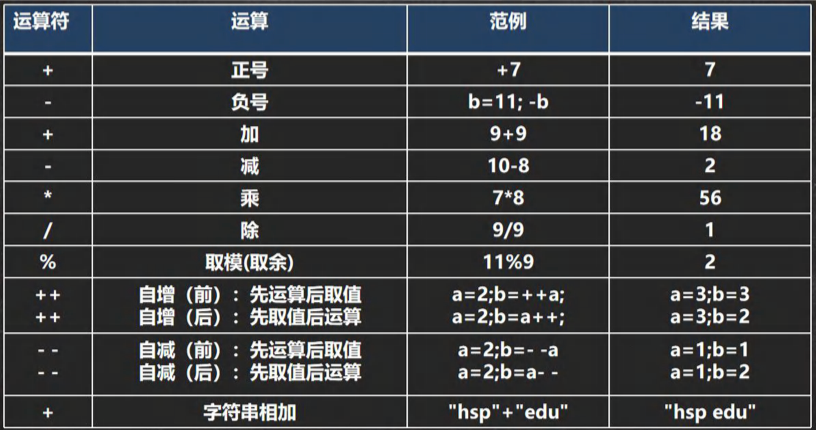

#### 4.2.3案例演示

案例演示算术运算符的使用(ArithmeticOperator.java)

1. +、-、*、/、%、++、--

2. 自增：++

   作为独立的语句使用：

   前++和后++都完全等价于 i = i + 1;

   作为表达式使用

   ​	前++：++i先自增后赋值

   ​	后++：i++先赋值后自增

3. --、+、-、*是一个道理

```java
/**
 * 演示算术运算符的使用
*/
public class ArithmeticOperator {

	public static void main(String[] args) {
		// /使用
		System.out.println(10 / 4); //从数学来看2.5，java中 2
		System.out.println(10.0 / 4);//java是2.5
		double d = 10 / 4;//java中10 / 4 = 2，2=>2.0
		System.out.println(d);// 是2.0

		// % 取模，取余
		// 在 % 的本质 看一个公式 a % b = a - a / b * b
		// -10 % 3 => -10-(-10) / 3 *3 = -10 + 9 = -1
		//10 % -3 = 10 - 10 /(-3) * (-3) = 10 - 9 =1 
		// -10 % -3 = (-10) - (-10) / (-3) * (-3) = (-10) - 3 * (-3) = -1
		System.out.println(10 % 3);	// 1
		System.out.println(-10 % 3);// -1
		System.out.println(10 % -3);// 1
		System.out.println(-10 % -3);// -1

		//++的使用
		//
		int i = 10;
		i++;//自增 等价于 i = i + 1;=> i = 11
		++i;//自增 等价于 i = i + 1;=> i = 12
		System.out.println("i=" + i);//12

		/*
		作为表达式使用
		前++：++i 先自增后赋值
		后++：i++ 先赋值后自增
		*/
		int j = 8;
		//int k = ++j;//等价 j = j + 1;k = j;
		int k = j++;//等价 k = j;j=j+1;
		//System.out.println("k=" + k + " j=" +j);//k = 9;j = 9;
		System.out.println("k=" + k + " j=" +j);//k = 8;j = 9;

	}
}
```

#### 4.2.4 细节说明

1. 对于除号" / "，它的整数除和小数除是有区别的：整之间做除法时，只保留整数部分而舍弃小数部分。例如：int x = 10 / 3，结果是 3
2. 当对一个数取模时，可以等价 a % b = a - a / b * b，这样我们可以看到 取模的一个本质运算。
3. 当 自增 当做一个独立语言使用时，不管是 ++i;还是i++;都是一样的，等价
4. 当 自增 当做一个 表达式使用时 j = ++i 等价 `i = i +1; j = i`;
5. 当 自增 当做一个 表达式使用时j = i++ 等价 `j = i ;i = i+1`;

#### 4.2.5 面试题

ArithmeticOperatorExercise01.java

1. 面试题1

   > int i = 1;//i->1
   >
   > i = i++;//规则使用临时变量:(1)temp=1;(2)i=i+1;(3)i=temp;
   >
   > System.out.println(i);//1

   问：结果是多少？为什么？

2. 面试题2

   > int i = 1;
   >
   > i = ++i;//规则使用临时变量:(1) i = i+1;(2) temp = i; (3) i = temp;
   >
   > System.out.println(i);//2

#### 4.2.6 自增，自减课堂练习

```java

//练习

public class ArithmeticOperatorExercise01 {
	public static void main(String[] args) {
		
		// int i = 1;//i->1
		// i = i++;//规则使用临时:(1)temp=1;(2)i=i+1;(3)i=temp;
		// System.out.println(i);//1

		// int i = 1;
		// i = ++i;//规则使用临时变量:(1) i = i+1;(2) temp = i; (3) i = temp;
		// System.out.println(i);
		//
		//测试输出

		int i1 = 10;
		int i2 = 20;
		int i = i1++; // i = 10
		System.out.print("i="+i);//10
		System.out.println("i2="+i2);//20
		i = --i2;// i2 = 19;i = 19;
		System.out.print("i="+i);//19
		System.out.println("i2="+i2);//19
	}
}
```

#### 4.2.7 课堂练习2

ArithmeticOperatorExercise02.java

1）假设还有59天放假，问：合XX个星期零XX天

2）定义一个变量保存华氏温度，华氏温度转换摄氏温度的公式为：5 / 9*(华氏温度-100),请求出华氏温度对应的摄氏温度。

3）代码

```java
//课堂练习

public class ArithmeticOperatorExercise02 {
	public static void main(String[] args) {
		
		//1.需求：
		//假设还有59天放假，问：合XX个星期零XX天
		//2.思路分析
		//(1)使用int 变量 days 保存 天数
		//(2)一个星期是7天 星期数：days / 7  零XX天leftDay days % 7
		//(3)输出

		//3.走代码
		int days = 59;
		int weeks = days / 7;
		int leftDays = days % 7;
		System.out.println(days+"天 合" + weeks + "星期零" +
			+leftDays + "天");


		//1.需求
		//定义一个变量保存华氏温度，华氏温度转换摄氏温度的公式为：
		//5 / 9*(华氏温度-100),请求出华氏温度对应的摄氏温度。

		//2.思路分析
		//(1) 先定义一个double huaShi 变量保存 华氏温度
		//(2) 根据给出的公式，进行计算即可5 / 9*(华氏温度-100)
		//	考虑数学公式和java语言的特性
		//(3) 将得到的结果保存到double sheShi
		//3.走代码
		double huaShi = 234.6;
		double sheShi = 5.0 / 9 * (huaShi-100);
		System.out.println("华氏温度" + huaShi 
			+ "对应的摄氏温度=" + sheShi);
	}
}
```

### 4.3 关系运算符(比较运算符)

#### 4.3.1介绍

1）关系运算符的结果都是boolean型，也就是要么是true，要么是false

2）关系表达式 经常用在 if 结构 的条件中或循环结构的条件中

#### 4.3.2关系运算符一览

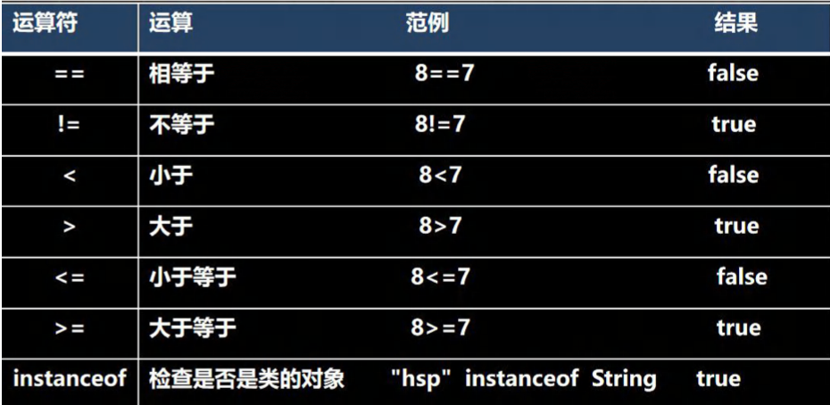

#### 4.3.3案例演示

案例演示关系运算符的使用(RelationalOperator.java)

```java
//演示关系运算符的使用
//
public class RelationalOperator {
	public static void main(String[] args) {
		
		int a = 9;
		int b = 8;
		System.out.println(a > b); //true
		System.out.println(a >= b); //true
		System.out.println(a <= b); //false
		System.out.println(a < b); //false
		System.out.println(a == b); //false
		System.out.println(a != b); //true
		boolean flag = a>b; //true
		System.out.println("flag="+flag);								
	}
}
```

#### 4.3.4 细节说明

1）关系运算符的结果都是boolean型，也就是要么是true，要么是false。

2）关系运算符组成的表达式，我们称为关系表达式。a > b

3）比较运算符“==”不能误写成“=”

### 4.4 逻辑运算符

#### 4.4.1介绍

​	用于连接多个条件（多个关系表达式），最终的结果也是一个boolean值。

#### 4.4.2逻辑运算符一览

​	分为两组学习

1）短路与 &&，短路或||，取反 ！

2）逻辑与 &，逻辑或|，^逻辑异或

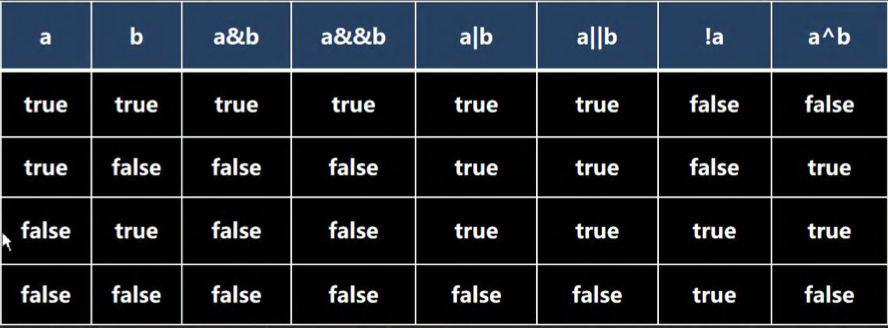

- 说明逻辑运算规则：

1）a&b：& 叫逻辑与；规则：当 a 和 b 同时为true，则结果为true，否则为false

2）a&&b：&& 叫短路与；规则：当 a 和 b 同时为true，则结果为true，否则为false

3）a|b：|叫逻辑或；规则：当 a 和 b，有一个为true，则结果为true，否则为false

4）a||b：叫短路或；规则：当 a 和 b，有一个为true，则结果为true，否则为false

5）!a：叫取反，或者非运算；当 a 为true，则结果为false，当 a 为false时，结果为true

6）a^b：叫逻辑异或，当 a 和 b 不同时，则结果为true，否则为false

#### 4.4.3 && 和 & 基本规则

| 名称     | 语法         | 特点                                    |
| -------- | ------------ | --------------------------------------- |
| 短路与&& | 条件1&&条件2 | 两个条件都为true，结果为true，否则false |
| 逻辑与&  | 条件1&条件2  | 两个条件都为true，结果为true，否则false |

#### 4.4.4 && 和 & 案例演示

案例演示&& 和 & 运算符的使用(LogicOperator01.java)

```java
/**
 * 演示逻辑运算符的使用
 */

public class LogicOperator01 {
	public static void main(String[] args) {
		//&&短路与 和 & 案例演示
		int age = 50;
		if(age > 20 && age < 90){
			System.out.println("ok100");
		}


		//&逻辑与使用
		if(age > 20 & age < 90){
			System.out.println("ok100");
		}

		//区别
		int a = 4;
		int b = 9;
		//对于&&短路与而言，如果第一个条件为false，后面的条件不再判断
		// if(a < 1 && ++b < 50){
		// 	System.out.println("ok300");
		// }
		// System.out.println("a="+ a + " b=" + b);//4 9

		//对于&逻辑与而言，如果第一个条件为false，后面的条件仍然会判断
		if(a < 1 & ++b < 50){
			System.out.println("ok300");
		}
		System.out.println("a="+ a + " b=" + b);//4 10

	}
}
```

#### 4.4.5 && 和 & 使用区别

1）&&短路与：如果第一个条件为false，则第二个条件不会判断，最终结果为false，效率高

2）& 逻辑与：不管第一个条件是否为false，第二个条件都要判断，效率低

3）开发中，我们使用的基本是使用短路与&&，效率高

#### 4.4.6 || 和 | 基本规则

| 名称       | 语法             | 特点                                              |
| ---------- | ---------------- | ------------------------------------------------- |
| 短路或\|\| | 条件1 \|\| 条件2 | 两个条件中只要有一个成立，结果为true，否则为false |
| \|逻辑或   | 条件1 \| 条件 2  | 只要有一个条件成立，结果为true，否则为false       |

#### 4.4.7 || 和 | 案例演示

案例演示&& || ！运算符的使用(LogicOperator02.java)

```java
//演示|和||使用
public class LogicOperator02 {

	public static void main(String[] args) {
		
		//|| 短路或 和 | 逻辑或 案例演示
		//|| 规则：两个条件中只要有一个成立，结果为true，否则为false
		//|  规则：只要有一个条件成立，结果为true，否则为false
		int age = 50;
		if (age > 20 || age < 30) {
			System.out.println("ok100");
		}

		//&逻辑与使用
		if (age > 20 | age < 30) {
			System.out.println("ok200");
		}

		//看看区别
		//(1)||短路或：如果第一个条件为true，
		//则第二个条件不会判断，最终结果为true，效率高
		// int a = 4;
		// int b = 9;
		// if ( a > 1 || ++b > 4) {
		// 	System.out.println("ok300");
		// }
		// System.out.println("a="+ a + " b=" + b);

		//(2)| 逻辑或：不管第一个条件是否为true，第二个条件都要判断，效率低
		int a = 4;
		int b = 9;
		if ( a > 1 | ++b > 4) {
			System.out.println("ok300");
		}
		System.out.println("a="+ a + " b=" + b);
	}
}
```

#### 4.4.8 || 和 | 使用区别

1）||短路或：如果第一个条件为true，则第二个条件不会判断，最终结果为true，效率高

2） | 逻辑或：不管第一个条件是否为true，第二个条件都要判断，效率低

3）开发中，我们基本使用||

#### 4.4.9 ！取反 基本规则

| 名称         | 语法   | 特点                                      |
| ------------ | ------ | ----------------------------------------- |
| ！非（取反） | ！条件 | 如果条件本身成立，结果为false，否则为true |

#### 4.4.10 ！案例演示

案例演示 ！运算符的使用(InverseOperator.java)

```java
//!和^案例演示

public class InverseOperator {
	public static void main(String[] args) {
		
		//! 操作是取反 T -> F ，F -> T		
		System.out.println(60 > 20);//true
		System.out.println(!(60 > 20));//false

		//a^b：叫逻辑异或，当a 和 b 不同时，则结果为true，否则为false
		boolean b = (10 > 1) ^ (3 < 5);
		System.out.println("b="+b);//F
	}
}
```

#### 4.4.11 ^ 案例演示

a^b：叫逻辑异或，当 a 和 b 不同时，则结果为true，否则为false

^逻辑异或，System.out.println((4 < 1)  ^ (6 > 3));//True

#### 4.4.12 练习题1请写出每题的输出结果

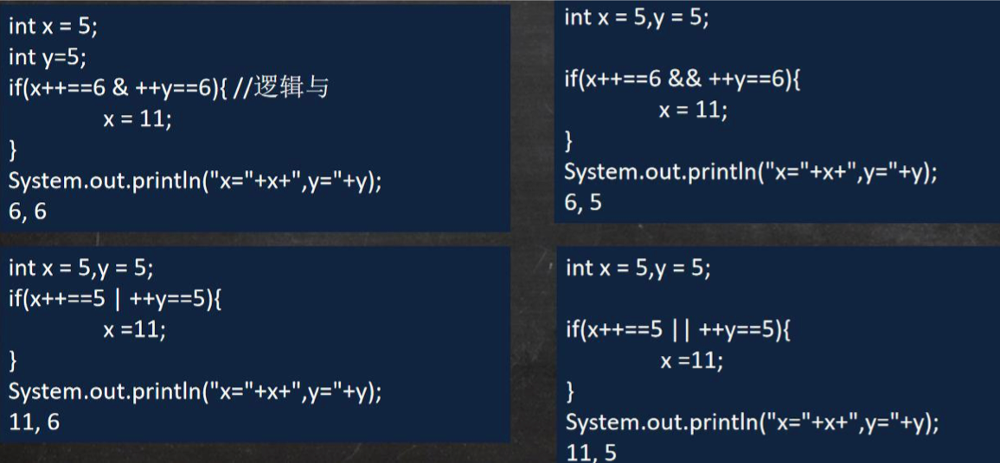

#### 4.4.13 练习题2请写出输出结果

```java
boolean x = true;
boolean y = false;
short z = 46;
if((z++==46)&&(y=true)) z++;//z = 48
if((x=false)||(++z==49)) z++;
System.out.println("z="+z);//50
```

### 4.5 赋值运算符

#### 4.5.1 介绍

​	赋值运算就是将某个运算后的值，赋给指定的变量。

#### 4.5.2 赋值运算符的分类

- 基本赋值运算符 = int a = 10;

- 复合赋值运算符

  +=，-=，*=，/=，%=等

  a+=b; [等价 a = a + b;]

  a-=b; [等价 a = a - b;]

#### 4.5.3 案例演示

案例演示赋值运算符的基本使用。AssignOperator.java

1）赋值基本案例[int num1 = 10]

2）+= 的使用案例

#### 4.5.4 赋值运算符特点

1）运算顺序从右往左	int num = a + b + c;

2）赋值运算符的左边	只能是变量，右边	可以是变量、表达式、常量值int num = 20;int num2 = 78*34-10;int num3 = a;

3）复合赋值运算符等价于下面的效果比如：a+=3;等价于a=a+3；

4）复合赋值运算符会进行类型转换。byte b = 2;b+=3;b++;

```java
//演示赋值运算符的使用
public class AssignOperator {
	public static void main(String[] args) {
		
		int n1 = 10;
		n1 += 4;//n1 = n1 + 4;
		System.out.println(n1);//14
		n1 /= 3;//n1 = n1 / 3;//4
		System.out.println(n1);//4

		//复合赋值运算符会进行类型转换
		byte b = 3;
		b += 2;//等价b =(byte)(b + 2);
		b++;//b =(byte)(b+1);

	}
}
```

### 4.6 三元运算符

#### 4.6.1 基本语法

条件表达式 ？表达式1：表达式2；

运算规则：

1. 如果条件表达式为true，运算后的结果是表达式1；
2. 如果条件表达式为false，运算后的结果是表达式2；

口诀：[一灯大师：一真大师]

#### 4.6.2 案例演示 TernaryOperator.java

```java
//三元运算符使用

public class TernaryOperator {
	public static void main(String[] args) {
		
		int a = 10;
		int b = 99;
		//解读
		//1.a > b 为 false
		//2.返回 b--,先返回b的值，然后返回 b-1
		//3.返回的结果是99
		int result = a > b ? a++ : b--;
		System.out.println("result=" + result);
		System.out.println("a=" + a);//10
		System.out.println("b=" + b);//98
	}
}
```

#### 4.6.3 使用细节 TernaryOperatorDetail.java

1）表达式1 和表达式2 要为可以赋给接收变量的类型（或可以自动转换）

2）三元运算符可以转成if-else 语句

```
int res = a > b ? a++ : --b;
if(a > b) res = a++;
else res = --b;
```

#### 4.6.4 课堂练习

案例：实现三个数的最大值TernaryOperatorExercise.java

```java

```

### 4.7 运算符优先级

1）运算符有不同的优先级，所谓优先级就是表达式运算中的运算顺序。上一行运算符总优先于下一行。

2）只有单目运算符、赋值运算符是从右向左运算的。

3）一览表：

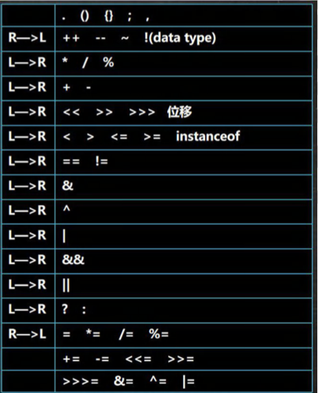

### 4.8 标识符的命名规则和规范

- 标识符概念
  1. Java 对各种变量、方法和类等命名时使用的字符序列称为标识符
  2. 凡是自己可以起名字的地方都叫标识符 int num1 = 90；
- 标识符的命名规则(必须遵守)
  1. 由26个英文字母大小写，0-9，或 $ 组成
  2. 数字不可以开头。int 3ab = 1;//错误
  3. 不可以使用关键字和保留字，但能包含关键字和保留字。
  4. Java中严格区分大小写，长度无限制。int totalNum = 10;int n = 90;
  5. 标识符不能包含空格。int a b = 90;

#### 4.8.1 判断下面变量名是否正确

> hsp //ok
>
> hsp12 //ok
>
> 1hsp //错误，数字不能开头
>
> h-s // 错误，不能有 -
>
> x h //错误，用空格
>
> h$4 //ok
>
> class //错误，class 关键字
>
> int //错误，int是关键字
>
> double //错误，double是关键字
>
> public //错误，public 是关键字
>
> static //错误，static 是关键字
>
> goto //错误，gotos是保留字
>
> syu_name //ok

#### 4.8.2标识符命名规范[更加专业]

1）包名：多单词组成时所有字母都小写：aaa.bbb.ccc // com.hsp.crm

2）类名、接口名：多单词组成时，所有单词的首字母大写：XxxYyyZzz[大驼峰]

比如：TankShotGame

3）变量名、方法名：多单词组成时，第一个单词首字母小写，第二个单词开始每个单词首字母大写：xxxYyyZzz[小驼峰，简称 驼峰法]

比如：tankShotGame

4）常量名：所有字母大写。多单词时每个单词用下划线连接：XXX_YYY_ZZZ

比如：定义一个所得税率 TAX_RATE

5）后面我们学习到 类，包，接口，等时，我们的命名规范要这样遵守，更加详细的看文档。

### 4.9关键字

关键字的定义和特点（不用背）

定义：被Java语言赋予了特殊含义，用做专门用途的字符串（单词）

特点：关键字中所有字母都为小写

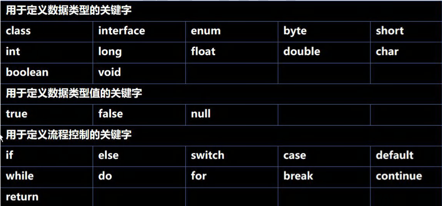

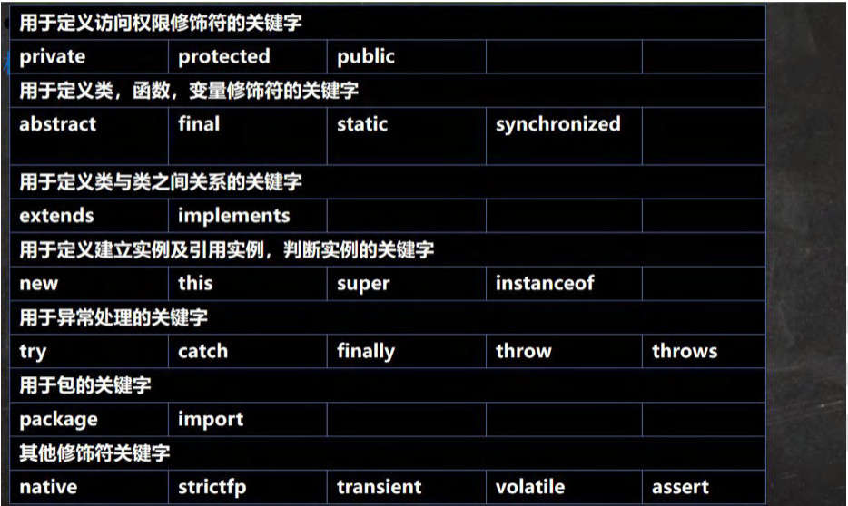

### 4.10 保留字

#### 4.10.1 介绍

​	Java 保留字：现有 Java 版本尚未使用，但以后版本可能会作为关键字使用。自己命名标识符时要避免使用这些保留 字 byValue、cast、future、 generic、 inner、 operator、 outer、 rest、 var 、 goto 、const

### 4.11 键盘输入语

#### 4.11.1介绍

​	在编程中，需要接收用户输入的数据，就可以使用键盘输入语句来获取。Input.java , 需要一个 扫描器(对象), 就是 Scanner

#### 4.11.2步骤

1）导入该类的所在包，java.util.*

2）创建该类对象（声明变量）

3）调用里面的功能

#### 4.11.3案例演示：

要求：可以从控制台接收用户信息，【姓名，年龄，薪水】

```java
import java.util.Scanner;//表示把java.util下的Scanner类导入
public class Input {
	public static void main(String[] args) {
		//演示接收用户的输入
		//步骤
		//Scanner类 表示 简单文本扫描器，在java.util 包
		//1.引入 Scanner类所在的包
		//2.创建 Scanner 对象
		//myScanner 就是 Scanner类的对象
		Scanner myScanner = new Scanner(System.in);
		//3.接收用户输入，使用相关的方法
		System.out.println("请输入名字");

		//当程序执行到 next 方法是，会等待用户输入~~~
		String name = myScanner.next();//接收用户输入字符串
		System.out.println("请输入年龄");
		int age = myScanner.nextInt();//接收用户输入int
		System.out.println("请输入薪水");
		double sal = myScanner.nextDouble();//接收用户输入dobule
		System.out.println("人的信息如下：");
		System.out.println("名字=" + name + " 年龄=" + age + " 薪水=" + sal);

	}
}
```

### 4.12进制

#### 4.12.1进制介绍

对于整数，有四种表示方式：

二进制：0,1，满2近1.以0b或0B开头。

十进制：0-9，满10进1。

八进制：0-7，满8进1，以数字0开头表示。

十六进制：0-9 及 A（10）- F（15），满16进1.以0x或0X开头表示。此处的A-F不区分大小写。

#### 4.12.2举例说明 BinaryTest.java

```java
//演示四种进制

public class BinaryTest {
	public static void main(String[] args) {
		//n1 二进制
		int n1 = 0b1010;
		//n2 10进制
		int n2 = 1010;
		//n3 8进制
		int n3 = 01010;
		//n4 16进制
		int n4 = 0x10101;
		System.out.println("n1=" + n1);
		System.out.println("n2=" + n2);
		System.out.println("n3=" + n3);
		System.out.println("n4=" + n4);
		System.out.println(0x23A);
	}
}
```

### 4.13 进制的图示

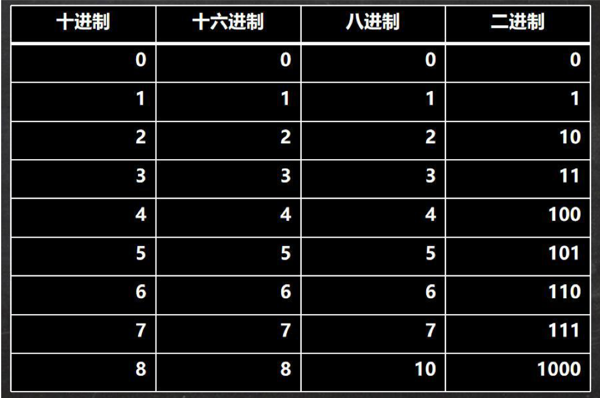

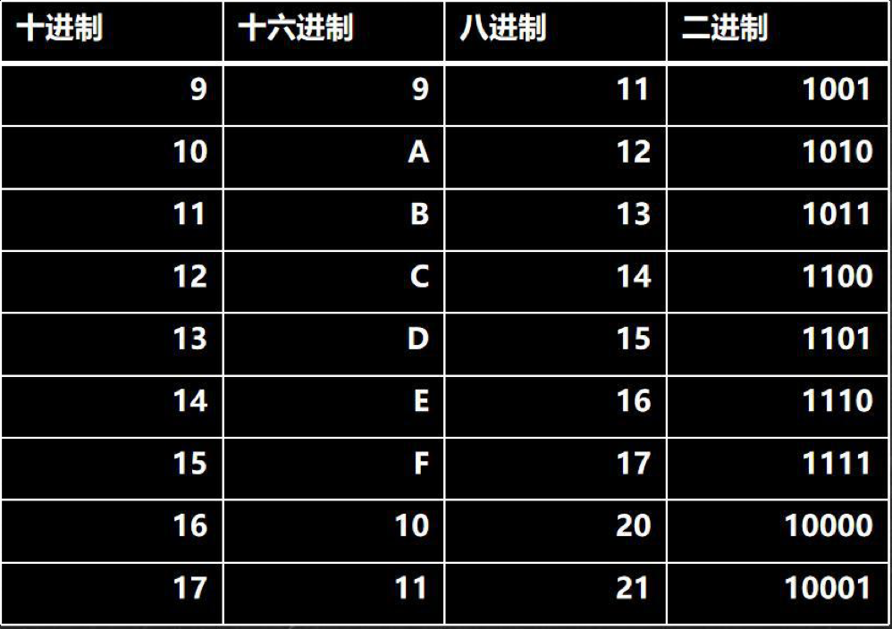

### 4.14进制的转换（基本功）

#### 4.14.1进制转换的介绍

- 第一组
  1. 二进制转十进制
  2. 八进制转十进制
  3. 十六进制转十进制
- 第二组
  1. 十进制转二进制
  2. 十进制转八进制
  3. 十进制转十六进制
- 第三组
  1. 二进制转八进制
  2. 二进制转十六进制
- 第四组
  1. 八进制转二进制
  2. 十六进制转二进制

### 4.15 二进制转成十进制示例

规则：从最低位（右边）开始，将每个位上的数提取出来，乘以2的（位数-1）次方，然后求和。

案例：请将0b1011转成十进制的数

> 0b1011 = 1 * 2^3 + 0 * 2^2 + 1 * 2^1 + 1 * 2^0=8+2+1=11


### 4.16 八进制转换成十进制示例

规则：从最低位（右边）开始，将每个位上的数据提取出来，乘以8的（位数-1）次方，然后求和。

案例：请将0234转成十进制的数

> 0234 = 4 * 8 ^ 0 + 3 * 8 ^ 1 + 2 * 8^3= 4 + 24 + 128 = 156

### 4.17 十六进制转换成十进制示例

规则：从最低位(右边)开始，将每个位上的数提取出来，乘以 16 的(位数-1)次方，然后求和。

案例：请将0x23A 转成十进制的数

0x23A = 10 * 16^0 + 3 * 16^1 + 2 * 16^2 = 10 + 48 + 512 = 570

课堂练习：请将

0b110001100 转成 十进制

02456 转成十进制

0xA45 转成十进制

> 0b110001100 = 2^8 + 2^7 + 2^3 + 2^2=256+128+12=396
>
> 02456 = 6 * 8^0 + 5 * 8^1 + 4 * 8^2 + 2 * 8 ^ 3=6+40+256+1024=1326
>
> 0xA45 = 5 * 16^0 + 4 * 16 ^1 + 10 * 16^2 = 5 + 64 + 2560=2629 

### 4.18十进制转换成二进制

规则：将该数不断除以 2，直到商为 0 为止，然后将每步得到的余数倒过来，就是对应的二进制。

案例：：请将 34 转成二进制 

> 34 = 0b00100010

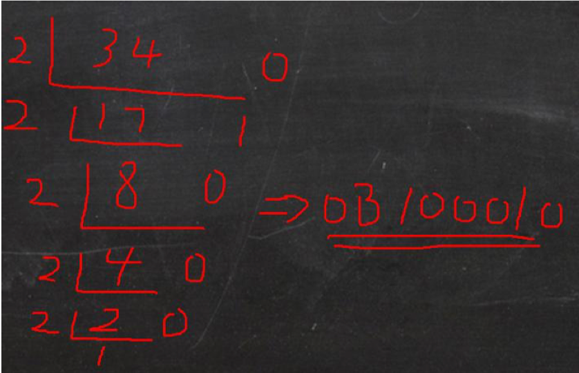

### 4.19十进制转换成八进制

规则：规则：将该数不断除以 8，直到商为 0 为止，然后将每步得到的余数倒过来，就是对应的八进制。

案例：请将 131 转 成八进制 => 0203


### 4.20十进制转换成十六进制

规则：规则：将该数不断除以 16，直到商为 0 为止，然后将每步得到的余数倒过来，就是对应的十六进制。

案例：请将 237 转成 十六进制 => 0xED

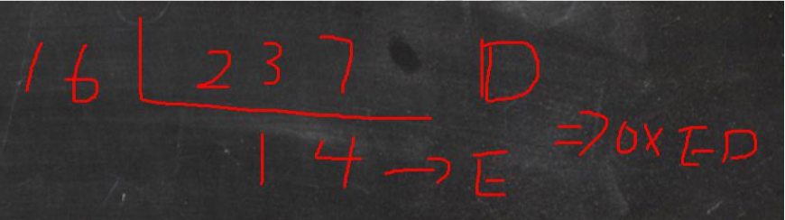

课堂练习：

> 123 转成 二进制 => 0b01111011
>
> 678 转成八进制 => 01246
>
> 8912 转成十六进制 => 0x22D0

### 4.21 二进制转换成八进制

规则：从低位开始,将二进制数每三位一组，转成对应的八进制数即可。

案例：请将0b11010101 转成八进制

> 0b 11(3) 010(2) 101(5) => 0325

### 4.22 二进制转换成十六进制

规则：从低位开始，将二进制数每四位一组，转成对应的十六进制数即可。

案例：请将0b11010101 转成十六进制

> 0b1101(D) 0101(5) = 0xD5

课堂练习：请将

0b11100101 转成 八进制

0b1110010110 转成 十六进制

> 0b11(3) 100(4) 101(5) => 0345
>
> 0b11(3) 1001(9) 0110(6) => 0x396

###  4.23 八进制转换成二进制

规则：将八进制数每 1 位，转成对应的一个 3 位的二进制数即可。

案例：请将 0237 转成二进制

> 02(010) 3(011) 7(111)  => 0b010011111

### 4.24 十六进制转换成二进制

规则：将十六进制数每 1 位，转成对应的 4 位的一个二进制数即可。

案例：请将 0x23B 转成二进制

> 0x2(0010) 3(0011) B(1011) => 0b001000111011

课堂练习：请将

01230 转成 二进制

0xAB29 转成 二进制

> 01(001) 2(010) 3(011) 0(000)  => 0b001010011000
>
> 0xA(1010) B(1011) 2(0010) 9(1001)  => 0b1010101100101001

### 4.25 位运算的思考题

1）请看下面的代码段，回答a,b,c,d,e结果是多少？

```java
public class void main(String []args)
{
	int a=1>>2;//1 向右移动2位
	int b=-1>>2;
	int c=1<<2;//
	int d=-1<<2;//
	int e=3>>>2;//算术右移
	//a,b,c,d,e结果是多少
	System.out.println("a="+a);
	System.out.println("b="+b);
	System.out.println("c="+c);
	System.out.println("d="+d);
	System.out.println("e="+e);
}
```

2）请回答在java中，下面的表达式运算的结果是：（位操作）

```java
~2 = ？//按位取反
2&3=？// 2按位与3
2|3=?//
~~5=?
5|4=?
-3^3=?//^ 按位异或
```

### 4.26二进制在运算中的说明

