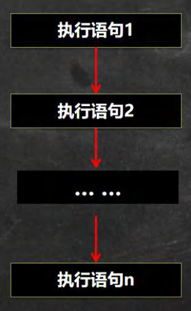
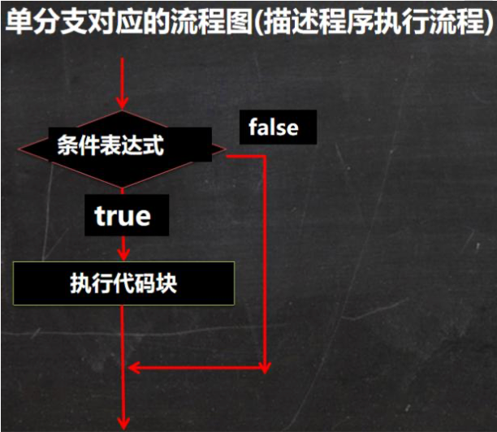
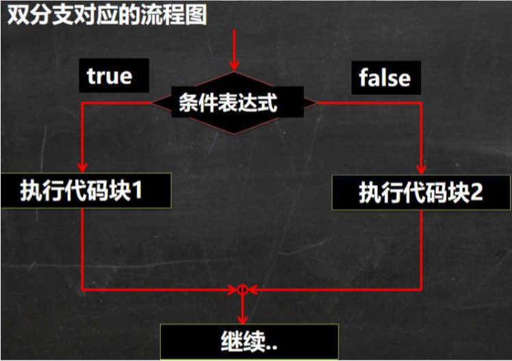
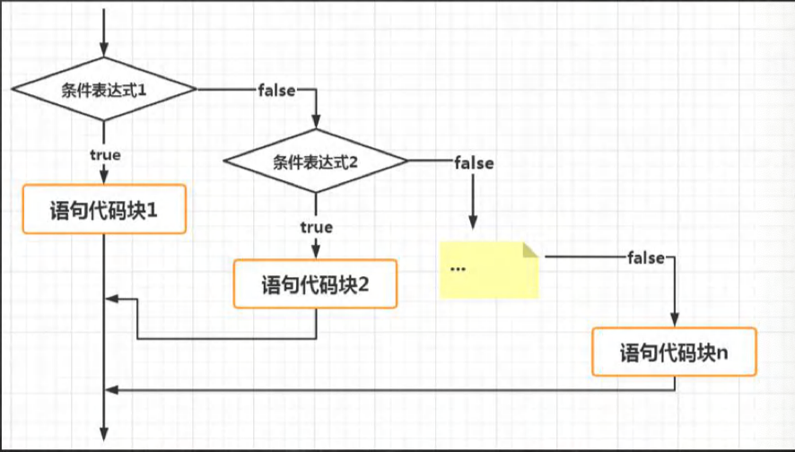
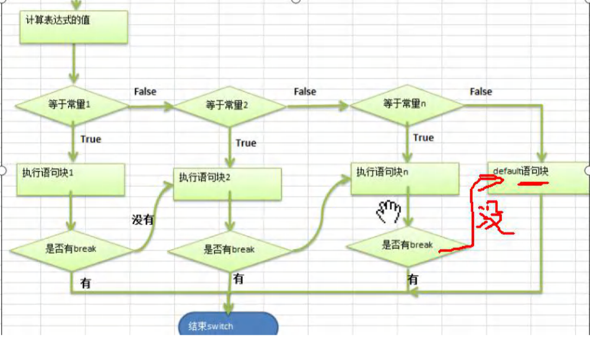

## 第5章 程序控制结构

### 5.1程序流程控制介绍

​	在程序中，程序运行的流程控制决定程序是如何执行的，是我们必须掌握的，主要有三大流程控制语句。

1）顺序控制

2）分支控制

3）循环控制

### 5.2 顺序控制

程序从上到下逐行地执行，中间没有任何判断和跳转。

- 顺序控制举例和注意事项

  Java中定义变量时采用合法的==前向引用==。如：

  ```java
  public class Test {
    int num1 = 12;
    int num2 = num1 + 2;
  }
  ```

  错误形式：

  ```java
  public class Test{
    int num2 = num1 + 2;//错误
    int num1 = 12;
  }
  ```

  

### 5.3 分支控制 if-else

#### 5.3.1分支控制 if-else 介绍

​	让程序有选择的执行，分支控制有三种

1）单分支 if

2）双分支 if-else

3）多分支 if-else if-....-else

#### 5.3.2单分支

- 基本语法

  ```
  if(条件表达式){
  	执行代码块;(可以有多条语句.)
  }
  ```

  说明：当条件表达式为true 时，就会执行{ }的代码。如果为false，就不执行。

  特别说明，如果{}中只有一条语句，则可以不用，建议写上{}

- 案例说明【If01.java】

  编写一个程序，可以输入人的年龄，如果该同志的年龄大于18岁，则输出“你的年龄大于18，要对自己的行为负责，送入监狱”

  ```java
  //if的快速入门
  import java.util.Scanner;//导入
  public class If01 {
  	public static void main(String[] args) {
  		
  		//编写一个程序，可以输入人的年龄，如果该同志的年龄大于18岁，
  		//则输出“你的年龄大于18，要对自己的行为负责，送入监狱”
  		//
  		//思路分析
  		//1.接收输入的年龄，应该定义一个Scanner对象
  		//2.把年龄保存到一个变量int age
  		//3.使用 if 判断，输出对应信息
  
  
  		//应该定义一个Scanner对象
  		Scanner myScanner = new Scanner(System.in);
  		System.out.println("请输入年龄");
  		//把年龄保存到一个变量 int age
  		int age = myScanner.nextInt();
  		//使用if 判断，输出对应信息
  		if(age > 18){
  			System.out.println("你的年龄大于18，要对自己的行为负责，送入监狱");
  		}
  		System.out.println("程序继续...");
  
  	}
  }
  ```

  

### 5.4双分支

- 基本语法

  ```
  if(条件表达式){
  	执行代码块1;
  }
  else {
  	执行代码块2；
  }
  ```

  说明：当条件表达式成立，即执行代码块1，否则执行代码块2.如果执行代码块 只有一条语句，则{}可省略，否则，不能省略

- 案例演示【If02.java】

  编写一个程序，可以输入人的年龄，如果该同志的年龄大于18岁，则输出"你年龄大于18，要对自己的行为负责，送入监狱"。否则，输出”你的年龄不大这次放过你了.”

  ```java
  //if-else 的快速入门
  import java.util.Scanner;//导入
  public class If02 {
  	public static void main(String[] args) {
  		//编写一个程序，可以输入人的年龄，如果该同志的年龄大于18岁，
  		//则输出"你年龄大于18，要对
  		//自己的行为负责，送入监狱"。否则，输出”你的年龄不大这次放过你了.”
  
  		//思路分析
  		//1.接收输入的年龄，应该定义一个Scanner 对象
  		//2.把年龄保存到一个变量 int age
  		//3.使用 if-else 判断，输出对应信息
  		//应该定义一个Scanner 对象
  		Scanner myScanner = new Scanner(System.in);
  		System.out.println("请输入年龄");
  		//把年龄保存到一个变量 int age
  		int age = myScanner.nextInt();
  		//使用 if-else 判断，输出对应信息
  		if(age > 18){
  			System.out.println("你年龄大于18，要对自己的行为负责，送入监狱");
  		}else {//双分支
  			System.out.println("你的年龄不大这次放过你了");
  		}
  
  		System.out.println("程序继续...")；
  	}
  }
  ```

#### 5.4.1双分支




#### 5.4.2 单分支和双分支练习题

1. 对下列代码，若右输出，指出输出结果。

   ```java
   int x = 7;
   int y = 4;
   if(x>5){
     if(y>5){
       System.out.println(x+y);
     }
     System.out.println("韩顺平教育~");
   }else
     System.out.println("x is"+x);
   //输出的内容是 韩顺平教育~
   ```

   //IfExercise01.java

1）编写程序，声明2个double型变量并赋值。判断第一个数大于 10.0，且第 2 个数小于 20.0，打印两数之和。

2）定义两个变量 int，判断二者的和，是否能被 3 又能被 5 整除，打印提示信息

3）判断一个年份是否是闰年，闰年的条件是符合下面二者之一：(1)年份能被 4 整除，但不能被 100 整除；(2)能被 400 整除

4）代码

```java
//单分支和双分支练习
//
public class IfExercise01 {
	public static void main(String[] args) {
		//编写程序，声明2个double型变量并赋值。
		//判断第一个数大于 10.0，且第 2 个数小于 20.0，打印两数之和。
		double  d1 = 33.5;
		double  d2 = 2.6;
		if (d1 > 10.0 && d2 < 20.0) {
			System.out.println("两个数和=" + (d1+d2));
		}

		//定义两个变量 int，判断二者的和，
		//是否能被 3 又能被 5 整除，打印提示信息
		//
		//思路分析
		//1.定义两个变量 int num1,num2
		//2.定义一个变量 int sum = num1 + num2;
		//3.sum % 3,5后 等于0 说明可以整除
		//4.使用 if-else 来提示对应信息
		//走代码
		int num1 = 10;
		int num2 = 1;
		int sum = num1 + num2;
		if (sum % 3 == 0 && sum %  5 == 0) {
			System.out.println("和可以被3又能被5整除");
		}else{
			System.out.println("和不能被3和5整除..");
		}

		//判断一个年份是否是闰年，闰年的条件是符合下面二者之一：
		//(1)年份能被 4 整除，但不能被 100 整除；(2)能被 400 整除
		//
		//思路分析
		//1.定义 int year 保存年
		//2.年份能被 4 整除，但不能被 100 整除,
		//  => year % 4 ==0 && year % 100 != 0
		//3.能被400整除 => year % 400 == 0
		//4.上面的 3 和 3 是 或的关系 
		//代码实现
		int year = 2028;
		if ((year % 4 ==0 && year % 100 != 0) || year % 400 == 0) {
			System.out.println(year + "是 闰年");
		}else{
			System.out.println(year + "不是 闰年");
		}
	}
}
```

#### 5.4.3 多分支

- 基本语法

  ```
  if(条件表达式1){
  	执行代码块1;
  }
  else if(条件表达式2){
  	执行代码块2;
  }
  ......
  else{
  	执行代码块n;
  }
  ```

  特别说明：(1)多分支 可以没有else，如果所有的条件表达式都不成立，则一个执行入口都没有(2)如果有else，如果所有的条件表达式都不成立，则默认执行else代码块

- 多分支的流程图(重要！)

  > 说明：
  >
  > 1. 当条件表达式1成立时，即执行代码块1，
  > 2. 如果表达式1不成立，才去判断表达式2是否成立，
  > 3. 如果表达式2成立，就执行代码块2
  > 4. 以此类推，如果所有的表达式都不成立
  > 5. 则执行else的代码块，注意，只能有一个执行入口。
  >
  > 

#### 5.4.4 多分支

- 案例演示 1【If03.java】

  请输入保国同志的芝麻信用分：

  如果：

  1）信用分为100分时，输出 信用极好；

  2）信用分为（80,99]时，输出 信用优秀；

  3）信用分为[60,80]时，输出 信用一般；

  4）其它情况，输出 信用 不及格

  5）请从键盘输入保国的芝麻信用分，并加以判断

  代码：

  ```java
  //多分支课堂练习
  import java.util.Scanner;
  public class If03 {
  	public static void main(String[] args) {
  		/*
  		输入保国同志的芝麻信用分：
  		如果：
  		1）信用分为100分时，输出 信用极好；
  		2）信用分为（80,99]时，输出 信用优秀；
  		3）信用分为[60,80]时，输出 信用一般；
  		4）其它情况，输出 信用 不及格
  		5）请从键盘输入保国的芝麻信用分，并加以判断
  		假定信用分数为int
  		*/
  
  		Scanner myScanner = new Scanner(System.in);
  		//接收用户输入
  		System.out.println("请输入信用分(1-100)：");
  		int grade = myScanner.nextInt();
  
  		//先对输入的信用分，进行一个范围的有效判断1-100，否则提示输入错误
  
  		if(grade >= 1 && grade <= 100){
  			//因为有4种情况，所以使用多分支
  			if(grade == 100){
  				System.out.println("信用极好");
  			}else if(grade > 80 && grade <= 99){
  				System.out.println("信用优秀");
  			}else if(grade >= 60 && grade <= 80){
  				System.out.println("信用一般");
  			}else{
  				System.out.println("信用不及格");
  			}
  		}else {
  			System.out.println("信用分需要在1-100，请重新输入:)");
  		}
  		
  	}
  }
  ```

- 案例演示2

  ```java
  boolean b = true;
  if(b == false)//【如果写成if(b=false)能编译通过吗？如果能，结果是c】
    System.out.println("a");
  else if(b)
    System.out.println("b");
  else if(!b)
    System.out.println("c");
  else
    System.out.println("d");
  ```

### 5.5嵌套分支

#### 5.5.1基本介绍

​	在一个分支结构中又完整的嵌套另一个完整的分支结果，里面的分支结构称为内层分支，外面的分支结构称为外层分支。建议：不要超过3层(可读性不好)

#### 5.5.2基本语法

```java
if(){
  if(){
    //if-else...
  }else{
    //if-else
  }
}
```

#### 5.5.3应用案例

​	参加歌手比赛，如果初赛成绩大于 8.0 进入决赛，否则提示淘汰。并且根据性别提示进入男子组或女子组。输入成绩和性别，进行判断和输出信息。[NestedIf.java]

​	提示·：double score;char gender;

​	接收字符：char gender = scanner.next().chatAt(0)

```java
import java.util.Scanner;
public class NestedIf {
	public static void main(String[] args) {
		/*
		参加歌手比赛，如果初赛成绩大于 8.0 进入决赛，
		否则提示淘汰。并且根据性别提示进入男子组或女子组。
		输入成绩和性别，进行判断和输出信息。
		[NestedIf.java]
		*/

		//思路分析
		//1.创建Scanner对象，接收用户输入
		//2.接收 成绩保存到 double score
		//3.使用 if-else 判断如果初赛成绩大于 8.0 进入决赛，否则提示淘汰。
		//4.如果进入到 决赛，再接收 char gender,使用 if-else 输出信息
		//代码实现

		Scanner myScanner = new Scanner(System.in);
		System.out.println("请输入该歌手的成绩");
		double score = myScanner.nextDouble();
		if ( score > 8.0) {
			System.out.println("请输入性别");
			char gender = myScanner.next().charAt(0);
			if(gender == '男'){
				System.out.println("进入男子组");
			}else if(gender == '女'){
				System.out.println("进入女子组");
			}else{
				System.out.println("你的性别有误,不能参加决赛");
			}
		}else {
			System.out.println("sorry,你被淘汰了~");
		}
	}
}
```

#### 5.5.4应用案例2

出票系统：根据淡旺季的月份和年龄，打印票价

4-10 旺季：

​					成人（18-60）：60

​					儿童（<18）：半价

​					老人（>60)：1/3

淡季：

​					成人：40

​					其它：20

思路分析(1) 淡季 -if - else (2)在旺季 中，可以使用多分支处理三种情况(3) 在淡季情况，使用双分支处理即可

### 5.6 switch 分支结构

#### 5.61.基本语法

```java
switch(表达式){
  case 常量1:	//当...
    语句块1;
    break;
  case 常量2:
    语句块2;
    break;
    ...
  case 常量n;
    语句块n;
    break;
  default:
    default语句块;
    break;
}
```

>解读switch
>
>1. switch 关键字，表示switch分支
>2. 表达式 对应一个值
>3. case 常量1:当表达式的值等于常量1，就执行 语句块1
>4. break：表示退出switch
>5. 如果和case 常量1 匹配，就执行语句块1，如果没有匹配，就继续匹配case常量2
>6. 如果一个都没有匹配上，就执行default

### 5.6.2 流程图

1）画出switch 流程

2）案例说明流程图



#### 5.6.3快速入门

案例：Switch01.java

请编写一个程序，该程序可以接收一个字符，比如:a,b,c,d,e,f,g

a表示星期一、b表示星期二、...

根据用户的输入显示相应的信息，使用switch语句完成

代码：

```java
import java.util.Scanner;
public class Switch01 {
	public static void main(String[] args) {
		/*
		请编写一个程序，该程序可以接收一个字符，比如:a,b,c,d,e,f,g
		a表示星期一、b表示星期二、...
		根据用户的输入显示相应的信息，使用switch语句完成

		s
		思路分析
		1.接收一个字符，创建Scanner对象
		2.使用switch 来完成匹配，并输出对应信息
		代码


		*/

		Scanner myScanner = new Scanner(System.in);
		System.out.println("请输入一个字符（a-g)");//
		char c1 = myScanner.next().charAt(0);
		//在java中，只要有值返回，就是一个表达式
		switch(c1){
			case 'a':
				System.out.println("今天星期一，猴子穿新衣");
				break;
			case 'b':
				System.out.println("今天星期二，猴子当小二");
				break;
			case 'c':
				System.out.println("今天星期三，猴子怕雪山");
				break;
			//......
			default:
				System.out.println("你输入的字符不正确，没有匹配");
		}

		System.out.println("退出了switch，继续执行程序");
	}
}
```

#### 5.6.4switch 注意事项和细节讨论

【SwitchDetail.java】

1. 表达式数据类型，应和case 后的常量类型一致，或者是可以自动转成可以相互比较的类型，比如输入的是字符，二常量是int

2. switch(表达式)中表达式的返回值必须是：（byte，short，int，char，enum[枚举]，String）

   ```java
   double c = 1.1;
   switch(c){//错误
   	
   	case 1.1;//错误
   			System.out.println("ok3");
   			break;
   }
   ```

3. case子句中的值必须是常量，而不能是变量

4. default子句式可选的，当没有匹配的case时，执行default

5. break语句用来在执行完一个case分支后使程序跳出switch语句块；如果没有写break，程序会顺序执行到switch结尾，除非遇到break;

#### 5.6.5 switch课堂练习

【SwitchExercise.java】

1）使用 switch 把小写类型的 char 型转为大写(键盘输入)。只转换 a, b, c, d, e. 其它的输出 "other"。

2）对学生成绩大于 60 分的，输出"合格"。低于 60 分的，输出"不合格"。(注：输入的成绩不能大于 100), 提示 成绩/60

3）根据用于指定月份，打印该月份所属的季节。3,4,5 春季 6,7,8 夏季 9,10,11 秋季 12, 1, 2 冬季 [课堂练习, 提示 使 用穿透 ]

代码：

```java

import java.util.Scanner;
public class SwitchExercise {
	public static void main(String[] args) {

		//使用 switch 把小写类型的 char 型转为大写(键盘输入)。
		//只转换 a, b, c, d, e. 其它的输出 "other"。

		//创建Scanner对象
		// Scanner myScanner = new Scanner(System.in);
		// System.out.println("请输入a-e");
		// char c1 = myScanner.next().charAt(0);
		// switch(c1){
		// 	case('a'):
		// 		System.out.println("A");
		// 		break;
		// 	case('b'):
		// 		System.out.println("B");
		// 		break;
		// 	case('c'):
		// 		System.out.println("C");
		// 		break;
		// 	case('d'):
		// 		System.out.println("D");
		// 		break;
		// 	case('e'):
		// 		System.out.println("E");
		// 		break;
		// 	default:
		// 		System.out.println("你的输入有误~");
		//}

		

		//对学生成绩大于 60 分的，输出"合格"。低于 60 分的，输出"不合格"。
		//(注：输入的成绩不能大于 100), 提示 成绩/60
		//思路分析
		//1.这道题，可以使用 分支来完成，但是要求使用switch
		//2.这里我们需要进行一个转换：
		// 如果成绩在 [60,100]，(int)(成绩/60) = 1
		// 如果成绩在 [0,60]，(int)(成绩/60) = 0

		//代码实现

		double score = 88.5;

		//使用if-else 保证输入的成绩是有效的 0-100
		if(score >= 0 && score <= 100 ){
			switch((int)(score / 60)) {
			case 0:
				System.out.println("不合格");
				break;
			case 1:
				System.out.println("合格");
				break;
			default:
				System.out.println("输入有误");
		}
		}else {
			System.out.println("输入的成绩要是0-100");
		}
		
		//根据用于指定月份，
		//打印该月份所属的季节。
		//3,4,5 春季 6,7,8 夏季 9,10,11 秋季 12, 1, 2 冬季 [课堂练习, 提示 使 用穿透 ]
		//
		//思路分析
		//1.创建一个Scanner对象，接收用户输入
		//2.使用 int month 接收
		//3.使用switch 来匹配，使用穿透来完成，比较简洁

		Scanner myScanner = new Scanner(System.in);
		System.out.println("请输入月份");
		int month = myScanner.nextInt();
		switch(month){
		case 3:
		case 4:
		case 5:
			System.out.println("这是春季");
			break;
		case 6:
		case 7:
		case 8:
			System.out.println("这是夏季");
			break;
		case 9:
		case 10:
		case 11:
			System.out.println("这是秋季");
			break;
		case 12:
		case 1:
		case 2:
			System.out.println("这是冬季");
			break;
		default:
			System.out.println("你输入的月份不对（1-12）");

		}
	}
}
```

#### 5.6.6switch 和 if的比较

1）如果判断的具体数值不多，而且符合byte、short、int、char 、enum[枚举]、String这6种类型。虽然两个语句都可以使用，但是建议使用switch语句。

2）其他情况：对于区间的判断，对结果为boolean类型判断，使用if，if的使用范围更广
