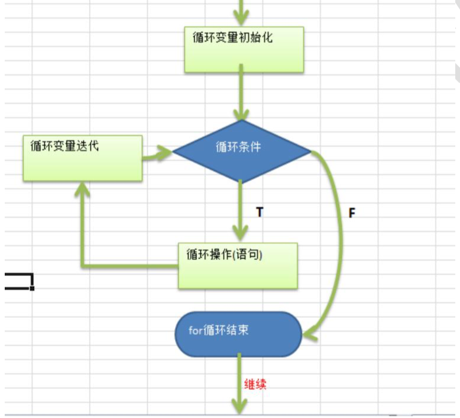
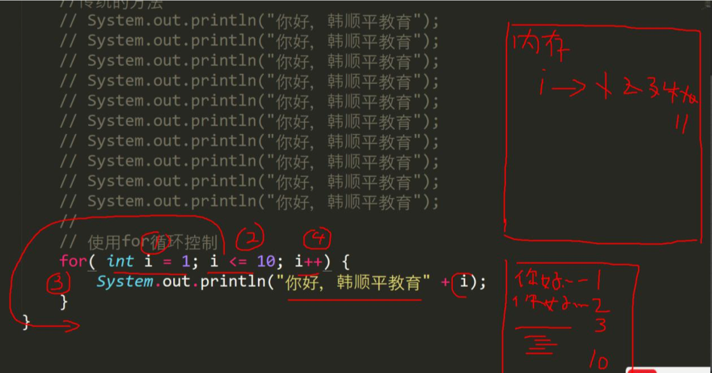
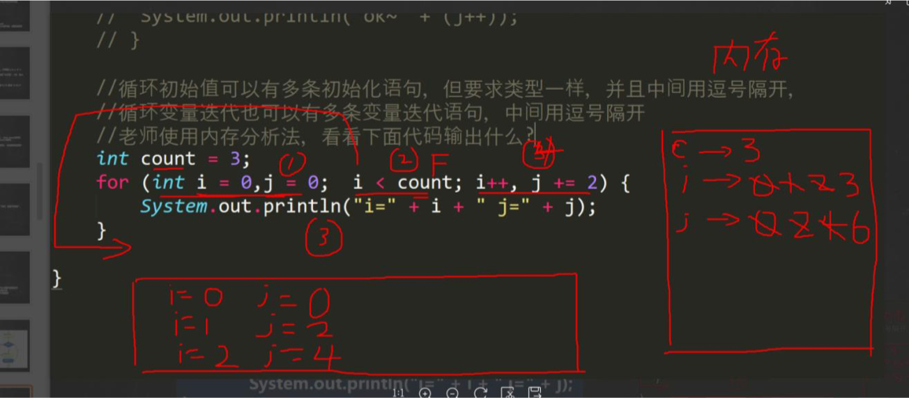
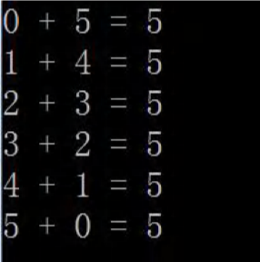
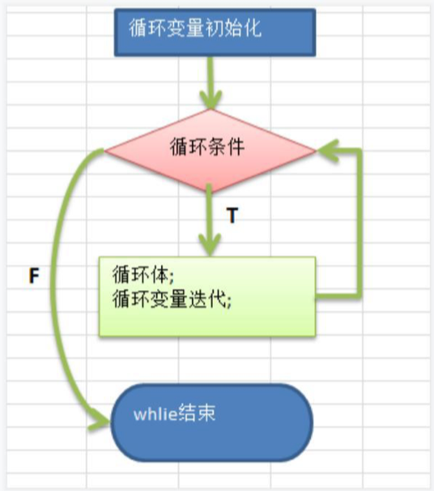
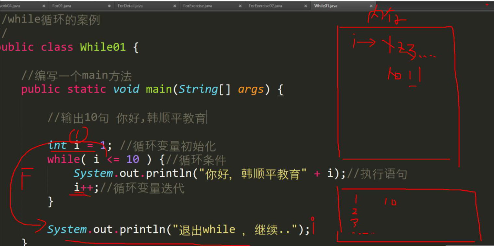
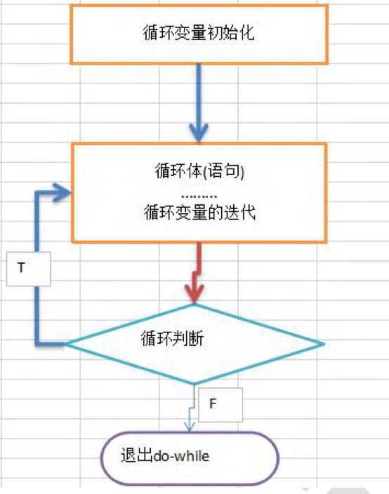
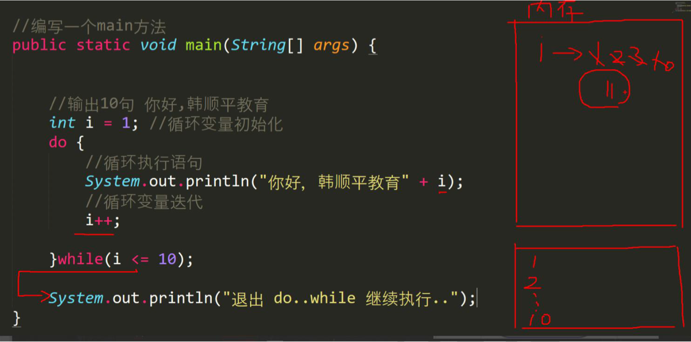
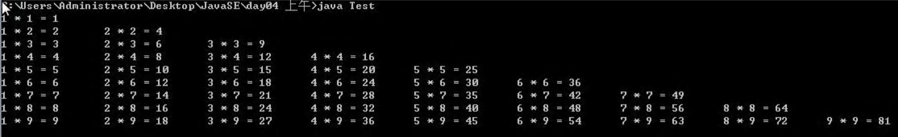
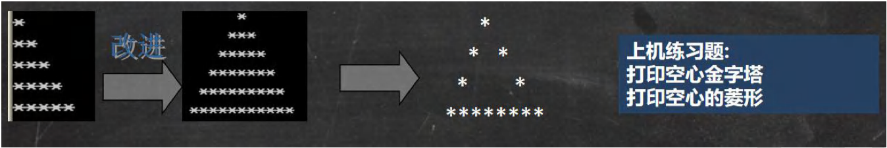

### 5.7 for循环控制

基本介绍：听其名而知其意,就是让你的代码可以循环的执行.

#### 5.7.1 看一个实际需求

【For01.java】

编写一个程序，可以打印10句”Hello world!"

#### 5.7.2 基本语法

```
for(循环变量初始化;循环条件;循环变量迭代){
	循环操作(可以多条语句);
}
```

- 说明
  1. for 关键字，表示循环控制
  2. for有四要素：(1)循环变量初始化(2)循环条件(3)循环操作(4)循环变量迭代
  3. 循环操作，这里可以有多条语句，也就是我们要循环执行的代码
  4. 如果 循环操作（语句）只有一条语句，可以省略{}，建议不要省略

#### 5.7.3for循环执行流程分析

1）使用for循环完成打印10句"Hello world!"

2）画出 for 流程图



3）代码执行，内存分析法



#### 5.7.4注意事项和细节说明

ForDetail.java

1）循环条件是返回一个布尔值的表达式

2）for(;循环判断条件;) 中的初始化和变量迭代可以写到其它地方，但是两边的分号不能省略。

3）循环初始值可以有多条初始化语句，但要求类型一样，并且中间用逗号隔开，循环变量迭代也可以有多条变量迭代 语句，中间用逗号隔开。

4）使用内存分析法

```java

//演示for的使用细节
public class ForDetail {
	public static void main(String[] args) {
		
		//for(;循环判断条件;) 
		//中的初始化和变量迭代可以写到其它地方，但是两边的分号不能省略。

		//使用for循环控制
		// int i = 1;//循环变量初始化
		// for(; i <= 10; ){
		// 	System.out.println("Hello world!" + i);
		// 	i++;
		// }
		// System.out.println("i="+i);//ok


		// int j = 0;
		// //补充
		// for(;;){//表示无限循环，死循环+break
		// 	System.out.println("ok~"+(j++));
		// }

		int count = 3;
		for (int i = 0,j = 0; i < count ;i++,j += 2 ) {
			System.out.println("i=" + i + " j=" + j);
		}
	}
}
```



#### 5.7.5 for循环练习

ForExercise.java

1）打印1~100之间所有是9的倍数的整数，统计个数 及 总和.[化繁为简,先死后活]

```java

public class ForExercise {
	public static void main(String[] args) {
		//打印1~100之间所有是9的倍数的整数，统计个数 及 总和.
		//两个编程思想（技巧）
		//1.化繁为简：即将复杂的需求，拆解成简单的需求，逐步完成
		//2.先死后活：先考虑固定的值，然后转成可以灵活变化的值
		//
		//思路分析
		//打印1~100之间所有是9的倍数的整数，统计个数 及 总和
		//化繁为简
		//(1) 完成 输出 1-100的值
		//(2) 在输出的过程中，进行过滤，只输出9的倍数 i % 9 == 0
		//(3) 统计个数 定义一个变量 int count = 0;当条件满足时 count++;
		//(4) 总和，定义一个变量 int sum = 0; 当条件满足时累积 sum += i;
		//先死后活
		//(1)为了适应更好的需求，把范围的起始值和结束的值，做成变量
		//(2)还可以更进一步 9 倍数也做成变量 int t = 9;

		int sum = 0;//总和
		int count = 0;//统计9的倍数个数 变量
		int start = 1;
		int end = 100;
		int t = 9;// 倍数
		for (int i = start;i <= end ;i++ ) {
			if (i % t == 0) {
				System.out.print(i+" ");
				count++;
				sum += i;//累积
			}
		}
		System.out.println();
		System.out.println("打印1~100之间所有是9的倍数的整数个数和和分别为："+ count+" "+sum);
	}
}
```

2）完成下面的表达式输出【ForExercise02.java】



```java

public class ForExercise02 {
	public static void main(String[] args) {
		
		//化繁为简
		//(1) 先输出 0-5
		//(2) 后面的+是 5-i

		//先死后活
		//(1) 5 替换成变量n

		int n = 10;
		for (int i=0;i <= n;i++) {
			System.out.println(i+" + " + (n-i) + " = " + n);
		}
	}
}
```

### 5.8 while循环控制

#### 5.8.1 基本语法

```
循环变量初始化;
while(循环条件){
	循环体(语句);
	循环变量迭代;
}
```

- 说明：
  1. while 循环也有四要素
  2. 只是四要素放的位置和for不一样

#### 5.8.2while 循环执行流程分析

【While01.java】

1）画出流程图



2）使用while循环完成打印10句”Hello World！“

```java
//while循环的案例
//
public class While01 {
	public static void main(String[] args) {
		
		//输出10句”Hello World！

		int i = 1;
		while(i <= 10){
			System.out.println("Hello World!");
			i++;//循环变量迭代
		}

		System.out.println("退出while，继续...");
	}
}
```

3）代码执行内存分析图



#### 5.8.3注意事项和细节说明

1）循环条件是返回一个布尔值的表达式

2）while 循环是先判断再执行语句

#### 5.8.4 课堂练习

【WhileExercise.java】

1）打印 1-100 之间所有能被3整除的数[使用while循环]

2）打印40 - 200之间所有的偶数 [使用while]

```java

public class WhileExercise {
	public static void main(String[] args) {
		
		//打印 1-100 之间所有能被3整除的数
		//化繁为简，先死后活

		// int i = 1;
		// int endNum = 100;//结束的变量
		// int t = 3;
		// while(i <= endNum){
		// 	if (i % t == 0) {
		// 		System.out.println("i=" + i);
		// 	}
		// 	i++;//变量自增
		// }

		// 打印40 - 200之间所有的偶数[使用while]
		//化繁为简，先死后活（利于思考）
		//
		int j = 40;//变量初始化
		while(j <= 200){
			//判断
			if (j % 2 == 0) {
				System.out.println("j=" + j);
			}
			j++;//循环变量的迭代
		}
	}
}
```

### 5.9 do...while 循环控制

#### 5.9.1基本语法

```
基本变量初始化;
do{
	循环体(语句);
	循环变量迭代;
}while(循环条件);
```

#### 5.9.2说明：

1. do while是关键字
2. 也有循环四要素，只是位置不一样
3. 先执行，再判断，也就是说，一定会执行一次
4. 最后 有一个 分号;
5. While 和 do..while 区别举例：要账 

#### 5.9.3do...while 循环执行流程分析

DoWhile01.java

1）画出流程图



2）使用do...while循环完成打印10句”Hello world!“

```java
public class DoWhile01 {
	public static void main(String[] args) {

		//输出10句 Hello World!
		int i = 1;//循环变量初始化
		do{
			//循环执行语句
			System.out.println("Hello World!" + i);
			//循环变量迭代
			i++;

		}while(i <= 10);
		System.out.println("退出 do...while 继续执行..");
	}
}
```

3）代码执行内存分析图



#### 5.9.4注意事项和细节说明

1）循环条件是返回一个布尔值的表达式

2）do...while循环是先执行，再判断，因此它至少执行一次

#### 5.9.5课堂练习题

1）打印1-100

2）计算1-100的和

```java
public class DoWhileExercise {
	public static void main(String[] args) {
		// //打印1-100
		// int i = 1;
		// do{
		// 	System.out.println(i+" ");
		// 	i++;
		// }while(i <= 100);

		//计算1-100的和
		int sum = 0;
		int i = 1;
		do{
			sum+=i;
			i++;
		}while(i <= 100);
		System.out.println("sum="+sum);
	}
}
```

3）统计1-200之间能被5整除但不能被3整除的个数(DoWhileExercise01.java)

```java
public class DoWhileExercise01 {
	public static void main(String[] args) {
		//统计1-200之间能被5整除但不能被3整除的个数
		//化繁为简
		//(1) 使用do-while输出 1-200
		//(2) 过滤	能被5整除但不能被3整除的数 %
		//(3) 统计满足条件的个数 int count = 0;
		//先死后活
		//(1) 范围的值 1-200 可以做出变量
		//(2) 能被5整除但不能被3整除的，5 和 3 可以改成变量
		int i = 1;
		int count = 0;//统计满足条件的个数
		do{
			if(i % 5 == 0 && i % 3 != 0){
				System.out.println(i);
				count++;
			}
			i++;
		}while(i <= 200);
		System.out.println("count=" + count);
	}
}
```

4）如果李三不还钱，则老韩将一直使出五连鞭，直到李三说还钱为止

[System.out.println("老韩问：还钱吗？y/n")]	do...while..

DoWhileExercise02.java

```java
import java.util.Scanner;
public class DoWhileExercise02{
	public static void main(String[] args) {
		//如果李三不还钱，则老韩将一直使出五连鞭，直到李三说还钱为止
		//[System.out.println("老韩问：还钱吗？y/n")]	do...while..
		//
		//化繁为简
		//(1)不停地问还钱吗？
		//(2) 使用char answer 接收,定义一个Scanner对象
		//(3) 在do-while 的while 判断如果是y 就不再循环
		Scanner myScanner = new Scanner(System.in);
		char answer = ' ';
		do{
			System.out.println("老韩使出五连鞭");
			System.out.println("还钱吗？y/n");
			answer = myScanner.next().charAt(0);
			System.out.println("他的回答是：" + answer);
		}while(answer != 'y');//判断条件很关键

		System.out.println("李三还钱了");
	}
}
```

### 5.10 多重循环控制（难点！重点！）

#### 5.10.1介绍

1）将一个循环放在另一个循环体内，就形成了嵌套循环。其中，for ,while ,do…while 均可以作为外层循环和内层循环。 【建议一般使用两层，最多不要超过 3 层, 否则，代码的可读性很差】

2）实质上，嵌套循环就是把内层循环当成外层循环的循环体。当只有内层循环的循环条件为 false 时，才会完全跳出内 层循环，才可结束外层的当次循环，开始下一次的循环。

3）设外层循环次数为 m 次，内层为 n 次，则内层循环体实际上需要执行 m*n 次。

```java
for(int i = 1;i <= 7;i++){//第一层循环 7
  for(int j =1;j <= 2;j++){//第二层循环 2
    System.out.println("ok~~");//7 * 2 =14
  }
}
```

#### 5.10.2 多重循环执行步骤分析：

 请分析 下面的多重循环执行步骤，并写出输出 => 内存分析法

//双层for MulFor.java

```java
public class MulFor {
	public static void main(String[] args) {
		
		for (int i = 0;i < 2 ;i++ ) {
			for (int j = 0;j < 3 ;j++ ) {
				System.out.println("i="+i+" j="+j);
			}
			
		}
	}
}
```


#### 5.10.3 应用实例：

//MulForExercise01.java

1）统计3个班成绩情况，每个班有5名同学，求出各个班的平均分和所有班级的平均分[学生的成绩从键盘输入]。

2）统计三个班及格人数，每个班有 5 名同学。

```java
import java.util.Scanner;
public class MulForExercise01 {
	public static void main(String[] args) {
		//统计3个班成绩情况，每个班有5名同学，
		//求出各个班的平均分和所有班级的平均分[学生的成绩从键盘输入]。
		//统计三班及格人数，每个班有5名同学。
		//
		//思路分析：
		//化繁为简
		//(1) 先计算一个班，5个学生的成绩;使用for
		//1.1 创建一个Scanner对象然后，接收用户输入
		//1.2 得到该班级的平均分,定义一个 double sum 把该班级5个学生的成绩累积

		//(2) 统计3个班(每个班5个学生)
		//(3) 所有班级的平均分
		//3.1 定义一个变量，double totalScore 累积所有学生的成绩
		//3.2 当多重循环结束后，totalScore / (3 * 5)
		//(4) 统计三班及格人数，每个班有5名同学
		//4.1 定义一个变量 int passNum = 0; 当有一个学生成绩>=60,passNum++
		//4.2 如果 >= 60 passNum++
		//(5) 可以优化[效率，可读性，结构]


		//创建 Scanner 对象
		Scanner myScanner = new Scanner(System.in);
		double totalScore = 0;//累积所有学生的成绩
		int passNum = 0;//累积 及格人数
		for (int i = 1; i <= 3 ; i++) {//i 表示班级
			
			double sum = 0;//一个班级的总分
			for (int j = 1;j <= 5 ;j++ ) {
				System.out.println("请数第"+ i +"个班的第"+ j +"个学生的成绩");
				double score = myScanner.nextDouble();
				//当有一个学生成绩>=60,passNum++
				if (score >= 60) {
					passNum++;
				}
				sum += score;//累积
				System.out.println("成绩为"+ score);
			}
			//因为sum 是 5个学生的总成绩
			System.out.println("sum=" + sum + " 平均分=" + (sum / 5));
			//把 sum 累积到 totalScore
			totalScore += sum;
		}
		System.out.println("三个班总分=" + totalScore 
			+ " 平均分=" + totalScore / 15);
		System.out.println("及格人数=" + passNum);
	}
}
```

3）打印出九九乘法表



```java
public class MulForExercise02 {
	public static void main(String[] args) {
		//打印出九九乘法表
		for (int i = 1;i <= 9 ; i++ ) {
			for (int j = 1; j <= i ; j++ ) {
				System.out.print(j+" * "+i+" = "+(i*j)+"\t");
			}
			System.out.println();
		}
	}
}
```

#### 5.10.4 经典的打印金字塔

使用 for 循环完成下面案例

编写一个程序，可以接收一个整数,表示层数（totalLevel），打印出金字塔。(Stars.java) [化繁为简, 先死后活]



```java
public class Stars {
	public static void main(String[] args) {
		// for (int i = 1;i <= 5 ;i++ ) {
		// 	for (int j =1;j <= i ;j++ ) {
		// 		System.out.print("*");
		// 	}
		// 	System.out.println();
		// }
		/*
		思路分析
		化繁为简
		1.先打印一个矩形
		*****
		*****
		*****
		*****
		*****
		2.打印半个金字塔
		*      //第一层 有 1个*
		**	   //第二层 有 2个*
		***	   //第三层 有 3个*
		****   //第四层 有 4个*
		*****  //第五层 有 5个*
	
		3.打印整个金字塔
			*		//第一层 有1个*	有四=(总层数-1)个空格
		   ***		//第二层 有3个*	有三=(总层数-2)个空格
		  *****     //第三层 有5个*	有二=(总层数-3)个空格
		 *******    //第四层 有7个*	有一=(总层数-4)个空格
		*********   //第五层 有9个*	有0=(总层数-5)个空格

		4.打印整个金字塔
			*		//第一层 有1个*	当前行的第一个位置是*，最后一个位置也是*
		   * *		//第二层 有2个*	当前行的第一个位置是*，最后一个位置也是*
		  *   *     //第三层 有2个*	当前行的第一个位置是*，最后一个位置也是*
		 *     *    //第四层 有2个*	当前行的第一个位置是*，最后一个位置也是*
		*********   //第五层 有9个*	全部输出*

		
		先死后活
		5 层数做成变量 int totalLevel = 5;
		
		*/

		for (int i = 1;i <=5 ;i++ ) {//i 表示层数
			//控制打印每层的*个数
			for(int j = 1;j <= i;j++){
				System.out.print("*");
			}
			//每打印完一层的*后，就换行 println本身
			System.out.println(" ");		
		}
		System.out.println("=================");
		for (int i=1;i <=5 ; i++ ) {
			//在输出*之前，还要输出  对应空格 
			for (int k = 1;k <= 5-i ;k++ ) {
				System.out.print(" ");
			}
			for (int j = 1;j <= 2*i-1 ; j++ ) {
				System.out.print("*");
			}
			System.out.println(" ");
		}
		System.out.println("=================");
		int totalLevel = 10;//层数
		for (int i=1;i <=totalLevel ; i++ ) {
			for (int k = 1;k <= totalLevel-i ;k++ ) {
				System.out.print(" ");
			}
			for (int j = 1;j <= 2*i-1 ; j++ ) {
				//当前行的第一个位置是*，最后一个位置也是*，最后一层全部*
				if (j ==1 || j == 2*i-1 || i== totalLevel) {
					System.out.print("*");
				}else{//其他情况输出空格
					System.out.print(" ");
				}
			}
			System.out.println(" ");
		}
	}
}
```