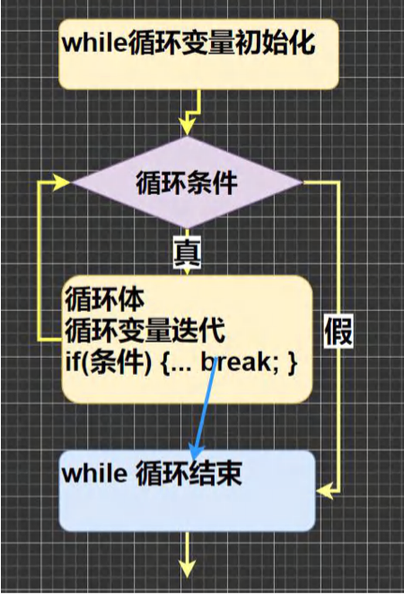
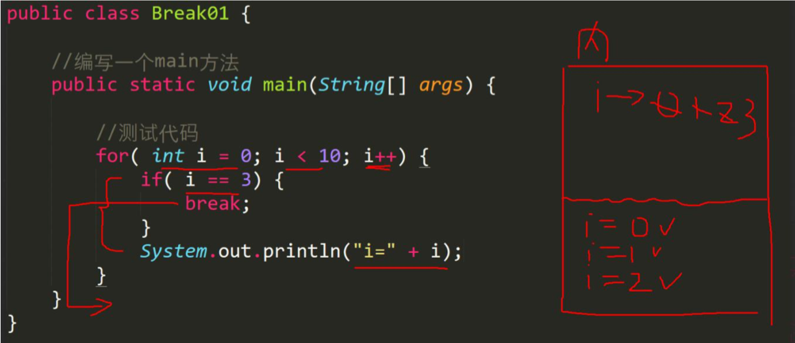
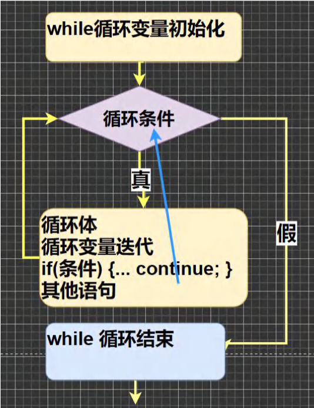
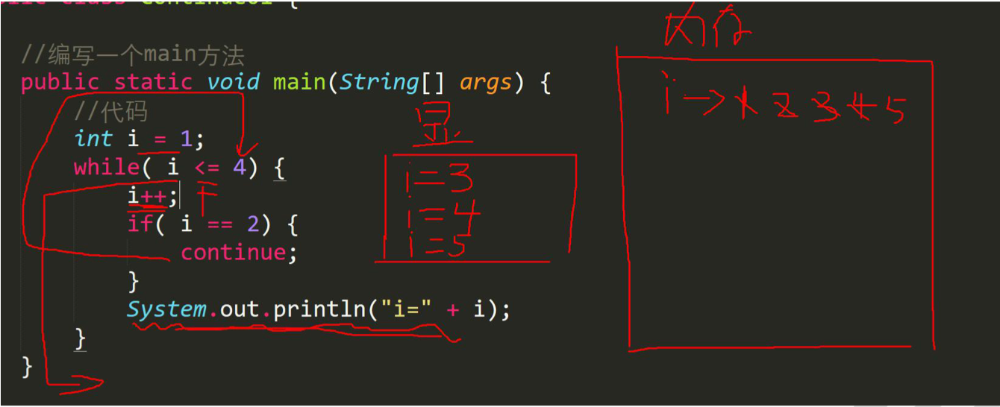

### 5.11 跳转控制语句-break

#### 5.11.1 看下面一个需求

随机生成 1-100 的一个数，直到生成了 97 这个数，看看你一共用了几次?

提示使用 (int)(Math.random() * 100) + 1

思路分析：

循环，但是循环的次数不知道. -> break ,当某个条件满足时，终止循环 通过该需求可以说明其它流程控制的必要性，比如 break

#### 5.11.2 基本介绍：

break语句用于终止某个语句块的执行，一般使用在switch或者循环[for , while , do-while]中

#### 5.11.3基本语法：

```java
{
  ......
    break;
  ......
}
```

#### 5.11.4 以while使用break为例，画出示意图



#### 5.11.4快速入门：

Break01.java

```java
public class Break01{
	public static void main(String[] args) {
			for (int i = 0;i < 10 ;i++ ) {
			if ( i == 3) {
				break;
			}
			System.out.println("i=" +i);
		}
	}
}
```



#### 5.11.6 注意事项和细节说明：

1. break语句出现在多层嵌套的语句块中时，可以通过==标签==指明要终止的是哪一层语句块BreakDetail.java

2. 标签的基本使用

   ```java
   label1:{......
     label2:{......
       label3:{......
         break label2;
               ......
       }
     }
   }
   ```

```java
public class BreakDetail {
	public static void main(String[] args) {
		label1:
		for (int j=0;j<4 ;j++ ) {//外层for
			label2:
			for (int i=0;i<10 ;i++ ) {//内层for
				for( i == 2 ){
					//break;//等价于break label2
					break label1;
				}
				System.out.println("i="+i);
			}
		}
	}
}
```

解读：

(1)break语句可以指定退出哪层

(2)label1 是标签，名字由程序员指定

(3)break后指定到哪个label就退出到哪里

(4)在实际的开发中，尽量不要使用标签

(5)如果没有指定break,默认退出最近的循环体

#### 5.11.7 课堂练习：

BreakExercise.java

1）1-100以内的数求和，求出 当和 第一次大于20的当前数【for+break】

```java
public class BreakExercise{
	public static void main(String[] args) {
		//1-100以内的数求和，求出 当和 第一次大于20的当前数【for+break】

		//1.循环 1-100，求和 sum
		//2.当 sum > 20 时，记录下当前数，然后break
		//3.在for循环外部，定义变量 n，把当前i赋给n
		int sum = 0;//累积和

		//注意i 的作用范围在 for{}
		int n = 0;
		for (int i=1;i<=100 ;i++ ) {
			sum+=i;//累积
			if (sum > 20) {
				System.out.println("和>20时候 当前数i="+i);
				n = i;
				break;
			}
		}
		System.out.println("当前数="+n);
	}
}
```

2）实现登录验证，有 3 次机会，如果用户名为"丁真" ,密码"666" 提示登录成功，否则提示还有几次机会，请使用 for+break 完成 BreakExercise02.java

```java
import java.util.Scanner;
public class BreakExercise02{
	public static void main(String[] args) {
		
		//实现登录验证，有 3 次机会，如果用户名为"丁真" ,密码"666" 
		//提示登录成功，否则提示还有几次机会，请使用 for+break 完成
		//
		//思路分析
		//1.创建Scanner对象接收用户输入
		//2.定义 String name ; String passwd; 保存用户名和密码
		//3.最多循环 3 次[登录 3 次]，如果 满足条件就提前退出
		//4.定义一般变量 int chance 记录还有几次登录机会
		//
		//代码实现


		Scanner myScanner = new Scanner(System.in);
		String name = "";
		String password = "";
		int chance = 3;//登录一次，就减少一次
		for (int i= 1;i <=3 ;i++ ) {//3次登录机会
			System.out.println("请输入名字");
			name = myScanner.next();
			System.out.println("请输入密码");
			password = myScanner.next();
			//比较输入的名字和密码是否正确
			//补充说明字符串 的内容 比较 使用的 方法 equals
			if ("丁真".equals(name) && "666".equals(password)) {
				System.out.println("恭喜你，登录成功~");
				break;
			}


			//登录的机会就少一次
			chance--;
			System.out.println("你还有"+ chance +"次登录机会");
		}
	}
}
```

### 5.12跳转控制语句-continue

#### 5.12.1基本介绍：

1）continue 语句用于结束本次循环，继续执行下一次循环。

2）continue 语句出现在多层嵌套的循环语句体中时，可以通过标签指明要跳过的是哪一层循环 , 这个和break的标签的 使用的规则一样.

#### 5.12.2基本语法：

```java
{
  ......
    continue;
  ......
}
```

#### 5.12.3 以while使用continue位例,画出示意图



#### 5.12.4 快速入门案例

【Continue01.java】

```java
public class Continue01 {
	public static void main(String[] args) {
		
		int i = 1;
		while( i <= 4){
			i++;
			if( i==2 ){
				continue;
			}
			System.out.println("i="+i);
		}
	}
}
```



#### 5.12.5 细节案例分析和说明：

ContinueDetail.java

```java

public class ContinueDetail {
	public static void main(String[] args) {
		label1:
		for (int j=0;j<4 ;j++ ) {
			label2:
			for (int i=0;i<10 ;i++ ) {
				if(i == 2){
					//看看分别输出什么值，并分析
					//continue ;
					//continue label2;
					continue label1;
				}
				System.out.println("i="+i);
			}
		}
	}
}
```

### 5.13 跳转控制语句-return

return 使用在方法，表示跳出所在的方法，注意：如果 return 写在 main 方法，退出程序..Return01.java

```java
public class Return01 {
	public static void main(String[] args) {
		for (int i = 1;i < 5;i++ ) {
			
			if (i == 3) {
				System.out.println("Hello World!"+i);
				//break;
				//continue;
				return;//当return用在方法时，表示跳出方法，如果在main,表示退出程序
			}
			System.out.println("梦开始的地方");
		}
		System.out.println("go on..");
	}
}
```

### 5.14 本章作业

1. 编程实现如下功能Homework01.java

   某人有100,000元，每经过一次路口，需要交费，规则如下：

   1）当现金>50000时，每次交5%

   2）当现金<=50000时，每次交1000

   编程计算该人可以经过多少次路口，要求:使用while + break方式完成

   ```java
   public class Homework01 {
   	public static void main(String[] args) {
   		/*
   		某人有100,000元，每经过一次路口，需要交费，规则如下：
   		1）当现金>50000时，每次交5%
   		2）当现金<=50000时，每次交1000
   
   		思路分析
   		1.定义 double money 保存 100000
   		2.根据题的要求，我们分析出来有三种情况 
   		money > 5000
   		money >= 1000 && money <=50000
   		money < 1000
   		3.使用多分支 if-elseif-else
   		4.while+break[money < 1000]，同时使用一个变量count来保存通过路口
   		*/
   		//代码实现
   		double money = 100000;//还有多少钱
   		int count = 0;//累积过得路口
   		while(true){//无限循环
   			if (money > 50000) {
   				//money = money - money * 0.05;
   				money *= 0.95;//过了这个路口后，还有这么多钱
   				count++;
   			}else if (money >= 1000) {
   				money -= 1000;
   				count++;
   			} else{//前不够
   				break;
   			}
   		}
   		System.out.println("100000可以过"+ count + "路口..");
   	}
   }
   ```

2. 实现判断一个整数，属于哪个范围：大于0；小于0；等于0 Homework02.java

   ```java
   public class Homework02{
   	public static void main(String[] args) {
   		int n = 22;
   		if ( n > 0) {
   			System.out.println("大于0");
   		}else if (n < 0) {
   			System.out.println("小于0");
   		}else{
   			System.out.println("等于0");
   		}
   	}
   }
   ```

3. 判断一个年份是否为闰年Homework03.java

   ```java
   public class Homework03{
   	public static void main(String[] args) {
   		int year =2023;
   		//能被4整除但是不能被100整除
   		//能被400整除
   		if((year % 4 == 0 && year % 100 != 00) || year % 400 == 0){
   			System.out.println(year+"是闰年！");
   		}else{
   			System.out.println(year+"不是闰年！");
   		}
   	}
   }
   ```

4. 判断一个整数是否是水仙花数，所谓水仙花数是指一个3位数，其各个位上数字立方和等于其本身。例如 153 = 1 * 1 * 1 + 3 * 3 * 3 +5 * 5 * 5【Homework04.java】

   ```java
   public class Homework04 {
   	public static void main(String[] args) {
   		/*
   		判断一个整数是否是水仙花数，所谓水仙花数是指一个3位数，
   		其各个位上数字立方和等于其本身。
   		例如 153 = 1 * 1 * 1 + 3 * 3 * 3 +5 * 5 * 5
   
   		思路分析
   		1.比如 int n = 153;
   		2.先得到 n的百位，十位，个位的数字，使用 if 判断他们的立方和是否相等
   		3.n的百位 = n / 100 
   		4.n的十位 = n % 100 / 10
   		5.n的个位 = n % 10
   		6.判断即可 
   		*/
   		int n = 153;
   		int n1 = n / 100;
   		int n2 = n % 100 / 10;
   		int n3 = n % 10;
   		if (n1 * n1 * n1 + n2 * n2 * n2 + n3 * n3 *n3 == n) {
   			System.out.println(n + "是水仙花数");
   		} else{
   			System.out.println(n + "不是水仙花数");
   		}
   	}
   }   
   ```

5. 看看下面代码输出什么？【Homework05.java】

   ```java
   public class Homework05 {
   	public static void main(String[] args) {
   		int m = 0,n = 3;
   		if (m>0) {
   			if (n>2) {
   				System.out.println("OK1");				
   			}else {
   				System.out.println("OK2");
   			}
   		}
   	}
   }
   ```

   > 没有任何输出！

6. 输出1-100之间的不能被5整除的数，每5个一行【Homework06.java】

   ```java
   public class Homework06{
   	public static void main(String[] args) {
   		/*
   		输出1-100之间的不能被5整除的数，每5个一行
   
   		思路分析
   		1.先输出1-100的所有数
   		2.然后过滤输出 不能被5整除的数
   		3.每5个一行，我们使用 int count 统计输出的个数 count % 5 =0就说明
   		  输出了5个,这时，我们输出 一个换行即可控制
   
   		代码实现
   		*/
   		int count = 0;
   		for (int i = 1;i <= 100 ;i++ ) {
   			if (i % 5 != 0) {
   				count++;
   				System.out.print(i+"\t");
   				//判断,没满5个就输出一个换行..
   				if (count % 5 ==0) {
   					System.out.println();
   				}
   			}
   			
   		}
   	}
   }
   ```

7. 输出小写的a-z以及大写的Z-A 【Homework07.java】

   ```java
   public class Homework07{
   	public static void main(String[] args) {
   		//输出小写的a-z以及大写的Z-A 
   		//考察我们对 a-z编码和 for的综合使用
   		//思路分析
   		//1. 'b' = 'a' + 1 c = 'a' + 2
   		//2. 使用 for 循环搞定
   
   		for (char c1 = 'a'; c1 <= 'z';c1++) {
   			System.out.print(c1+" ");
   		}
   		System.out.println(" ");
   		for (char c1 = 'Z'; c1 >= 'A';c1--) {
   			System.out.print(c1+" ");
   		}
   	}
   }
   ```

8. 求出1-1/2+1/3-1/4......1/100的和【Homework08.java】

   ```java
   public class Homework08{
   	public static void main(String[] args) {
   		/*
   		求出1-1/2+1/3-1/4......1/100的和
   		思路分析
   		1.1-1/2+1/3-1/4......1/100 = 1-(1/2)+(1/3)-(1/4)...(1/100)
   		2.从上面的分析我们可以看到
   		(1) 一共有100数，分子为1，分母从1-100
   		(2) 还发现 当分母为奇数时，前面是 +，当分母是偶数是，前面是-
   		3.我们可以使用for + 判断即可完成
   		4.把结果存放到 double sum
   		5.这里有一个隐藏的陷阱，要把 公式分子 1 写成1.0 才能得到精确的小数
   		*/
   
   		double sum = 0;
   		for (int i = 1;i <= 100;i++ ) {
   			//判断是奇数还是偶数，然后做不同的处理
   			if(i % 2 != 0){//奇数
   				sum+=1.0/i;
   			}else{//分母为偶数
   				sum-=1.0/i;
   			}
   		}
   		System.out.println("sum=" + sum);
   	}
   }
   ```

9. 求1+ (1+2) + (1+2+3) +(1+2+3+4) +...+ (1+2+3+..+100)的结果【Homework09.java】

   ```java
   public class Homework09 {
   	public static void main(String[] args) {
   		//求1+ (1+2) + (1+2+3) +(1+2+3+4) +...+ (1+2+3+..+100)的结果
   		//
   		//思路分析
   		//1.一共有100项相加
   		//2.每一项的数字在逐渐增加
   		//3.很像一个双层循环
   		//i 可以表示是第几项，同时也是当前项的最后一个数
   		//4.使用 sum 进行累积即可
   		int sum = 0;
   		for (int i = 1;i <=100 ;i++ ) {
   			for (int j = 1;j <= i ;j++ ) {//内层对1-i进行循环
   				sum+=j;
   			}
   		}
   		System.out.println("sum="+sum);
   	}
   }
   ```

   

