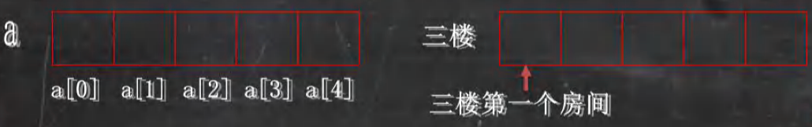
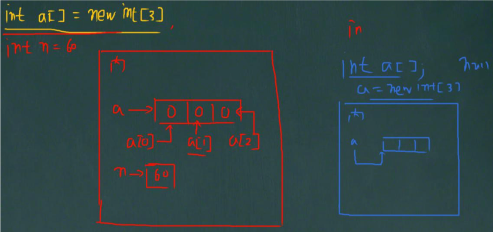
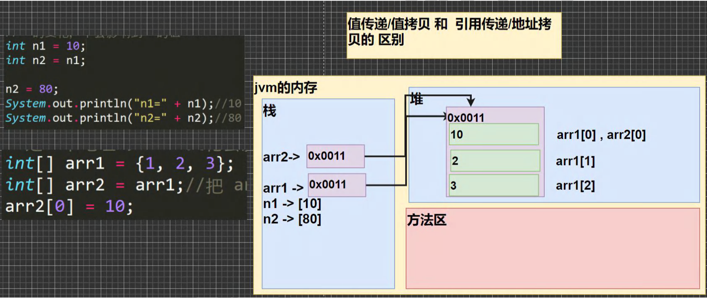
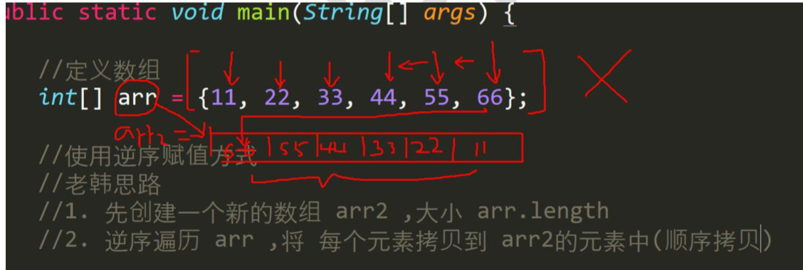
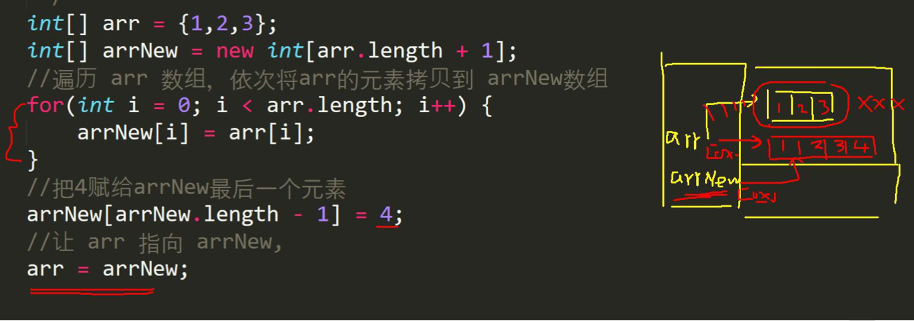
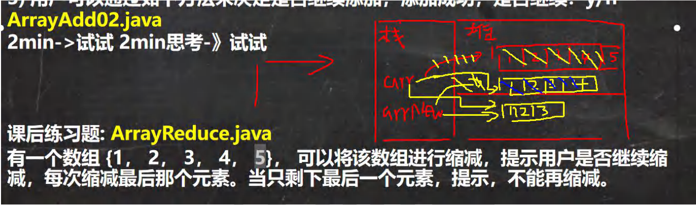

## 第 6 章 数组、排序和查找

### 6.1为什么需要数组

​	一个养鸡场有 6 只鸡，它们的体重分别是 3kg,5kg,1kg,3.4kg,2kg,50kg 。请问这六只鸡的总体重是多少?平 均体重是多少? 请你编一个程序。【 Array01.java】

​	思路：

​	定义 6 个变量，加起来 总体重，求出平均体重.引出 -> 数组

#### 6.1.1数组介绍

​	数组可以存放多个==同一类型的==数据。数组也是一种数据类型，是引用类型。

​	即：数(数据)组(一组)就是一组数据

#### 6.1.2 数组快速入门

​	【Array01.java】

​	用数组解决

```java

//数组的引出
public class Array01{
	public static void main(String[] args) {
		/*
		一个养鸡场有 6 只鸡，它们的体重分别是 3kg,5kg,1kg,3.4kg,2kg,50kg 。
		请问这六只鸡的总体重是多少?平 均体重是多少? 

		思路分析
		1.定义六个变量 double ，求和 得到总体重
		2.平均体重 = 总体重 / 6
		3.分析传统实现的方式问题. 6->600
		*/

		// double hen1 = 3;
		// double hen2 = 5;
		// double hen3 = 1;
		// double hen4 = 3.4;
		// double hen5 = 2;
		// double hen6 = 50;

		// double totalWeight = hen1 + hen2 + hen3 + hen4 + hen5 + hen6;

		// double avgWeight = totalWeight / 6;
		// System.out.println("总体重=" + totalWeight 
		// 	+ " 平均体重=" + avgWeight);
		//比如，我们可以用数组来解决上一个问题
		//
		//定义一个数组
		//解读
		//1. double[] 表示 是double类型的数组，数组名 hens
		//2. {3, 5, 1, 3.4, 2, 50} 表示数组的值/元素，依次表示数组的
		//	第几个元素
		//	
		double[] hens = {3, 5, 1, 3.4, 2, 50, 7.8, 88.8};

		//遍历数组得到数组的所有元素的和		使用for
		//解读
		//1. 我们可以通过 hens[下标] 来访问数组的元素
		//	 下标是从 0 开始编号的比如第一个元素就是 hens[0]
		//	 第2个元素就是 hens[1]，依此类推
		//2. 通过for就可以循环的访问 数组的元素/值
		//3. 使用一个变量 totalWeight 将各个元素累积
		System.out.println("===使用数组解决===");
		//提示：可以通过 数组名.length 得到数组的大小/长度
		System.out.println("数组的长度=" + hens.length);
		double totalWeight = 0;
		for (int i = 0;i < hens.length ;i++ ) {
			//System.out.println("第"+ (i+1) +"个元素的值="+ hens[i]);
			totalWeight += hens[i];
		}

		System.out.println("总体重=" + totalWeight 
			+ "平均体重" +(totalWeight / hens.length));

	}
}
```

### 6.2 数组的使用

- 使用方式1-动态初始化

  - 数组的定义

    数据类型 数组名[] = new 数据类型[大小]

    int a[] = new int[5];//创建了一个数组，名字a，存放5个int

    说明：这是定义数组的一种方法。

    

  - 数组的引用（使用）

    数组名[下标/索引]

    比如：要使用a数组的第3个数 a[2],数组的下标从0开始

  - 快速入门案例 Array02.java

    循环输入5个成绩，保存到double数组,并输出

    

    ```java
    import java.util.Scanner;
    public class Array02 {
    	public static void main(String[] args) {
    		//演示 数据类型 数组名[] = new 数据类型[大小]
    		//循环输入5个成绩，保存到double数组，并输出
    
    		//步骤
    		//1.创建一个 double 数组，大小 5
    
    		double scores[] = new double[5];
    		//2.循环输入
    		// scores.length 表示数组的大小/长度
    		//
    		Scanner myScanner = new Scanner(System.in);
    		for (int i = 0;i < scores.length ;i++ ) {
    			System.out.println("请输入第" + (i+1) + "个元素的值");
    			scores[i] = myScanner.nextDouble();
    		}
    
    		//输出，遍历数组
    		System.out.println("===当前数组的元素/值的情况如下：===");
    		for (int i = 0;i <scores.length ; i++) {
    			System.out.println("第" + (i+1) + "个元素的值=" + scores[i]);
    		}
    	}
    }
    ```

### 6.2.1使用方式2-动态初始化

- 先声明数组

  语法：数据类型 数组名[];	也可以	数据类型[] 数组名;

  int a[]; 或者 int[] a;

- 创建数组

  语法：数组名=new 数据类型[大小];

  a = new int[10];

- 案例演示

  ```java
  import java.util.Scanner;
  public class Array02 {
  	public static void main(String[] args) {
  		//演示 数据类型 数组名[] = new 数据类型[大小]
  		//循环输入5个成绩，保存到double数组，并输出
  
  		//步骤
  		//1.创建一个 double 数组，大小 5
      
  		//(1)第一种动态分配方式
  		//double scores[] = new double[5];
      //(2)第二种动态分配方式，先声明数组，再 new 分配空间
      double scores[];//声明数组，这时 scores 是 null
      scores = new double[5];//分配内存空间，可以存放数据
  		//2.循环输入
  		// scores.length 表示数组的大小/长度
  		//
  		Scanner myScanner = new Scanner(System.in);
  		for (int i = 0;i < scores.length ;i++ ) {
  			System.out.println("请输入第" + (i+1) + "个元素的值");
  			scores[i] = myScanner.nextDouble();
  		}
  
  		//输出，遍历数组
  		System.out.println("===当前数组的元素/值的情况如下：===");
  		for (int i = 0;i <scores.length ; i++) {
  			System.out.println("第" + (i+1) + "个元素的值=" + scores[i]);
  		}
  	}
  }
  ```

#### 6.2.2使用方式3-静态初始化

- 初始化数组

  语法:数据类型 数组名[]={元素值,元素值...}

  int a[] = {2,5,6,7,8,89,90,34,56},如果知道数组有多少元素，具体值

  上面的用法相当于：int a[] = new int[9];

  ​				a[0]=1;a[1]=5;a[2]=6;a[3]=7;a[4]=8;

  ​				a[5]=89;a[6]=90;a[7]=34;a[8]=56;

- 快速入门案例【养鸡场】

  //案例 Array01.java

  double hens[] = {3,5,1,3.4,2,50};

  等价

  Double hens[] =new double[6];

  hens[0]=3;hens[1]=5;hens[2]=1;hens[3]=3.4;hens[4]=2;hens[5]=50;

### 6.3 数组使用注意事项和细节

【ArrayDetail.java】

1）数组是多个相同类型数据的组合，实现对这些数据的统一管理

2）数组中的元素可以是任何数据类型，包括基本类型和引用类型，但是不能混用。

3）数组创建后，如果没有赋值，有默认值

> int 0，short 0, byte 0, long 0, float 0.0,double 0.0，char \u0000，boolean false，String null

4）使用数组的步骤 1. 声明数组并开辟空间 2 给数组各个元素赋值 3 使用数组

5）数组的下标是从 0 开始的。

6）数组下标必须在指定范围内使用，否则报：下标越界异常，比如int [] arr=new int[5]; 则有效下标为 0-4

7）数组属引用类型，数组型数据是对象(object)

```java
public class ArrayDetail{
	public static void main(String[] args) {
		//1.数组是多个相同类型数据的组合，实现对这些数据的统一管理

		// int[] arr1 = {1, 2, 3, 60, "hello"};//String -> int
		double[] arr2 = {1.1, 2.2, 3.3, 60.6, 100};//int -> double

		//2.数组中的元素可以是任何数据类型，包括基本类型和引用类型，但是不能混用。
		String[] arr3 = {"北京","jack","milan"};

		//3.数组创建后，如果没有赋值，有默认值
		//int 0，short 0, byte 0, long 0, float 0.0,
		//double 0.0，char \u0000，boolean false，String null
		//
		short[] arr4 = new short[3];
		System.out.println("=====数组arr4=====");
		for (int i = 0;i < arr4.length ;i++ ) {
			System.out.println(arr4[i]);
		}

		//6.数组下标必须在指定范围内使用，否则报：下标越界异常，比如
		//int [] arr=new int[5]; 则有效下标为 0-4
		//即数组的下标/索引 最小 0 最大 数组长度-1(4)
		int [] arr = new int[5];
		//System.out.println(arr[5]);//数组越界
	}
}
```

### 6.4 数组应用案例

1）创建一个 char 类型的 26 个元素的数组，分别 放置'A'-'Z'。使用 for 循环访问所有元素并打印出来。提示：char 类型 数据运算 'A'+2 -> 'C' 【ArrayExercise01.java】

```java

public class ArrayExercise01{
	public static void main(String[] args) {
		
		/*
		创建一个 char 类型的 26 个元素的数组，分别 放置'A'-'Z'。
		使用 for 循环访问所有元素并打印出来。
		提示：char 类型 数据运算 'A'+2 -> 'C'

		思路分析
		1.定义一个 数组 char[] chars = new char[26]
		2.因为 'A' + 1 = 'B' 类推，所以可以用for来赋值
		3. 使用 for 循环访问所有元素
		*/
		char[] chars = new char[26];
		for (int i=0;i < chars.length ;i++ ) {//循环26次
			//chars 是 char[]
			//chars[i] = char
			chars[i] = (char)('A' + i);//'A' + i 是int，需要强制转换
		}

		//循环输出
		System.out.println("===chars数组===");
		for (int i = 0;i < chars.length ;i++ ) {
			System.out.print(chars[i] + " ");
		}
	}
}
```

2）请求出一个数组 int[]的最大值 {4,-1,9, 10,23}， 并得到对应的下标。【ArrayExercise02.java】

```java
public class ArrayExercise02{
	public static void main(String[] args) {
		
		//请求出一个数组 int[]的最大值 {4,-1,9, 10,23}， 并得到对应的下标。
		//思路分析
		//1.定义一个int数组 int[] arr = {4,-1,9, 10,23};
		//2.假定 max = arr[0] 是最大值，maxIndex = 0;
		//3.从下标 1 开始遍历arr,如果max < 当前元素,说明max 不是真正的最大值，
		//  就 max = 当前元素；maxIndex = 当前元素下标
		//4.当遍历整个数组后，max就是真正的最大值，maxIndex最大值对应的下标
		int arr[] ={4,-1,9,10,23};
		int max = arr[0];//假定第一个元素就是最大值
		int maxIndex = 0;//
		for (int i=0;i <arr.length;i++ ) {//从下标 1 开始遍历arr
			if (arr[i]>max) { //如果max < 当前元素
				max=arr[i]; //把max 设置成 当前元素
				maxIndex = i; 
			}
		}
		//当我们遍历这个数组 arr 后 , max 就是真正的最大值，maxIndex 最大值下标
		System.out.println("最大值："+max+" 最大值的下标："+ maxIndex);
	}
}
```

3）请求出一个数组的和和平均值。(养鸡场)

### 6.5 数组赋值机制

1）基本数据类型赋值，这个值就是具体的数据，而且相互不影响。

​	int n1 = 2;int n2 = n1;

2）数组在默认情况下是引用传递，赋的值是地址。

​	【ArrayAssign.java】

int[] arr1 = {1,2,3};

int[] arr2 = arr1;



### 6.6数组拷贝

编写代码 实现数组拷贝(内容复制)【ArrayCopy.java】

将 in[] arr1 = {10,20,30};拷贝到 arr2 数组, 要求数据空间是独立的.

```java
public class ArrayCopy{
	public static void main(String[] args) {
		
		//将 in[] arr1 = {10,20,30};拷贝到 arr2 数组,
		// 要求数据空间是独立的.

		int[] arr1 = {10,20,30};
		

		//创建一个新的数组arr2，开辟新的数据空间
		//大小 arr1.length;
		int[] arr2 = new int[arr1.length];

		//遍历 arr1，把每个元素拷贝到对应的位置
		for (int i = 0;i < arr1.length ;i++ ) {
			arr2[i] = arr1[i];
		}

		//修改 arr2, 不会对arr1有影响.
		arr2[0] = 100;

		//输出arr1
		System.out.println("====arr1的元素====");
		for (int i=0;i <arr1.length;i++ ) {
			System.out.println(arr1[i]);//10, 20, 30
		}


		System.out.println("====arr2的元素====");
		for (int i=0;i <arr2.length;i++ ) {
			System.out.println(arr2[i]);//100, 2, 3
		}
	}
}
```

### 6.7 数组反转

要求：把数组的元素内容反转。【ArrayReverse.java】

arr {11,22,33,44,55,66}  ------> {66, 55,44,33,22,11}

方式1：通过找规律反转

```java

public class ArrayReverse{
	public static void main(String[] args) {
		
		//定义数组
		int[] arr = {11,22,33,44,55,66};
		//思路
		//1.把 arr[0] 和 arr[5] 进行交换 {66,22,33,44,55,11}
		//2.把 arr[1] 和 arr[4] 进行交换 {66,55,33,44,22,11}
		//3.把 arr[2] 和 arr[3] 进行交换 {66,55,44,33,22,11}
		//4.一共要交换 3 次 = arr.length / 2
		//5.每次交换时，对应的下标 是 arr[i] 和 arr[arr.length -1 -i]
		//代码
		//优化
		int temp = 0;
		int len = arr.length;//计算数组的长度
		for (int i=0; i < len/2 ;i++) {
			temp = arr[len -1 -i];//保存
			arr[len -1 -i] = arr[i];
			arr[i] = temp;
		}

		System.out.println("===翻转后数组===");
		for (int i=0; i < len ;i++ ) {
			System.out.print(arr[i] + "\t");
		}
	}
}
```

方式2：使用逆序赋值方式【ArrayReverse02.java】

```java
public class ArrayReverse02 {
	public static void main(String[] args) {
		//定义数组
		int[] arr = {11,22,33,44,55,66};

		// int len = arr.length;

		// int[] arr1 = new int[len];

		// for (int i = len - 1;i >= 0 ; i-- ) { //i = 5
		// 	arr1[i] = arr[len-1-i];
		// }

		// System.out.println("===翻转后数组===");
		// for (int i=0; i < len ;i++ ) {
		// 	System.out.print(arr1[i] + "\t");
		// }

		// 使用逆序赋值方式
		//思路
		//1.先创建一个新的数组 arr2,大小 arr.length
		//2.逆序遍历 arr,将 每个元素拷贝到 arr2 的元素中(顺序拷贝)
		//3.建议增加一个循环变量 j->0->5
		int[] arr2 = new int[arr.length];
		for (int i = arr.length-1,j = 0; i >= 0; i--,j++) {//逆序遍历 arr
			arr2[j] = arr[i]; 
		}

		//4.当 for 循环结束，arr2就是一个逆序的数组{66,55,44,33,22,11}
		//5.让 arr 指向 arr2 数据空间，此时 arr原来的数据空间就没有变量引用
		//会被当做垃圾，销毁
		arr = arr2;

		System.out.println("===arr的元素情况===");
		//6.输出 arr 看看
		for (int i = 0;i < arr.length ; i++) {
			System.out.println(arr[i]+"\t");
		}
	}
}
```



### 6.8 数组添加/扩容

要求：实现动态的给数组添加元素效果，实现对数组扩容。【ArrayAdd.java】

1）原始数组使用静态分配 int[] arr = {1,2,3}

2）增加的元素 4， 直接放在数组的最后 arr = {1,2,3,4}

```java
public class ArrayAdd{
	public static void main(String[] args) {
		/*
		要求：实现动态的给数组添加元素效果，实现对数组扩容。【ArrayAdd.java】
		1）原始数组使用静态分配 int[] arr = {1,2,3}
		2）增加的元素 4， 直接放在数组的最后 arr = {1,2,3,4}
		3）用户可以通过如下方法来决定是否继续添加，添加成功，是否继续？y/n

		思路分析
		1.定义初始数组 int[] arr = {1,2,3}//下标0-2
		2.定义一个新的数组 int[] arrNew = new int[arr.length+1];
		3.遍历 arr 数组，依次将arr的元素拷贝到 arrNew数组
		4.将 4 赋给 arrNew[arrNew.length - 1] = 4;把4赋给arrNew最后一个元素
		5.让arr 指向 arrNew; arr = arrNew;那么 原来arr数组就被销毁
		*/
		int[] arr = {1,2,3};
		int[] arrNew = new int[arr.length + 1];
		//遍历 arr 数组，依次将arr的元素拷贝到 arrNew数组
		for (int i = 0;i < arr.length ;i++ ) {
			arrNew[i] = arr [i];
		}
		//把4赋给arrNew最后一个元素
		arrNew[arrNew.length - 1] = 4;
		//让arr 指向 arrNew;
		arr = arrNew;
		//输出arr
		System.out.println("====arr扩容后元素情况====")
		for (int i = 0;i < arr.length ;i++ ) {
			System.out.println(arr[i]);
		}
	}
}
```

3）用户可以通过如下方法来决定是否继续添加，添加成功，是否继续？y/n

【ArrayAdd02.java】

代码：

```java
import java.util.Scanner;
public class ArrayAdd02{
	public static void main(String[] args) {
		/*
		要求：实现动态的给数组添加元素效果，实现对数组扩容。【ArrayAdd.java】
		1）原始数组使用静态分配 int[] arr = {1,2,3}
		2）增加的元素 4， 直接放在数组的最后 arr = {1,2,3,4}
		3）用户可以通过如下方法来决定是否继续添加，添加成功，是否继续？y/n

		思路分析
		1.定义初始数组 int[] arr = {1,2,3}//下标0-2
		2.定义一个新的数组 int[] arrNew = new int[arr.length+1];
		3.遍历 arr 数组，依次将arr的元素拷贝到 arrNew数组
		4.将 4 赋给 arrNew[arrNew.length - 1] = 4;把4赋给arrNew最后一个元素
		5.让arr 指向 arrNew; arr = arrNew;那么 原来arr数组就被销毁
		6.创建一个 Scanner可以接收用户输入
		7.因为用户什么时候退出，不确定，可以用 do-while + break来控制
		*/

		Scanner myScanner = new Scanner(System.in);

		int[] arr = {1,2,3};

		do{
		int[] arrNew = new int[arr.length + 1];
		//遍历 arr 数组，依次将arr的元素拷贝到 arrNew数组
		for (int i = 0;i < arr.length ;i++ ) {
			arrNew[i] = arr [i];
		}
		System.out.println("请输入你要添加的元素");
		int addNum = myScanner.nextInt();
		//把addNum赋给arrNew最后一个元素
		arrNew[arrNew.length - 1] = addNum;
		//让arr 指向 arrNew;
		arr = arrNew;
		//输出arr
		System.out.println("====arr扩容后元素情况====");
		for (int i = 0;i < arr.length ;i++ ) {
			System.out.print(arr[i]+"\t");
		}
		//问用户是否继续
		System.out.println("是否继续添加 y/n");
		char key = myScanner.next().charAt(0);
		if ( key == 'n') {//如果输入n，就结束
			break;
		}
	}while(true);
	System.out.println("你退出来了添加...");
	}
}
```



有一个数组 {1， 2， 3， 4， 5}， 可以将该数组进行缩减，提示用户是否继续缩减，每次缩减最后那个元素。当只剩 下最后一个元素，提示，不能再缩减。【ArrayReduce.java】

```java
import java.util.Scanner;
public class ArrayReduce{
	public static void main(String[] args) {
		int[] arr = {1,2,3,4,5};
		int len = arr.length-1;
		Scanner myScanner = new Scanner(System.in);
		do{
			int[] arrNew = new int[len];

			for (int i = 0; i < arrNew.length;i++ ) {
				arrNew[i] = arr[i];
			}

			arr = arrNew;
			System.out.println("====arr缩减后元素情况====");
			for (int i = 0;i < arr.length ;i++ ) {
			System.out.print(arr[i]+"\t");
			}
			if (arr.length == 1) {
				System.out.println();
				System.out.println("缩减完成");
				break;
			}
			System.out.println("是否继续删除 y/n");
			char key = myScanner.next().charAt(0);
			if ( key == 'n') {//如果输入n，就结束
				break;
			}
			len--;
		}while(true);
		System.out.println("你退出来了缩减...");
	}
}
```



### 6.9 排序的介绍

排序是将多个数据，依指定的顺序进行排列的过程。

排序的分类：

#### 6.9.1 内部排序：

指将需要处理的所有数据都加载到内部存储器中进行排序。包括(交换式排序法、选择 式排序法和插入式排序法)；

