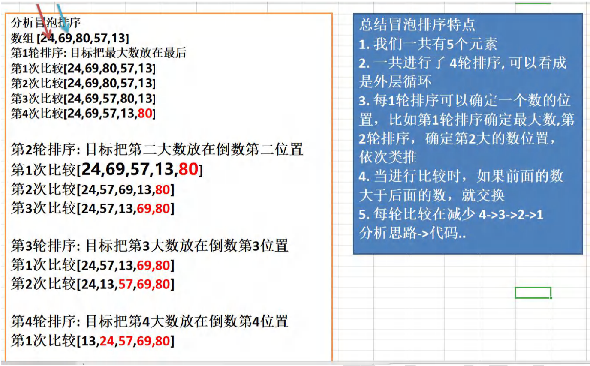
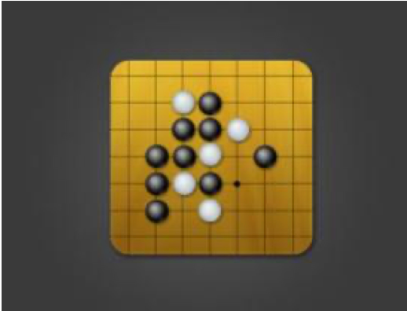
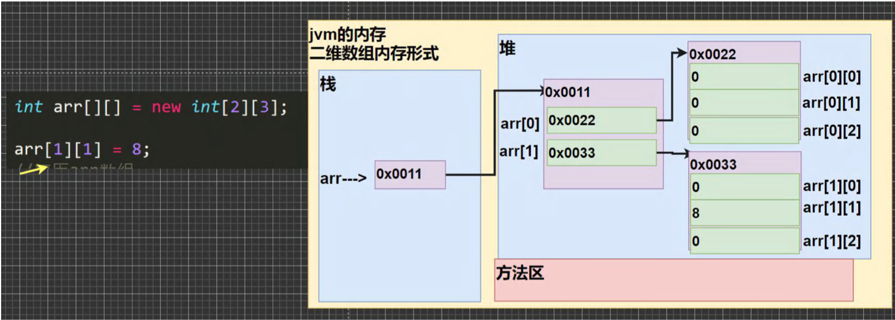
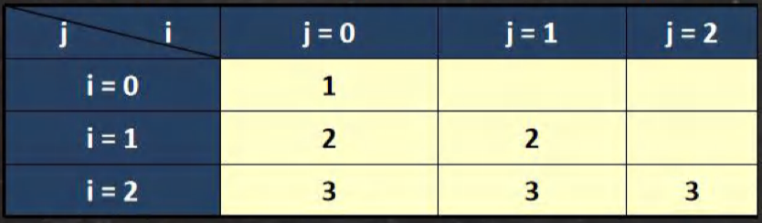
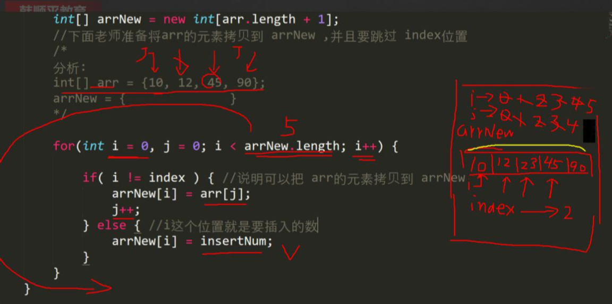
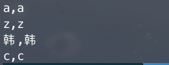

### 6.10冒泡排序法

​	冒泡排序（Bubble Sorting）的基本思想是：通过对待排序序列从后向前（从下标较大的元素开始），依次比较相邻元素 的值，若发现逆序则交换，使值较大的元素逐渐从前移向后部，就象水底下的气泡一样逐渐向上冒。


### 6.11冒泡排序法

冒泡排序案例：【BubbleSort.java】

将五个无序：24,69,80,57,13 使用冒泡排序法将其排成一个从小到大的有 序数列。

思路->走代码



代码

```java
public class BubbleSort{
	public static void main(String[] args) {
		

		//化繁为简，先死后活


		/*
			数组 [24,69,80,57,13] 
			第 1 轮排序: 目标把最大数放在最后 
			第 1 次比较[24,69,80,57,13] 
			第 2 次比较[24,69,80,57,13] 
			第 3 次比较[24,69,57,80,13] 
			第 4 次比较[24,69,57,13,80]

		*/
		int[] arr = {24,69,80,57,13};
		int temp = 0;//用于辅助交换的变量


		//将多轮排序使用外层循环包括起来即可
		//先死后活 => 4 就是 arr.length - 1
		for (int i = 0; i < arr.length - 1 ;i++ ) {//外层循环是4次

			for (int j = 0;j < arr.length - 1 - i;j++ ) {//4次比较-3次-2次-1次
				//如果前面的数大于后面的数，就交换
				if (arr[j] > arr[j+1]) {
					temp = arr[j];
					arr[j] = arr[j+1];
					arr[j+1] = temp;
				}
			}
			System.out.println("\n==第"+(i+1)+"轮==");
			for (int j = 0;j < arr.length ;j++ ) {
				System.out.print(arr[j]+"\t");
			}
		}
	}
}
```

### 6.12 查找

#### 6.12.1 介绍：

在 java 中，我们常用的查找有两种:

1）顺序查找 SeqSearch.java

2）二分查找【二分法】

#### 6.12.2 案例演示：

1）有一个数列：白眉鹰王、金毛狮王、紫衫龙王、青翼蝠王猜数游戏：从键盘中任意输入一个名称，判断数列中是否 包含此名称【顺序查找】 要求: 如果找到了，就提示找到，并给出下标值。

```java
import java.util.Scanner;
public class SeqSearch{
	public static void main(String[] args) {
		/*
		有一个数列：白眉鹰王、金毛狮王、紫衫龙王、青翼蝠王猜数游戏：
		从键盘中任意输入一个名称，判断数列中是否 包含此名称【顺序查找】 
		要求: 如果找到了，就提示找到，并给出下标值。

		思路分析
		1.定义一个字符串数组
		2.接收用户输入，遍历数组，逐一比较，如果有，则提示信息，并退出

		*/

		//定义一个字符串数组
		String[] names = {"白眉鹰王","金毛狮王","紫衫龙王","青翼蝠王"};
		Scanner myScanner = new Scanner(System.in);

		System.out.println("请输入名字");
		String findName = myScanner.next();
		//遍历数组，逐一比较，如果有，则提示信息，并退出
		int index = -1;
		for (int i = 0;i < names.length;i++) {
			//比较 字符串比较 equals,如果要找到名字就是当前元素
			if(findName.equals(names[i])){
				System.out.println("恭喜你找到 " + findName);
				System.out.println("下标为= " + i);
				//把i 保存到 index
				index = i;
				break;
			}
		}
		if (index == -1) {//没有找到
			System.out.println("Sorry，没有找到" + findName);
		}
	}
}
```

2）请对一个有序数组进行二分查找 {1,8, 10, 89, 1000, 1234} ，输入一个数看看该数组是否存在此数，并且求出下标， 如果没有就提示"没有这个数"。

### 6.13多维数组-二维数组

二维数组的应用场景

比如我们开发一个五子棋游戏，棋盘就是需要二维数组来表示。如图：



### 6.14 二维数组的使用

#### 6.14.1 快速入门案例：

【TwoDimensionalArray01.java】

请用二维数组输出如下图形

> 000000 
>
> 001000
>
> 020300 
>
> 000000

代码：

```java
public class TwoDimensionalArray01
{
	public static void main(String[] args) {
		/*
		请用二维数组输出如下图形:
		000000 
		001000
		020300 
		000000
		*/

		//什么是二维数组：
		//解读
		//1.从定义上看 int[][]
		//2.可以这样理解，原来的一维数组的每个元素是一维数组，就构成二维数组
		int[][] arr = {{0,0,0,0,0,0},
					   {0,0,1,0,0,0},
					   {0,2,0,3,0,0},
					   {0,0,0,0,0,0}};
		//关于二维数组的关键概念
		//(1)
		System.out.println("二维数组的元素个数=" + arr.length);
		//(2) 二维数组的每个元素是一维数组，所以如果需要得到每一个一维数组的值
		//	  还需要再次遍历
		//(3) 如果我们要访问第 (i+1) 个一维数组的第(j+1)个值 arr[i][j];
		//	  举例 访问 3,->它是第3个一维数组的第4个值,arr[2][3]
		System.out.println("第3个一维数组的第4个值= "+ arr[2][3]);


		//输出二维数组的图像
		for (int i = 0;i < arr.length ;i++ ) {//遍历二维数组的每个元素
		//遍历二维数组的每个元素(数组)
		//解读
		//1.arr[i]表示 二维数组的第i+1个元素 比如arr[0]:表示二维数组的第一个元素
		//2.arr[i].length 得到 对应的 每个一维数组的长度
		for (int j = 0;j < arr[i].length; j++ ) {
			System.out.print(arr[i][j] + " ");//输出了一维数组
		}
		System.out.println();//换行
		}
	}
}
```

#### 6.14.2 使用方式1：动态初始化

【TwoDimensionalArray02.java】

1）语法：类型[ ] [ ] 数组名 = new 类型 [大小] [大小]

2）比如：int a[ ] [ ]=new int[ ] [ ]

3）使用演示

4）二维数组在内存的存在形式

代码

```java
public class TwoDimensionalArray02{
	public static void main(String[] args) {
		
		//int arr[][] = new int[2][3]

		int arr[][];//声明二维数组
		arr = new int[2][3];//再开空间


		arr[1][1] = 8;
		//遍历arr数组
		for (int i = 0;i < arr.length ;i++ ) {
			for (int j = 0;j < arr[i].length ;j++ ) {
				System.out.print(arr[i][j]+" ");
			}
			System.out.println();//换行
		}
	}
}
```



#### 6.14.3 使用方式2：动态初始化

先声明：类型 数组名[][];【 TwoDimensionalArray02.java】

再定义(开辟空间) 数组名 = new 类型[大小] [大小]

赋值(有默认值，比如 int 类型的就是 0)

#### 6.14.4 使用方式3：动态初始化-列数不确定

1）看一个需求：动态创建下列二维数组，并输出。【TwoDimensionalArray02.java】



2）完成该案例

3）画出执行分析示意图

```java
public class TwoDimensionalArray03{
	public static void main(String[] args) {
		/* 看一个需求：动态创建下面二维数组，并输出

		i = 0: 1
		i = 1: 2  2  
		i = 2: 3  3  3
		一个有三个一维数组, 每个一维数组的元素是不一样的
		*/

		//创建 二维数组，一个有3个一维数组，但是每个一维数组还没有开数据空间
		
    //创建 二维数组，一共有3个一维数组，但是每个一维数组还没有开数据空间
		int[][] arr = new int[3][];
		for (int i = 0;i < arr.length ;i++ ) {//遍历
			//给每个一维数组开空间 new
			//如果没有给一维数组 new ,那么 arr[i] 就是null
			arr[i] = new int[i+1];

			//遍历一维数组，并给一维数组的每个元素赋值
			for (int j = 0;j < arr[i].length ; j++ ) {
				arr[i][j] = i+1;//赋值
			}
		}

		System.out.println("=====arr元素=====");
		//遍历arr输出
		for (int i = 0;i < arr.length;i++ ) {
			//输出arr的每个一维数组
			for (int j = 0;j < arr[i].length ;j++ ) {
				System.out.print(arr[i][j]+" ");
			}
			System.out.println();//换行
		}
	}
}
```

#### 6.14.5使用方式4：静态初始化

【TwoDimensionalArray04.java】

定义 类型 数组名[ ] [ ] = {{值1,值2..},{值 1,值 2..},{值 1,值 2..}}

使用即可[ 固定方式访问 ]

比如：

int[ ] [ ] arr = {{1,1,1},{8,8,9},{100}};

解读

1. 定义了一个二维数组 arr
2. arr有三个元素(每个元素都是一维数组)
3. 第一个一维数组有 3 个元素 , 第二个一维数组有 3 个元素, 第三个一维数组有 1 个元素

#### 6.14.6 案例：

【TwoDimensionalArray05.java】

int arr[][]={{4,6},{1,4,5,7},{-2}}; 遍历该二维数组，并得到和

```java
public class TwoDimensionalArray05{
	public static void main(String[] args) {
		
		/*
		int arr[][]={{4,6},{1,4,5,7},{-2}}; 遍历该二维数组，并得到和

		思路
		1.遍历二维数组，并将各个值累计到 int num
		*/

		int arr[][]={{4,6},{1,4,5,7},{-2}};
		int sum= 0;
		for (int i = 0;i < arr.length ;i++ ) {
			//遍历每个一维数组
			for (int j = 0;j < arr[i].length ;j++ ) {
				sum+=arr[i][j];
			}
		}
		System.out.println("sum=" + sum);
	}
}
```

### 6.15 二维数组的应用案例

1）使用二维数组打印一个 10 行杨辉三角 【YangHui.java】

1

1 1

1 2 1

1 3 3 1

1 4 6 4 1

1 5 10 10 5 1

【提示】

1. 第一行有1个元素，第n行有n个元素

2. 每一行的第一个元素和最后一个元素都是1

3. 从第三行开始，对于非第一个元素和最后一个元素的元素的值.arr[i] [j]

   arr[i] [j] = arr[i-1] [j] + arr[i-1] [j-1];

代码：

```java
public class YangHui{
	public static void main(String[] args) {
		
		/*
		1

		1 1

		1 2 1

		1 3 3 1

		1 4 6 4 1

		1 5 10 10 5 1

		规律
		1. 第一行有1个元素，第n行有n个元素

		2. 每一行的第一个元素和最后一个元素都是1

		3. 从第三行开始，对于非第一个元素和最后一个元素的元素的值.arr[i] [j]

		   arr[i] [j] = arr[i-1] [j] + arr[i-1] [j-1];
		*/

		int[][] yangHui = new int[10][];
		for (int i =0;i < yangHui.length ;i++ ) {//遍历yangHui的每个元素

			//给每个一维数组（行）开辟空间
			yangHui[i] = new int[i+1];
			//给每个一维数（行）组赋值
			for (int j =0;j < yangHui[i].length ;j++ ) {
				//每一行的第一个元素和最后一个元素都是1
				if (j == 0 || j == yangHui[i].length-1) {
					yangHui[i][j] = 1;
				}else{//中间的元素
					yangHui[i][j] = yangHui[i-1][j] + yangHui[i-1][j-1];
				}
			}
		}
		//输出杨辉三角
		for (int i = 0; i < yangHui.length ;i++ ) {
			for (int j = 0;j < yangHui[i].length ;j++ ) {//遍历输出该行
				System.out.print(yangHui[i][j]+"\t");
			}
			System.out.println();//换行
		}
	}
}
```

### 6.16 二维数组使用细节和注意事项

1）一维数组的声明方式有：

int[] x 或者 int x[ ]

2）二维数组的声明方式有：

int[ ] [ ]y 或者 int[ ] y[ ] 或者 int y[ ] [ ]

3）二维数组实际上是由多个一维数组组成的，它的各个一维数组的长度可以相同，也可以不相同。比如： map[][] 是 一个二维数组

int map [][] = {{1,2},{3,4,5}}

由 map[0] 是一个含有两个元素的一维数组 ， map[1] 是一个含有三个元素的一维数组构成， 的二维数组

### 6.17 二维数组课堂练习

声明：int [ ] x,y[ ];以下选项允许通过编译的是(b e):

说明：x 是int 类型的一维数组，y是int类型的二维数组

a）x[0] = y; //错误 int[] [] ->int

b）y[0] = x;//正确 int[] -> int[]

c）y[0] [0] = x;//错误 int[]->int

d）x[0] [0] = y;//错误 x[0] [0] 是错误的

e）y[0] [0] = x[0];//int ->int

f）x = y;//错误 int[ ] [ ] ->int [ ]

### 6.18 本章作业

1. 下面数组定义正确的有_ b _ d _ 【Homework01.java】

   A.String strs[] = {'a','b','c'};//error,char->String

   B.String[] strs = {"a","b","c"};//ok

   C.String[] strs = new String{"a" "b" "c"};//error

   D.String strs[] =new String[]{"a","b","c"};//ok

   E.String[] strs = new String[3]{"a","b","c"};error,编译不通过

2. 写出结果 【Homework02.java】

   ```java
   String foo="blue";
   boolean[] bar=new boolean[2];//bar[0]默认是false bar[1] false
   if(bar[0]){
     foo="green";
   }
   System.out.println(foo);//blue
   ```

3. 以下Java代码的输出结果为（1 3 5 7）。【Homework03.java】

   ```java
   int num = 1;
   while(num < 10){
     System.out.println(num);
     if(num > 5){
       break;
     }
     num+=2;
   }
   ```

4. 已知有个升序的数组，要求插入一个元素，该数组顺序依然是升序，比如[10, 12, 45, 90],添加23后，数组为[10, 12, 23, 45, 90]【Homework04.java】

   ```java
   public class Homework04{
   	public static void main(String[] args) {
   		/*
   		已知有个升序的数组，要求插入一个元素，该数组顺序依然是升序，比如:
   		[10, 12, 45, 90],添加23后，数组为[10, 12, 23, 45, 90]
   
   
   		思路 本质数组扩容 + 定位
   		1.先确定添加数应该插入哪个索引
   		2.然后扩容
   		*/		
   
   		//先定义原数组
   		int[] arr = {10,12,45,90};
   		int insertNum = 23;
   		int index = -1;//index就是要插入的位置
   
   		//遍历 arr数组,如果发现 insertNum <= arr[i] 说明 i 就是要插入的位置
   		//使用 index 保留 index = i;
   		//如果遍历完后，没有发现 insertNum <= arr[i],说明 index = arr.length
   		//即：添加到arr的最后
   
   		for (int i = 0; i<arr.length ;i++ ) {
   			if (insertNum <= arr[i]) {
   				index = i;
   				break;//找到位置后，就退出
   			}
   		}
   
   		//判断index 的值
   		if(index == -1){//说明没有找到位置
   			index = arr.length;
   		}
   		System.out.println("index="+index);
   
   		//扩容
   		//先创建一个新的数组，大小 arr.length + 1
   		int[] arrNew = new int[arr.length +1];
   		//将arr的元素拷贝到 arrNew,并且要跳过 index位置
   		/*
   		分析：
   		int[ ] arr ={10,12,45,90};
   		arrNew = {				}
   		*/
   
   		for (int i = 0,j = 0;i < arrNew.length ;i++ ) {
   			
   			if( i != index){//说明可以把arr的元素拷贝到 arrNew
   				arrNew[i] = arr[j];
   				j++;
   			}else{//i 这个位置就是要插入的数
   				arrNew[i] = insertNum;
   			}
   		}
   	}
   }
   ```

   

5. 随机生成10个整数(1_100的范围)保存到数组，并倒序打印以及求平均值、求最大值和最大值的下标、并查找里面是否有 8【Homework05.java】

   ```java
   
   public class Homework05{
   	public static void main(String[] args) {
   		
   		/*
   		随机生成10个整数(1_100的范围)保存到数组，
   		并倒序打印以及求平均值、求最大值和最大值的下标、
   		并查找里面是否有 8
   		*/
   
   		int[] arr = new int[10];
   
   		//(int)(Math.random()*100)+1 生成 随机数1-100
   
   		for (int i = 0;i < arr.length ;i++ ) {
   			arr[i] = (int)(Math.random()*100)+1;
   		}
   
   		System.out.println("====arr的元素情况====");
   		for (int i = 1;i < arr.length ;i++ ) {
   			System.out.print(arr[i]+"\t");
   		}
   
   		System.out.println("\n====arr的元素情况(倒序)====");
   		for (int i =arr.length-1; i>=0 ;i-- ) {
   			System.out.print(arr[i]+"\t");
   		}
   
   		//平均值、求最大值和最大值的下标
   
   		System.out.println("==平均值、求最大值和最大值的下标==");
   
   		double sum = arr[0];
   		int max = arr[0];
   		int maxIndex = 0;
   		for (int i=1;i < arr.length ;i++ ) {
   			if (arr[i]>max) {
   				max = arr[i];
   				maxIndex = i;
   			}
   			sum+=arr[i];
   		}
   		System.out.println("平均值="+(sum / arr.length)+
   			" max="+max+" maxIndex="+maxIndex);
   
   
   		//查找数组中是否有8->顺序查找
   		int findNum = 9;
   		int index = -1//如果找到，就把下标记录到 index
   		for (int i = 0;i < arr.length ;i++ ) {
   			if (findNum == arr[i]) {
   				System.out.println("找到数" + findNum + "下标=" + i);
   				index = i;
   				break;	
   			} 
   		}
   		if(index == -1){
   			System.out.println("没有找到"+findNum);
   		}
   	}
   }
   ```

6. 试写出以下代码的打印结果【Homework06.java】

   ```java
   char[] arr1={'a','z','b','c'};
   char[] arr2=arr1;
   arr1[2] = '韩';
   for(int i=0;i<arr2.length;i++){
     System.out.println(arr1[i]+","+arr2[i]);
   }
   ```

   

7. 写出冒泡排序的代码【Homework07.java】

   ```java
   public class Homework07{
   	public static void main(String[] args) {
   		int[] arr={23,12,45,67,98,78};
   		int temp = 0;
   		for (int i = 0;i < arr.length-1;i++) {
   			for (int j = 0; j < arr.length-1-i ;j++ ) {
   				if (arr[j] > arr[j+1]) {
   					temp = arr[j];
   					arr[j] = arr[j+1];
   					arr[j+1] = temp;
   				}
   			}
   		}
   		for (int i = 1;i < arr.length ;i++ ) {
   			System.out.print(arr[i]+"\t");
   		}
   	}
   }
   ```

   