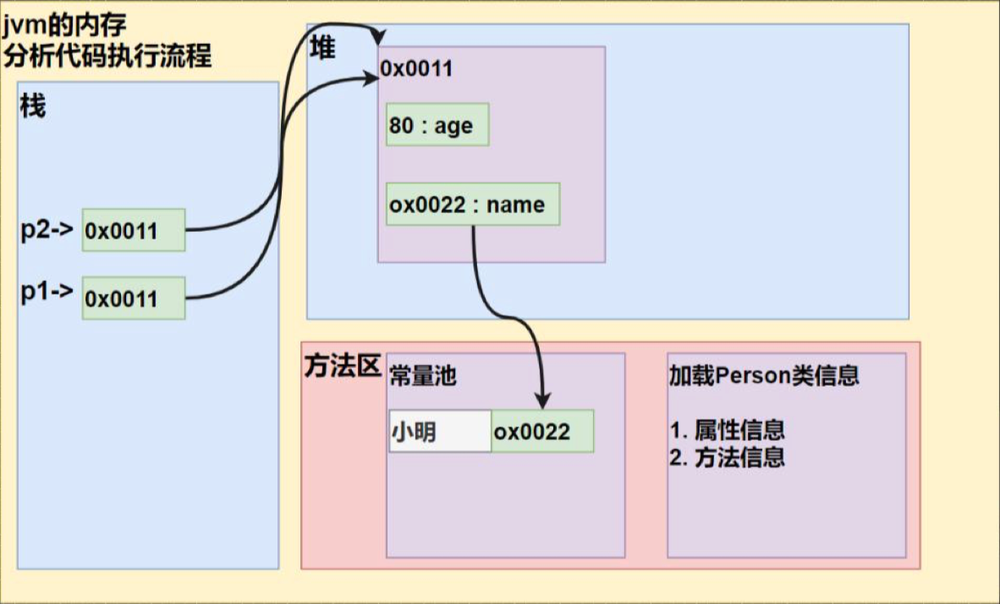
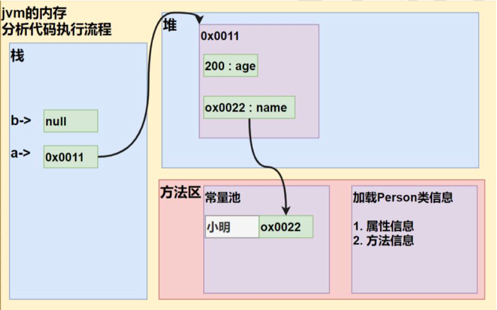
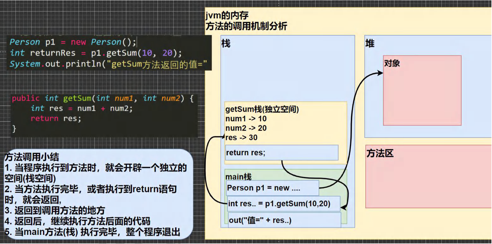

## 第 7 章 面向对象编程(基础部分)

### 7.1 类与对象

#### 7.1.1看一个养猫猫问题

​	张老太养了两只猫猫:一只名字叫小白,今年 3 岁,白色。还有一只叫小花,今年 100 岁,花色。请编写一个程序，当用户 输入小猫的名字时，就显示该猫的名字，年龄，颜色。如果用户输入的小猫名错误，则显示 张老太没有这只猫猫。

#### 7.1.2 使用现有技术解决 Object01.java

1）单独的定义变量解决

2）使用数组解决

#### 7.1.3 现有技术解决的缺点分析

不利于数据的管理

效率低 ===> 引出我们的新知识点 类与对象 哲学, 道家思想

java 设计者 引入 类与对象(OOP) ，根本原因就是现有的技术，不能完美的解决新的新的需求.

代码

```java
public class Object01{
	public static void main(String[] args) {
		/*
		张老太养了两只猫猫:一只名字叫小白,今年 3 岁,白色。
		还有一只叫小花,今年 100 岁,花色。请编写一个程序，当用户 输入小猫的名字时，
		就显示该猫的名字，年龄，颜色。如果用户输入的小猫名错误，
		则显示 张老太没有这只猫猫。
		*/

		//单独变量来解决 => 不利于数据的管理(把一只猫的信息拆解了)
		//第1只猫信息
		// String cat1Name = "小白";
		// int cat1Age = 3;
		// String cat1Color = "白色";

		// //第2只猫信息
		// String cat2Name = "小花";
		// int cat2Age = 100;
		// String cat2Color = "花色";

		//数组 ===> (1)数据类型体现不出来(2)只能通过[下标]获取信息，造成变量名字和内容
		//			的对应关系不明确(3)不能体现猫的行为
		//第一只猫信息

		// String[] cat1= {"小白","3","白色"};
		// String[] cat2= {"小花","100","花色"}


		//使用OOP面向对象解决
		//实例化一只猫[创建一只猫对象]
		//解读：
		//1.new Cat() 创建一只猫
		//2.Cat cat1 = new Cat();把创建的猫赋给 cat1
		//3.cat1 就是一个对象(猫对象)
		Cat cat1 = new Cat();
		cat1.name = "小白";
		cat1.age = 3;
		cat1.color = "白色";
		cat1.weight = 10;
		//创建了第二只猫，并赋给 cat2
		//cat2 也是一个对象(猫对象)
		Cat cat2 = new Cat();
		cat2.name = "小花";
		cat2.age = 100;
		cat2.color = "花色";
		cat2.weight = 20;

		//怎么访问对象的属性
		System.out.println("第一只猫的信息"+cat1.name
			+" "+ cat1.age+" "+cat1.color + " " +cat1.weight);

		System.out.println("第二只猫的信息"+cat2.name
			+" "+ cat2.age+" "+cat2.color + " " + cat2.weight);

	}
}
//使用面向对象的方式解决养猫问题
//
//定义一个猫类 Cat -> 自定义的数据类型
class Cat{
	//属性
	String name;//名字
	int age;//年龄
	String color;//颜色
	double weight;//体重
}
```

#### 7.1.4一个程序就是一个世界，有很多事物(对象[属性, 行为])


#### 7.1.5 类与对象的关系示意图

.assets/image-20230913182730931.png)

- 对上图说明
  1. 类就是数据类型，比如 Cat
  2. 对象就是一个具体的实例

#### 7.1.6 类与对象的关系示意图

.assets/image-20230913183553101.png)

- 上图说明

  注意：从猫类到对象，目前有几种说法：1.创建一个对象 2.实例化一个对象 3.把类实例化 ...

  当然：上面的猫也可是鱼、狗、人...java最大的特点就是面向对象。

#### 7.1.7 快速入门-面向对象的方式解决养猫问题

【Object01.java】

#### 7.1.8类和对象的区别和联系

类是抽象的，概念的，代表一类事物,比如人类,猫类.., 即它是数据类型.

一类事物,比如人类,猫类.., 即它是数据类型.

类是对象的模板，对象是类的一个个体，对应一个实例

#### 7.1.9 对象在内存中的存在形式(重要)

.assets/image-20230913185649257.png)

#### 7.1.10 属性/成员变量/字段

- 基本介绍

  1）从概念或叫法上看： 成员变量 = 属性 = field(字段)

  案例演示：Car(name,price,color) Object02.java

  ```java
  public class Object02{
  	public static void main(String[] args) {
  		
  	}
  }
  class Car {
  	String name;//属性，成员变量，字段 field
  	double price;
  	String color;
  	String[] master;//属性可以基本数据类型，也可以是引用类型(对象，数组)
  }
  ```

  2）属性是类的一个组成部分，一般是基本数据类型,也可是引用类型(对象，数组)。比如我们前面定义猫类 的 int age 就 是属性

- 注意事项和细节说明

  【PropertiesDetail.java】

  1）属性的定义语法同变量，示例：访问修饰符 属性类型 属性名; 修饰符： 控制属性的访问范围 有四种访问修饰符 public, proctected, 默认, private

  2）属性的定义类型可以为任意类型，包含基本类型或引用类型

  3）属性如果不赋值，有默认值，规则和数组一致。具体说: int 0，short 0, byte 0, long 0, float 0.0,double 0.0，char \u0000， boolean false，String null

  案例演示：【Person类】

  代码：

  ```java
  public class PropertiesDetail{
  	public static void main(String[] args) {
  		
  		//创建Person对象
  		//p1 是对象名(对象引用)
  		//new Person( ) 创建的对象空间(数据) 才是真正的对象
  		Preson p1 = new Preson();
  
  		//对象的属性默认值，遵守数组规则：
  		// int 0，short 0, byte 0, long 0, float 0.0,double 0.0，char \u0000， boolean false，String null
  
  		System.out.println("\n当前这个人的信息");
  		System.out.println("age=" + p1.age + " name="
  				 + p1.name + " sal=" + p1.sal + " isPass=" + p1.isPass);
  	}
  }
  
  class Preson{
  	int age;
  	String name;
  	double sal;
  	boolean isPass;
  }
  ```

#### 7.1.11 如何创建对象

1）先声明再创建

Cat cat;//声明对象 cat

cat = new Cat( );//创建

2）直接创建

Cat cat = new Cat( );

#### 7.1.12 如何访问属性

- 基本语法

  对象名.属性名;

  案例演示赋值和输出

  cat.name ; cat.age; cat.color;

- 类和对象的内存分配机制(重要)

  定义一个人类(Person)(包括 名字,年龄)。 【Object03.java】

  ```java
  		Person p1 = new Person();
  		p1.age=10;
  		p1.name = "小明";
  		Person p2 = p1;//把p1 赋给了 p2,让p2指向p1
  		System.out.println(p2.age);
  ```

  

#### 7.1.13类和对象的内存分配机制

- Java内存的结构分析

  1）栈：一般存放基本数据类型(局部变量)

  2）堆： 存放对象(Cat cat , 数组等)

  3）方法区：常量池(常量，比如字符串)， 类加载信息

  4）方法区：常量池(常量，比如字符串)， 类加载信息

- Java 创建对象的流程简单分析

  > Person p = new Person(); 
  >
  > p.name = “jack”;
  >
  >  p.age = 10;

  1）先加载 Person 类信息(属性和方法信息, 只会加载一次)

  2）在堆中分配空间, 进行默认初始化(看规则)

  3）把地址赋给 p , p 就指向对象

  4）进行指定初始化， 比如 p.name =”jack”   p.age = 10

- 看一个练习题，并分析画出内存布局图，进行分析

  ```java
  Person a = new Person();
  a.age=10;
  a.name="小明";
  Person b;
  b = a;
  System.out.println(b.name);//小明
  b.age = 200;
  b = null;
  System.out.println(a.age);//200
  System.out.println(b.age);//异常
  ```

  

### 7.2成员方法

#### 7.2.1基本介绍

​	在某些情况下，我们要需要定义成员方法(简称方法)。比如人类:除了有一些属性外( 年龄，姓名..),我们人类还有一 些行为比如:可以说话、跑步..,通过学习，还可以做算术题。这时就要用成员方法才能完成。现在要求对 Person 类完善。

#### 7.2.2 成员方法快速入门

【Method01.java】

1）添加 speak 成员方法,输出 “我是一个好人”

2）添加 cal01 成员方法,可以计算从 1+..+1000 的结果

3）添加 cal02 成员方法,该方法可以接收一个数 n，计算从 1+..+n 的结果

4）添加 getSum 成员方法,可以计算两个数的和

代码：

```java
public class Method01{
	public static void main(String[] args) {
		//方法使用
		//1.方法写好后，如果不去调用(使用)，不会输出
		//2.先创建一个对象，然后调用方法即可
		Person p1 = new Person();
		p1.speak();//调用方法
		p1.cal01();//调用cal01方法
		p1.cal02(5);//调用cal02方法，同时给n = 5

		//调用getSum方法，同时num1=10，num2=20
		//把 方法 getSum 返回的值,赋给 变量 returnRes
		int returnRes = p1.getSum(10,20);
		System.out.println("getSum方法返回的值="+returnRes);
	}
}

class Person {
	String name;
	int age;
	//方法（成员方法）
	//添加speak 成员方法，输出”我是一个好人"
	//解读
	//1.public 表示方法是公开的
	//2.void 表示方法没有返回值
	//3.speak() speak是方法名，()形参列表
	//4.{} 方法体，可以写我们要执行的代码
	//5.System.out.println("我是一个好人");表示我们的方法就是输出一句话
	public void speak(){
		System.out.println("我是一个好人");
	}

	//添加 cal01 成员方法,可以计算从 1+..+1000 的结果
	public void cal01(){
		//用循环语句
		int res = 0;
		for (int i = 1; i <=1000 ;i++ ) {
			res += i;
		}
		System.out.println("cal01方法 计算结果="+res);
	}
	//添加 cal02 成员方法,该方法可以接收一个数 n，计算从 1+..+n 的结果
	//解读
	//1.(int n) 形参列表，表示当前有一个形参 n,可以接收用户输入
	public void cal02(int n){
		int res = 0;
		for (int i = 0;i <= n ;i++ ) {
			res += i;
		}
		System.out.println("cal02方法 计算结果=" + res);
	}

	//添加 getSum 成员方法,可以计算两个数的和
	//1.public 表示方法是公开的
	//2.int :表示方法执行后，返回一个 int 值
	//3.getSum 方法名
	//4.(int num1,int num2) 形参列表，2个形参，可以接收用户传入的两个数
	//5.return res; 表示把 res 的值，返回
	public int getSum(int num1,int num2){
		int res = num1 + num2;
		return res;
	}
}
```

#### 7.2.3方法的调用机制原理：(重要!-示意图!!!)

提示：画出程序执行过程[getSum]+说明



#### 7.2.4 为什么需要成员方法

【Method02.java】

- 看一个需求：

  请遍历一个数组 , 输出数组的各个元素值。

- 解决思路 1， 传统的方法，就是使用单个 for 循环，将数组输出

- 解决思路 2: 定义一个类 MyTools ,然后写一个成员方法，调用方法实现

代码

```java
public class Method02{
	public static void main(String[] args) {
		
		//请遍历一个数组，输出数组的各个元素值
		int [][] map = {{0,0,1},{1,1,1},{1,1,3}};

		//使用方法完成输出,创建MyTools对象
		MyTools tool = new MyTools();

		// //遍历map数组
		// //传统的解决方式就是直接遍历
		// for (int i = 0;i < map.length ;i++ ) {
		// 	for (int j = 0;j < map[i].length ; j++) {
		// 		System.out.print(map[i][j] + "\t");
		// 	}
		// 	System.out.println();
		// }
		//使用方法
		tool.printArr(map);

		tool.printArr(map);

		tool.printArr(map);

		//...
		//
		//要求再次遍历map数组

	}
}

//把输出的功能，写到一个类的方法中，然后调用该方法即可
class MyTools {
	//方法，接收一个二维数组

	public void printArr(int[][] map){
		System.out.println("======");
		//对传入的map数组进行遍历输出
		for (int i = 0;i < map.length ;i++ ) {
			for (int j = 0;j < map[i].length ; j++) {
				System.out.print(map[i][j] + " ");
			}
			System.out.println();
		}
	}
}
```

#### 7.2.5成员方法的好处

1）提高代码的复用性

2）可以将实现的细节封装起来，然后供其他用户来调用即可

#### 7.2.6成员方法的定义

> 访问修饰符 返回数据类型 方法名 (形参列表...){//方法体
>
> ​	语句;
>
> ​	return 返回值;
>
> }

1. 形参列表：表示成员方法输入 cal(int n) ， getSum(int num1, int num2)
2. 返回数据类型：表示成员方法输出, void 表示没有返回值
3. 方法主体：表示为了实现某一功能代码块
4. return 语句不是必须的

#### 7.2.7注意事项和使用细节

【MethodDetail.java】

```java
public class MethodDetail{
	public static void main(String[] args) {
		
		AA a = new AA();
		int[] res = a.getSumAndSub(1,4);
		System.out.println("和="+res[0]);
		System.out.println("差="+res[1]);


		//细节：调用带参数的方法时，一定对应着参数列表传入相同类型或兼容类型的参数
		byte b1 = 1;
		byte b2 = 2;
		a.getSumAndSub(b1, b2);//byte -> int
		//a.getSumAndSub(1.1,1.8);//double -> int(x)
		//细节：实参和形参的类型要一致或兼容、个数、顺序必须一致

		//a.getSumAndSub(100);//x 个数不一致
		a.f3("tom",10);//ok
		a.f3(100,"jack");//实际参数和形式参数顺序不对

	}
}

class AA {

	//细节：方法不能嵌套定义
	public void f4(){
		public void f5(){
			
		}
	}
	public void f3(String str,int n){
	}
	//1.一个方法最多有一个返回值 [如果返回多个结果，返回数组]
	public int[] getSumAndSub(int n1,int n2){

		int[] resArr =new int[2];//创建一个数组
		resArr[0] = n1 + n2;
		resArr[1] = n1 - n2;
		return resArr;
	}
	//2.返回类型可以为任意类型，包含基本类型或引用类型(数组，对象)
	//	看 getSumAndSub

	//3.如果方法要求有返回数据类型，则方法体中最后的执行语句必须为return值；
	//而且要求返回值类型必须和return的值类型一致或兼容
	//
	public double f1(){

		double d1 = 1.1 * 3;
		int n = 100;
		//return n;//int -> double 会将int类型转成double //不能将高精度赋给精度
		return d1;
	}

	//如果方法是 void， 则方法体中可以没有 return 语句，或者 只写 return ;
	//提示：在实际工作中，我们的方法都是为了完成某个功能，所以方法名要有一定含义
	//最好是见名知意
	public void f2(){
		System.out.println("hello1");
		System.out.println("hello2");
		System.out.println("hello3");
		int n = 10;
		// return;
	}
}
```

- 访问修饰符(作用是控制 方法使用的范围)

  如果不写默认访问， [有四种: public, protected, 默认, private]

- 返回数据类型

  1）一个方法最多有一个返回值 [思考， 如何返回多个结果 返回数组 ]

  2）返回类型可以为任意类型，包含基本类型或引用类型(数组，对象)

  3）如果方法要求有返回数据类型，则方法体中最后的执行语句必须为return值；而且要求返回值类型必须和return的值类型一致或兼容

  4）如果方法是 void， 则方法体中可以没有 return 语句，或者 只写 return ;

- 方法名

  遵循驼峰命名法，最好见名知义，表达出该功能的意思即可, 比如 得到两个数的和

  getSum, 开发中按照规范

- 形参列表

  1. 一个方法可以有0个参数，也可以有多个参数，中间用逗号隔开，比如getSum(int n1,int n2)
  2. 参数类型可以为任意类型，包含基本类型或引用类型，比如printArr(int[] [] map)
  3. 调用带参数的方法时，一定对应着参数列表传入相同类型或兼容类型的参数！【getSum】
  4. 方法定义时的参数称为形式参数，简称形参；方法调用时的传入参数称为实际参数，简称实参，实参和形参的类型要一致或兼容、个数、顺序必须一致！

- 方法体

  里面写完成功的具体语句，可以为输入、输出、变量、运算、分支、循环、方法调用，但里面不能再定义方法！即：方法不能嵌套定义。

【MethodDetail02.java】

- 方法调用细节说明

  1. 同一个类中的方法调用：直接调用即可。比如print(参数);

     案例演示：A类sayOK调用print()

  2. 跨类中的方法A类调用B类方法：需要通过对象名调用。比如 对象名.方法名(参数);案例演示：B类 sayHello 调用 print()

  3. 跨类的方法调用和方法的访问修饰符相关

```java
public class MethodDetail02{
	public static void main(String[] args) {
		
		A a = new A();
		a.sayOk();

		a.m1();
	}
}

class A {
	//同一个类中的方法调用：直接调用即可
	//

	public void print(int n){
		System.out.println("print()方法调用 n=" + n);
	}

	public void sayOk(){//sayOk调用 print
		print(10);
		System.out.println("继续执行sayOK()~~~");
	}

	//跨类中的方法A类调用B类方法：需要通过对象名调用

	public void m1(){
		//创建B对象,然后再调用方法即可
		System.out.println("m1() 方法被调用");
		B b = new B();
		b.hi();

		System.out.println("m1() 方法继续执行:)");
	}
}

class B{

	public void hi(){
		System.out.println("B类中的 hi()被执行");
	}
}
```

#### 7.2.8类定义的完善

.assets/image-20230915145044912.png)

#### 7.2.9课堂练习

【MethodExercise01.java】

1）编写类 AA ，有一个方法：判断一个数是奇数 odd 还是偶数, 返回 boolean

2）根据行、列、字符打印 对应行数和列数的字符，比如：行：4，列：4，字符#,则打印相应的效果

代码

```java
public class MethodExercise01{
	public static void main(String[] args) {
		AA a = new AA();
		if (a.isOdd(1)) {
			System.out.println("是奇数");
		}else{
			System.out.println("是偶数");
		}

		//使用print方法
		a.print(4,4,'#');

	}		
}
//编写类 AA ，有一个方法：判断一个数是奇数 odd 还是偶数, 返回 boolean
class AA{
	//思路
	//1.方法的返回类型 boolean
	//2.方法的名字 isOdd
	//3.方法的形参（int num）
	//4.方法体，判断
	public boolean isOdd(int num){

		// if (num % 2 != 0){
		// 	return true;
		// }else{
		// 	return false;
		// }

		//return num % 2 != 0 ? true : false;
		//
		return num % 2 != 0;
	}


	//根据行、列、字符打印 对应行数和列数的字符，
	//比如：行：4，列：4，字符#,则打印相应的效果
	/*
		####
		####
		####
		####
	*/
	//思路
	//1.方法的返回类型 void
	//2.方法的名字 print
	//3.方法的形参（int row,int col,char c）
	//4.方法体，循环
	public void print(int row,int col,char c){
		for (int i=0;i < row ;i++ ) {
			for (int j = 0;j < col ;j++ ) {
				System.out.print(c);
			}
			System.out.println();
		}
	}
}
```

