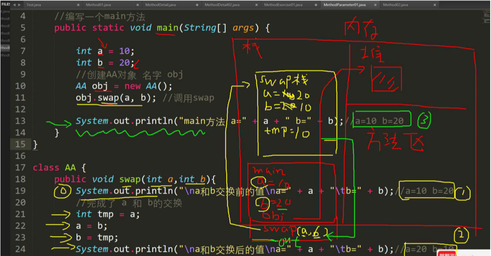
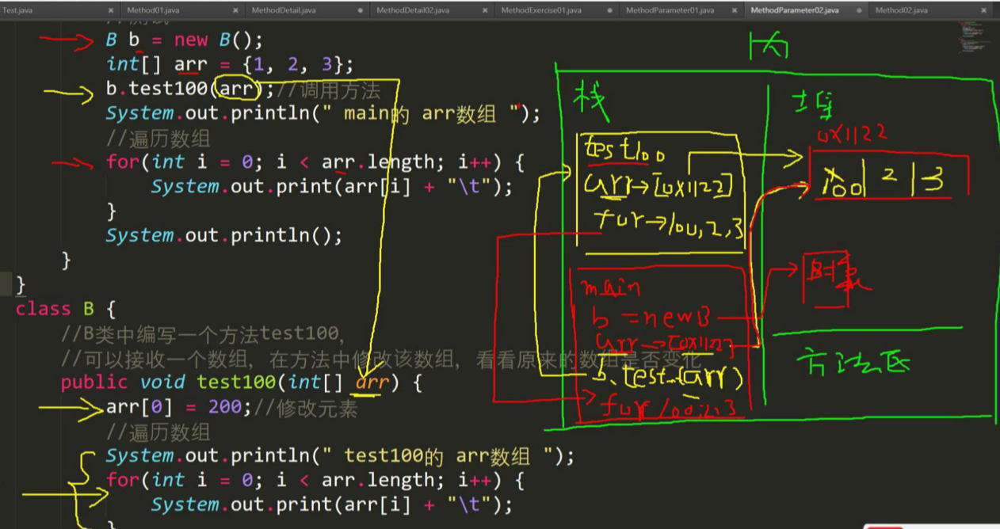
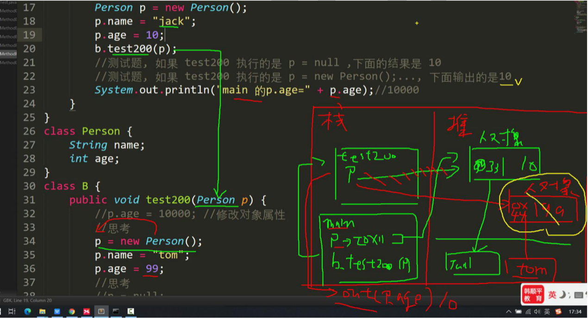
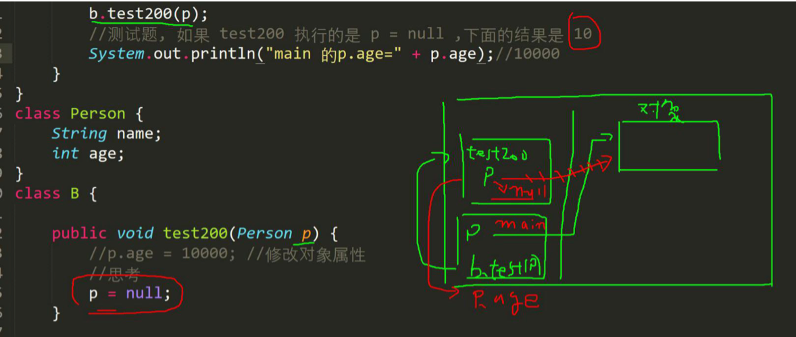
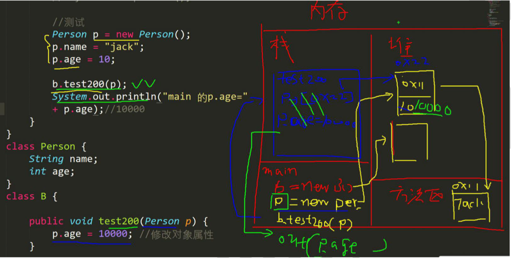
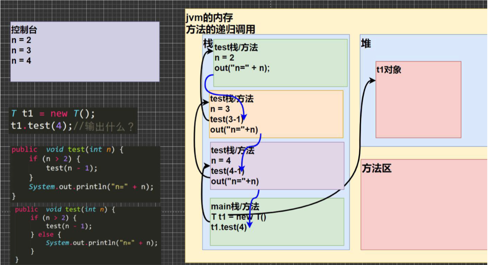
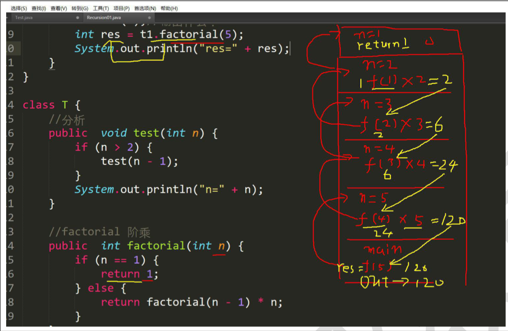
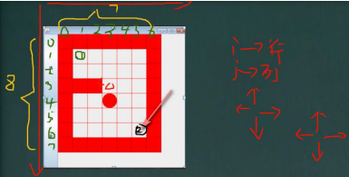
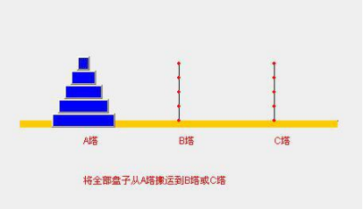

### 7.3 成员方法传参机制

#### 7.3.1基本数据类型的传参机制

【MethodParameter01.java】

Parameter 参数

1）看一个案例，分析结果是什么？

```java
public void swap(int a,int b){
  int temp = a;
  a = b;
  b = tmp;
  System.out.println("a="+a+"\tb="+b);
}
```

2）结论及示意图

​	基本数据类型，传递的是值（值拷贝），形参的任何改变不影响实参！

```java
public class MethodParameter01{
	public static void main(String[] args) {
		int a = 10;
		int b = 20;
		//创建AA对象
		AA obj = new AA();
		obj.swap(a,b);//调用swap

		System.out.println("main方法 a=" + a + " b=" + b);//a=10 b=20
	}
}

class AA{
	public void swap(int a,int b){
		System.out.println("\na和b交换之前的值a="+a+"\tb="+b);//a=10 b=20
		//完成了a 和 b 的交换
	    int temp = a;
	    a = b;
	    b = temp;
	    System.out.println("\na和b交换之后的值a="+a+"\tb="+b);//a=20 b=10
	}
}
```



#### 7.3.2用数据类型的传参机制

1）看一个案例 【MethodParameter02.java】

​	B 类中编写一个方法 test100， 可以接收一个数组，在方法中修改该数组，看看原来的数组是否变化？会变化

​	B 类中编写一个方法 test200， 可以接收一个 Person(age,sal)对象， 在方法中修改该对象属性，看看原来的对象是否变化？会变化.

```java

public class MethodParameter02{
	public static void main(String[] args) {
		
		//测试
		B b = new B();
		// int[] arr = {1,2,3};
		// b.test100(arr);//调用方法

		// System.out.println(" mian的 arr数组");
		// //遍历数组
		// for (int i = 0;i < arr.length ;i++ ) {
		// 	System.out.print(arr[i]+" ");
		// }
		// System.out.println();

		//测试
		Person p = new Person();
		p.name = "jack";
		p.age = 10;

		b.test200(p);
		//测试，如果 test200 执行的是 p = null ，下面的结果是 10 
		//测试，如果 test200 执行的是 p = new Person();....,下面输出的结果是什么？
		System.out.println("main 的p.age=" + p.age);//10000
	}
}
class Person{
	String name;
	int age;
}
class B {

	public void test200(Person p){
		//p.age = 10000;//修改对象属性
		//思考
		p = new Person();
		p.name = "tom";
		p.age = 99;
		//思考
		//p = null;
	}

	//B 类中编写一个方法 test100， 
	//可以接收一个数组，在方法中修改该数组，看看原来的数组是否变化？
	//
	public void test100(int[] arr){
		arr[0] = 200;
		//遍历数组
		System.out.println(" test100的 arr数组");
		for (int i = 0;i < arr.length ;i++ ) {
			System.out.print(arr[i]+" ");
		}
		System.out.println();
	}
}
```

2）结论及示意图

​	引用类型传递的是地址（传递也是值，但是值是地址），可以通过形参影响实参！





3）再看一个案例，下面的方法会对原来的对象有影响吗？

p=nill 和 p=new Person();对应示意图





#### 7.3.3 成员方法返回类型是引用类型应用实例

【MethodExercise02.java】

1）编写类 MyTools 类，编写一个方法可以打印二维数组的数据。

2）编写一个方法 copyPerson，可以复制一个 Person 对象，返回复制的对象。克隆对象， 注意要求得到新对象和原来的 对象是两个独立的对象，只是他们的属性相同

代码

```java
public class MethodExercise02{
	public static void main(String[] args) {
		
		Person p=new Person();
		p.name = "milan";
		p.age = 100;

		//创建tools
		MyTools tools = new MyTools();
		Person p2 = tools.copyPerson(p);

		//到此 p 和 p2 是Person对象，但是是两个独立的对象，属性相同
		System.out.println("p的属性 age="+ p.age + "名字" + p.name);
		System.out.println("p2的属性 age="+ p2.age + "名字" + p2.name);
		//提示：可以通过 通过对象比较看看是否为同一个对象
		System.out.println(p == p2);//false

	}
}

class Person{
	String name;
	int age;
}

class MyTools{
	//编写一个方法 copyPerson，可以复制一个 Person 对象，返回复制的对象。
	//克隆对象， 注意要求得到新对象和原来的 对象是两个独立的对象，只是他们的属性相同
	//
	//编写方法的思路
	//思路
	//1.方法的返回类型 Person
	//2.方法的名字 copyPerson
	//3.方法的形参 (Perosn p)
	//4.方法体,创建一个新对象，并复制属性，返回即可

	public Person copyPerson(Person p){
		//创建一个新的对象
		 Person p2= new Person();
		 p2.name = p.name;//把原来对象的名字赋给p2.name
		 p2.age = p.age;//把原来对象的年龄赋给p2.name
		 return p2;
	}
}
```


### 7.4 方法递归调用

### 7.4.1基本介绍

简单的说: 递归就是方法自己调用自己,每次调用时传入不同的变量.递归有助于编程者解决复杂问题,同时可以让代码变 得简洁

#### 7.4.2递归能解决什么问题？

1. 各种数学问题如：8皇后问题，汉诺塔，阶乘问题，迷宫问题，球和篮子的问题(google编程大赛)
2. 各种算法中也会使用到递归，比如快排，归并排序，二分查找，分治算法等。
3. 将用栈解决的问题-->递归代码比较简洁

#### 7.4.3递归举例

1）打印问题

2）阶乘问题

recursion 递归

factorial    阶乘

代码

```java
public class Recursion01{
	public static void main(String[] args) {
		
		T t1=new T();
		t1.test(4);//2 3 4
		int res=t1.factorial(5);
		System.out.println("res=" + res);
	}
}

class T {
	pubilc void test(int n){
		if (n > 2) {
			test(n - 1);
		}
		System.out.println("n=" + n);
	}

	//factorial阶乘
	public int factorial(int n){
		if (n == 1) {
			return 1;
		}else {
			return factorial(n-1) * n;
		}
	}
}
```





#### 7.4.4递归重要规则

1. 执行一个方法时，就创建一个新的受保护的独立空间（栈空间）
2. 方法的局部变量是独立的，不会相互影响，比如n变量
3. 如果方法中使用的是引用类型变量(比如数组，对象)，就会共享该引用类型的数据。
4. 递归必须向退出递归的条件逼近，否则就是无限递归，出现StackOverflowError,死龟了：）
5. 当一个方法执行完毕，或者遇到return，就会返回，遵守谁调用，就将结果返回非谁，同时当方法执行完毕或者返回时，该方法也就执行完毕。

#### 7.4.5 课堂练习

【RecursionExercise01.java】

1. 请使用递归的方法求出斐波那契数1,1,2,3,5,8,13...给你一个整数n，求出它的值是多少
2. 猴子吃桃子问题：有一堆桃子，猴子第一天吃了其中的一半，并再多吃一个！以后每天猴子都吃其中的一半，然后再多吃一个。当到第10天时，想再吃时（即还没吃），发现只有一个桃子了。问题：最初共多少个桃子？

```java
public class RecursionExercise01{
	public static void main(String[] args) {
		T t1 = new T();
		// int n= -1;
		// int res = t1.fibonacci(n);
		// if (res != -1) {
		// 	System.out.println("当n="+ n +" 对应的斐波那契=" + res);
		// 

		//桃子问题
		int day = 1;
		int peachNum = t1.peach(day);
		if (peachNum != -1) {
			System.out.println("第"+ day +"天有" + peachNum + "个桃子");
		}
	}
}

class T {
	/*
	请使用递归的方法求出斐波那契数1,1,2,3,5,8,13...给你一个整数n，求出它的值是多少
	思路
	1.当n=1 斐波那契数 是1 
	2.当n=2 斐波那契数 是1 
	3.当n >= 3 斐波那契数 是前面两个数的和
	4.这里是一个递归的思路
	*/

	public int fibonacci(int n){
		if (n >= 1) {
			if (n == 1 || n == 2) {
			return 1;
			}else {
				return fibonacci(n-1) + fibonacci(n - 2);
			}	
		}else{
			System.out.println("要求输入的n>=1的整数");
			return -1;
		}
	}
	/*
	猴子吃桃子问题：有一堆桃子，猴子第一天吃了其中的一半，并再多吃一个！以后每天猴子都吃其中的一半，
	然后再多吃一个。当到第10天时，想再吃时（即还没吃），发现只有一个桃子了。问题：最初共多少个桃子？

	思路分析 逆推
	1.day = 10时 有 1个桃子
	2.day = 9时	有(day10 + 1) * 2 =4
	3.day = 9时	有(day9 + 1) * 2 = 10
	4.规律就是 前一天的桃子 = (后一天的桃子 + 1) * 2
	*/
	public int peach(int day){
		if(day == 10){//第10天，只有1个桃
			return 1;
		}else if(day >= 1 && day <= 9){
			return (peach(day + 1) + 1) * 2;//规则
		}else{

			System.out.println("day在1-10");
			return -1;
		}
	}
}
```

#### 7.4.6递归调用应用实例-迷宫问题

【MiGong.java】

1. 小球得到的路径，和程序员设置的找路策略有关即：找到的上下左右的顺序相关
2. 再得到小球路径时，可以先使用(下右上左),再改成(上右下左),看看路径是不是有变化
3. 测试回溯现象
4. 扩展思考：如何求出最短路径？思路(1)穷举(2)图->求出最短路径

代码：

```java
public class MiGong{
	public static void main(String[] args) {
		
		//思路
		//1.先创建迷宫，用二维数组表示 int[][] map = new int[8][7];
		//2.先规定 map 数组的元素值：0 表示可以走 1 表示障碍物

		int[][] map = new int[8][7];
		//3.将最上面的一行和最下面的一行，全部设置为1
		for (int i = 0;i < 7 ;i++ ) {
			map[0][i] = 1;
			map[7][i] = 1;
		}
		//4.将最右面的一列和左边的一列，全部设置为1
		for (int i = 1;i < 7;i++ ) {
			map[i][0] = 1;
			map[i][6] = 1;

		}

		map[3][1] = 1;
		map[3][2] = 1;
		map[2][2] = 1;//测试回溯
		//map[2][1] = 1;
		//map[2][2] = 1;
		//map[1][2] = 1;


		//输出当前的地图
		System.out.println("=====当前地图情况=====");
		for (int i = 0;i < map.length ;i++ ) {
			for (int j = 0;j < map[i].length ;j++ ) {
				System.out.print(map[i][j] + " ");//输出一行
			}
			System.out.println();
		}

		//使用findWay给老鼠找路
		T t1 = new T();
		//下右上左
		t1.findWay(map,1,1);

		System.out.println("====找路的情况如下====");

		for (int i = 0;i < map.length ;i++ ) {
			for (int j = 0;j < map[i].length ;j++ ) {
				System.out.print(map[i][j] + " ");//输出一行
			}
			System.out.println();
		}
	}
}

class T {

	//使用递归回溯的思想来解决老鼠出迷宫


	//解读：
	//1.findWay方法就是专门来找出迷宫的路径
	//2.如果找到，就返回 true ，否则返回false
	//3.map 就是二维数组，即表示迷宫
	//4.i,j 就是老鼠的位置，初始化的位置为(1,1)
	//5.因为是递归的找路，所以先规定 map数组的各个值的含义
	// 0 表示可以走 1 表示障碍物 2 表示可以走 3表示走过，但是走不通是死路
	//6.当map[6][5] = 2 就说明找到通路，就可以结束，否则就继续找.
	//7.先确定老鼠找路策略 下->右->上->左

	public boolean findWay(int[][] map,int i,int j){

		if(map[6][5] == 2){//说明已经找到
			return true;
		}else{
			if(map[i][j] == 0){//当前位置0，说明表示可以走
				//我们假定可以走通
				map[i][j] = 2;
				//使用找路策略，来确定该位置是否真的可以走通
				//下->右->上->左
				if(findWay(map,i+1,j)){//向下走
					return true;
				}else if (findWay(map,i,j+1)) {//向右走
					return true;
				}else if (findWay(map,i-1,j)) {//上
					return true;
				}else if (findWay(map,i,j-1)) {//左
					return true;
				}else{
					map[i][j] = 3;
					return false;
				}
			}else{//map[i][j] = 1,2,3
				return false;
			}
		}
	}
    //修改找路策略，看看路径是否有变化
    //下->右->上->左 ==> 上->右->下->左
    public boolean findWay2(int[][] map,int i,int j){

            if(map[6][5] == 2){//说明已经找到
                return true;
            }else{
                if(map[i][j] == 0){//当前位置0，说明表示可以走
                    //我们假定可以走通
                    map[i][j] = 2;
                    //使用找路策略，来确定该位置是否真的可以走通
                    //上->右->下->左
                    if(findWay2(map,i-1,j)){//上
                        return true;
                    }else if (findWay2(map,i,j+1)) {//右
                        return true;
                    }else if (findWay2(map,i+1,j)) {//下
                        return true;
                    }else if (findWay2(map,i,j-1)) {//左
                        return true;
                    }else{
                        map[i][j] = 3;
                        return false;
                    }
                }else{//map[i][j] = 1,2,3
                    return false;
                }
            }
        }
}
```



#### 7.4.7递归调用应用实例-汉诺塔

- 汉诺塔传说

  汉诺塔：汉诺塔（又称河内塔）问题是源于印度一个古老传说的益智玩具。大梵天创造世界的时候做了三根金刚石柱子， 在一根柱子上从下往上按照大小顺序摞着 64 片圆盘。大梵天命令婆罗门把圆盘从下面开始按大小顺序重新摆放在另一 根柱子上。并且规定，在小圆盘上不能放大圆盘，在三根柱子之间一次只能移动一个圆盘。

  假如每秒钟移动一次，共需多长时间呢？移完这些金片需要 5845.54 亿年以上，太阳系的预期寿命据说也就是数百亿年。 真的过了 5845.54 亿年，地球上的一切生命，连同梵塔、庙宇等，都早已经灰飞烟灭

- 汉诺塔代码实现

  【 HanoiTower.java】

  

代码

```java
public class  HanoiTower{

	public static void main(String[] args) {
		Tower tower = new Tower();
		tower.move(1,'A','B','C');
	}
}

class Tower {

	//方法
	//num 表示要移动的个数，a,b,c分别表示A塔，B塔，C塔
	public void move(int num,char a,char b,char c){
		//如果只有一个盘 num = 1
		if (num == 1) {
			System.out.println(a + "->" +c);
		}else{
			//如果有多个盘，可以看成两个，最下面的和最上面的所有盘
			//(1)先移动上面所有的盘到 b,借助 c
			move(num - 1,a,c,b);
			//(2)把最下面的这个盘，移动到c
			System.out.println(a + "->" + c);
			//(3)再把 b塔的所有盘，移动到c，借助a
			move(num - 1,b,a,c);
		}
	}
}
```

