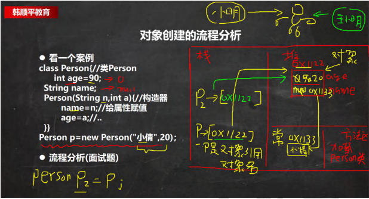
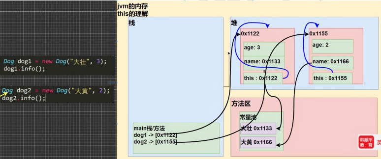

### 7.5 方法重载(OverLoad)

#### 7.5.1基本介绍

java 中允许同一个类中，多个同名方法的存在，但要求 形参列表不一致！

比如：System.out.println();	out是PrinStream类型

【OverLoad01.java】

```java
public class OverLoad01{

	public static void main(String[] args) {
		System.out.println(100);
		System.out.println("hello,world");
		System.out.println('h');
		System.out.println(1.1);
		System.out.println(true);
	}
}
```

#### 7.5.2重载的好处

1）减轻了起名的麻烦

2）减轻了记名的麻烦

#### 7.5.3快速入门案例

【OverLoad01.java】

案例：类：MyCalculator	方法：calculate 计算

1）calculate(int n1,int n2)//两个整数的和

2）calculate(int n1,double n2)//一个整数，一个double的和

3）calculate(double n2,int n1)//一个double，一个int和

4）calculate(int n1,int n2,int n3)//三个int的和

```java
public class OverLoad01{
	public static void main(String[] args) {
		// System.out.println(100);
		// System.out.println("hello,world");
		// System.out.println('h');
		// System.out.println(1.1);
		// System.out.println(true);
		//
		MyCalculator mc = new MyCalculator();
		System.out.println(mc.calculate(1,2));
		System.out.println(mc.calculate(1.1,2));

	}
}
class MyCalculator{
		//下面的四个 calculate方法构成了重载
	   //两个整数的和
	   public int calculate(int n1,int n2){
	   		System.out.println("calculate(int n1,int n2) 被调用..");
	   		return n1 + n2;
	   }
	   //一个整数，一个double的和
	   public double calculate(int n1,double n2){
	   		return n1 + n2;
	   }
	   //一个double，一个int和
	   public double calculate(double n2,int n1){
	   		System.out.println("calculate(double n2,int n1) 被调用..");
	   		return n1 + n2;
	   }
	   //三个int的和
	   public int calculate(int n1,int n2,int n3){
	   		return n1 + n2 + n3;
	   }
}
```

#### 7.5.4注意事项和使用细节

1）方法名：必须相同

2）形参列表：必须不同(形参类型或个数或顺序，至少有一样不同，参数名无要求)

3）返回类型：无要求

#### 7.5.5课堂练习题

1. 判断题：

   与void show(int a,char b,double c){ }构成重载的有:[ b c d e]

   a）void show(int x,char y,double z){}//不是

   b）int show(int a,double c,char b){}//是

   c）void show(int a,double c,char b){}//是

   d）boolean show(int c,charb)//是

   e）void show(double c){}//是

   f）double show(int x,char y,double z){}//不是

   g）void shows(){}//不是

2. 编写程序，类Methods中定义三个重载方法并调用。方法名为m。三个方法分别接收一个int参数、两个int参数、一个字符串参数。分别执行平方运算并输出结果，相乘并输出结果，输出字符串信息。在主类的main()方法中分别用参数区别调用三个方法。【OverLoadExercise.java】

3. 在Methods类，定义三个重载方法max(),第一个方法，返回两个int值中的最大值，第二个方法，返回两个double值中的最大值，第三个方法，返回三个double值中的最大值，并分别调用三个方法。

```java
public class OverLoadExercise{
	public static void main(String[] args) {
		//在主类的main()方法中分别用参数区别调用三个方法。
		Methods method = new Methods();
		method.m(10);//100
		method.m(10,20);//200
		method.m("Hello,World!");//Hello,World!

		//测试
		System.out.println(method.max(10,24));//24
		System.out.println(method.max(10.0,21.4));//21.4
		System.out.println(method.max(10.0,1.4,30));//30.0

	}
}

/*
编写程序，类Methods中定义三个重载方法并调用。方法名为m。
三个方法分别接收一个int参数、两个int参数、一个字符串参数。分别执行平方运算并输出结果，
相乘并输出结果，输出字符串信息。在主类的main()方法中分别用参数区别调用三个方法。
*/


/*
在Methods类，定义三个重载方法max(),第一个方法，返回两个int值中的最大值，第二个方法，
返回两个double值中的最大值，第三个方法，返回三个double值中的最大值，并分别调用三个方法。
*/
class Methods {

	//分析
	//1 方法名 max
	//2 形参 (int,int)
	//3. int

	public int max(int n1,int n2){
		return n1 > n2 ? n1 : n2;
	}

	//分析
	//1 方法名 max
	//2 形参 (double,double)
	//3. double
	public double max(double n1,double n2){
		return n1 > n2 ? n1 : n2;
	}

	//分析
	//1 方法名 max
	//2 形参 (double,double)
	//3. double
	public double max(double n1,double n2,double n3){
		return n3 > (n1 > n2 ? n1 : n2) ? n3 : (n1 > n2 ? n1 : n2);
	}

	public double max(double n1,double n2,int n3){
		System.out.println("这个被调用了");
		return n3 > (n1 > n2 ? n1 : n2) ? n3 : (n1 > n2 ? n1 : n2);
	}
  
	//分析
	//1 方法名 m
	//2 形参 (int)
	//3. void
	public void m(int n){
		System.out.println("平方=" + (n * n));
	}

	//1 方法名 m
	//2 形参 (int,int)
	//3. void
	public void m(int n1,int n2){
		System.out.println("相乘=" + (n1 * n2));
	}

	//1 方法名 m
	//2 形参 (String)
	//3. void
	public void m(String str){
		System.out.println("传入的str=" + str);
	}
}
```

### 7.6可变参数

#### 7.6.1基本概念

java允许将同一个类中多个同名同功能但参数个数不同的方法，封装成一个方法。 就可以通过可变参数实现

#### 7.6.2基本语法

> 访问修饰符 返回类型 方法名(数据类型... 形参名){
>
> }

#### 7.6.3快速入门案例(VarParameter01.java)

Variable Parameter  可变参数

看一个案例 类 HspMethod， 方法 sum

【可以计算 2 个数的和， 3 个数的和 ， 4. 5， 。。】

```java
public class VarParameter01{
	public static void main(String[] args) {
		HspMethod m = new HspMethod();
		System.out.println(m.sum(1,5,100));//106
		System.out.println(m.sum(1,19));//20
	}
}

class HspMethod{
	//可以计算 2个数的和，3个数的和，4. 5，。。
	//可以使用方法重载
	// publuc int sum(int n1,int n2){//2个数的和
	// 	return n1 + n2;
	// }

	// publuc int sum(int n1,int n2,int n3){//3个数的和
	// 	return n1 + n2 + n3;
	// }

	// publuc int sum(int n1,int n2,int n3,int n4){//4个数的和
	// 	return n1 + n2 + n3 + n4;
	// }
	//.....
	//上面的三个方法名称相同，功能相同，参数个数不同-> 使用可变参数优化
	//解读
	//1.int... 表示接受的是可变参数，类型是int，即可接收多个int(0 - 多)
	//2.使用可变参数时，可以当做数组来使用 即nums 
	//3.遍历 nums 求和即可
	public int sum(int... nums){
		//System.out.println("接收的参数个数="+ nums.length);
		int res = 0;
		for (int i = 0;i < nums.length ;i++ ) {
			res+=nums[i];
		}
		return res;
	}
}
```

#### 7.6.4注意事项和使用细节

【VarParameterDetail.java】

1）可变参数的实参可以为0个或任意多个。

2）可变参数的实参可以为数组。

3）可变参数的本质就是数组。

4）可变参数可以和普通类型的参数一起放在形参列表，但必须保证可变参数在最后

5）一个形参列表中只能出现一个可变参数

代码

```java
public class VarParameterDetail{
	public static void main(String[] args) {
		//细节：可变参数的实参可以为数组
		int[] arr = {1,2,3};
		T t1 = new T();
		t1.f1(arr);
	}
}

class T {

	public void f1(int... nums){
		System.out.println("长度=" + nums.length);
	}

	//细节：可变参数可以和普通类型的参数一起放在形参列表，但必须保证可变参数在最后
	public void f2(String str,double... nums){

	}

	//细节：一个形参列表中只能出现一个可变参数
	//下面的写法是错误的.
	// public void f3(int... nums,double... nums2)
	// {
		
	// }
}
```

#### 7.6.5课堂练习

【VarParameterExercise.java】

有三个方法，分别实现返回名字和两门课成绩(总分)，返回姓名和三门课成绩（总分），返回姓名和五门课成绩（总分）。封装成一个可变参数的方法

类名HspMethod 方法名 showScore

```java
public class VarParameterExercise{
	public static void main(String[] args) {
		HspMethod hm = new HspMethod();
		System.out.println(hm.showScore("milan",90.1,80.0));
		System.out.println(hm.showScore("terry",90.1,80.0,10,30.5,70));
	}
}

class HspMethod{

	/*
	有三个方法，分别实现返回名字和两门课成绩(总分)，
	返回姓名和三门课成绩（总分），返回姓名和五门课成绩（总分）。封装成一个可变参数的方法
	*/
	//分析1.方法名 showScore 2.形参(String ,double...) 3.返回String
	public String showScore(String name,double... score){

		double totalScore = 0;
		for(int i = 0;i < score.length;i++){
			totalScore+=score[i];
		}
		return name + "有" + score.length + "门课的成绩总分为=" + totalScore; 
	}
}
```

### 7.7作用域

#### 7.7.1基本使用

面向对象中，变量作用域是非常重要的知识点【VarScope.java】

1. 在java编程中，主要的变量就是属性（成员变量）和局部变量。

2. 我们说的局部变量一般是指在成员方法中定义的变量。【Cat类：cry】

3. java中作用域的 分类

   全局变量：也就是属性，作用域为整个类体Cat类：cry eat等方法使用属性

   局部变量：也就是除了属性之外的其他变量，作用域为定义它的代码块中！

4. 全局变量(属性)可以不赋值，直接使用，因为有默认值，局部变量必须赋值后，才能使用，因为没有默认值。

```java
public class VarScope{

	public static void main(String[] args) {
		
	}
}
class Cat{
	//全局变量：也就是属性，作用域为整体类题 Cat类：cry eat 等方法使用属性
	//属性在定义时，可以直接赋值
	int age = 10;//指定的值是 10

	//全局变量(属性)可以不赋值，直接使用，因为有默认值，
    double weight; ///默认值是0.0

    public void hi(){
    //局部变量必须赋值后，才能使用，因为没有默认值。
    	int num = 1;
    	String address = "北京";
    	System.out.println("num=" + num);
    	System.out.println("weight=" + weight);//属性
    }

	{
		int num = 100;
	}
	public void cry(){
		//1.局部变量一般是指在成员方法中定义的变量
		//2.n 和 name 就是局部变量
		//3.n 和 name的作用域在 cry方法中
		int n = 10;
		String name = "jack";
		System.out.println("在cry中使用属性 age=" + age);
	}

	public void eat(){

		System.out.println("在eat中使用属性age=" + age);
		// System.out.println("num=" + num);

		// System.out.println("在eat中使用 cry的变量 name=" + name);//错误
	}
}
```

#### 7.7.2注意事项和细节使用

【VarScopeDetail.java】

1. 属性和局部变量可以重名，访问时遵循就近原则。

2. 在同一个作用域中，比如在同一个成员方法中，两个局部变量，不能重名。

3. 属性生命周期较长，伴随着对象的创建而创建，伴随着对象的销毁而销毁。局部变量，生命周期较短，伴随着它的代码块的执行而创建，伴随着代码块的结束而销毁。即在一次方法调用过程中。

4. 作用域范围不同

   全局变量/属性：可以被本类使用，或其他类使用（通过对象调用）

   局部变量：只能在本类中对应的方法中使用

5. 修饰符不同

   全局变量/属性可以加修饰符

   局部变量不可加修饰符

```java
public class VarScopeDetail{

	public static void main(String[] args) {
		Person p1 = new Person();
		/*
		属性生命周期较长，伴随着对象的创建而创建，伴随着对象的销毁而销毁。
		局部变量，生命周期较短，伴随着它的代码块的执行而创建，
		伴随着代码块的结束而销毁。即在一次方法调用过程中。
		*/
		p1.say();//当执行say方法时，say方法的局部变量比如name，会创建，当say执行完毕后
		//name局部变量就销毁，但是属性(全局变量)仍然可以使用
		
		T t1 = new T();
		t1.test();//第一种跨类访问对象属性的方式

		t1.test2(p1);//第二种跨类访问对象属性的方式
	}
}
class T {
	//全局变量/属性：可以被本类使用，或其他类使用（通过对象调用）
	public void test() {
		Person p1 = new Person();
		System.out.println(p1.name);//jack
	}

	public void test2(Person p){
		System.out.println(p.name);//jack
	}
}

class Person{

	//细节：属性可以加修饰符（public protected private...）
	//		局部变量不能加修饰符号
	public int age = 20;

	String name = "jack";

	public void say(){
		//细节：属性和局部变量可以重名，访问时遵循就近原则。
		//String name = "king";
		System.out.println("say() name=" + name );
	}

	public void hi(){
		String address = "北京";
		//Sting address = "上海";//错误，重复定义变量
		String name = "hsp";//可以


	}
}
```

### 7.8 构造方法/构造器

#### 7.8.1看一个需求

我们来看一个需求：前面我们在创建人类的对象时，是先把一个对象创建好后，再给他的年龄和姓名属性赋值，如 果现在我要求，在创建人类的对象时，就直接指定这个对象的年龄和姓名，该怎么做? 这时就可以使用构造器。

#### 7.8.2基本语法

```
[修饰符] 方法明(形参列表){
	方法体;
}
```

- 说明：
  1. 构造器的修饰符可以默认， 也可以是 public pro
  2. 构造器没有返回值
  3. 方法名 和 类名字必须一样
  4. 参数列表 和 成员方法一样的规则
  5. 构造器的调用，由系统完成

#### 7.8.3基本介绍

构造方法又叫构造器(constructor)，是类的一种特殊的方法，它的主要作用是完成对新对象的初始化。它有几个特点：

1. 方法名 和 类名相同
2. 没有返回值
3. 在创建对象时，系统会自动的调用该类的构造器完成对象的初始化。、

#### 7.8.4快速入门

【Constructor01.java】

```java

public class Constructor01{
	public static void main(String[] args) {
		//当我们new 一个对象时，直接通过构造器指定名字和年龄
		Person p1=new Person("smith",80);
		System.out.println("p1的信息如下");
		System.out.println("p1对象name=" + p1.name);//smith
		System.out.println("p1对象age=" + p1.age);//80

	}
}
//在创建人类的对象时，就直接指定这个对象的年龄和姓名
//
class Person{
	String name;
	int age;
	//构造器
	//解读
	//1.构造器没有返回值，也不能写void
	//2.构造器的名称和类Person一样
	//3.(String pName,int pAge)是构造器形参列表，规则和成员方法一样


	public Person(String pName,int pAge){
		System.out.println("构造器被调用~~ 完成对象属性的初始化");
		name = pName;
		age = pAge;
	}
}
```

#### 7.8.5注意事项和使用细节

【ConstructorDetail.java】

1. 一个类可以定义多个不同的构造器，即构造器重载

   比如：我们可以再给Person类定义一个构造器，用来创建对象的时候，只指定人名，不需要指定年龄

2. 构造器名和类名要相同

3. 构造器没有返回值

4. 构造器是完成对象的初始化，并不是创建对象

5. 在创建对象时，系统自动的调用该类的构造方法

6. 如果程序员没有定义构造器，系统会自动给类生成一个默认无参构造器(也叫默认构造器),比如Dog(){}，可以使用javap指令 反编译试试

7. 一旦定义了自己的构造器，默认的构造器就覆盖了，就不能再使用默认的无参构造器，除非显式的定义一下，即：Dog(){} 写

```java
public class ConstructorDetail{
	public static void main(String[] args) {
		Person p1=new Person("king",40);//第一个构造器
		Person p2=new Person("Tom");//第二个构造器

		Dog dog1 = new Dog();//使用的是默认的无参构造器
	}
}
class Dog{
	//如果程序员没有定义构造器，系统会自动给类生成一个默认无参构造器(也叫默认构造器)
	/*
		默认构造器
		Dog() {
	
		}
	*/
	//一旦定义了自己的构造器，默认的构造器就覆盖了，就不能再使用默认的无参构造器，
	//除非显式的定义一下，即：Dog(){} 写
	//
	public Dog(String dName){
		//...
	}

	Dog(){//除非显式的定义一下 无参构造器

	}
}

class Person{
	String name;
	int age;//默认0
	//第一个构造器
	public Person(String pName,int pAge){
		name = pName;
		age = pAge;
	}
	//第二个构造器,只指定人名，不需要指定年龄
	public Person(String pName){
		name = pName;
	}
}
```

#### 7.8.6课堂练习题

【ConstructorExercise.java】

在前面定义的 Person 类中添加两个构造器：

 第一个无参构造器：利用构造器设置所有人的 age 属性初始值都为 18

第二个带 pName 和 pAge 两个参数的构造器：使得每次创建 Person 对象的同时初始化对象的 age 属性值和 name 属性值。 分别使用不同的构造器，创建对象.

代码：

```java

public class ConstructorExercise {
	public static void main(String[] args) {
		Person p1=new Person();//无参构造器

		//下面输出 name = null;age = 18;
		System.out.println("p1的信息 name=" + p1.name + " age" + p1.age);

		Person p2 = new Person("scott",50);

		//下面输出 name = scott ;age = 50;
		System.out.println("p2的信息 name=" + p2.name + " age" + p2.age);
	}
}
/*
 *第一个无参构造器：利用构造器设置所有人的 age 属性初始值都为 18
 *第二个带 pName 和 pAge 两个参数的构造器：
 *使得每次创建 Person 对象的同时初始化对象的 age 属性值和 name 属性值。
 *分别使用不同的构造器，创建对象.
*/

class Person {
	String name;//默认值 null
	int age;//默认 0
	//第一个无参构造器：利用构造器设置所有人的 age 属性初始值都为 18
	public Person(){
		age = 18;//
	}
	//第二个带 pName 和 pAge 两个参数的构造器
	public Person(String pName,int pAge){
		name = pName;
		age = pAge;
	}
}
```

### 7.9对象创建的流程分析

#### 7.9.1看一个案例

```java
class Person{//类Person
    int age = 90;
    String name;
    Person(String n,int a){//构造器
        name = n;//给属性赋值
        age = a;//...
    }
}
```

Person p = new Person("小倩",20);

- 流程分析
  1. 加载Person类信息(Person.class),只会加载一次
  2. 在堆中分配空间(地址)
  3. 完成对象初始化[3.1 初始化 age = 0 name = null 3.2 显式初始化 age = 90，name = null ，3.3 构造器的初始化 age = 20，name = 小倩]
  4. 在对象在堆中的地址，返回给 p (p是对象名，也可以理解成是对象的引用)



### 7.10 this关键字

#### 7.10.1 先看一段代码，并分析问题

【This01.java】

```java
class Dog{
    public String name;
    public int age;
    public Dog(String dName,int dAge){
        
        name = dName;
        age = dAge;
    }
    public void info(){
        System.out.println(name + "\t" + age + "\t");
    }
}
```

问题：构造方法的输入参数名不是非常的好，如果能够将dName 改成 name 就好了，但是我们会发现按照变量的作用域原则，name的值就是null，怎么解决-> this

- 什么是this

  java虚拟机会给每个对象分配this，代表当前对象。

  02.assets/image-20230919175040545.png)

- 使用this解决前面变量命名问题

#### 7.10.2 深入理解this

【This01.java】

```java
class Dog{
    public String name;
    public int age;
    public Dog(String name,int in_age){
        this.name=name;
        this.age=in_age;
    }
    public void info(){
        System.out.println(this.name + "\t" + this.age + "\t" + "当前对象的hashCode是：" + this.hashCode());
    }
}//使用hashCode()看看对象的情况
```

this:简单的说，哪个对象调用，this就代表哪个对象



```java
public class This01{

	public static void main(String[] args) {
		
		 Dog dog1 = new Dog("大壮",3);
		 System.out.println("dog1的hashCode=" + dog1.hashCode());
		 //dog1调用了 info()方法
		 dog1.info();

		 System.out.println("============");
		 Dog dog2 = new Dog("大黄",2);
		 System.out.println("dog2的hashCode=" + dog2.hashCode());
		 dog2.info();
	}
}

class Dog{//类
    String name;
    int age;
    // public Dog(String dName,int dAge){//构造器
    //     name = dName;
    //     age = dAge;
    // }
    //如果我们构造器的形参，能够直接写成属性名，就更好了
    //但是出现了一个问题，根据变量的作用域原则
    //构造器的name 是局部变量，而不是属性
    //构造器的age  是局部变量，而不是属性
    //==> 引出this关键字来解决
    public Dog(String name,int age){//构造器
     	//this.name 就是当前对象的属性name
        this.name = name;
        //this.age  就是当前对象的属性age
        this.age = age;
        System.out.println("this.hashCode=" + this.hashCode());
    }

    public void info(){//成员方法，输出属性信息
    	System.out.println("this.hashCode=" + this.hashCode());
        System.out.println(name + "\t" + age + "\t");
    }
}
```

#### 7.10.3 this的注意事项和使用细节

【ThisDetail.java】

1. this关键字可以用来访问本类的属性、方法、构造器
2. this用于区分当前类的属性和局部变量
3. 访问成员方法的语法：this.方法名(参数列表);
4. 访问构造器语法：this(参数列表);注意只能在构造器中使用(即只能在构造器中访问另外一个构造器, 必须放在第一条语句)
5. this不能再类定义的内部使用，只能在类定义的方法中使用。

#### 7.10.4 this 的课堂案例

【TestPerson.java】

定义 Person 类，里面有 name、age 属性，并提供 compareTo 比较方法，用于判断是否和另一个人相等，提供测试类 TestPerson 用于测试, 名字和年龄完全一样，就返回 true, 否则返回 false

代码：

```java
public class TestPerson{
	public static void main(String[] args) {
		Person p1 = new Person("mary",20);
		Person p2 = new Person("smith",30);

		System.out.println("p1和p2的比较结果=" + p1.compareTo(p2));
	}
}

/*
定义 Person 类，里面有 name、age 属性，并提供 compareTo 比较方法，
用于判断是否和另一个人相等，提供测试类 TestPerson 用于测试, 
名字和年龄完全一样，就返回 true, 否则返回 false
*/
class Person{
	String name;
	int age;
	//构造器
	public Person(String name,int age){
		this.name = name;
		this.age = age;
	}
	//compareTo比较方法
	public boolean compareTo(Person p){
		// if (this.name.equals(p.name) && this.age == p.age) {
		// 	return true;
		// }else{
		// 	return false;
		// }
		return this.name.equals(p.name) && this.age == p.age;
	}
}
```

### 7.11本章作业

02.assets/image-20230919215250171.png)

02.assets/image-20230919215318390.png)

02.assets/image-20230919215350542.png)

02.assets/image-20230919215410519.png)

02.assets/image-20230919215434088.png)

02.assets/image-20230919215459392.png)

> Homework01.java

```java
public class Homework01{
	public static void main(String[] args) {

		double[] arr = {1.0,1.4,-1.3,89.8,123.8,66};//{};
		A01 a = new A01();
		Double res = a.max(arr);
		if (res != null) {
			System.out.println("arr的最大值=" + res);
		}else{
			System.out.println("arr的输入有误,数组不能为null，或者{}");
		}
		
	}
}
/*
编写类A01,定义方法max，实现求某个double数组的最大值，并返回

思路分析
1.类名 A01
2.方法名 max
3.形参 (double[])
4.返回值 double

先完成正常业务，然后考虑代码健壮性
*/
class A01 {
	public Double max(double[] arr){
		//先判断arr是否为null，然后再判断 length 是否>0
		if(arr != null && arr.length > 0){
			//保证arr至少有一个元素
			double max = arr[0];//假定第一个元素就是最大值
			for (int i = 1;i < arr.length;i++ ) {
				if (arr[i] > max) {
					max = arr[i];
				}
			}
			return max;//double
		}else{
			return null;
		}	
	}
}
```

> Homework02.java

```java
public class Homework02{
	public static void main(String[] args) {
		
		String[] strs = {"jack","tom","mary","milan"};
		A02 a02 = new A02();
		int index = a02.find("milan",strs);
		System.out.println("查找的index=" + index);
	}
}

//分析
//1.类名 A02
//2.方法名 find
//3.返回值 int
//4.形参 (String,String[])
class A02 {
	public int find(String findStr,String[] strs){
		//直接遍历字符串数组，如果找到，则返回索引
		for (int i = 0; i < strs.length ;i++ ) {
			if (findStr.equals(strs[i])) {
				return i;
			}
		}
		//如果没有返回-1
		return -1;
	}
}
```

