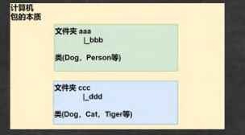
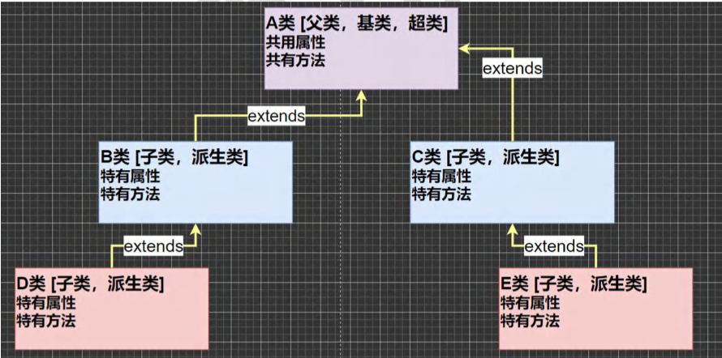
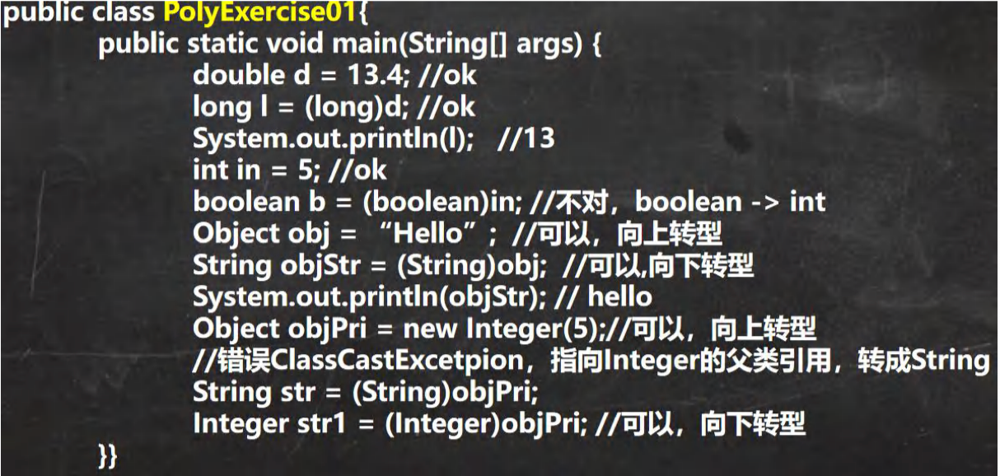
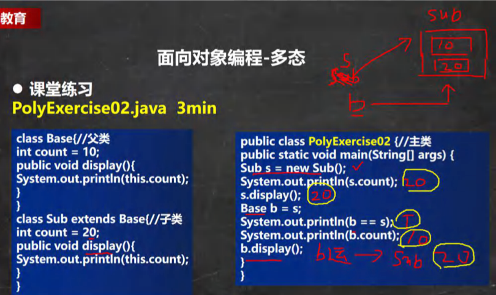
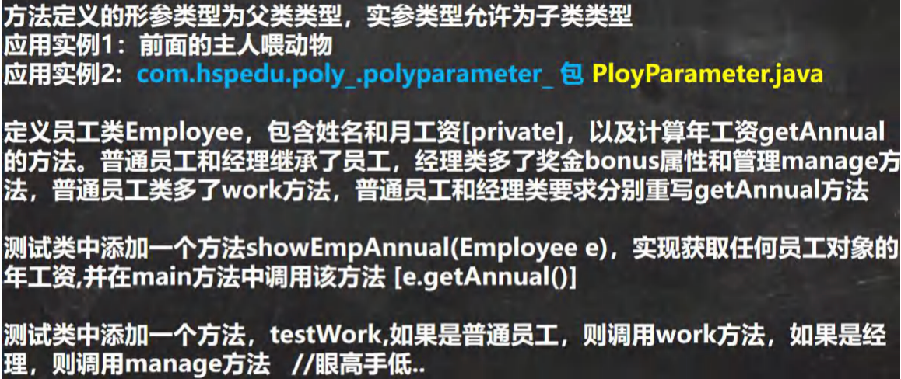
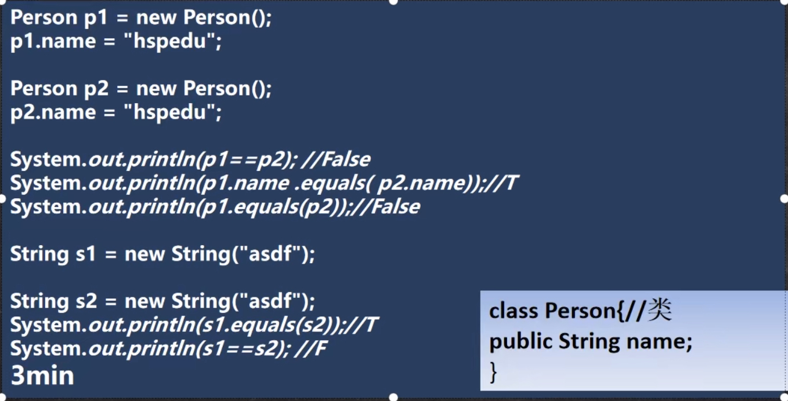
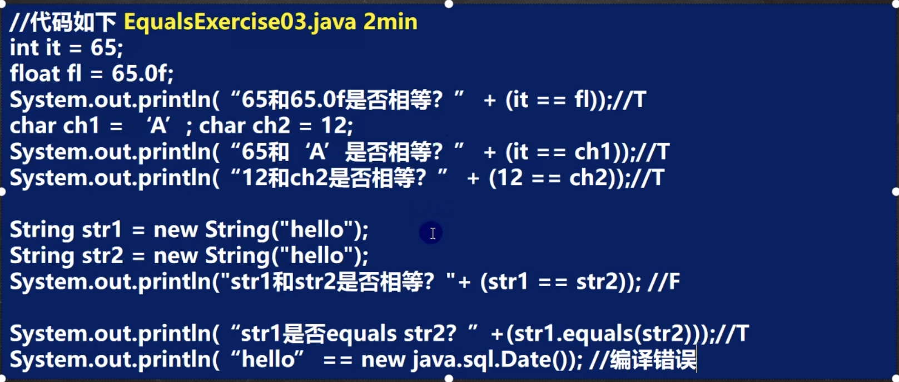
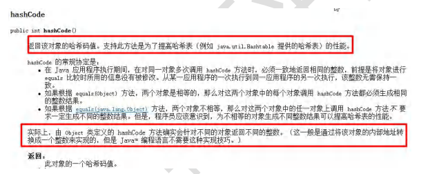
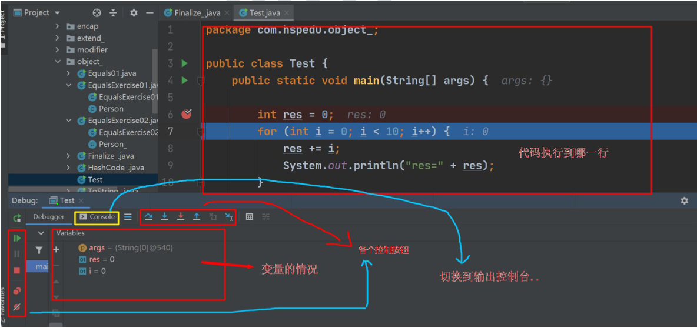
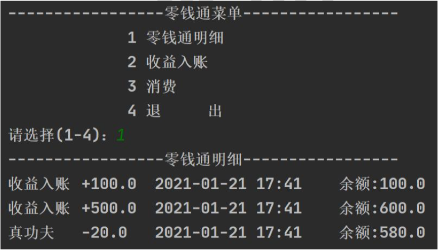

## 第 8 章 面向对象编程(中级部分)

### 8.1 IDE（集成开发环境）-IDEA

#### 8.1.1IDEA介绍

1. IDEA 全称 IntelliJ IDE
2. 在业界被公认为最好的 Java 开发工
3.  IDEA 是 JetBrains 公司的产品，总部位于捷克的首都布拉格
4. 除了支持 Java 开发，还支持 HTML，CSS，PHP，MySQL，Python 等

#### 8.2 IDE（集成开发环境）-Eclipse

#### 8.2.1Eclipse 介绍

1. Eclipse 是一个开放源代码的、基于 Java 的可扩展开发平台
2. 最初是由 IBM 公司耗资 3000 万美金开发的下一代 IDE
3. 2001 年 11 月贡献给开源
4. Eclipse 是目前最优秀的 Java 开发 IDE 之一

### 8.3 IDE（集成开发环境）-IDEA 的使

#### 8.3.1 IDEA的安装

1. 官网: https://www.jetbrains.com/
2. IDEA 下载后，就可以开始安装。
3. IDEA 工作界面介

.assets/image-20230920121306933.png)

#### 8.3.2IDEA的基本介绍与使用

使用 IDEA 创建 Java 项目(project)，看看 IDEA 是如何使用的，IDEA 是以项目的概念，来管理我们的 java 源码的

#### 8.3.3IDEA 使用技巧和经验

- 设置字体 [如图] 和 颜色主题

  菜单 file-> settings

  .assets/image-20230920122207845.png)

- 字符编码设置

  .assets/image-20230920122239867.png)

#### 8.3.4课堂练习

使用 IDEA 开发一个 java 项目 testpro01，创建一个类 MyTools, 编写一个方法，可以完成对 int 数组冒泡排序的功能 ，使用快捷键的开发项目

.assets/image-20230920122359376.png)

#### 8.3.5IDEA 常用快捷键

1. 删除当前行，默认是Ctrl + Y 自己配置 ctrl + d
2.  复制当前行, 自己配置 ctrl + alt + 向下光标
3.  补全代码 alt + /
4.  添加注释和取消注释 ctrl + / 【第一次是添加注释，第二次是取消注释】
5.  导入该行需要的类 先配置 auto import , 然后使用 alt+enter 即可
6.  快速格式化代码 ctrl + alt + L
7.  快速运行程序 自己定义 alt + R
8.  生成构造器等 alt + insert [提高开发效率]
9. 查看一个类的层级关系 ctrl + H [学习继承后，非常有用]
10. 将光标放在一个方法上，输入 ctrl + B , 可以定位到方法 [学继承后，非常有用]
11. 自动的分配变量名 , 通过 在后面加 .var

#### 8.3.6模版/自定义模版

file -> settings -> editor -> Live templates ->查看有哪些模版快捷键/可以自己增加模版

模版可以高效的完成开发，提高速度

### 8.4 包

#### 8.4.1 看一个应用场景

现在有两个程序员共同开发一个java项目，程序员xiaoming希望定义一个类取名Dog，程序员xiaoqiang也想定义一个类也叫Dog。两个程序员为此还吵了起来，怎么办？-》包

#### 8.4.2 包的三大作用

1. 区分相同名字的类
2. 当类很多时，可以很好的管理类[看Java API文档]
3. 控制访问范围

#### 8.4.3 包基本语法

> package com.hspedu;

说明：

1. package 关键字，表示打包.
2. com.hspedu：表示包名

#### 8.4.4 包的本质分析(原理)

包的本质 实际上就是创建不同的文件夹/目录来保存类文件，示意图



#### 8.4.5 快速入门

.assets/image-20230920154748023.png)

#### 8.4.6包的命名

- 命名规则：

  只能包含数字、字母、下划线、小圆点.,但不能用数字开头，不能是关键字或保留字

  demo.class.exec1//错误class是关键字

  demo.12a//错误 12a 是数字开头

  demo.ab12.oa//对

- 命名规范

  一般是小写字母+小圆点

  一般是com.公司名.业务名.业务模块名

  比如：com.hspedu.oa.model；com.hspedu.oa.controller;

  举例：

  com.sina.crm.user//用户模块

  com.sina.crm.order//订单模块

  com.sina.crm.utils//工具类

#### 8.4.7常用的包

一个包下，包含很多的类，java中常用的包有

1. java.lang.*	//lang包是基本包，默认引入，不需要再引入.
2. java.util.*         //util 包，系统提供的工具包, 工具类，使用 Scanner
3. java.net.*         //网络包，网络开发
4. java.awt.*        //是做 java 的界面开发，GUI

#### 8.4.8 如何引入包

com.hspedu.pkg:import01.java

语法：import 包;

我们引入一个包的主要目的是要使用该包下的类

比如import java.util.Scanner;就只是引入一个类Scanner。

import java.util.*; //表示将java.util 包所有都引入

#### 8.4.9 注意事项和使用细节

【PkgDetail.java】

1. package 的作用是声明当前类所在的包，需要放在类的最上面，一个类中最多只有一句package
2. import指令 位置放在package的下面，在类定义前面，可以有多句且没有顺序要求。

### 8.5 访问修饰符

#### 8.5.1 基本介绍

java提供四种访问控制修饰符号，用于控制方法和属性(成员变量)的访问权限(范围)：

1. 公开级别：用public 修饰，对外公开
2. 受保护级别：用protected修饰，对子类和同一个包中的类公开
3. 默认级别：没有修饰符号，向同一个包的类公开
4. 私有级别：用private修饰，只有类本身可以访问，不对外公开

#### 8.5.2 4种访问修饰符的访问范围

.assets/image-20230920165032954.png)

#### 8.5.3 使用的注意事项

1. 修饰符可以用来修饰类中的属性，成员方法以及类
2. 只有默认的和public才能修饰类！并且遵循上述访问权限的特点。
3. 成员方法的访问规则和属性完全一样

【com.hspedu.modifier】

### 8.6 面向对象编程三大特征

#### 8.6.1基本介绍

面向对象编程有三大特征：封装、继承和多态。

#### 8.6.2封装介绍

封装(encapsulation)就是把抽象出的数据[属性]和对数据的操作[方法]封装在一起，数据被保护在内部，程序的其它部分只有通过被授权的操作[方法],才能对数据进行操作。

#### 8.6.3封装的理解和好处

1. 隐藏实现细节：方法(连接数据库)<--调用(传入参数..)
2. 可以对数据进行验证，保证安全合理

Person {name,age}

Person p = new Person();

p.name = "jack";

p.age = 1200;

#### 8.6.4 封装的实现步骤(三步)

1. 将属性进行私有化private【不能直接修改属性】

2. 提供一个公共的(public)set方法，用于对属性判断并赋值

   public void setXxx(类型 参数名){//Xxx 表示某个属性

   //加入数据验证的业务逻辑

   属性 = 参数名;

   }

3. 提供一个公共的(public)get方法，用于获取属性的值

   public 数据类型 getXxx(){//权限判断，Xxx某个属性

   return xx;

   }

### 8.7 快速入门案例

- 看一个案例

  【com.hspedu.encap:Encapsulation01.java】，不能随便查看人的年龄，工资等隐私，并对设置的年龄进行合理的验证。年龄合理就设置，否则给默认年龄，必须在1-120，年龄，工资不能直接查看，name的长度在2-6字符之间

#### 8.7.1 将构造器和setXxx结合

```java
    public Person(String name, int age, double salary) {
//        this.name = name;
//        this.age = age;
//        this.salary = salary;
        //我们可以将set方法写在构造器中，这样仍然可以验证
        setName(name);
        setAge(age);
        setSalary(salary);
    }
```

#### 8.7.2 课堂练习

com.hspedu.encap包：AccountTest.java和Account.java

创建程序，在其中定义两个类：Account和AccountTest类体会Java的封装性。

1. Account类要求具有属性：名字(长度2位3位或4位)、余额(必须>20)、密码（必须是六位），如果不满足，则给出提示信息，并默认值
2. 通过setXxx的方法给Account 的属性赋值。
3. 在AccountTest中测试

### 8.8 面向对象编程-继承

#### 8.8.1 为什么需要继承

【com.hspedu.extend_包:Extends01.java】

提高代码复用的问题

编写两个类，一个是Pupil(小学生)，一个是Graduate(大学毕业生)。

问题：两个类的属性和方法有很多是相同的

==> 继承(代码复用性~)

#### 8.8.2 继承基本介绍和示意图

​	继承可以解决代码复用,让我们的编程更加靠近人类思维.当多个类存在相同的属性(变量)和方法时,可以从这些类中 抽象出父类,在父类中定义这些相同的属性和方法，所有的子类不需要重新定义这些属性和方法，只需要通过 extends 来 声明继承父类即可。画出继承的示意图



#### 8.8.3 继承的基本语法

> class 子类 extends 父类{
>
> }

1. 子类就会自动拥有父类定义的属性和方法
2. 父类又叫 超类，基类。
3. 子类又叫派生类。

#### 8.8.4 快速入门案例

对 【Extends01.java 】改进，使用继承的方法,请大家注意体会使用继承的好处

#### 8.8.5 继承给编程带来的便利

1. 代码的复用性提高了
2. 代码的扩展性和维护性提高了

#### 8.8.6 继承的深入讨论/细节问题

【com.hspedu.extend_包:ExtendsDetail.java】

1. 子类继承了所有的属性和方法，非私有的属性和方法可以在子类直接访问, 但是私有属性和方法不能在子类直接访 问，要通过父类提供公共的方法去访问
2. 子类必须调用父类的构造器， 完成父类的初始化
3. 当创建子类对象时，不管使用子类的哪个构造器，默认情况下总会去调用父类的无参构造器，如果父类没有提供无 参构造器，则必须在子类的构造器中用 super 去指定使用父类的哪个构造器完成对父类的初始化工作，否则，编译不会通过。
4. 如果希望指定去调用父类的某个构造器，则显式的调用一下 : super(参数列表)
5. super 在使用时，必须放在构造器第一行(super 只能在构造器中使用)
6. super() 和 this() 都只能放在构造器第一行，因此这两个方法不能共存在一个构造器
7. java 所有类都是 Object 类的子类, Object 是所有类的基类.
8. 父类构造器的调用不限于直接父类！将一直往上追溯直到 Object 类(顶级父类)
9. 子类最多只能继承一个父类(指直接继承)，即 java 中是单继承机制。
10. 不能滥用继承，子类和父类之间必须满足 is-a 的逻辑关系

#### 8.8.7 继承的本质分析

.assets/image-20230921201446860.png)

#### 8.8.8 课堂练习

1. 案例1 【ExtendsExercise01.java】

   .assets/image-20230921210921515.png)

2. 案例 2 【ExtendsExercise02.java】

3. 案例 3 【ExtendsExercise03.java】

   编写 Computer 类，包含 CPU、内存、硬盘等属性，getDetails 方法用于返回 Computer 的详细信息 

   编写 PC 子类，继承 Computer 类，添加特有属性【品牌 brand】 

   编写 NotePad 子类，继承 Computer 类，添加特有属性【color】

    编写 Test 类，在 main 方法中创建 PC 和 NotePad 对象，分别给对象中特有的属性赋值，以及从 Computer 类继承的 属性赋值，并使用方法并打印输出信息

### 8.9 super关键字

#### 8.9.1 基本介绍

super代表父类的引用，用于访问类的属性、方法、构造器

#### 8.9.2 基本语法

1. 访问父类的属性，但不能访问父类的private属性

   super.属性名;

2. 访问父类的方法，不能访问父类的private方法

   super.方法名(参数列表);

3. 访问父类的构造器

   super(参数列表);只能放在构造器的第一句，只能出现一句！

#### 8.9.3 super给编程带来的便利/细节

【SuperDetail.java】

1. 调用父类的构造器的好处（分工明确，父类属性由父类初始化，子类的属性由子类初始化）
2. 当子类中有和父类中的成员（属性和方法）重名时，为了访问父类的成员，必须通过super。如果没有重名，使用super、this、直接访问是一样的效果！
3. super的访问不限于直接父类，如果爷爷类和本类中有同名的成员，也可以使用super去访问爷爷类的成员；如果多个基类（上级类）中都有同名的成员，使用super访问遵循就近原则。当然也需要遵守访问权限的相关规则

#### 8.9.4 super 和 this 的比较

.assets/image-20230922144225798.png)

### 8.10 方法重写/覆盖（override）

#### 8.10.1 基本介绍

简单的说：方法覆盖(重写)就是子类有一个方法，和父类的某个方法的名称、返回类型、参数一样，那么我们就说子类的这个方法覆盖了父类的方法

#### 8.10.2 快速入门

【Override01.java】

#### 8.10.3 注意事项和使用细节

方法重写也叫方法覆盖，需要满足下面的条件

1. 子类的方法的形参列表，方法名称，要和父类方法的形参列表，方法名称完全一样。

2. 子类方法的返回类型和父类方法返回类型一样，或者是父类返回类型的子类

   比如 父类 返回类型是 Object，子类方法返回类型是String

   > public Object getInfo(){}
   >
   > public String getInfo(){}

3. 子类方法不能缩小父类方法的访问权限 public > protected > 默认 > private

   > void say(){}
   >
   > public void sayok(){}

#### 8.10.4 课堂练习

- 题一

  请对方法的重写和重载做一个比较

  .assets/image-20230922185520523.png)

- 题二【OverrideExercise.java】

  1. 编写一个 Person 类，包括属性/private（name、 age）， 构造器、方法 say(返回自我介绍的字符串）。
  2. 编写一个 Student 类，继承 Person 类，增加 id、score 属性/private，以及构造器，定义 say 方法(返回自我介绍的信息)。
  3. 在 main 中,分别创建 Person 和 Student 对象，调用 say 方法输出自我介绍

### 8.11 面向对象编程-多态

#### 8.11.1 先看一个问题

.assets/image-20230922200323246.png)

- 使用传统的方法来解决(private属性)

- 传统的方法带来的问题是什么？如何解决？

  问题是：代码的复用性不高，而且不利于代码维护

  解决方案：引出多态

#### 8.11.2 多[多种]态[状态]基本介绍

方法或对象具体形态。是面向对象的第三大特征，多态是建立在封装和继承基础之上的。

#### 8.11.3 多态的具体体现

1）方法的多态 PloyMethod.java

​    重写和重载就体现多态

2）对象的多态

1. 一个对象的编译类型和运行类型可以不一致
2. 编译类型在定义对象时，就确定了，不能改变
3. 运行类型是可以变化的
4. 编译类型看定义时 = 号 的左边，运行类型看 = 号的 右边

案例：com.hspedu,poly_ .objpoly _:PolyObject.java

Animal animal = new Dog;【animal 编译类型是Animal，运行类型Dog】

animal = new Cat();【anima 的运行类型变成了Cat，编译类型仍然是Animal】

#### 8.11.4 多态快速入门案例

使用多态的机制来解决主人喂食物的问题【Poly01.java】

#### 8.11.5 多态注意事项和细节讨论

【com.hspedu.poly_.detail_ 包 : PolyDetail.java】

- 多态的前提是：两个对象（类）存在继承关系
- 多态的向上转型
  1. 本质：父类的引用指向了子类的对象
  2. 语法：父类类型    引用名 = new 子类类型();
  3. 特点：编译类型看左边，运行类型看右边。可以调用父类中的所有成员（需遵守访问权限），不能调用子类中特有成员；最终运行效果看子类的具体实现！
- 多态向下转型
  1. 语法：子类类型   引用名 = （子类类型）父类引用；
  2. 只能强转父类的引用，不能强转父类的对象
  3. 要求父类的引用必须指向的是当前目标类型的对象
  4. 当向下转型后，可以调用子类类型中所有的成员

- 属性没有重写之说！属性的值看编译类型【PolyDetail02.java】
- instanceOf 比较操作符，用于判断对象的运行类型是否为 XX 类型或 XX 类型的子类型【PolyDetail03.java】

#### 8.11.6 课堂练习

【PolyExercise01.java】

【PolyExercise02.java】





#### 8.11.7 java 的动态绑定机制

Java重要特性：动态绑定机制【DynamicBinding.java】

.assets/image-20230923161205928.png)

#### 8.11.8 多态的应用

1. 多态数组【com.hspedu.poly_ .polyarr_ 包 PloyArray.java】

   数组的定义类型为父类类型，里面保存的实际元素类型为子类类型

2. 多态参数

   方法定义的形参类型为父类类型，实参类型允许为子类类型



### 8.12 Object 类详解

#### 8.12.1 equals 方法

- == 和 equals 的对比[面试题]

  【com.hspedu.object_:Equals01.java】

  == 是一个比较运算符

  1. ==：既可以判断基本类型，又可以判断引用类型
  2. ==：如果判断基本类型，判断的值是否相等。示例：inti = 10；double d = 10.0；
  3. ==：如果判断引用类型，判断的是地址是否相等，即判定是不是同一个对象
  4. equals：是Object类中的方法，只能判断引用类型
  5. 默认判断的是地址是否相等，子类中往往重写该方法，用于判断内容是否相等。比如Integer，String

#### 8.12.2 如何重写 equals 方法

​	应用实例: 判断两个 Person 对象的内容是否相等，如果两个 Person 对象的各个属性值都一样，则返回 true， 反之 false。【EqualsExercise01.java】

#### 8.12.3 课堂练习题

【EqualsExercise02.java】



【EqualsExercise03.java】



#### 8.12.4 hashCode 方法



- 小结：

1. 提高具有哈希结构的容器的效率！
2. 两个引用，如果指向的是同一个对象，则哈希值肯定是一样的！
3. 两个引用，如果指向的是不同对象，则哈希值是不一样的
4. 哈希值主要根据地址号来的！不能完全将哈希值等价于地址。
5. 案例演示【HashCode_.java】：obj.hashCode() [测试：A obj1 = new A( );A obj2 = new A( );A obj3 = obj1]

#### 8.12.5 toString方法

1. 基本介绍

   默认返回：全类名+@+哈希值的十六进制，【查看Object 的 toString方法】

   子类往往重写toString方法，用于返回对象的属性信息

2. 重写toString方法，打印对象或拼接对象时，都会自动调用该对象的toString形式

   案例演示：Monster[name,job,sal]  案例：ToString_.java

3. 当直接输出一个对象时，toString 方法会被默认的调用，比如System.out.println(monster); 就会默认调用monter.toString()

#### 8.12.6 finalize 方法

1. 当对象被回收时，系统自动调用该对象的 finalize 方法。子类可以重写该方法，做一些释放资源的操作

2. 什么时候被回收：当某个对象没有任何引用时，则 jvm 就认为这个对象是一个垃圾对象，就会使用垃圾回收机制来 销毁该对象，在销毁该对象前，会先调用 finalize 方法。

3. 垃圾回收机制的调用，是由系统来决定(即有自己的 GC 算法), 也可以通过 System.gc() 主动触发垃圾回收机制，测 试：Car [name]

   提示：在实际开发中，几乎不会运用 finalize，所以更多就是为了应付面试

### 8.13  断点调试(debug)

#### 8.13.1 一个实际需求

1. 在开发中，新手程序员在查找错误时，这时老程序员就会温馨提示，可以用断点调试，一步一步的看源码执行的过程，从而发现错误所在。
2. 重要提示：在断点调试 过程中，是运行状态，是以对象的 运行类型来执行的。

#### 8.13.2 断点调试介绍

1. 断点调试是指在程序的某一行设置一个断点，调试时，程序运行到这一行就会停住，然后你可以一步一步往下调试，调试过程中可以看各个变量当前的值，出错的话，调试到出错的代码行即显示错误，停下。进行分析从而找到这个Bug
2. 断点调试是程序员必须掌握的技能。
3. 断点调试也能帮助我们查看java底层源代码的执行过程，提高程序员的Java水平。

#### 8.13.3 断点调试的快捷键

F7(跳入)	F8(跳出)	shift+F8(跳出)	F9(resume,执行到下一个断点)

F7：跳入方法内

F8：逐行执行代码

shift+F8：跳出方法



#### 8.13.4 断点调试应用案例

看几段代码，演示调试过程

#### 8.13.5 断点调试应用案例

1）案例1 【com.hspedu.debug_ 包 Debug01.java】

看一下变量的变化情况等

2）案例2

看一下数组越界的异常【Debug02.java】

3）案例3

演示如何追源码，看看java设计者是怎么实现的。(提高编程思想)。

小技巧：将光标放在某个变量上，可以看到最新的数据。【Debug03.java】

4）案例4

演示如何直接执行到下一个断点F9 resume。

小技巧：断点可以在debug过程中，动态的下断点【Debug04.java】

#### 8.13.6 断点调试课后练习

【DebugExercise.java】

1. 使用断点调试的方法，追踪下一个对象创建的过程。Person [name,age,构造器..]
2. 我们使用断点调试，查看动态绑定机制是如何工作

### 8.14 项目-零钱通

#### 8.14.1 项目开发流程说明

#### 8.14.2 项目需求说明

使用Java 开发 零钱通项目，可以完成收益入账，消费，查看明细，退出系统等功能.

#### 8.14.3 项目的界面



化繁为简

1）先完成显示菜单，并可以选择

2）完成零钱通明细.

3）完成收益入账

4）消费

5）退出

#### 8.14.4 项目代码实现

编写文件 【SmallChangeSys.java】完成基本功能 (过程编程)

提示：先使用过程编程，后面改成 OOP 版本，请小伙伴体会 OOP 编程带来的好处

#### 8.14.5 项目代码实现改进

1. 用户输入4退出时，给出提示”你确定要退出吗？y/n“，必须输入正确的y/n，否则循环输入指令，直到输入y或者n。
2. 在收益入账和消费时，判断金额是否合理，并给出相应的提示。
3. 将面向过程的代码修改成面向对象的方法，编写SmallChangeSysOOP.java类，并使用SmallChangeSysApp.java 完成测试。


