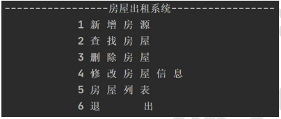
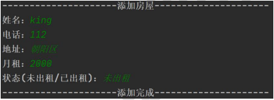
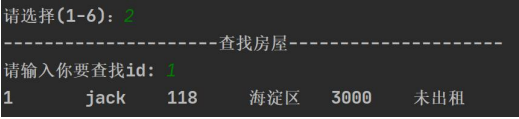
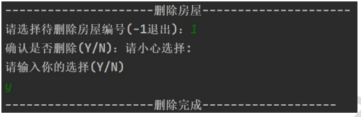
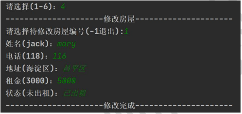
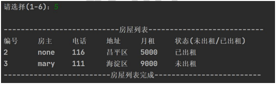
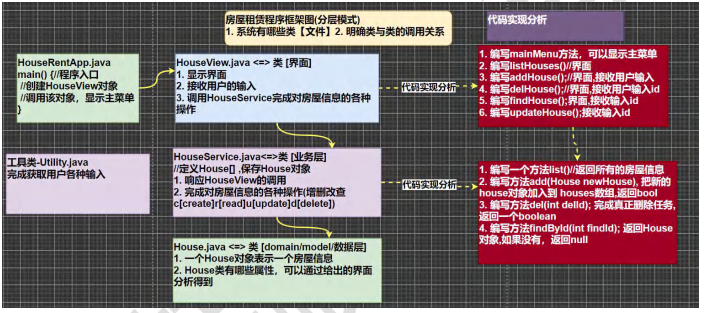

## 第 9 章 项目-房屋出租系统

### 9.1 房屋出租系统-需求

#### 9.1.1 项目需求说明

实现基于文本界面的《房屋出租软件》。

能够实现对房屋信息的添加、修改和删除（用数组实现），并能够打印房屋明细表

### 9.2 房屋出租系统-界面

#### 9.2.1 项目界面 - 主界面

#### 9.2.2 项目界面 - 新增房源

#### 9.2.3 项目界面 - 查找房源

#### 9.2.4 项目界面 - 删除房源

#### 9.2.5 项目界面 - 修改房源

#### 9.2.6 项目界面 - 房屋列表

#### 9.2.7 项目界面 - 退出系统

### 9.3 房屋出租系统 - 设计

项目设计-程序框架图 (分层模式=>当软件比较复杂，需要模式管理)

### 9.4 房屋出租系统 - 实现

#### 9.4.1 准备工具类Utility，提高开发效率

​	在实际开发中，公司都会提供相应的工具类和开发库，可以提高开发效率，程序员也需要能够看懂别人写的代码，并能够正确的调用。

1）了解Utility类的使用

2）测试Utility类

#### 9.4.2 项目功能实现 - 完成House类

编号	房主	电话	地址	月租	状态(未出租/已出租)

