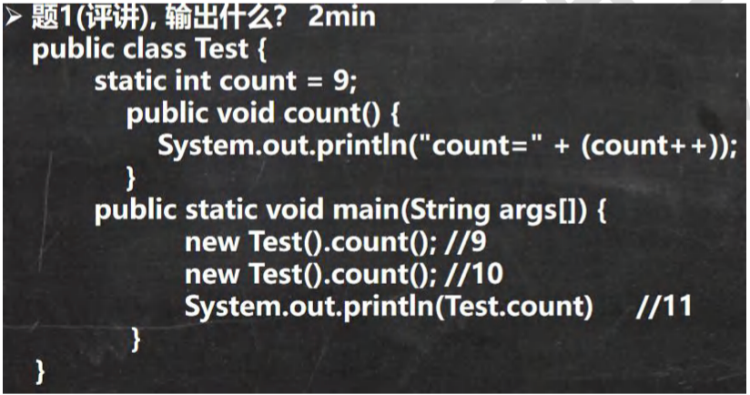
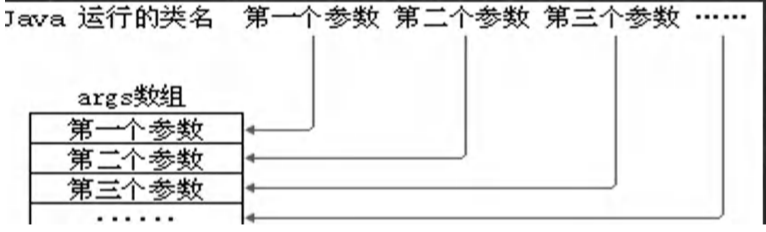
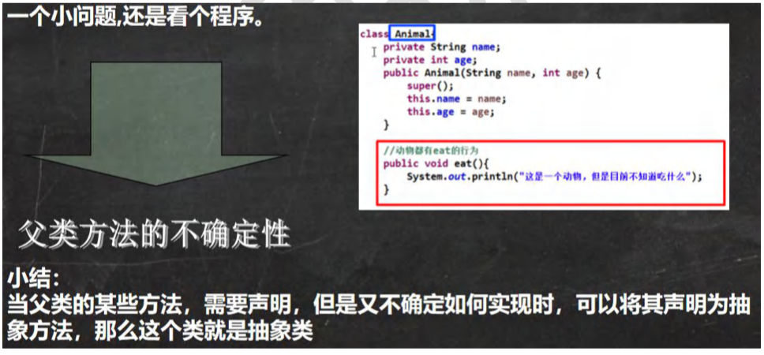
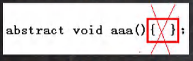
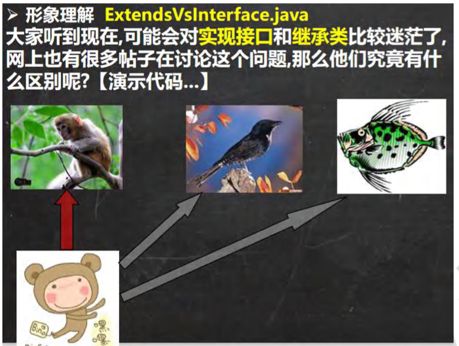

## 第 10 章 面向对象编程(高级部分)

### 10.1 类变量和类方法

#### 10.1.1 类变量-提出问题

提出问题的主要目的就是让大家思考解决之道，从而引出我要讲的知识点. 

说：有一群小孩在玩堆雪人,不时有新的小孩加入,请问如何知道现在共有多少人在玩?，编写程序解决。

.assets/image-20230927174709651.png)

#### 10.1.2 传统的方法来解决

.assets/image-20230927175447792.png)

#### 10.1.3 类变量快速入门

思考：如果,设计一个 int count 表示总人数,我们在创建一个小孩时，就把 count 加 1,并且 count 是所有对象共享的 就 ok 了!，我们使用类变量来解决 ChildGame.java 改进

#### 10.1.4 类变量内存布局

.assets/image-20230927203655382.png)


#### 10.1.5 什么是类变量

类变量也叫静态变量/静态属性，是该类的所有对象共享的变量，任何一个该类的对象去访问它时，取到的都是相同的值，同样任何一个该类的对象去修改它时，修改的也是同一个变量。

#### 10.1.6 如何定义类变量

定义语法：

> 访问修饰符 static 数据类型 变量名;[推荐]
>
> static 访问修饰符 数据类型 变量名;

#### 10.1.7 如何访问类变量 【VisitStatic.java】

> 类型.类变量名
>
> 或者 对象名.类变量名【静态变量的访问修饰符的访问权限和范围 和 普通属性性是一样的。】
>
> 推荐使用：类名.类变量名;

#### 10.1.8 类变量使用注意事项和细节讨论【StaticDetail.java】

1. 什么时候需要用类变量

   当我们需要让某个类的所有对象都共享一个变量时，就可以考虑使用类变量(静态变量)；比如:定义学生类，统计所有学生共交多少钱。Student(name,static fee)

2. 类变量与实例变量(普通属性)区别

   类变量是该类的所有对象共享的，而实例变量是每个对象独享的。

3. 加上static称为类变量或静态变量，否则称为实例变量/普通变量/非静态变量

4. 类变量可以通过 类名.类变量名 或者 对象名.类变量名 来访问，但java设计者推荐我们使用 类名.类变量名方式访问。【前提是 满足访问修饰符的访问权限和范围】

5. 实例变量不能通过 类名.类变量名 方式访问。

6. 类变量是在类加载时就初始化了，也就是说，即使没有创建对象，只要类加载了，就可以使用类变量了。

7. 类变量的生命周期是随类的加载开始，随着类消亡而销毁。[举例：Monster.name]

#### 10.1.9 类方法基本介绍

类方法也叫静态方法。

形式如下：

> 访问修饰符 static 数据返回类型 方法名(){ }【推荐】
>
> static 访问修饰符 数据返回类型 方法名(){ }

#### 10.1.10 类方法的调用

使用方式：类名.类方法名 或者 对象名.类方法名【前提是 满足访问修饰符的访问权限和范围】

```java
class B{
  public static void printStart(){
    System.out.println("打印星星...");
  }
}
```

#### 10.1.11 类方法应用实例 【StaticMethod.java】

#### 10.1.12 类方法经典的使用场景

- 当方法中不涉及到任何和对象相关的成员，则可以将方法设计成静态方法，提高开发效率。

  比如：工具类中的方法 utils

  Math类、Arrays类、Collections 集合类

- 小结

  在程序实际开发，往往会将一些通用的方法，设计成静态方法，这样我们不需要创建对象就可以使用了，比如打印一维数组，冒泡排序，完成某个计算任务 等...

#### 10.1.13 类方法使用注意事项和细节讨论 

【StaticMethodDetail.java】

1. 类方法和普通方法都是随类的加载而加载，将结构信息存储在方法区：

   类方法中无this的参数

   普通方法中隐含着this的参数

2. 类方法可以通过类名调用，也可以通过对象名调用。

3. 普通方法和对象有关，需要通过对象名调用，比如对象名.方法名(参数),不能通过类名调用。

4. 类方法中不允许使用和对象有关的关键值，比如this和super。普通方法(成员方法)可以。

5. 类方法(静态方法)中 只能访问 静态变量 或静态方法。

6. 普通成员方法，既可以访问 非静态成员，也可以访问静态成员。

==小结==：静态方法，只能访问静态的成员，非静态的方法，可以访问静态成员和非静态成员（必须遵守访问权限）

#### 10.1.14 课堂练习【StaticExercise01.java】



#### 10.1.15 题 2,看看下面代码有没有错误,如果有错误，就修改，看看输出什么?

【StaticExercise02.java】

#### 10.1.16 题 3,看看下面代码有没有错误,如果有错误，就修改，看看 total 等于多少 4?

【StaticExercise03.java】

小结：记住两句话 

(1) 静态方法，只能访问静态成员 

(2) 非静态方法，可以访问所有的成员

 (3) 在编写代码时，仍然要遵守访问权限规则

### 10.2 理解 main 方法语法

#### 10.2.1 深入理解main方法

解释main方法的形式：public static void main(String[] args){}

1. main方法是虚拟机调用
2. java虚拟机需要调用类的main()方法，所以该方法的访问权限必须是public
3. java虚拟机在执行main()方法时不必创建对象，所以该方法必须是static
4. 该方法接收String类型的数组参数，该数组中保存执行java命令时传递给所运行的类的参数
5. java 执行的程序 参数1 参数2 参数3



#### 10.2.2 特别提示：

1. 在 main()方法中，我们可以直接调用 main 方法所在类的静态方法或静态属性。
2. 但是，不能直接访问该类中的非静态成员，必须创建该类的一个实例对象后，才能通过这个对象去访问类中的非静 态成员，[举例说明] 【Main01.java】

#### 10.2.3 案例演示

```java
public class CommandPara{
  public static void main(String[] args){
    for(int i = 0;i < args.length;i++){
      System.out.println("args["+i+"]=" + args[i]);
    }
  }
}
```

//运行程序CommandPara.java

Java CommandPara "lisa" "bily" "Mr Brown" 【Main02.java】

说明：在idea如何传递参数{如下图}

.assets/image-20230928142328008.png)

### 10.3 代码块

#### 10.3.1 基本介绍

代码块又称为初始化块，属于类中的成员[即 是类的一部分]，类似于方法，将逻辑语句封装在方法体中，通过{}包围起来。

但和方法不同，没有方法名，没有返回，没有参数，只有方法体，而且不用通过对象或类显式调用，而是加载类时，或创建对象时隐式调用。

#### 10.3.2 基本语法

[修饰符] {

​	代码

};

说明注意:

1. 修饰符 可选，要写的话，也只能写 static
2. 代码块分为两大类，使用static 修饰的叫静态代码块，没有static修饰的，叫普通代码块/非静态代码块。
3. 逻辑语句可以为任何逻辑语句(输入、输出、方法调用、循环、判断等)
4. ；号可以写上，也可以省略。

#### 10.3.3 代码块的好处和案例演示

理解：

1. 相当于另一种形式的构造器(对构造器的补充机制)，可以做初始化的操作
2. 场景：如果多个构造器中都有重复的语句，可以抽取到初始化块中，提高代码块的重用性
3. 代码块的快速入门 【CodeBlock01.java】

#### 10.3.4 代码块使用注意事项和细节讨论

【CodeBlockDetail01.java】

1. static代码块也叫静态代码块，作用就是对类进行初始化，而且随着类的加载而执行，并且只会执行一次。如果是普通代码块，每创建一个对象，就执行。

2. 类什么时候被加载

   - 创建对象实例时(new)
   - 创建子类对象实例，父类也会被加载
   - 使用类的静态成员是(静态属性，静态方法)

   案例演示：A 类 extends B类 的静态块

3. 普通的代码块，在创建对象实例时，会被隐式的调用。被创建一次，就会调用一次。如果只是使用类的静态成员时，普通代码块并不会执行

小结：

1. static 代码块是类加载时，执行，只会执行一次
2. 普通代码块是在创建对象时调用，创建一次，调用一次
3. 类加载的3种情况，需要记住。

4）创建一个对象时，在一个类 调用顺序是：

1. 调用静态代码块和静态属性初始化（注意：静态代码块和静态属性初始化调用的优先级一样，如果有多个静态代码和多个静态变量初始化，则按他们定义的顺序调用）

2. 调用普通代码块和普通属性的初始化（注意：普通代码块和普通属性初始化调用的优先级一样，如果有多个普通代码块和多个普通属性初始化，则按定义顺序调用）

3. 调用构造方法

   【CodeBlockDetail02.java】

5）构造器 的最前面其实隐含了super()和 调用普通代码块，静态相关的代码块，属性初始化，在类加载时，就执行完毕，因此是优先于 构造器和普通代码块执行的 【CodeBlockDetail03.java】

> class A{
>
> ​	public A(){//构造器
>
> ​		//这里有隐藏的执行要求
>
> ​		//(1) super();
>
> ​		//(2) 调用普通代码块的
>
> ​		System.out.println("ok");
>
> ​	}
>
> }

6）我们看一下创建一个子类对象时(继承关系)，他们的静态代码块，静态属性初始化，普通代码块，普通属性初始化，构造方法的调用顺序如下：

1. 父类的静态代码块和静态属性(优先级一样，按定义顺序执行)
2. 子类的静态代码块和静态属性(优先级一样，按定义顺序执行)
3. 父类的普通代码块和普通属性初始化(优先级一样，按定义顺序执行)
4. 父类的构造方法
5. 子类的普通代码块和普通属性初始化(优先级一样，按定义顺序执行)
6. 子类的构造方法

AAAAA extends BBBBB 类 演示【CodeBlockDetail04.java】

7）静态代码块只能直接调用静态成员(静态属性和静态方法)，普通代码块可以调用任意成员。

#### 10.3.5 课堂练习

【CodeBlockExercise01.java】

#### 10.3.6 题2

【CodeBlockExercise02.java】

### 10.3 单例设计模式

#### 10.4.1 什么是设计模式

1. 静态方法和属性的经典使用
2. 设计模式是在大量的实践中总结的理论化之后优选的代码结构、编程风格、以及解决问题的思维方式。设计模式就像是经典的棋谱，不同的棋局，我们用不同的棋谱，免去我们自己再思考和摸索

.assets/image-20230929233559768.png)

#### 10.4.2 什么是单例模式

单例(单个的实例)

1. 所谓的单例设计模式，就是采取一定的方法保证在整个的软件系统中，对某个类只能存在一个对象实例，并且该类只能提供一个取得其对象实例的方法
2. 单例模式有两种方式：1）饿汉式 2）懒汉式

#### 10.4.3 单例模式应用实例

演示饿汉式和懒汉式单例模式的实现。

步骤如下：

1. 构造器私有化 => 防止直接 new
2. 类的内部创建对象
3. 向外暴露一个静态饿公共方法。getInstance
4. 代码实现【SingleTon01.java SingleTon02.java】

#### 10.4.4 饿汉式VS懒汉式

1. 二者最主要的区别在于创建对象的时机不同：饿汉式是在类加载就创建了对象实例，而懒汉式是在使用时才创建。
2. 饿汉式不存在线程安全问题，懒汉式存在线程安全问题。
3. 饿汉式存在浪费资源的可能。因为如果程序员一个对象实例都没有使用，那么饿汉式创建的对象就浪费了，懒汉式是使用时才创建，就不存在这个问题。
4. 在javaSE标准类中，java.lang.Runtime就是经典的单例模式。

### 10.5 final关键字

#### 10.5.1 基本介绍

【Final01.java】

final 中文意思：最后的，最终的

final 可以修饰类、属性、方法和局部变量

在某些情况下，程序员可能有以下需求，就会使用到final：

1）当不希望类被继承时，可以用final修饰。

2）当不希望父类的某个方法被子类覆盖/重新(override)时，可以用final关键字修饰。

3）当不希望类的某个属性的值被修改，可以用final修饰。

4）当不希望某个局部变量被修改，可以使用final修饰。

#### 10.5.2 final 使用注意事项和细节讨论

1. final修饰的属性又叫常量，一般 用XX_XX_XX 来命名

2. final修饰的属性在定位时，必须赋初值，并且以后不能再修改，赋值可以在如下位置之一【选择一个位置赋初值即可】：

   - 定义时：如public final double TAX_RATE = 0.08;
   - 在构造器中
   - 在代码块中

3. 如果final修饰的属性是静态的，则初始化的位置只能是

   - 定义时
   - 在静态代码块 不能在构造器中赋值

4. final类不能继承，但是可以实例化对象

5. 如果类不是final类，但是含有final方法，则该方法虽然不能重新，但是可以被继承。

6. 一般来说，如果一个类已经时final类了，就没有必要再将方法修饰成final方法。

7. final不能修饰构造方法(即构造器)

8. final 和 static 往往搭配使用，效率更高，不会导致类加载.底层编译器做了优化处理。

   ```java
   class Demo{
     publuc static final int i = 16;
     static{
       System.out.println("韩顺平教育~");
     }
   }
   ```

9. 包装类(Integer，Double，Float，Boolean等都是final)，String也是final类。

#### 10.5.3 final 应用实例

题1 【FinalExercise01.java】

请编写一个程序，能够计算圆形的面积。要求圆周率为3.14.赋值的位置3个方式都写一下

题2 【FinalExercise02.java】

```java
public int addOne(final int x) { //下面的代码是否有误， 为什么? 1min ++x; //错误,原因是不能修改 final x 的值 return x + 1; //这里是可以.

} }
```

### 10.6 抽象类

#### 10.6.1 先看一个问题

【Abstract01.java】



#### 10.6.2 解决之道-抽象类快速入门

当父类的一些方法不确定时，可以用abstract关键字来修饰该方法，这个方法就是抽象方法，用abstract 来修饰类就是抽象类。

#### 10.6.3 抽象类的介绍

1. 用abstract 关键字来修饰一个类时，这个类就叫抽象类

   访问修饰符 abstract 类名{

   }

2. 用abstract 关键字来修饰一个方法时，这个方法就是抽象方法

   访问修饰符 abstract 返回类型 方法名(参数列表);//没有方法体

3. 抽象类的价值更多作用是在于设计，是设计者设计好后，让子类继承并实现抽象类()

4. 抽象类，是hr比较爱问的知识点，在框架和设计模式使用较多

#### 10.6.4 抽象类使用的注意事项和细节讨论 

【AbstractDetail01.java】

1）抽象类不能被实例化

2）抽象类不一定包含abstract方法。也就是说，抽象类可以没有abstract方法

3）一旦类包含了abstract方法在，则这个类必须声明为abstract

4）abstract只能修饰类和方法，不能修饰属性和其他的。

#### 10.6.5 抽象类使用的注意事项和细节讨论

【AbstractDetail02.java】

5. 抽象类可以有任意成员【抽象类本质还是类】，比如：非抽象方法、构造器、静态属性等等

6. 抽象方法不能有主体，即不能实现.如图所示

   

7. 如果一个类继承了抽象类，则它必须实现抽象类的所有抽象方法，除非它自己也声明为abstract类。

8. 抽象方法不能使用private、final和static来修饰，因为这些关键字都是和重新想违背的。

#### 10.6.6 课堂练习题 

【AbstractExercise01.java】

.assets/image-20230930145245671.png)

### 10.7 抽象类最佳实践-模版设计模式

#### 10.7.2 模版设计模式能解决的问题

1）当功能内部一部分实现是确定，一部分实现是不确定的。这时可以把不确定的部分露出来，让子类去实现。

2）编写一个抽象父类，父类提供了多个子类的通用方法，并把一个或多个方法留给其子类实现，就是一种模版模式。

#### 10.7.3 最佳实践

.assets/image-20230930181656059.png)

### 10.8 接口

#### 10.8.1 为什么有接口

.assets/image-20230930220516384.png)

#### 10.8.2 接口快速入门

这样的设计需求java编程/php/.net/go中也是会大量存在的，一个程序就是一个世界，在现实世界存在的情况，在程序中也会出现。我们用程序来模拟一下。

【Interface01.java】

#### 10.8.3 基本介绍

接口就是给出一些没有实现的方法，封装到一起，到某个类要使用的时候，在根据具体情况把这些方法写出来。语法：

```java
interface 接口{
  //属性
  //抽象方法
}
class 类名 implements 接口{
  自己属性;
  自己方法;
  必须实现的接口的抽象方法
}
```

小结:结口是更加抽象的抽象的类，抽象类里的方法可以有方法体，接口里的所有方法都没有方法体【jdk7.0】。接口体现了程序设计的多态和高内聚低偶合的设计思想。

特别说明：jdk8.0后接口类可以有静态方法，默认方法，也就是说接口中可以有方法的具体实现

#### 10.8.4 深入讨论

.assets/image-20231001140240523.png)

.assets/image-20231001140304477.png)

.assets/image-20231001140327012.png)

#### 10.8.5 注意事项和细节

1）接口不能被实例化

2）接口中所有的方法是public方法，接口中抽象方法，可以不用abstract修饰

.assets/image-20231001154220233.png)

3）一个普通类实现接口，就必须将该接口的所有方法都实现。

4）抽象类实现接口，可以不用实习接口的方法。

5）一个类同时可以实现多个接口

6）接口中的属性，只能是final的，而且是public static final 修饰符。比如：

int a = 1;实际上是public static fianl int a = 1;（必须初始化）

7）接口中属性的访问形式：接口名.属性名

8）一个接口不能继承其他的类，但是可以继承多个别的接口

interface A extends B,C{}

9）接口的修饰符 只能是public和默认，这点和类的修饰符是一样的。

#### 10.8.6 课堂练习

【InterfaceExercise01.java】

```java
interface A{
  int a = 23;//等价 public static final int a = 23;
}
class B implements A{//正确
}
main中：
B b = new B();//ok
System.out.println(b.a);//23
System.out.println(A.a);//23
System.out.println(B.a);//23
```

#### 10.8.7 实现接口 vs 继承类



- 接口和继承解决的问题不同

  继承的价值主要在于：解决代码的复用性和可维护性。

  接口的价值主要在于：设计，设计好各种规范(方法)，让其它类去实现这些方法。即更加的灵活..

- 接口比继承更加灵活

  接口比继承更加灵活，继承是满足 is - a的关系，而接口只需要满足 like - a的关系。

- 接口在一定程度上实现代码解耦[即：接口规范性+动态绑定机制]

#### 10.8.8 接口的多态特性

.assets/image-20231002134726884.png)

#### 10.8.9 课堂练习

【InterfaceExercise02.java】

### 10.9 内部类

