## 第 11 章 枚举和注释

### 11.1 先看一个需求

要求创建季节(Season) 对象，请设计并完成。【Enumeration01.java】

```java
class Season{//类 
  private String name; 
  private String desc;//描述 
  //构造器 
  //getXX 
  //setXX 
}
```

### 11.2 分析问题

#### 11.2.1 创建Season对象有如下特点

1）季节的值是有限的几个值(spring,summer,autumn,winter)

2）只读，不需要修改。

### 11.3 解决方案-枚举

1）枚举对应英文(enumeration,简写 enum)

2）枚举是一组常量的集合。

3）可以这样理解：枚举属于一种特殊的类，里面只包含一组有限的特定的对象。

### 11.4 枚举的两种实现方式

1）自定义类实现枚举

2）使用 enum 关键字实现枚举

### 11.5 自定义类实现枚举-应用案例

1. 不需要提供setXxx 方法，因为枚举对象值通常为只读。
2. 对枚举对象/属性使用 final + static 共同修饰，实现底层优化。
3. 枚举对象名通常使用全部大写，常量的命名规范.
4. 枚举对象根据需要，也可以有多个属性

【Enumeration02.java】

### 11.6 自定义类实现枚举-小结

#### 11.6.1 小结：进行自定义类实现枚举，有如下特点：

1）构造器私有化

2）本类内部创建一组对象[四个 春夏秋冬]

3）对外暴露对象（通过为对象添加 public final static 修饰符）

4）可以提供 get方法，但是不要提供 set方法

### 11.7 enum关键字实现枚举-快速入门

#### 11.7.1 说明

使用 enum 来实现前面的枚举案例，体会和自定义类实现枚举不同的地方

【Enumeration03.java】

#### 11.7.2 enum 关键字实现枚举注意事项

1）当我们使用 enum 关键字开发一个枚举类时，默认会继承 Enum 类, 而且是一个 final 类。

2）传统的 public static final Season2 SPRING = new Season2(" 春天" , " 温暖" ); 简化成 SPRING(" 春天" , " 温暖" )， 这里必 须知道，它调用的是哪个构造器.

3）如果使用无参构造器 创建 枚举对象，则实参列表和小括号都可以省略

4）当有多个枚举对象时，使用,间隔，最后有一个分号结尾

5）枚举对象必须放在枚举类的行首.

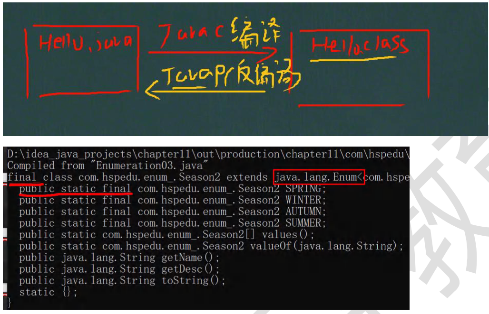

### 11.8 enum 关键字实现枚举-课堂练习

下面代码是否正确，并说明表示的含义？

Enum Gender{

​	BOY,GIRE;//这里其实就是调用Gender 类的无参构造器

}

1）上面语法是ok

2）有一个枚举类Gender，没有属性。

3）有两个枚举对象 BOY,GIRL,使用的无参构造器创建.

下面代码输出什么? 【EnumExercise01.java】


### 11.9 enum常用方法说明

说明：使用关键字enum时，会隐式继承Enum类，这样我们就可以使用 Enum 类相关的方法。[看下源码定义.]

```java
public abstract class Enum<E extends Enum<E>>
  				implements Comparable<E>,Serializable{
  
}
```

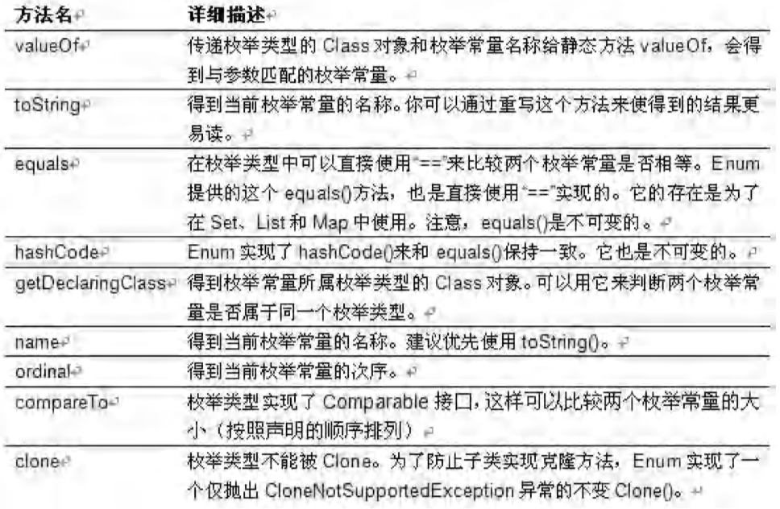

### 11.10 enum常用方法应用实例

【EnumMethod.java】

1. toString:Enum 类已经重写过了，返回的是当前对象 名,子类可以重写该方法，用于返回对象的属性信息
2. name：返回当前对象名（常量名），子类中不能重写
3. ordinal：返回当前对象的位置号，默认从 0 开始
4. values：返回当前枚举类中所有的常量
5. valueOf：将字符串转换成枚举对象，要求字符串必须 为已有的常量名，否则报异常！
6. compareTo：比较两个枚举常量，比较的就是编号！
7. 代码

- enum课堂练习

【EnumExercise02.java】

1）声明 Week 枚举类， 其中包含星期一至星期日的定义； MONDAY, TUESDAY, WEDNESDAY, THURSDAY, FRIDAY, SATURDAY, SUNDAY;

2）使用 values 返回所有的枚举数组, 并遍历

### 11.11 enum实现接口

【EnumDetail.java】

1）使用 enum 关键字后，就不能再继承其它类了，因为 enum 会隐式继承 Enum， 而 Java 是单继承机制。

2）枚举类和普通类一样，可以实现接口，如下形式。

> enum 类名 implements 接口 1， 接口 2{}

3）代码

### 11.12 注解的理解

1）注解(Annotation)也被称为元数据(Metadata)，用于修饰解释 包、类、方法、属性、构造器、局部变量等数据信息。

2）和注释一样，注解不影响程序逻辑，但注解可以被编译或运行，相当于嵌入在代码中的补充信息。

3）在 JavaSE 中，注解的使用目的比较简单，例如标记过时的功能，忽略警告等。在 JavaEE 中注解占据了更重要的角 色，例如用来配置应用程序的任何切面，代替 java EE 旧版中所遗留的繁冗代码和 XML 配置等。

### 11.13 基本的 Annotation介绍

​	使用Annotation 时 要在其前面增加 @ 符号，并把该 Annotation 当成一个修饰符使用。用于修饰它支持的程序元素

​	三个基本的 Annotation：

1）@Override: 限定某个方法，是重写父类方法, 该注解只能用于方法

2）@Deprecated: 用于表示某个程序元素(类, 方法等)已过时

3）@SuppressWarnings: 抑制编译器警告

### 11.14 基本的 Annotation 应用案例

#### 11.14.1 @Override 注释的案例 【Override_.java】

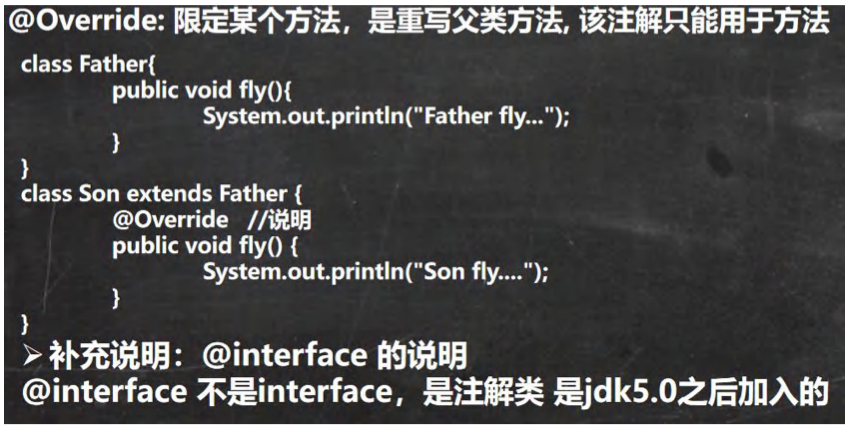

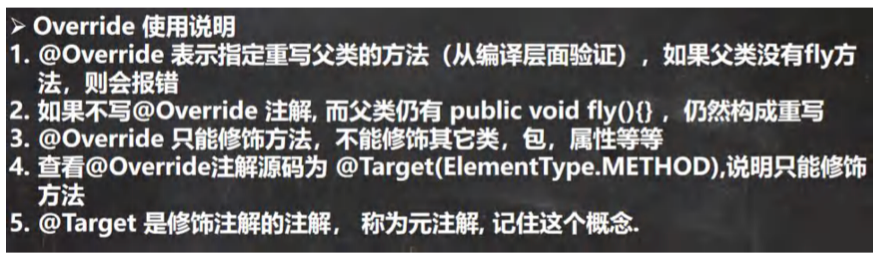

#### 11.14.2 @Deprecated 注解的案例 【Deprecated_.java】

@Deprecated: 用于表示某个程序元素(类, 方法等)已过时

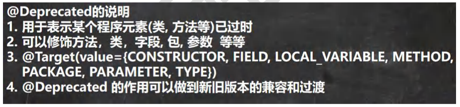

#### 11.14.3 @SuppressWarnings 注解的案例 【SuppressWarnings_.java】

@SuppressWarnings: 抑制编译器警告

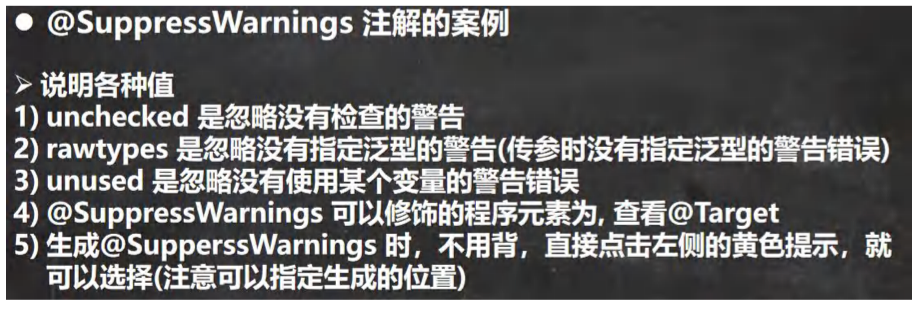

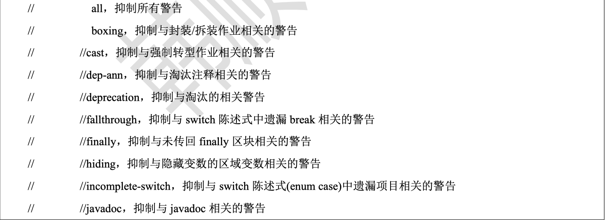

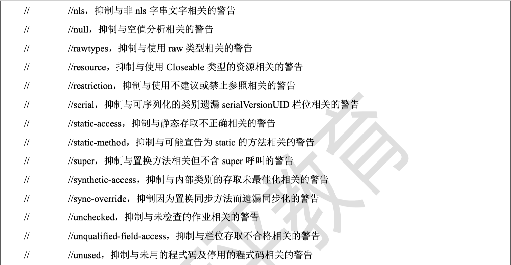

### 11.15 JDK 的元 Annotation(元注解，了解)

#### 11.15.1 元注解的基本介绍

JDK 的元 Annotation 用于修饰其他 Annotation

#### 11.15.2 元注解的种类

1）Retention //指定注解的作用范围，三种 SOURCE,CLASS,RUNTIME

2）Target // 指定注解可以在哪些地方使用

3）Documented //指定该注解是否会在 javadoc 体现

4）Inherited //子类会继承父类注解

#### 11.15.3 @Retention 注解

说明

只能用于修饰一个Annotation 定义, 用于指定该 Annotation 可以保留多长时间, @Rentention 包含一个 RetentionPolicy 类型的成员变量, 使用 @Rentention 时必须为该 value 成员变量指定值:

@Retention的三种值

1）RetentionPolicy.SOURCE: 编译器使用后，直接丢弃这种策略的注释

2）RetentionPolicy.CLASS: 编译器将把注解记录在 class 文件中. 当运行 Java 程序时, JVM 不会保留注解。 这是默认 值

3）RetentionPolicy.RUNTIME:编译器将把注解记录在 class 文件中. 当运行 Java 程序时, JVM 会保留注解. 程序可以

通过反射获取该注解

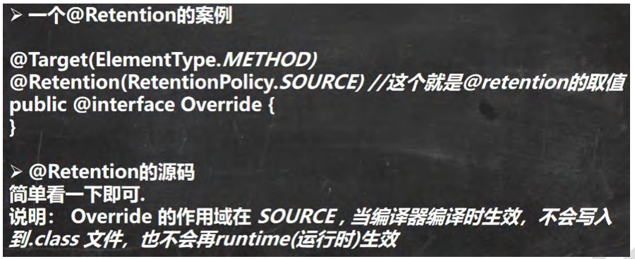

#### 11.15.4 @Target

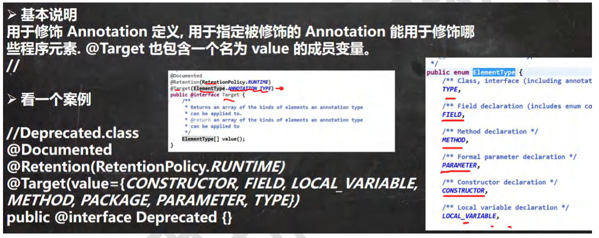

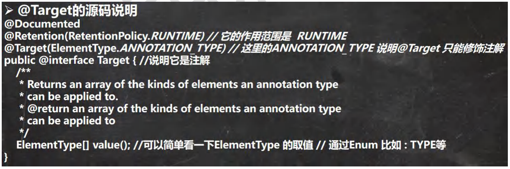

#### 11.15.5 @Documented

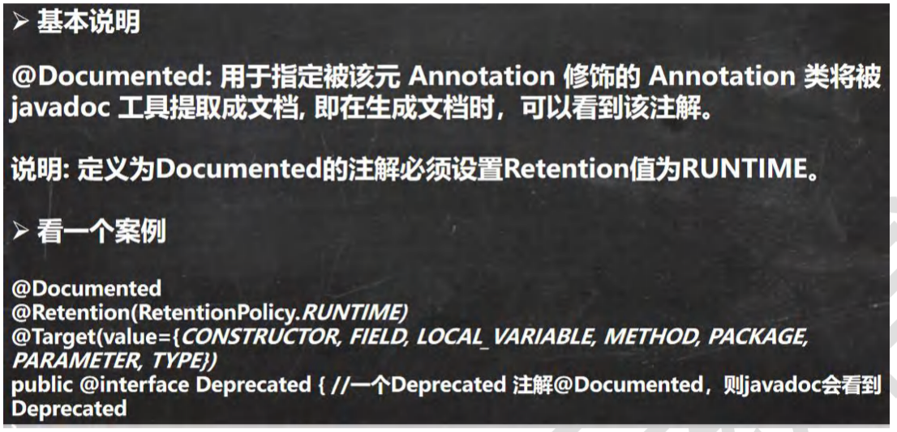

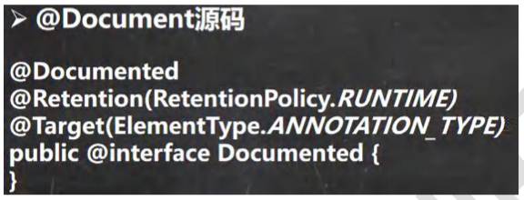

#### 11.15.6 @Inherited 注解

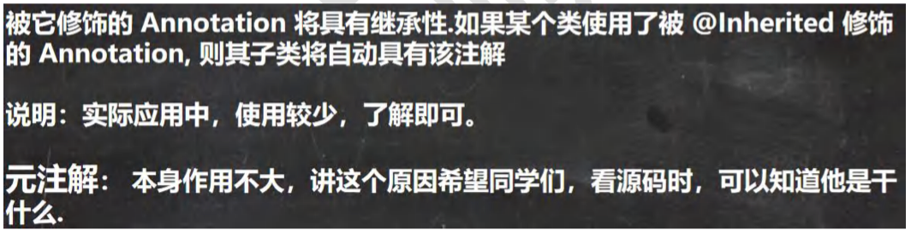

 