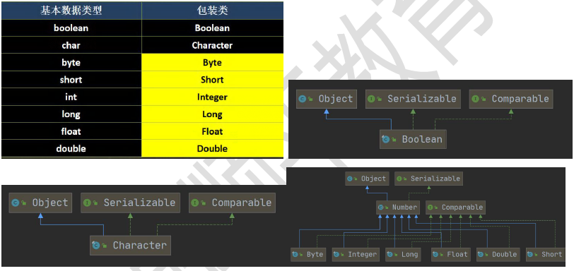
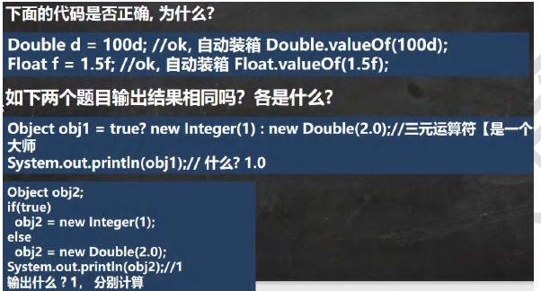

## 第 13 章 常用类

### 13.1 包装类

#### 13.1.1 包装类的分类

【WrapperType.java】

1）针对八种基本数据类型相应的引用类型—包装类

2）有了类的特点，就可以调用类中的方法。

3）如图：

#### 13.1.2 包装类和基本数据的转换

演示 包装类 和 基本数据类型的相互转换，这里以int 和 Integer演示。

1）jdk5 前的手动装箱和拆箱方式，装箱：基本类型->包装类型，反之，拆箱

2）jdk5 以后(含jdk5)的自动装箱和拆箱方式

3）自动装箱底层调用的是valueOf方法，比如Integer.valueOf()

4）其它包装类的用法类似

#### 13.1.3 案例演示

【Integer01.java】

#### 13.1.4 课堂测试题

【WrapperExercise01.java】

#### 13.1.5 包装类型和String类型的相互转换 

【WrapperVSString.java】

案例演示, 以Integer 和String 转换为例，其它类似:

#### 13.1.6 Integer类 和 Character 类的常用方法

【WrapperMethod.java】

#### 13.1.7 Integer 类面试题1

【WrapperExercise02.java】

#### 13.1.8 Intege 类面试题总结

【WrapperExercise03.java】

### 13.2 String类

#### 13.2.1 String 类的理解和创建对象

