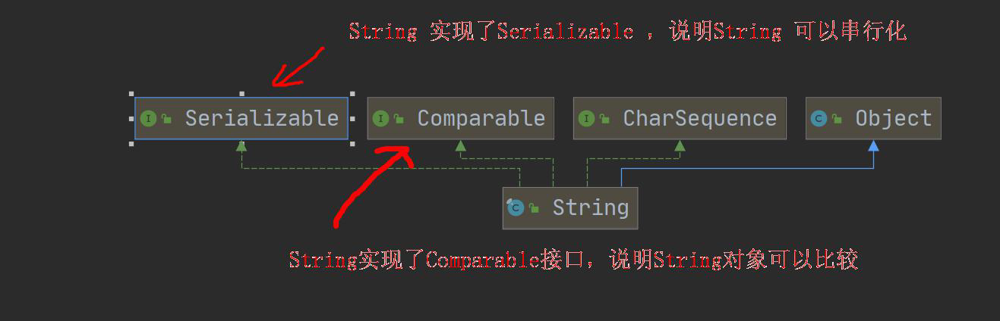
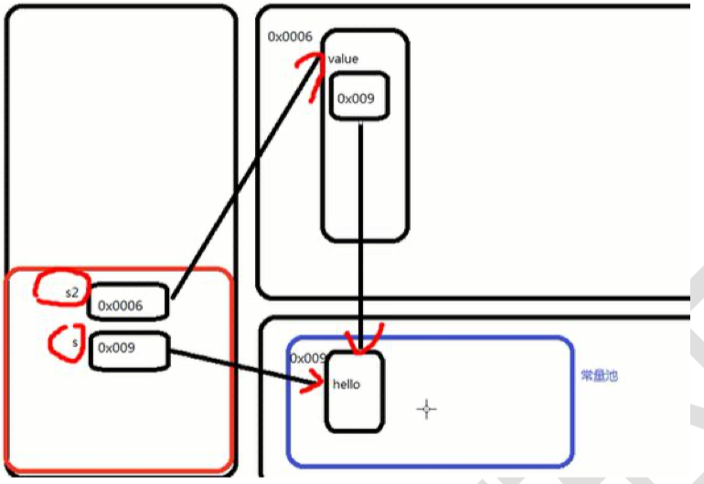
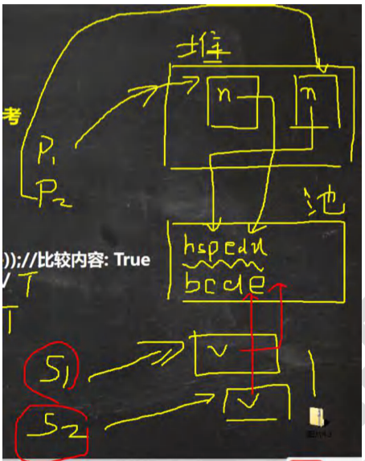
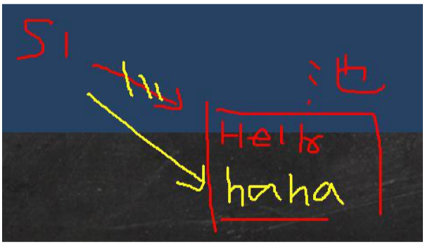
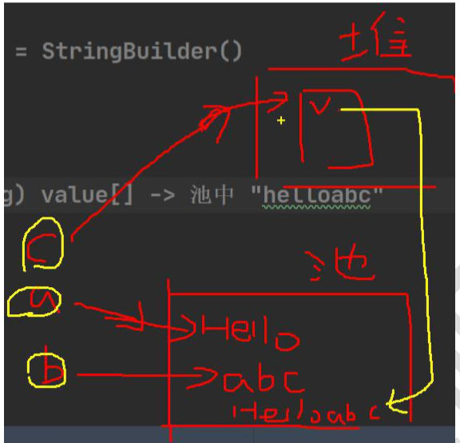
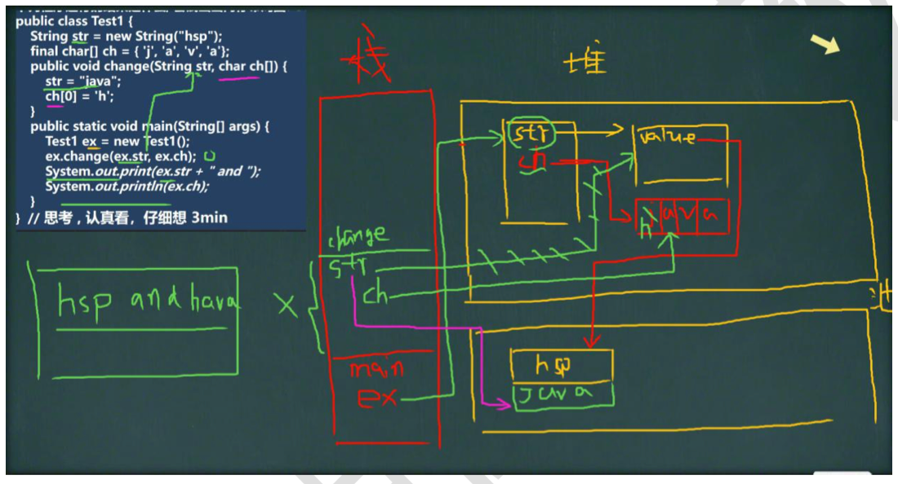
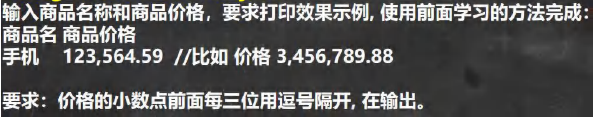
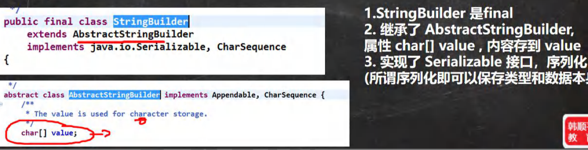
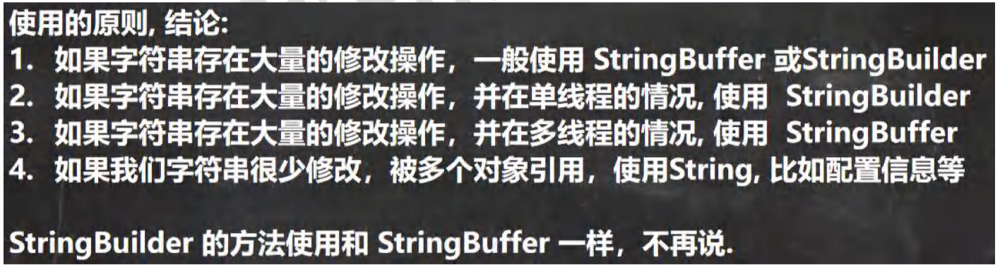
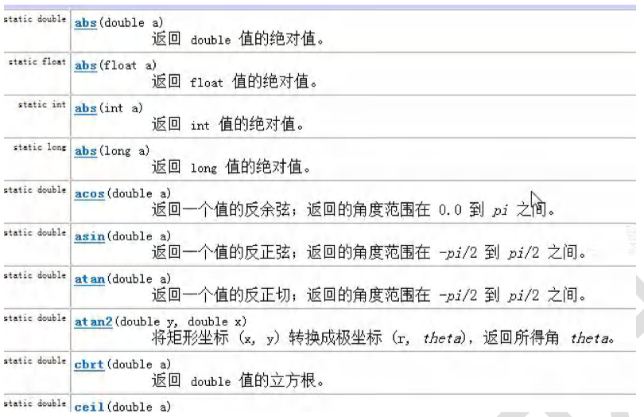

## 第 13 章 常用类

### 13.1 包装类

#### 13.1.1 包装类的分类

【WrapperType.java】

1）针对八种基本数据类型相应的引用类型—包装类

2）有了类的特点，就可以调用类中的方法。

3）如图：


#### 13.1.2 包装类和基本数据的转换

演示 包装类 和 基本数据类型的相互转换，这里以int 和 Integer演示。

1）jdk5 前的手动装箱和拆箱方式，装箱：基本类型->包装类型，反之，拆箱

2）jdk5 以后(含jdk5)的自动装箱和拆箱方式

3）自动装箱底层调用的是valueOf方法，比如Integer.valueOf()

4）其它包装类的用法类似

#### 13.1.3 案例演示

【Integer01.java】

#### 13.1.4 课堂测试题

【WrapperExercise01.java】


#### 13.1.5 包装类型和String类型的相互转换 

【WrapperVSString.java】

案例演示, 以Integer 和String 转换为例，其它类似:

#### 13.1.6 Integer类 和 Character 类的常用方法

【WrapperMethod.java】

#### 13.1.7 Integer 类面试题1

【WrapperExercise02.java】

#### 13.1.8 Intege 类面试题总结

【WrapperExercise03.java】

### 13.2 String类

#### 13.2.1 String 类的理解和创建对象

【String01.java】

1）String 对象用于保存字符串，也就是一组字符序列

2）字符串常量对象是用双引号括起来的字符编码。如：“你好”、“12.97”、“boy"等

3）字符串的字符使用Unicode字符编码，一个字符(不区分字母还是汉字)占两个字节。

4）String类较常用构造器:

- String s1 = new String();
- String s2 = new String(String original);
- String s3 = new String(char[] a);
- String s4 = new String(char[] a,int startIndex,int count);

说明：



#### 13.2.2 创建String对象的两种方式

1）方式一：直接赋值 String s = "hspedu";

2）方式二：调用构造器 String s = new String("hspedu");

#### 13.2.3 两种创建String对象的去呗

方式一：直接赋值 String s = "hspedu";

方式二：调用构造器 String s = new String("hspedu");

1. 方式一：先从常量池查看是否有"hsp"数据空间，如果有，直接指向；如果没有则重新创建，然后指向。s最终指向的是常量池的空间地址
2. 方式二：先在堆中创建空间，里面维护了value属性，指向常量池的hsp空间。如果常量池没"hsp",重新创建，如果有，直接通过value指向。最终指向的是堆中的空间地址。
3. 画出两种方式的内存分布图



#### 13.2.4 课堂测试题

1）测试题1

【StringExercise01.java】

```java
String a = "abc";
String b = "abc";
sout(a.equals(b));//T
sout(a == b);//T
```

2）测试题2

【StringExercise02.java】

```java
String a = "abc";
String b = new String("abc");
sout(a.equals(b));//T
sout(a == b);//F
```

3）测试题3

【StringExercise03.java】

```java
String a = "hsp";
String b = new String("hsp");
System.out.println(a.equals(b));
System.out.println(a == b);
System.out.println(a == b.intern());
System.out.println(b == a.intern());
```

知识点：

> 当调用intern方法时，如果池中已经包含一个等于此 String 对象的字符串（用equals(Object)方法确定），则返回池中的字符串。否则，将此String对象添加到池中，并返回此String对象的引用

解读：(1) b.intern() 方法最终返回的是常量池的地址(对象).

4）测试题4

【StringExercise04.java】

```java
String s1 = "hspedu";
String s2 = "java";
String s4 = "java";
String s3 = new String("java");
System.out.println(s2 == s3);//F
System.out.println(s2 == s4);//T
System.out.println(s2.equals(s3));//T
System.out.println(s1 == s2);//F
```

5）测试题5

【StringExercise05.java】

```java
Person p1 = new Person();
p1.name = "hspedu";
Person p2 = new Person();
p2.name = "hspedu";

System.out.println(p1.name.equals(p2.name));//比较内容
System.out.println(p1.name == p2.name);//T
System.out.println(p1.name == "hspedu");

String s1 = new String("bcde");
String s2 = new String("bced");
System.out.println(s1 == s2);//False
```



### 13.3 字符串的特性

#### 13.3.1 说明

【StringExercise06.java】

1）String是一个final类，代表不变的字符序列

2）字符串是不可变的。一个字符串对象一旦被分配，其内容是不可变的。

以下语句创建了几个对象？画出内存布局图。

```java
String s1 = "hello";
s1 = "haha";
//创建了2个对象
```



#### 13.3.2 面试题

1）题1

```java
String a = "hello" + "abc";
```

创建了几个对象？只有1个对象

//解读：String a = "hello" + "abc";// String a = "helloabc";

分析

1. 编译器不傻，做一个优化，判断创建的常量池对象，是否有引用指向
2. String a = "hello" + "abc"; => Stirng a = "helloabc";

2）题2

【StringExercise08.java】

```java
String a = "hello";//创建a对象
String b = "abc";//创建b对象
String c = a + b;
```

创建了几个对象？画出内存图

//关键就是要分析 String c = a + b;到底是如何执行的

//一共有3个对象



小结：底层是 StringBuilder sb = new StringBuilder()；sb.append(a)；sb.append(b)；sb是在堆中，并且append是在原来字符串的基础上追加的。

重要规则：String c1 = "ab" + "cd";常量相加，看的是池。String c1 = a + b;变量相加，是在堆中

3）题3

【StringExercise09.java】

下面代码输出什么，并说明原因.

```java
String s1 = "hspedu";//s1 指向池中的 "hspedu"
String s2 = "java";//s2 指向池中的 "java"
String s5 = "hspedujava";//s5 指向池中的 "hspedujava"
String s6 = (s1+s2).intern();//指向池中”hspedujava“的地址
System.out.println(s5 == s6);//T
System.out.println(s5.equals(s6));//T
```

4）题4

【StringExercise10.java】

下列程序运行的结果是什么，尝试画出内存布局图

```java
public class StringExercise10 {
    String str = new String("hsp");
    final char[] ch = {'j','a','v','a'};
    public void change(String str,char ch[]){
        str = "java";
        ch[0] ='h';
    }
    public static void main(String[] args) {
        StringExercise10 ex = new StringExercise10();
        ex.change(ex.str, ex.ch);
        System.out.println(ex.str + "and");
        System.out.println(ex.ch);
    }
}
```



### 13.4 String类的常见方法

#### 13.4.1 说明

String类是保存字符串常量的。每次更新都需要重新开辟空间，效率较低，因此java设计者还提供了StringBuilder和StringBuffer来增强String的功能，并提高效率。

```java
String s = new String("");
for(int i = 0;i < 80000;i++){
    s += "hello";
}
```

#### 13.4.2 String 类的常见方法一览

【StringMethod01.java】

- equals//区分大小写，判断内容是否相等
- equalsIgnoreCase//忽略大小写的判断内容是否相等
- length//获取字符的个数，字符串的长度
- indexOf//获取字符在字符串中第一次出现的索引，索引从0开始，如果找不到，返回-1
- lastIndexOf//获取字符在字符串中最后一次出现的索引，索引从0开始，如找不到，返回-1
- substring//截取指定范围的子串
- trim//去前后空格
- charAt:获取某索引处的字符，注意不能使用Str[index]这种方式

<hr/>

【StringMethod02】

- toUpperCase

- toLowerCase

- concat

- replace 替换字符串中的字符

- split 分割字符串，对于某些分隔符，我们需要 转义比如| \ \等

  案例：String poem = "锄禾日当午，汗滴禾下土，谁知盘中餐，粒粒皆辛苦";和 文件路径.

- compareTo //比较两个字符串的大小

- toCharArray //转换成字符数组

- format //格式化字符串，%s字符串 %c 字符 %d 整型 %.2f 浮点型

  案例，将个人的信息格式化输出.

### 13.5 StringBuffer类

#### 13.5.1 基本介绍

【StringBuffer01.java】

- java.lang.StringBuffer代表可变的字符序列，可以对字符串内容进行增删。
- 很多方法与String相同，但StringBuffer是可变长度的。
- StringBuffer是一个容器。


#### 13.5.2 String VS StringBuffer

1）String保存的是字符串常量，里面的值不能更改，每次String类的更新实际上就是更改地址，效率较低

//private final char value[];

2）StringBuffer保存的是字符串变量，里面的值可以更改，每次StringBuffer的更新实际上可以更新内容，不用每次更新地址，效率较高

//char[] value;//这个放在堆.

#### 13.5.3 String 和 StringBuffer 相互转换

在开发，我们经常需要将String 和 StringBuffer进行转换【StringAndStringBuffer.java】

```java
//String ——>StringBuffer
String str = "hello tom";
//方式1 使用构造器
//注意：返回的才是StringBuffer对象，对str 本身没有影响
StringBuffer stringBuffer = new StringBuffer(str);
//方式2 使用的是append方法
StringBuffer stringBuffer1 = new StringBuffer();
stringBuffer1 = stringBuffer1.append(str);

//StringBuffer -> String
StringBuffer stringBuffer3 = new StringBuffer("韩顺平教育");
//方式1 使用StringBuffer提供的 toString方法
String s = stringBuffer3.toString();

//方式2 使用构造器来搞定
String s1 = new String(stringBuffer3);
```

#### 13.5.4 StringBuffer类常见方法

【StringBufferMethod.java】

1）增加 append

2）删 delete(start,end)

3）改 replace(start,end,string)//将strat---end 间的内容替换掉，不含end

4）查 indexOf//查找子串在字符串第一次出现的索引，如果找不到返回-1

5）插insert

6）获取长度 length

#### 13.5.5 StringBuffer 类课堂测试题 1

【StringBufferExercise01.java】

#### 13.5.6 StringBuffer 类课后练习 2

【StringBufferExercise02.java】



### 13.6 StringBuilder类

#### 13.6.1 基本介绍

【StringBuilder01.java】

1）一个可变的字符序列。此类提供一个与 StringBuffer 兼容的 API，但不保证同步(StringBuffer 不是线程安全)。该类被设计用作 StringBuffer 的一个简易替换，用在字符串缓冲区被单个线程使用的时候。如果可能，建议优先采用该类，因为在大多数实现中，它比 StringBuffer 要快。

2）在 StringBuilder 上的主要操作是 append 和 insert 方法，可重载这些方法，以接受任意类型的数据。

#### 13.6.2 StringBuilder 常用方法

StringBuilder 和 StringBuffer 均代表可变的字符序列，方法是一样的，所以使用和StringBuffer一样



#### 13.6.3 String、StringBuffer 和 StringBuilder 的比较

1）StringBuilder 和 StringBuffer 非常类似，均代表可变的字符序列，而且方法也一样

2）String：不可变字符序列，效率低，但是复用率高。

3）StringBuffer：可变字符序列，效率较高(增删)、线程安全

4）StringBuilder：可变字符序列、效率最高、线程不安全

5）String使用说明：

> String s = "a";//创建了一个字符串
>
> s += "b";//实际上原来的"a"字符串对象已经丢弃了，又产生了一个字符串s+"b"(也就是"ab")。如果多次执行这些改变串内容的操作，会导致大量副本字符串对象存留在内存中，降低效率。如果这样的操作放在循环中，会极大影响程序的性能 ==> 结论：如果我们对String 做大量修改，不要使用String

#### 13.6.4 String、StringBuffer 和 StringBuilder 的效率测试

【StringVsStringBufferVsStringBuilder.java】 

效率 ： StringBuilder > StringBuffer > String

#### 13.6.5 String、StringBuffer 和 StringBuilder 的选择



### 13.7 Math 类

#### 13.7.1 基本介绍

Math类包含用于执行基本数学运算的方法，如初等指数、对数、平方根和三角函数。

#### 13.7.2 方法一览(均为静态方法)



#### 13.7.3 Math类常见方法应用案例

【MathMethod.java】

1）abs绝对值

2）pow 求幂

3）ceil 向上取整

4）floor 向下取整

5）round 四舍五入

6）sqrt 求开方

7）random 求随机数

8）max 求两个数的最大值

9）min 求两个数的最小值

获取a-b之间的随机整数公式：

> int num = (int)(Math.random()*(b-a+1)+a)

### 13.8 Arrays类

#### 13.8.1 Arrays 类常见方法应用案例

【ArraysMethod01.java】

Arrays里面包含了一系列静态方法，用于管理或操作数组(比如排序和搜索)。

1）toString 返回数组的字符串形式

Arrays.toString(arr)

2）sort 排序 (自然排序和定制排序)	Integer arr[] = {1,-1,7,0,89};

【ArraysSortCustom.java】

【ArraysMethod02.java】

3）binarySearch 通过二分搜索法进行查找，要求必须排好序

int index = Arrays.binarySearch(arr,3);

【ArraysMethod02.java】

4）copyOf 数组元素的复制

Integer[] newArr = Arrays.copyOf(arr,arr.length);

5）fill 数组元素的填充

Integer[] num = new Integer[]{9,3,2};

Arrays.fill(num,99);

6）equals 比较两个数组元素内容是否完全一致

boolean equals = Arrays.equals(arr,arr2);

7）asList 将一组值，转换成list

List<Integer>  asList = Arrays.asList(2,3,4,5,6,1);

System.out.println("asList=" + asList);

#### 13.8.2 Arrays 类课堂练习

【ArrayExercise.java】

案例：自定义Book类，里面包含name和price，按price排序(从大到小)。要求使用两种方式排序，有一个 Book[] books = 4 本书对象.

使用前面的传递 实现Comparator接口匿名内部类，也称为定制排序，可以按照price (1) 从大道小 (2) 从小到大 (3) 按照书名长度从大到小

```java
Book[] books = new Book[4];
books[0] = new Book("红楼梦",100);
books[1] = new Book("金瓶梅新",90);
books[2] = new Book("青年文摘20年",5);
books[3] = new Book("java从入门到放弃~",300);
```

### 13.9 System类

#### 13.9.1 System 类常见方法和案例

【System_.java】

1）exit 退出当前程序

2）arraycopy：复制数组元素，比较适合底层调用，一般使用Arrays.copyOf完成复制数组

int[] src={1,2,3};

int[] dest = new int[3];

System.arraycopy(src,0,dest,0,3);

3）currentTimeMillens:返回当前时间距离1970-1-1 的毫秒数

4）gc:运行垃圾回收机制 System.gc();

### 13.10 BigInteger 和 BigDecimal类

#### 13.10.1 BigInteger 和BigDecimal 介绍

应用场景：

1）BigInteger适合保存比较大的整数

2）BigDecimal适合保存精度更高的浮点型(小数)

#### 13.10.2 BigInteger 和BigDecimal 常见方法

【BigInteger_.java BigDecimal _.java】

1）add 加

2）subtract 减

3）multiply 乘

4）divide 除

#### 13.11 日期类

#### 13.11.1 第一代日期类

1）Date：精确到毫秒，代表特定的瞬间

2）SimpleDateFormat：格式和解析日期的类SimpleDateFormat 格式化和解析日期的具体类。它允许进行格式化(日期 -> 文本)、解析 (文本 -> 日期) 和规范化.

3）应用实例 【Date_.java】

#### 13.11.2 第二代日期类

1）第二代日期类，主要是Calendar(日历)。

```java
public abstract class Calendar extends Object implements Serializable,Cloneable,Comparable<Calendar>
```

2）Calendar 类是一个抽象类，它为特定瞬间与一组诸如 YEAR、MONTH、DAY_OF_MONTH、HOUR等日期字段之间的转换提供了一些方法，并为操作日历字段(例如获得下星期的日期)提供了一些方法。

#### 13.11.3 第三代日期类

- 前面两代日期类的不足分析

  JDK 1.0 中包含了一个java.util.Date类，但是它的大多数方法已经在JDK 1.1引入Calendar类之后被弃用了。而Calendar也存在问题是：

  1）可变性：像日期和时间这样的类应该是不可变的。

  2）偏移性：Date中的年份是从1900开始的，而月份都从0开始。

  3）格式化：格式化只对Data有用，Calendar则不行。

  4）此外，它们也不是线程安全的；不能处理闰秒等(没隔2天，多出1s)。

1）LocalDate(日期/年月日)、LocalTime(时间/时分秒)、LocalDateTime(日期时间/年月日时分秒) 	JDK8加入的

> LocalDate 只包含日期，可以获取日期字段
>
> LocalTime 只包含时间，可以获取时间字段
>
> LocalDateTime 包含日期+时间，可以获取日期和时间字段

案例：【LocalDate_.java】

#### 13.11.4 DateTimeFormatter 格式日期类

类似于SimpleDateFormat

DateTimeFormat dtf = DateTimeFormatter.ofPattern(格式);

String str  = dtf.format(日期对象);

#### 13.11.5 Instant 时间戳

类似于Date

> 提供了一系列和Date类转换的方式
>
> Instant ——> Date:
>
> Date date = Date.from(instant);
>
> Date ——> Instant;
>
> Instant instant = date.toInstant();

#### 13.11.6 第三代日期类更多方法

- LocalDateTime类
- MonthDay类：检查重复事件
- 是否是闰年
- 增加日期的某个部分
- 使用plus方法测试增加时间的某个部分
- 使用minus方法测试查看一年前和一年后的日期

### 13.12 本章作业

