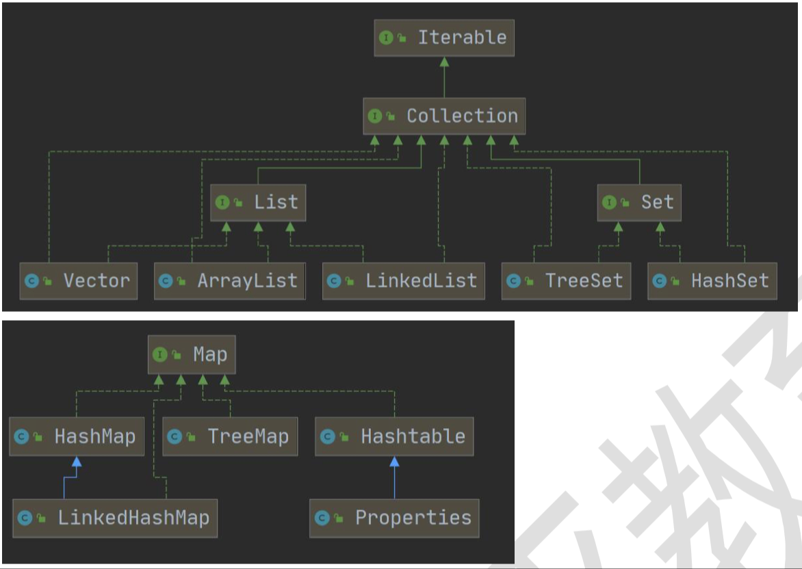
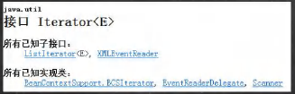
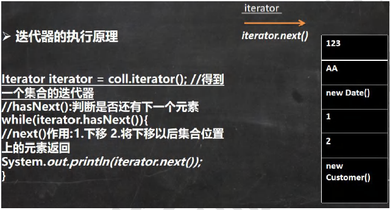
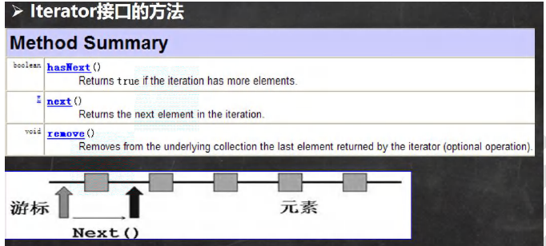
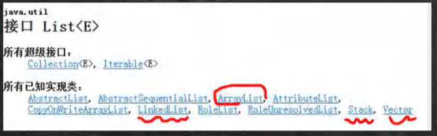
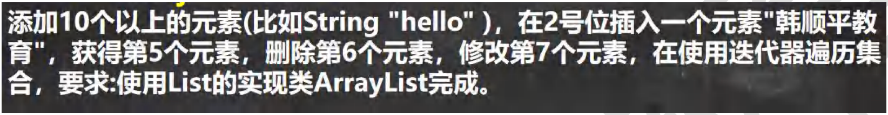
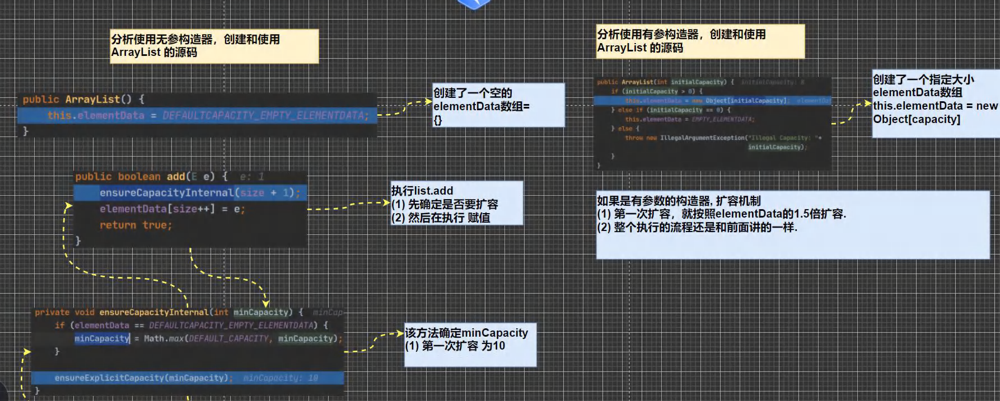
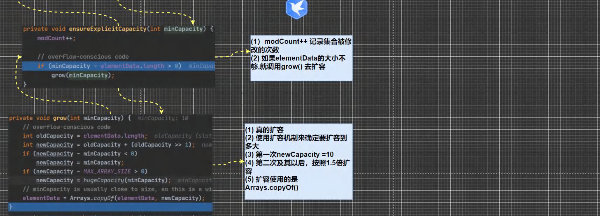

## 第 14 章 集合

### 14.1 集合的理解和好处

前面我们保存多个数据使用的是数组，那么数组有不足的地方，我们分析一下

#### 14.1.1 数组

1）长度开始时必须指定，而且一旦指定，不能修改

2）保存的必须为同一类的元素

3）使用数组进行增加/删除元素的示意代码 - 比较麻烦

> 写出Person数组扩容示意代码。

```java
Person[] pers = new Person[1];//大小是1
per[0] = new Person();
```

> 增加新的Person对象

```java
Person[] pers2 = new Person[pers.length+1];//新创建数组
for(){}//拷贝pers数组的元素到pers2
pers2[pers2.length-1] = new Person();//添加新的对象
```

#### 14.1.2 集合

1）可以动态保存任意多个对象，使用比较方便！

2）提供了一些列方便的操作对象的方法：add、remove、set、get等

3）使用集合添加，删除新元素的示意代码- 简洁了

### 14.2 集合的框架体系

Java的集合类很多，主要分为两大类，如图：

【Collection_.java】



### 14.3 Collection 接口和常用方法

#### 14.3.1 Collection 接口实现类的特点

```java
public interface Collection<E> extends Iterable <E>
```

1）collection实现子类可以存放多个元素，每个元素可以是Object

2）有些Collection的实现类，可以存放重复的元素，有些不可以

3）有些Collection的实现类，有些是有序的(List)，有些不是有序(Set)

4）Collection接口没有直接的实现子类，是通过它的子接口Set 和List 来实现的

Collection 接口常用方法,以实现子类ArrayList 来演示.【 CollectionMethod.java】

1）add：添加单个元素

2）remove：删除指定元素

3）contains：查找元素是否存在

4）size：获取元素个数

5）isEmpty：判断是否为空

6）clear：清空

7）addAll：添加多个元素

8）containsAll：查找多个元素是否都存在

9）removeAll：删除多个元素

10）说明：以ArrayList实现类来演示

#### 14.3.2 Collection 接口遍历元素方式 1- 使用 Iterator(迭代器)

- 基本介绍

  

1）Interator对象称为迭代器，主要用于遍历Collection 集合中的元素。

2）所有实现了Collection接口的集合类都有一个iterator()方法，用以返回一个实现了Iterator接口的对象，即可以返回一个迭代器。

3）Iterator 的结构

4）Iterator 仅用于遍历集合，Iterator本身并不存放对象。





> 提示：在调用Iterator.next()方法之前必须要调用Iterator.hasNext()进行检测。若不调用，且下一条记录无效，直接调用it.next()会抛出NoSuchElementException异常。

迭代器的使用案例【CollectionIterator.java】

#### 14.3.3 Collection 接口遍历对象方式2-for循环增强

增强for循环，可以代替iterator迭代器，特点：增强for就是简化版的Iierator，本质一样。只能用于遍历集合或数组。

- 基本语法

  ```java
  for(元素类型 元素名：集合名或数组名){
      访问元素
  }
  ```

- 案例演示

  【CollectionFor.java】

#### 14.3.4 课堂练习

请编写程序【CollectionExercise.java】

1. 创建 3 个 Dog {name,age}对象，放入到ArrayList 中，赋给 List 引用
2. 用迭代器和增强for循环两种方式来遍历
3. 重写Dog 的toString方法，输出name和age

### 14.4 List接口和常用方法

#### 14.4.1 List接口基本介绍

List 接口是 Collection 接口的字接口 List_.java

1）List 集合类中元素有序(即添加顺序和取出顺序一致)、且可重复

2）List集合中的每个元素都有其对应的顺序索引，即支持索引。

3）List容器中的元素都对应一个整数型的序号记载其在容器中的位置，可以根据序号存取容器中的元素。

4）JDK API中List接口的实现类有：



常用的有：ArrayList、LinkedList和Vector。

#### 14.4.2 List接口的常用方法

【ListMethod.java】

#### 14.4.3 List 接口课堂练习

【ListExercise.java】



#### 14.4.4 List的三种遍历方式[ArrayList, LinkedList,Vector]

【ListFor.java】

> 1）方式一：使用iterator

```java
Iterator iter = col.iterator();
	while(iter.hsaNext()){
    Object o = iter.next();
  }
```

> 2）方式二：使用增强for

```java
for(Object o:col){
  
}
```

> 3）方式三：使用普通for

```java
for(int i = 0;i < list;i++){
  Object object = list.get(i);
  System.out.println(object);
}
```

说明：使用LinkedList完成 使用方式和ArrayList一样

#### 14.4.5 实现类的课堂练习2

【ListExercise02.java】

使用List的实现类添加三本图书，并遍历，打印如下效果

名称：xx		价格：xx		作者：xx

名称：xx		价格：xx		作者：xx

名称：xx		价格：xx		作者：xx

要求

1）按价格排序，从低到高(使用冒泡法)

2）要求使用ArrayList、LinkedList 和 Vector 三种集合实现

### 14.5 ArrayList 底层结构和源码分析

#### 14.5.1 Array 的注意事项

【ArrayListDetail.java】

1）permits all elements,including null,ArrayList 可以加入null，并且多个

2）ArrayList 是由数组来实现数据存储的

3）ArrayList 基本等同于Vector，除了ArrayList是线程不安全(执行效率高)看源码，在多线程情况下，不建议使用ArrayList

#### 14.5.2 ArrayList 的底层操作机制源码分析

【ArrayListSource.java】

1）ArrayList中维护了一个Object类型的数组elementData.

​	transient Object[] elementData;//==transient 表示瞬间，短暂的，表示该属性不会被序列化==

2）当创建ArrayList对象时，如果使用的是无参构造器，则初始elementData容量为0，第1次添加，则扩容elementData为10，如需要再次扩容，则扩容elementData为1.5倍。

> 0 -> 10 -> 15 -> 22 -> 33...

3）如果使用的是指定大小的构造器，则初始elementData容量为指定大小，如果需要扩容，则直接扩容elementData为1.5倍。

> 假设初始 8 -> 12 -> 18 ->27......

示意图：





### 14.6 Vector 底层结构和源码剖析

#### 14.6.1 Vector的基本介绍

【Vector_.java】

1）Vector类的定义说明

```java
public class Vector<E>
    extends AbstractList<E>
    implements List<E>,RandomAccess,Cloneable,Serializable
```

2）Vector底层也是一个对象数组，protected Object[] elementData;

3）Vector 是线程同步的，即线程安全，Vector类的操作方法带有synchronized

```java
public synchronized E get(int index){
    if(index >= elementCount)
        throw new ArratIndexOutOfBoundsException(index);
    return elementData(index);
}
```

4）在开发中，需要线程同步安全时，考虑使用Vector
