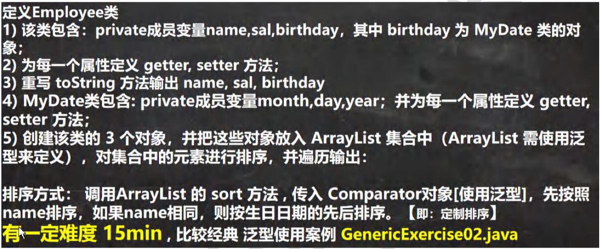
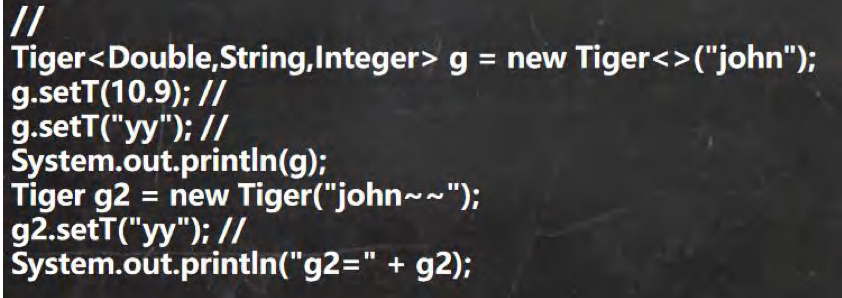
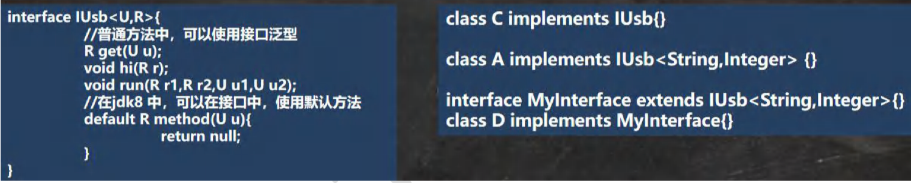
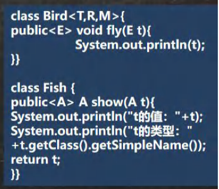
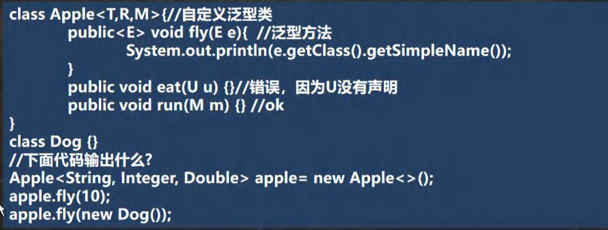
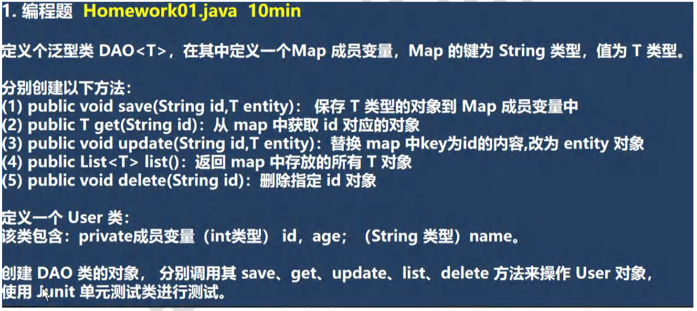

## 第 15 章 泛型

### 15.1 泛型饿理解和好处

#### 15.1.1 看看一个需求

1）请编写程序，在ArrayList 中，添加3个Dog对象

2）Dog对象含有name 和 age，并输出name 和 age (要求使用getXxx())

先使用传统的方法来解决 -> 引出泛型

#### 15.1.2 使用传统方法的问题分析

1）不能对加入到集合 ArrayList中的数据类型进行约束(不安全)

2）遍历的时候，需要进行类型转换，如果集合中的数据量较大，对效率有影响

#### 15.1.3 泛型快速体验-用泛型来解决前面的问题

【Generic02.java】

ArrayList<Dog> arrayList = new ArratList<Dog>

### 15.2 泛型的理解和好处

#### 15.2.1 泛型的好处

1）编译时，检查添加元素的类型，提高了安全性

2）减少了类型转换的次数，提高效率

- 不使用泛型

  Dog -加入-> Object -取出-> Dog //放入到ArrayList 会先转成 Object，再取出时，还需要转换成Dog

- 使用泛型

  Dog -> DOg -> Dog //放入时，和取出时，不需要类型转换，提高效率

3）不再提示编译警告

### 15.3 泛型介绍

int a = 10;

理解：泛(广泛)型(类型) => Integer，String，Dog

1）泛型又称参数化类型，是JDK5.0 出现的新特性，解决数据类型的安全性问题

2）在类声明或实例化时只要指定好需要的具体类型即可。

3）Java泛型可以保证如果程序在编译时没有发出警告，运行时就不会产生ClassCastException异常。同时，代码更加简洁、健壮

4）泛型的作用是：可以在类声明时通过一个标识表示类中某个属性的类型，或者是某个方法的返回值的类型，或者是某个方法的返回值的类型，或者是参数类型。【Generic03.java】

### 15.4 泛型的语法

#### 15.4.1 泛型的声明

```java
interface 接口 <T>{} 和 class 类 <K,V>{}
```

//比如：List，ArrayList

说明：

1）其中，T,K,V不代表值，而是表示类型。

2）任意字母都可以。常用T表示，是Type的缩写

#### 15.4.2 泛型的实例化

要在类名后面指定类型参数的值(类型)。如：

1）List<String> strList = new ArrayList<String>();

2）Interator<Cunstomer> iterator = customers.interator();

#### 15.4.3 泛型使用举例

举例说明，泛型在 HashSet，HashMap 的使用情况【GenericExercise.java】

- 练习
  1. 创建 3个学生对象
  2. 放入到HashSet中学生对象，使用
  3. 放入到 HashMap中，要求Key 是 String name，Value就是 学生对象
  4. 使用两种方式遍历

#### 15.4.4 泛型使用的注意事项和细节

【GenericDetail.java】

1. interface List<T>{}，public class HashSet<E>{}..等等

   说明：T，E只能是引用类型

   看看下面语句是否正确？

   LIst<Integer> list = new ArrayList<Integer>();//ok

   LIst<int> list2 = new ArrayList<int>();//错误

2. 在给泛型指定具体类型后，可以传入改类型或者其子类类型

3. 泛型使用形式

   List<Integer> list1 = new ArrayList<Integer>();

   List<Integer> list2 = new ArrayList<>()

4. 如果我们这样写 List list3 = new ArrayList()；默认给它的 泛型是[<E> E就是Object]

### 15.5 泛型课堂练习

【GenericExercise02.java】



### 15.6 自定义泛型

#### 15.6.1 自定义泛型类

- 基本语法

  ```java
  class 类名<T,R...>{//...表示可以有多个泛型
    成员
  }
  ```

- 注意细节

  1）普通成员可以使用泛型(属性、方法)

  2）使用泛型的数组，不能初始化

  3）静态方法中不能使用类的泛型

  4）泛型类的类型，是在创建对象时确定的(因为创建对象时，需要指定确定类型)

  5）如果在创建对象时，没有指定类型，默认为Object

- 应用案例【CustomeGeneric_.java】

  ```java
  class Tiger<T,R,M>{
    String name;
    R r;
    M m;
    T t;
  }
  ```

- 说明自定义泛型代码是否正确，并说明原因

  【CUstomGenericExercise.java】

  

#### 15.6.2 自定义泛型接口

- 基本语法

  ```java
  interface 接口名<T,R...>{
    
  }
  ```

- 注意细节

  1）接口中，静态成员也不能使用泛型(这个和泛型类规定一样)

  2）泛型接口的类型，在继承接口或者实现接口时确定

  3）没有指定类型，默认为Object

- 应用实例【CustomInterfaceGeneric.ajva】

  

#### 15.6.3 自定义泛型方法

- 基本语法

  ```java
  修饰符 <T,R...> 返回类型 方法名(参数列表){
    
  }
  ```

- 注意细节

  1. 泛型方法，可以定义在普通类中，也可以定义在泛型类中
  2. 当泛型方法被调用时，类型会确定
  3. public void eat(E e){}，修饰符后没有<T,R..> eat 方法不是泛型方法，而是使用了泛型

  应用案例【CustomMethodGeneric.java】


#### 15.6.4 自定义泛型方法

- 课堂练习[下面代码是否正确，如果有错误，修改正确，并说明输出什么？]

【CustomMethodGenericExercise.java】



### 15.7 泛型的继承和通配符

#### 15.7.1 泛型的继承和通配符说明

【GenericExtends.java】

1）泛型不具备继承性

List<Object> list = new ArrarList<String>();//不对

2）<?>：支持任意泛型类型

3）<? extends A>：支持A类以及A类的子类，规定了泛型的上限

4）<? super A>：支持A类以及A类的父类，不限于直接父类，规定了泛型的下限

#### 15.7.2 应用案例

【GenericExtends.java】

### 15.8 本章作业



### 15.9 JUnit

#### 15.9.1 为什么需要JUnit

1. 一个类有很多功能代码需要测试，为了测试，就需要写入到main方法中
2. 如果有多个功能代码测试，就需要来回注销，切换很麻烦
3. 如果可以直接运行一个方法，就方便很多，并且可以给出相关信息，就好了 -> JUnit


#### 15.9.2 基本介绍

1. JUnit是一个Java语言的单元测试框架
2. 多数Java的开发环境都已经集成了JUnit作为单元测试的工具

#### 15.9.3 使用步骤，代码演示

【JUnit_.java】
