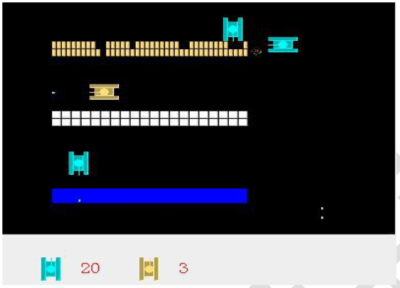
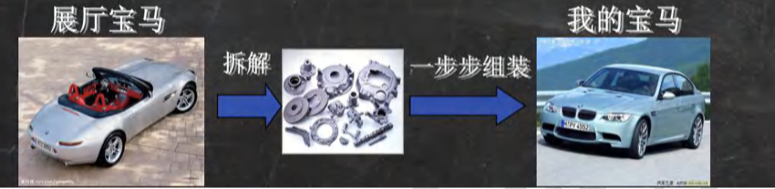
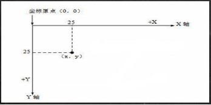
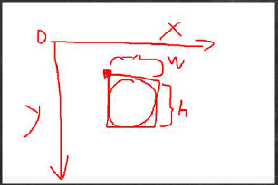
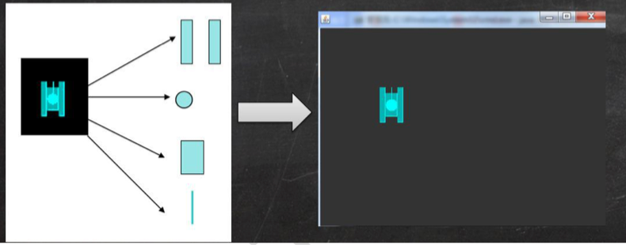
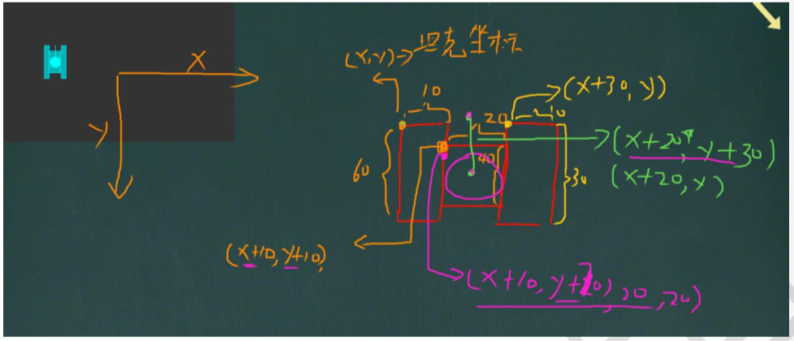
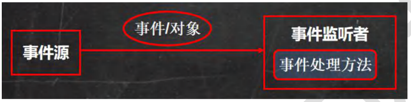

## 第 16 章 坦克大战[1]

### 16.1 坦克大战游戏演示

#### 16.1.1 游戏演示

#### 16.1.2 文档坦克游戏说明文档.doc

#### 16.1.3 为什么写这个项目

- 好玩
- 涉及到java各个方面的技术
  1. java面向对象编程
  2. 多线程
  3. 文件i/o操作
  4. 数据库
- 巩固旧知识，学习新知识

#### 16.1.4 写项目前的提醒

1. 编写坦克大战游戏，需要有一定的java基础，是完全可以听懂的
2. 记住一点：成为编程高手的秘诀就是：思考------编程------思考------编程

#### 16.1.5 如何讲解这个项目，授课的原则：

1. 努力做到通俗易懂
2. 宁可啰嗦一点，也不遗漏细节。
3. 项目是从小到大的过程，每个完整的项目被分解成不同的版本，从1.0到1.1 ...最后版，随版本的增加，将新的功能和新的知识点融入到项目中，整个过程是循序渐进的。让大家轻松的学习，高效的掌握java技术

### 16.2 java绘图坐标体现

#### 16.2.1 坐标体现-介绍

下图说明了Java坐标系。坐标原点位于左上角，以像素为单位。在Java坐标系中，第一个是x坐标，表示当前位置为水平方向，距离坐标原点x个像素；第二个是y坐标，表示当前位置为垂直方向，距离坐标原点y个像素。

#### 16.2.2 坐标体系-像素

1. 绘图还必须要搞清一个非常重要的概念-像素

   错误问法：一个像素等于多少厘米？

2. 计算机在屏幕上显示的内容都是由屏幕上的每 一个像素组成。例如，计算机显示器的分辨率是800x600，表示计算机屏幕上的每一行由800个点组成，共有600行，整个计算机屏幕共有480 000个像素。像素是一个密度单位，而厘米是长度单位，两者无法比较

#### 16.2.3 介绍-快速入门

在面板上画一个小圆[DrawCircle.java]

&nbsp;&nbsp;&nbsp;&nbsp;&nbsp;&nbsp;&nbsp;&nbsp;&nbsp;&nbsp;&nbsp;&nbsp;&nbsp;&nbsp;&nbsp;&nbsp;&nbsp;&nbsp;&nbsp;&nbsp;&nbsp;&nbsp;

#### 16.2.4 绘图原理

- Component提供了两个和绘图相关最重要的方法：
  1. paint(Graphics g)绘制组件的外观
  2. repaint()刷新组件的外观。
- 当组件第一次在屏幕显示的时候，程序会自动的调用paint()方法来绘制组件。
- 在以下情况paint()将会被调用：
  1. 窗口最小化，再最大化
  2. 窗口的大小发生变化
  3. repaint方法被调用

#### 16.2.5 Graphics 类

Graphics类可以理解就是画笔，为我们提供了各种绘制图形的方法

1. 画直线 drawLine(int x1,int y1,int x2,int y2)
2. 画矩形边框 drawRect(int x,int y,int width,int height)
3. 画椭圆边框 drawOval(int x,int y,int width,int height)
4. 填充矩形fillRect(int x,int y,int width,int height)
5. 填充椭圆 fillOval(int x,int y,int width,int height)
6. 画图片 drawImages(Image img,int x,int y,..)
7. 画字符串 drawString(String str,int x,int y)
8. 设置画笔的字体 setFont(Font font)
9. 设置画笔的颜色 setColor(Color c)

[GraphicsMethod.java]

#### 16.2.6 绘出坦克

坦克大战游戏中，我们会用到坦克，现在利用java绘图画出一个小坦克，完成我们的坦克大战游戏1.0版本.。[HspTankGame01.java]

### 16.2.7 绘图练习

运用java绘图技术充分发挥想象，画出如下图形

1. 蛤蟆
2. 王八
3. 小老鼠

### 16.3 java 事件处理机制

#### 16.3.1 事件处理机制-看个问题

怎样让小球受键盘的控制，上下左右移动。【BallMove.java】

#### 16.3.2 基本说明

java事件处理是采取“委派事件模型”。当事件发生时，产生事件的对象，会把此“信息”传递给“事件的监听者”处理，这里所说的“信息”实际上就是 java.awt.event 事件类库里面某个类所创建的对象，把它称为“事件的对象”。

#### 16.3.3 示意图

#### 16.3.4 机制分析

#### 16.3.5 事件处理机制深入理解

1. 事件源：事件源是一个产生事件的对象，比如按钮，窗口等。

2. 事件：事件就是承载事件源状态改变时的对象，比如当键盘事件、鼠标事件、窗口事件等等，会生成一个事件对象，该对象保存着当前事件很多信息，比如KeyEvent 对象有含有被按下键的Code值。java.awt.event包 和javax.swing.event包中定义了各种事件类型

3. 事件类型：查阅jdk文档

   

4. 事件监听器接口：

   (1)当事件源产生一个事件，可以传给事件监听者处理

   (2)事件监听者实际上就是一个类，该类实现了某个事件监听器接口

   (3)事件监听器接口有多种，不同的事件监听器接口可以监听不同的事件，一个类可以实现多个监听接口

   (4)这些接口在java.awt.event包和javax.swing.event包中定义。

### 16.4 坦克大战游戏

#### 16.4.1 让坦克动起来

通过按键控制上右下左(wdsa表示)的移动。[HspTankGame02.java]

### 16.5 本章作业

#### 16.5.1 本章作业

在HspTankGame02.java基础上画出三辆敌人的坦克，注意颜色。

分析：

1. 因为敌人的坦克，是在MyPanel 上，所以我们的代码在MyPanel
2. 因为敌人的坦克，后面有自己特殊的属性和方法，可以单开一个EnemyTank
3. 敌人坦克数量多，可以放入集合 Vector，因为考虑多线程问题

#### 16.5.2 本章内容小结

- java坐标体系
- java绘图技术
- java事件处理机制
- HspTankGame01.java 包含的功能：
  1. 绘制出了我方的坦克
- HspTankGame02.java 包含的功能:
  1. 绘制出了我方的坦克
  2. 通过按键可以控制我方坦克上下左右移动
