## 第 17 章 多线程基础

### 17.1 线程相关概念

#### 17.1.1 程序(program)

是为完成特定任务、用某种语言编写的一组指令的集合。

简单的说：就是我们写的代码

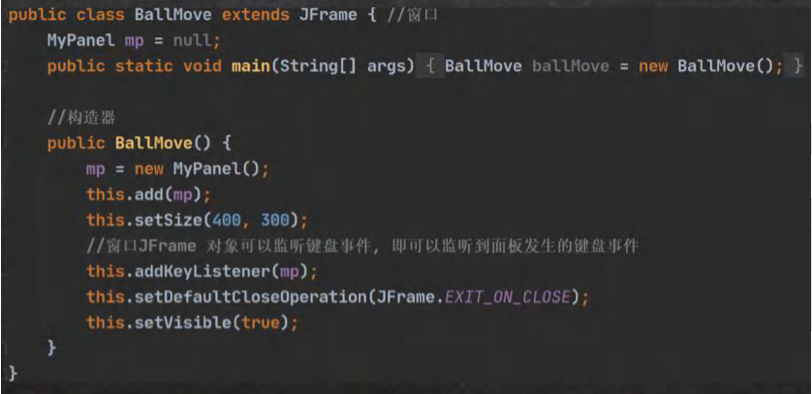

#### 17.1.2 进程

1. 进程是指运行中的程序，比如我们使用QQ，就启动了一个进程，操作系统就会为该进程分配内存空间。当我们使用迅雷，又启动了一个进程，操作系统将为迅雷分配新的内存空间。
2. 进程是程序的一次执行过程，或是正在运行的一个程序。是动态过程：有它自身的产生、存在和消亡的过程


#### 17.1.3 什么是线程

1. 线程由进程创建的，是进程的一个实体

2. 一个进程可以拥有多个线程，如下图

   

3. 坦克大战

   

#### 17.1.4 其他相关概念

1. 单线程：同一时刻，只允许执行一个线程
2. 多线程：同一时刻，可以执行多个线程，比如：一个qq进程，可以同时打开多个聊天窗口，一个迅雷进程，可以同时下载多个文件


3. 并发：同一个时刻，多个任务交替执行，造成一种“貌似同时”的错觉，简单的说，单核cpu实现的多任务就是并发。

   

4. 并行：同一时刻，多个任务同时执行。多核cpu可以实现并行。

   

### 17.2 线程基本使用

#### 17.2.1 创建线程的两种方式

在java中线程来使用有两种方法。

1. 继承Thread 类，重写 run方法
2. 实现Runnable接口，重写 run方法

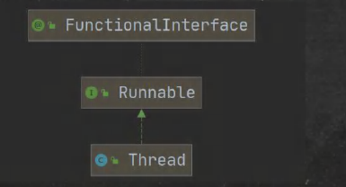

#### 17.2.2 线程应用案例 1-继承 Thread类

[Thread01.java com.hspedu.threaduse]

1）请编写程序，开启一个线程，该线程每隔1秒。在控制台输出 "喵喵，我是小猫咪"

2）对上题改进：当输出80次 喵喵，我是小猫咪，结束该线程

3）使用JConsole 监控线程执行情况，并画出程序示意图！

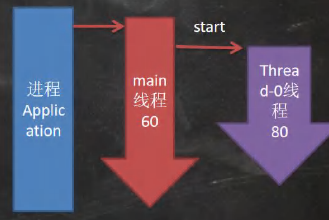


#### 17.2.3 线程应用案例2-实现 Runnable 接口

- 说明

  1. java是单继承的，在某些情况下一个类可能已经继承了某个父类，这时在用继承Thread类方法来创建线程显然不可能了。
  2. java设计者们提供了另外一个方式创建线程，就是同过实现Runnable接口来创建线程

- 应用案例

  请编写程序，该程序可以每隔1秒。在控制台输出“hi！",当输出10次后，自动退出。请使用实现Runnable接口的方式实现。Thread02.java,这里底层使用了设计模式[代理模式] => 代码模拟 实现 Runnable接口 开发线程的机制

#### 17.2.4 线程使用应用案例-多线程执行

请编写一个程序，创建两个线程，一个线程每隔1秒输出“hello，world”，输出10次，退出，一个线程每隔1秒输出 “hi”，输出 5次退出.【Thread03.java】

#### 17.2.5 线程如何理解

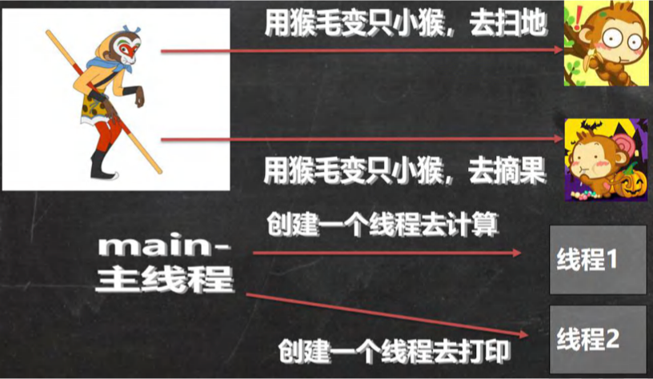

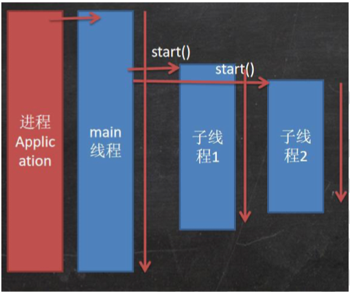

### 17.3 继承 Thread vs 实现 Runnable 的区别

1. 从java的设计来看，通过继承Thread或者实现Runnable接口来创建线程本质上没有区别，从jdk帮助文档我们可以看到Thread类本身就实现了Runnable接口
2. 实现Runnable接口方式更加适合多线程共享一个资源的情况，并且避免了单继承的限制，建议使用Runnable
3. [售票系统]，编程模拟三个售票窗口售票100，分别使用 继承 Thread 和实现 Runnable 方式，并分析有什么问题？[SellTicket.java]

### 17.4 线程终止

#### 17.4.1 基本说明

1. 当线程完成任务后，会自动退出。
2. 还可以通过使用变量来控制run方法退出的方式停止线程，即通知方式

#### 17.4.2 应用案例 [ThreadExit_.java com.hspedu.exit _]

要求：启动一个线程t，要求在main线程中去停止线程t，请编程实现.

### 17.5 线程常用方法

#### 17.5.1 常用方法第一组

1. setName //设置线程名称，使之与参数name相同
2. getName //返回该线程的名称
3. start //使该线程开始执行；Java 虚拟机底层调用该线程的 start0 方法
4. run //调用线程对象 run 方法;
5. setPriority //更改线程的优先级
6. getPriority //获取线程的优先级
7. sleep //在指定的毫秒数内让当前正在执行的线程休眠(暂停执行)
8. interrupt //中断线程

#### 17.5.2 注意事项和细节

1. start 底层会创建新的线程，调用run，run 就是一个简单的方法调用，不会启动新线程

2. 线程优先级的范围

   | MAX_PRIORITY  | 10   |
   | ------------- | ---- |
   | MIN_PRIORITY  | 1    |
   | NORM_PRIORITY | 5    |

3. interrupt，中断线程，但并没有真正的结束线程。所以一般用于中断正在休眠线程

4. sleep:线程的静态方法，使当前线程休眠

#### 17.5.3 应用案例 

[ThreadMethod01.java]

#### 17.5.4 常用方法第二组

1. yield：线程的礼让。让出cpu，让其他线程执行，但礼让的时间不确实，所以也不一定礼让成功

2. join：线程的插队。插队的线程一旦插队成功，则肯定先执行完插入的线程所有的任务

   案例：main线程创建一个子线程，每隔1s 输出 hello，输出 20次，主线程每隔1秒，输出 hi ，输出 20次.要求：两个线程同时执行，当主线程输出 5次后，让子线程运行完毕，主线程再继续。

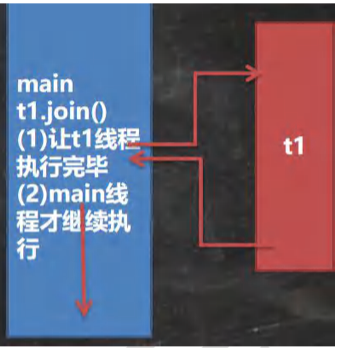

#### 17.5.5 应用案例

[ThreadMethod02.java]

测试yield 和 join 方法

#### 17.5.6 课堂练习

[ThreadMethodExercise.java]

1. 主线程每隔1s，输出 hi，一共10次
2. 当输出到 hi 5 时，启动一个子线程(要求实现Runnable)，每隔1s 输出hello，等改线程输出10次 hello后，退出
3. 主线程继续输出 hi，直到主线程退出.
4. 其实就是线程插队

#### 17.5.7 用户线程和守护线程

1. 用户线程：也加工作线程，当线程的任务执行完或通知方式结束
2. 守护线程：一般是为工作线程服务的，当所有的用户线程结束，守护线程自动结束
3. 常见的守护线程：垃圾回收机制

#### 17.5.8 应用案例 

[ThreadMethod03.java]

如何将一个线程设置成守护线程

### 17.6 线程的生命周期

#### 17.6.1 JDK 中用 Thread.State 枚举表示了线程的几种状态

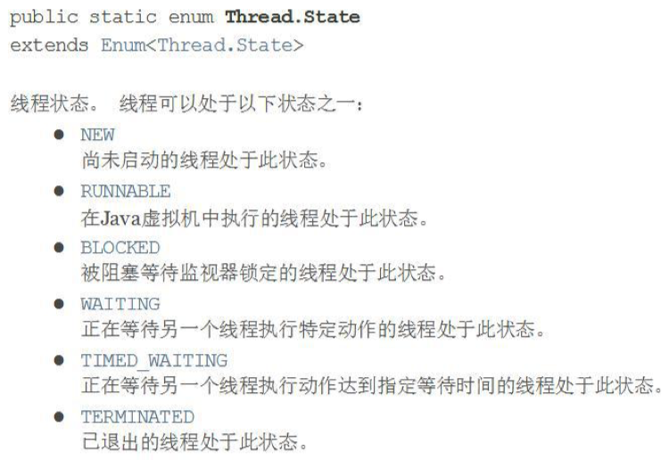

#### 17.6.2 线程状态转换图

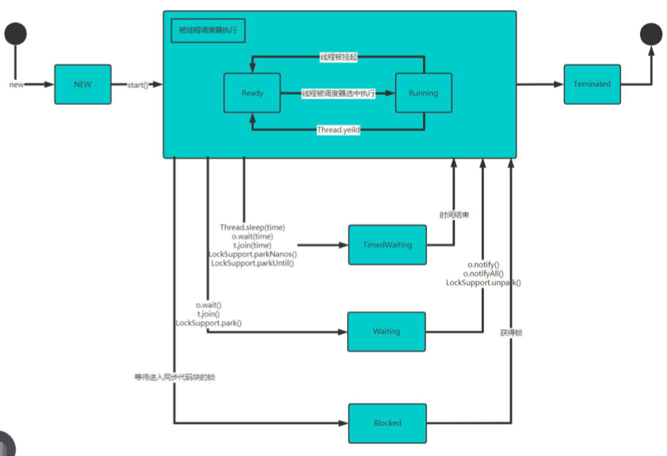

#### 17.6.3 写程序查看线程状态

[ThreadState_.java]

### 17.7 线程的同步

#### 17.7.1 先看一个问题

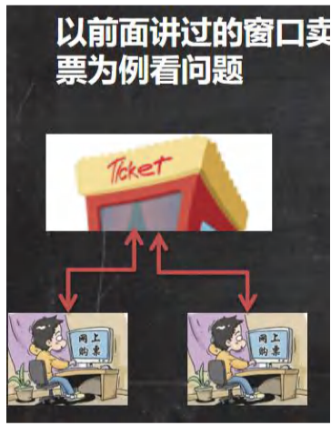

### 17.8 Synchronized

#### 17.8.1 线程同步机制

1. 在多线程编程，一些敏感数据不允许被多个线程同时访问，此时就使用同步访问技术，保证数据在任何同一时刻，最多有一个线程访问，以保证数据的完整性。
2. 也可以这样理解：线程同步，即当有一个线程在对内存进行操作时，其他线程都不可以对这个内存地址进行操作，直到该线程完成操作，其他线程才能对该内存地址进行操作。

#### 17.8.2 同步具体方法-Synchronized

1. 同步代码块

   ```java
   synchronized (对象) {//得到对象的锁，才能操作同步代码
     	//需要被同步代码
   }
   ```

2. synchronized还可以放在方法声明中，表示整个方法-为同步方法

   ```java
   public synchronized void m (String name){
     	//需要被同步的代码
   }
   ```

3. 如何理解：

   就好像 某小伙伴上厕所前先把门关上(上锁)，完事后再出来(解锁),那么其它小伙伴就可以再使用厕所了

   

4. 使用synchronized 解决售票问题

### 17.9 分析同步原来

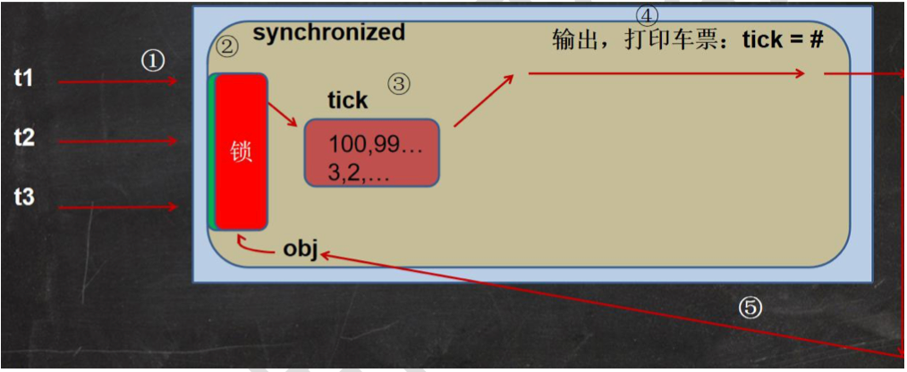

### 17.10 互斥锁

#### 17.10.1 基本介绍

1. Java语言中，引入了对象互斥锁的概念，来保证共享数据操作的完整性。
2. 每个对象都对应于一个可成为”互斥锁“的标记，这个标记用来保证在任一时刻，只能有一个线程访问该对象。
3. 关键字synchronized 来与对象的互斥锁联系。当某个对象用synchronized修饰时，表明该对象在任一时刻只能由一个线程访问
4. 同步的局限性：导致程序的执行效率要降低
5. 同步方法(非静态的)的锁可以是this，也可以是其他对象(要求是同一个对象)
6. 同步方法(静态的) 的锁为当前本身。

#### 17.10.2 使用互斥锁来解决售票问题

两种方式：代码块加锁，和方法上加锁

#### 17.10.3 注意事项和细节

1. 同步方法如果没有使用static修饰：默认锁对象为this
2. 如果方法使用static修饰，默认锁对象：当前类.class
3. 实现的落地步骤：
   - 需要先分析上锁的代码
   - 选择==同步代码块==或同步方法
   - 要求多个线程的锁对象为同一个即可！

### 17.11 线程的死锁

#### 17.11.1 基本介绍

多个线程都占用了对方的锁资源，但不肯相让，导致了死锁，在编程时一定要避免死锁的发生.

#### 17.11.2 应用案例

妈妈：你先完成作业，才让你玩手机

小明：你先让我玩手机，我才完成作业

#### 17.11.3 应用案例

[DeadLock_.java]

### 17.12 释放锁

#### 17.12.1 下面操作会释放锁

1. 当前线程的同步方法、同步代码块执行结束

   案例：上厕所，完事出来

2. 当前线程在同步代码块、同步方法中遇到break、return。

   案例：没有正常的完事，经理叫他修改bug，不得已出来

3. 当前线程在同步代码块、同步方法中出现了未处理的Error或Exception，导致异常结束

   案例：没有正常的完事，发现忘带纸，不得已出来

4. 当前线程在同步代码块】同步方法中执行了线程对象的wait()方法，当前线程暂停，并释放锁

   案例：没有正常完事，觉得需要运粮下，所以出来等会再进去

#### 17.12.2 下面操作不会释放锁

1. 线程执行同步代码块或同步方法时，程序调用Thread.sleep()、Thread.yield方法暂停当前线程的执行，不会释放锁

   案例：上厕所，太困了，在坑位上眯了一会

2. 线程执行同步代码块时，其他线程调用了该线程的suspend()方法将该线程挂起，该线程不会释放锁。

   提示：应尽量避免使用suspend()和resume()来控制线程，方法不再推荐使用

### 17.13 本章作业

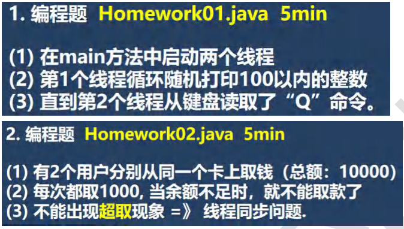

