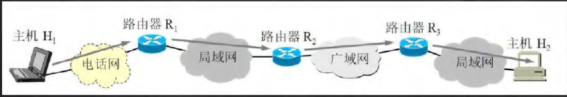
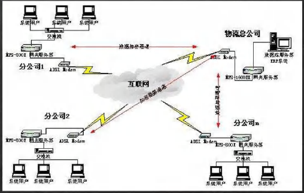
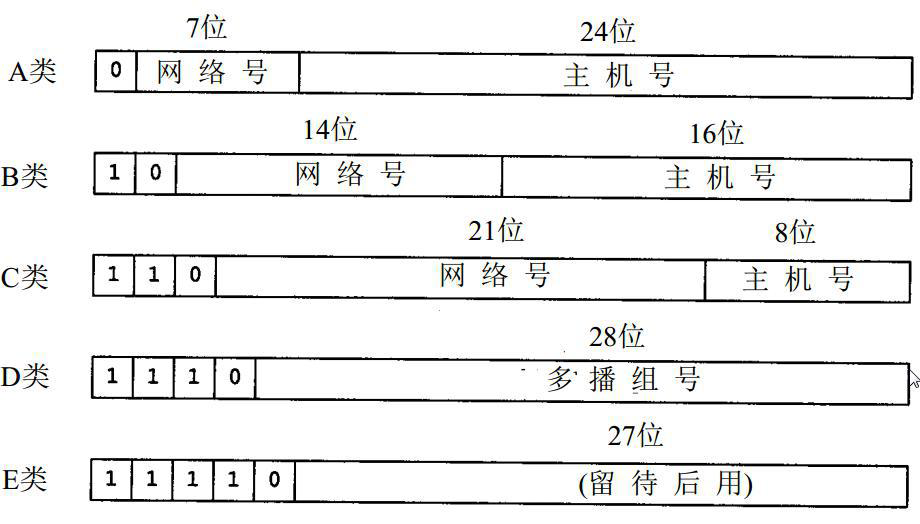
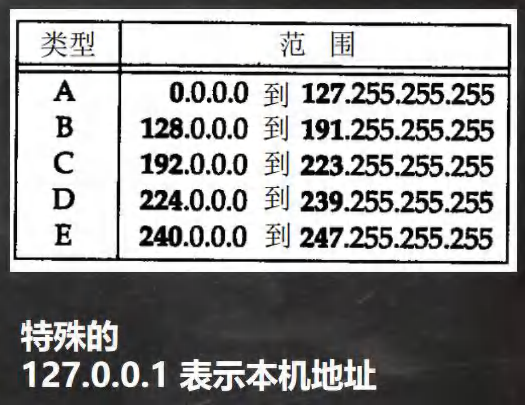
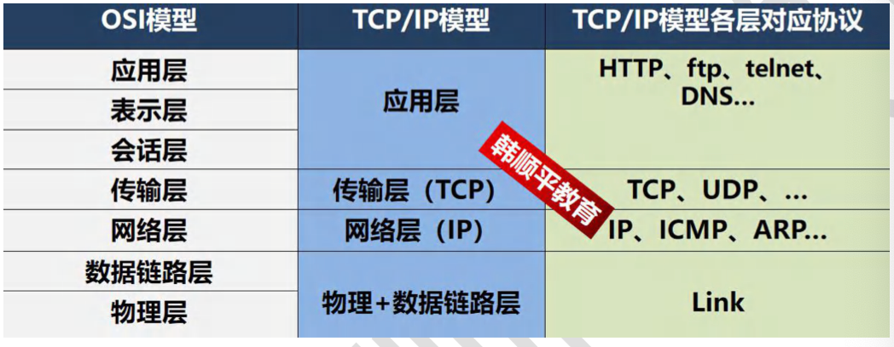
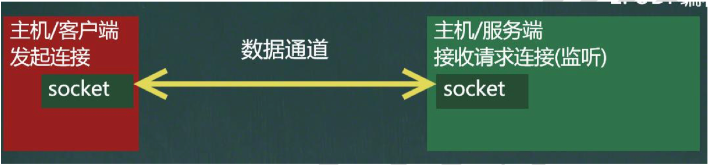
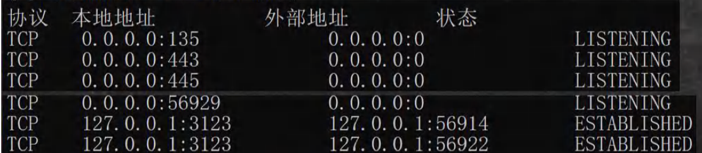
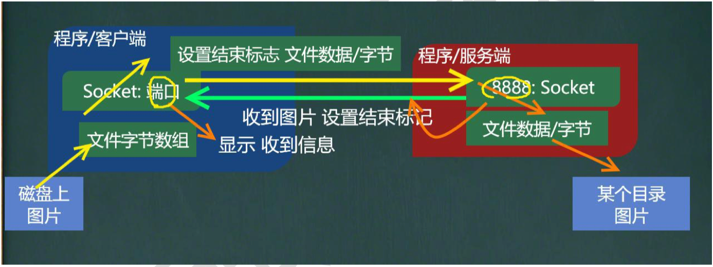
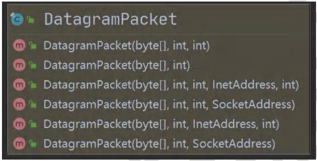
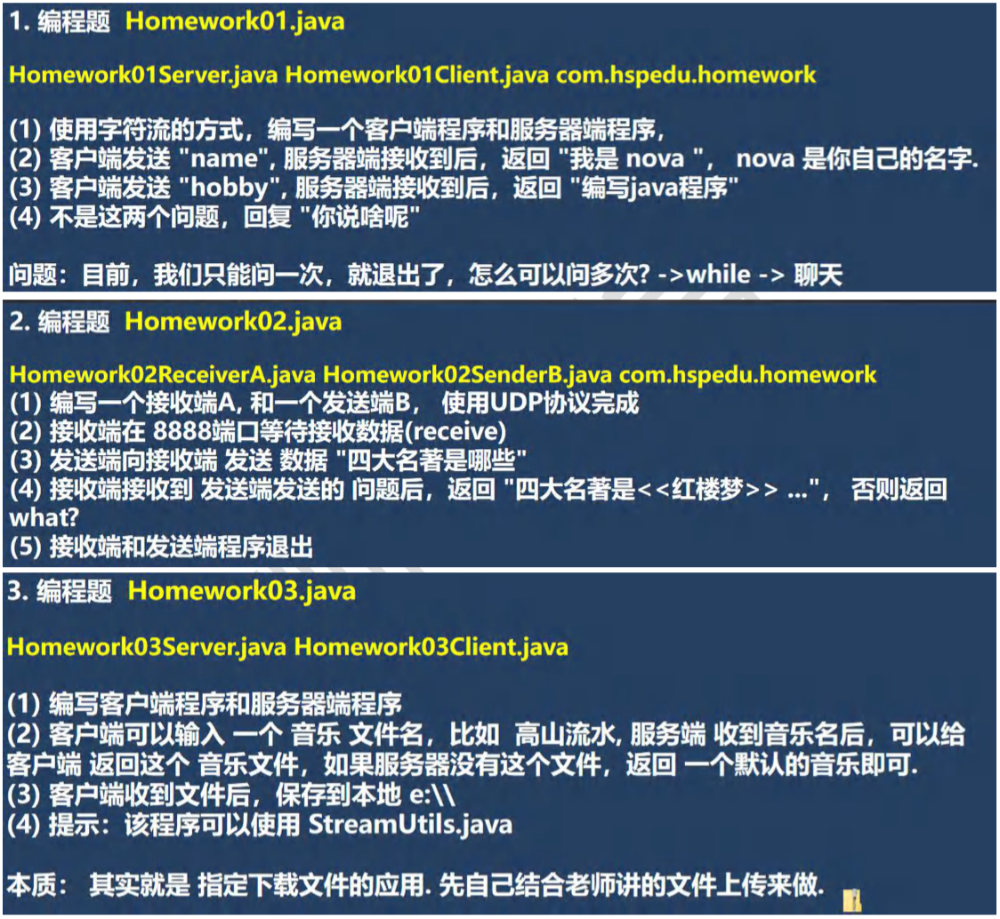

## 第 21 章 网络编程

### 21.1 网络的相关概念

#### 21.1.1 网络通讯信

1. 概念：两台设备之间通过网络实现数据传输
2. 网络通信：将数据通过网络从一台设备传输到另一台设备
3. java.net包下提供了一系列的类或接口，供程序员使用，完成网络通信

#### 21.1.2 网络

    

1. 概念：两台或多台设备通过一定物理设备连接起来构成了网络
2. 根据网络的覆盖范围不同，对网络进行分类：
   - 局域网：覆盖范围最小，仅仅覆盖一个教室或一个机房
   - 城域网：覆盖范围较大，可以覆盖一个城市
   - 广域网：覆盖范围最大，可以覆盖全国，甚至全球，万维网是广域网的代表

#### 21.1.3 ip 地址

1. 概念：用于唯一标识网络中的每台计算机/主机
2. 查看ip地址：ipconfig
3. ip地址的表示形式：点分十进制  xx.xx.xx.xx
4. 每一个十进制数的范围：0~255
5. ip地址的组成=网络地址+主机地址，比如：192.168.16.69
6. Ipv6 是互联网工程任务组设计的用于替换IPv4的下一代IP协议，其地址数量号称可以为全世界的每一粒沙子编上一个地址。
7. 由于IPv4最大的问题在于网络地址资源有限，严重制约了互联网的应用和发展。IPv6的使用，不仅能解决网络地址资源数量的问题，而且也解决了多种接入设备连入互联网的障碍

#### 21.1.4 ipv4 地址分类

#### 21.1.5 域名

1. www.baidu.com
2. 好处：为了方便记忆，解决ip的困难
3. 概念：将ip地址映射成域名，HTTP协议

- 端口号
  1. 概念：用于标识计算机上讴歌特定的网络程序
  2. 表示形式：以整数形式，端口范围0~65535[2个字节表示端口号 0~（2^16）-1]
  3. 0~1024已经被占用，比如 ssh 22，ftp 21，smtp 25 http 80
  4. 常见的网络程序端口号：
     - tomcat：8080
     - mysql：3306
     - oracle：1521
     - sqlserver：1433

#### 21.1.6 网络通信协议

- 协议(tcp/ip)

  TCP/IP (Transmission Control Protocol/Internet Protocol)的简写，中文译名为==传输控制协议/因特网互联协议==,又叫网络通讯协议，这个协议是Internet最基本的协议、Internet国际互联网的基础

#### 21.1.7 网络通信协议

#### 21.1.8 TCP 和 UDP

- TCP协议：传输控制协议
  1. 使用TCP协议前，须先建立TCP连接，形成传输数据通道
  2. 传输前，采用”三次握手“方式，是==可靠的==
  3. TCP协议进行通信的两个应用进程：客户端、服务器
  4. 在连接中可进行打数据量的传输
  5. 传输完毕，需要释放已建立的连接，==效率低==
- UDP协议：用户数据协议
  1. 将数据、源、目的封装成数据包，不需要建立连接
  2. 每个数据报的大小限制在64k内，不适合传输大量数据
  3. 因无需连接，故是==不可靠的==
  4. 发送数据结束时无需释放资源(因为不是面向连接的)，速度快
  5. 举例：厕所通知：发短信

### 21.2 InetAddress 类

#### 21.2.1 相关方法

1. 获取本机InetAddress对象 getLocalHost
2. 根据制定主机名/域名获取ip地址对象 getByName
3. 获取InetAddress对象的主机名 getHostName
4. 获取InetAddress对象的地址 getHostAddress

#### 21.2.2 应用案例 

[com.hspedu.api API_.java]

编写代码，获取计算机的主机名和IP地址相关API

### 21.3 Socket

#### 21.3.1 基本介绍

1. 套接字(Socket)开发网络应用程序被广泛采用，以至于成为事实上的标准。
2. 通信的两端都要有Socket，是两台机器间通信的端点
3. 网络通信其实就是Socket间的通信。
4. Socket允许程序把网络连接当成一个流，数据在两个Socket间通过IO传输。
5. 一般主动发起通信的应用程序称为客户端，等待通信请求的为服务端

示意图：

### 21.4 TCP 网络通信编程

#### 21.4.1 基本介绍

1. 基本客户端—服务端的网络通信
2. 底层使用的是TCP/IP协议
3. 应用场景举例：客户端发送数据，服务端接受并显示控制台
4. 基于Socket的TCP编程

#### 21.4.2 应用案例1(使用字节流)

[com.hspedu.socket **SocketTCP01Server.java**    **SocketTCP01Client.java**]

1. 编写一个服务器，和一个客户端
2. 服务器端在 9999 端口监听
3. 客户端连接到服务器端，发送”hello，server“，然后退出
4. 服务器端接收到 客户端发送的 信息，输出，并退出

#### 21.4.3 应用案例2(使用字节流) 

[SocketTCP02.java]

1. 编写一个服务端，和一个客户端
2. 服务端在9999端口监听
3. 客户端连接到服务端，发送”hello，server“,并接收服务器端回发的”hello，client“，再退出
4. 服务器端接收到 客户端发送的 信息，输出，并发送 ”hello，client“，再退出

#### 21.4.4 应用案例3(使用字符流)

[SocketTCP03.java]

1. 编写一个服务端，和一个客户端
2. 服务端在 9999端口监听
3. 客户连接到服务端，发送 ”hello，server“，并接收服务端回发的"hello,client",再退出
4. 服务端接收到 客户端发送的 信息，输出，并发送”hello，client“，再退出

#### 21.4.5 应用案例4 

[TCPFileUploadServer.java  TCPFileUploadClient.java]

[com.hspedu.upload]

1. 编写一个服务端，和一个客户端
2. 服务器端在 8888端口监听
3. 客户端连接到服务端，发送一张图片
4. 服务器端接收到 客户端发送的 图片，保存到 src下，发送”收到图片“再退出
5. 客户端接收到服务端发送的 ”收到图片“，再退出
6. 该程序要求使用 StreamUtils.java

#### 21.4.6 netstat 指令

1. netstat -an 可以查看当前主机网络情况，包括==端口监听==情况和==网络==情况
2. netstat -an | more 可以分页显示
3. 要求在dos控制台下执行 win+r

说明：

(1) Listening 表示某个端口在监听

(2) 如果有一个外部程序(客户端)连接到该端口，就会显示一条连接信息.

(3) 可以输入ctrl + c 退出指令

#### 21.4.7 TCP 网络通讯不为人知的秘密

1. 当客户端连接到服务端后，实际上客户端也是通过一个端口和服务

端进行通讯的，这个端口是TCP/IP来分配的，是不确定的，是随机的。

2. 示意图
3. 程序验证 + netstat

### 21.5 UDP 网络通信编程

#### 21.5.1 基本介绍

1. 类 DatagramSocket 和 DatagramPacket[数据包/数据报] 实现了基于UDP协议网络程序
2. UDP数据报通过数据报套接字 DatagramSocket 发送和接收，系统不保证UDP数据报一定能够安全送到目的地，也不能确定什么时候可以抵达。
3. DatagramPacket 对象封装了UDP数据报，在数据报中包含了发送端的IP地址和端口号以及接收端的IP地址和端口号。
4. UDP协议中每个数据报都给出了完整的地址信息，因此无须建立发送方和接收方的连接

#### 21.5.2 基本流程

1. 核心的两个类/对象 DatagramSocket 与 DatagramPacket
2. 建立发送端，接收端(没有服务端和客户端概念)
3. 发送数据前，建立数据包/报 DatagramPacket对象
4. 调用DatagramSocket的发送、接收方法
5. 关闭DatagramSocket

#### 21.5.3 应用案例

[UDPReceiverA.java UDPSenderB.java] [com.hspedu.udp 包]

1. 编写一个接收端A，和一个发送端B
2. 接收端A在 9999端口等待接收数据(receive)
3. 发送端B向接收端A 发送 数据 “hello，明天吃火锅~”
4. 接收端A接收到 发送端B发送的数据，回复“好的，明天见”，再退出
5. 发送接收端收 回复的数据，再退出

### 21.6 本章作业

