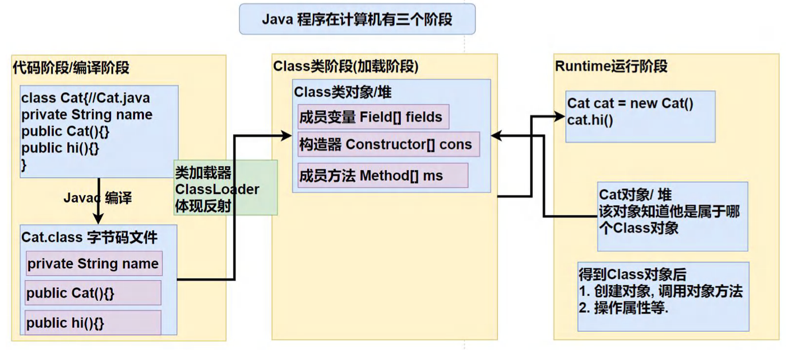
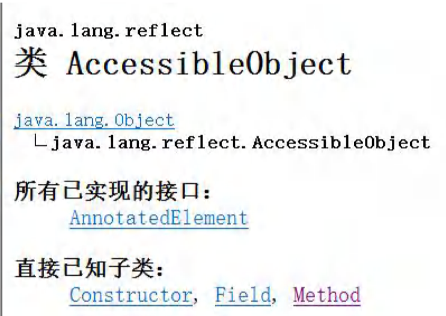
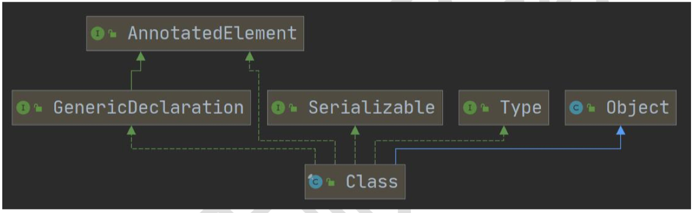
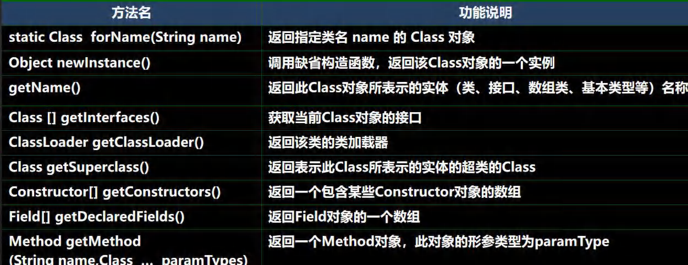
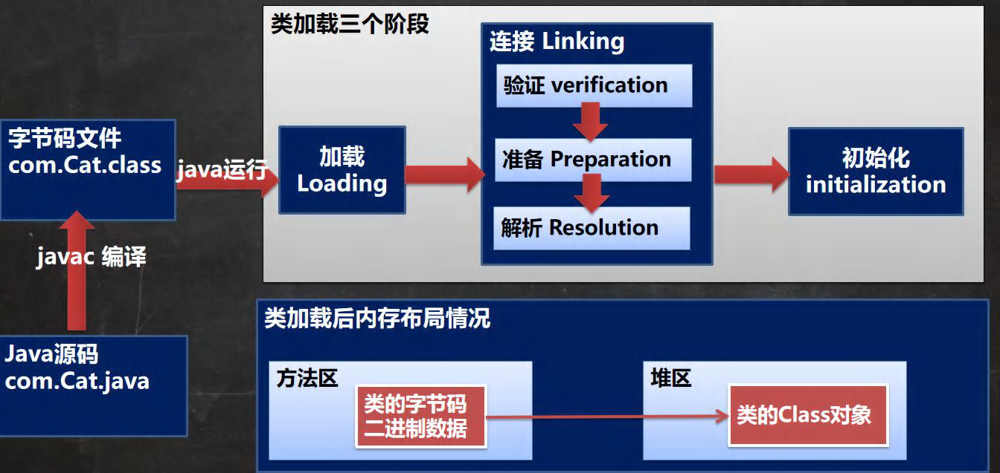
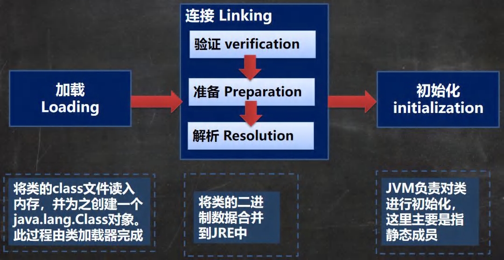
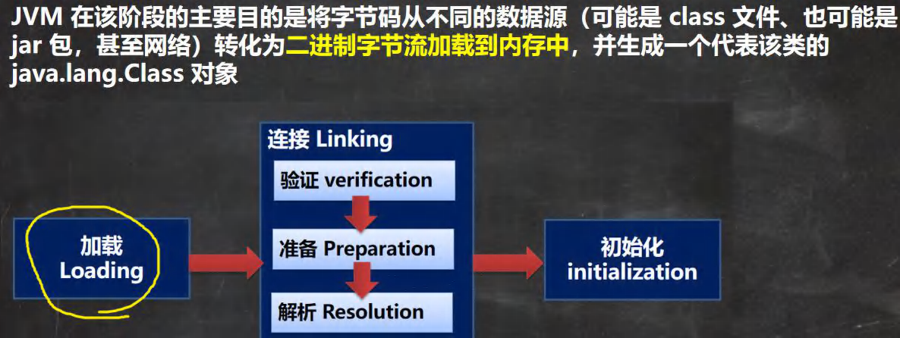
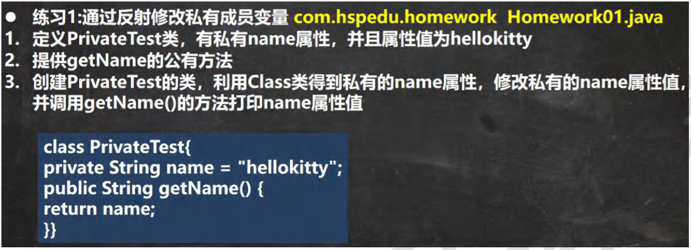
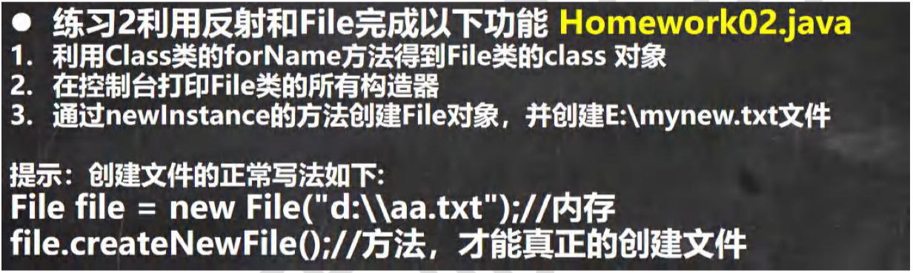

# 第 23 章 反射

## 23.1 一个需求引出反射

### 23.1.1 请看下面的问题

1. 根据配置文件 re.properties 指定信息，创建Cat对象并调用方法hi

   classfullpath=com.hspedu.Cat

   method=hi

2. 这样的需求在学习框架时特别多，即通过外部文件配置，在不修改源码情况下，来控制程序，也符合设计模式的 ocp原则(开闭原则：不修改源码，扩容功能)

3. 快速入门 com.hspedu.reflection.question    ReflectionQusestion.java

## 23.2 反射机制

### 23.2.1 Java Reflection

1. 反射机制允许程序在执行期借助于ReflectionAPI取得任何类的内部信息(比如成员变量，构造器，成员方法等等)，并能操作对象的属性及方法。反射在设计模式和框架底层都会用到
2. 加载完类之后，在堆中就产生了一个Class类型的对象(一个类只有一个Class对象)，这个对象包含了类的完整结构信息。通过这个对象得到类的结构。这个Class对象就像一面镜子，透过这个镜子看到类的结构，所以，形象的称之为：反射

p 对象 --》 类型 Person类

Class对象 cls ---> 类型 Class类

### 23.2.2 Java 反射机制原理示意图！！！



### 23.2.3 Java 反射机制可以完成

1. 在运行时判断任意一个对象所属的类
2. 在运行时创造任意一个类的对象
3. 在运行时得到任意一个类所具有的成员变量和方法
4. 在运行时调用任意一个对象的成员变量和方法
5. 生成动态代理


### 23.2.4 反射相关的主要类

1. Java.lang.Class：代表一个类，Class对象表示某个类加载后在堆中的对象
2. java.lang.reflect.Method：代表类的方法，Method对象表示某个类的方法
3. java.lang.reflect.Field：代表类的成员变量，Field对象表示某个类的成员变量
4. java.lang.reflect.Constructor：代表类的构造方法，Constructor对象表示构造器

这些类在java.lang.reflection

Reflection01.java  com.hspedu.reflecton

### 23.2.5 反射优点和缺点

1. 优点：可以动态的创建和使用对象(也是框架底层核心)，使用灵活，没有反射机制，框架技术就失去底层支撑。
2. 缺点：使用反射基本是解释执行，对执行速度有影响
3. 应用实例：Reflection02.java com.hspedu.reflection

### 23.2.6 反射调用优化-关闭访问检查

1. Method和File、Constructor对象都有setAccessible()方法
2. setAccessible作用是启动和禁用访问安全检查的开关
3. 参数为true表示 反射的对象在使用时取消访问检查，提高放射的效率。参数值为false则表示反射的对象执行访问检查



## 23.3 Class类

### 23.3.1 基本介绍



[Class01.java] [com.hspedu.reflection.class_]

1. Class也是类，因此也继承Object类
1. Class类对象不是new出来的，而是系统创建的
1. 对于某个类的Class类对象，在内存中只有一份，因此类只加载一次
1. 每个类的实例都会记得自己是由那个 Class 实例所生成
1. 通过Class对象可以完整地得到一个类的完整结构，通过一系列API
1. Class对象是存放在堆的
1. 类的字节码二进制数据，是放在方法区，有的地方称为类的元数据(包括 方法代码，变量名，方法名，访问权限等等)

### 23.3.2 Class类的常用方法



### 23.3.3 应用实例：

[Class02.java]

## 23.4 获取Class类对象

[GetClass_.java]

1. 前提：已知一个类的全类名，且该类在类路径下，可以通过Class类的静态方法forName()获取，可以抛出ClassNotFoundException,实例：Class cls1 = Class.forName("java.lang.Cat");

   应用场景：多用于配置文件，读取类全路径，加载类.

2. 前提：若已知具体的类，通过类的class 获取，该方式 最为安全可靠，程序性能最高

   实例：Class cls2 = Cat.class;

   应用场景：多用于参数传递，比如通过反射得到对应构造器对象.

3. 前提：已知某个类的实例，调用该实例的getClass()方法获取Class对象

   实例：Class clazz = 对象.getClass();//运行类型

   应用场景：通过创建好的对象，获取Class对象.

4. 其他方式

   ClassLoader cl = 对象.getClass().getClassLoader();

   Class clazz4 = cl.loadClass("类的全类名");

5. 基本数据(int, char, boolean, float, double, byte, long, short) 按照如下方式得到Class类对象

   Class cls = 基本数据类型.class

6. 基本数据类型对应的包装类，可以通过.TYPE 得到Class类对象

   Class cls = 包装类.TYPE

## 23.5 哪些类型有Clas对象

### 23.5.1 如下类型有Class对象

1. 外部类，成员内部类，静态内部类，局部内部类，匿名内部类
2. interface:接口
3. 数组
4. enum:枚举
5. annotation:注解
6. 基本数据类型
7. void

### 23.5.2 应用实例

[AllTypeClass.java]

## 23.6 类加载

### 23.6.1 基本说明

反射机制是java实现动态语言的关键，也就是通过反射实现类动态加载。

1. 静态加载：编译时加载相关的类，如果没有则报错，依赖性太强
2. 动态加载：运行是加载需要的类，如果运行时不用改类，即使不存在该类，则不报错，降低了依赖性

### 23.6.2 类加载时机

1. 创建对象时(new)	//静态加载
2. 当子类被加载时，父类也加载    //静态加载
3. 调用类中的静态成员是               //静态加载
4. 通过反射                              //动态加载

Class.forName("com.test.Cat");

### 23.6.3 类加载过程图



### 23.6.4 类加载各阶段完成任务



### 23.6.5 加载阶段



### 23.6.6 连接阶段-验证

1. 目的是为了确保 Class文件的字节流中包含的信息符合当前虚拟机的要求，并且不会危害虚拟机自身的安全。
2. 包括：文件格式验证(是否以 oxcafebabe开头)、元数据验证、字节码验证和符号引用验证
3. 可以考虑使用 -Xverify:none 参数来关闭大部分的类验证措施，缩短虚拟机类加载的时间

### 23.6.7 连接阶段-准备

1. JVM 会在该阶段对静态变量，分配内存并默认初始化(对应数据类型的默认初始值，如0、0L、null、false 等)。这些变量所使用的内存都将在方法区中进行分配
2. 举例说明：ClassLoad02.java

### 23.6.8 连接阶段-解析

1. 虚拟机将常量池内的符号引用替换为直接引用的过程。

2. 举例说明：

   

### 23.6.9 Initialization（初始化)

1. 到初始化阶段，才真正开始执行类中定义的Java程序代码，此阶段是执行<clinit>() 方法的过程。
2. <clinit>() 方法是有编译器按语句在源文件中出现的顺序，依次自动收集类中的所有静态变量的赋值动作和静态代码块中的雨具，并进行合并。
3. 虚拟机会保证一个类的<clinit>() 方法在多线程环境中被正确地加锁、同步、如果多个线程同时去初始化一个类，那么只会有一个线程去执行这个类的<clinit>() 方法，其他线程都需要阻塞等待，直到活动线程执行<clinit>() 方法完毕

### 23.7.1 第一组：java.lang.Class 类

com.hspedu.reflection [ReflectionUtils.java]

```java
//得到Class对象
Class<?> personCls = Class.forName("com.hspedu.reflection.Person");
//getName:获取全类名
System.out.println(personCls.getName());
//getSimpleName:获取简单类名
System.out.println(personCls.getSimpleName());
//getFields:获取所有public修饰的属性，包含本类以及父类的
Field[] fields = personCls.getFields();
for (Field field : fields) {//增强for
    System.out.println("本类及父类的属性=" + field.getName());
}
//getDeclaredFields:获取本类中所有属性
Field[] declaredFields = personCls.getDeclaredFields();
for (Field declaredField : declaredFields) {
    System.out.println("本类所有属性=" + declaredField.getName());
}
//getMethods:获取所有public修饰的方法，包含本类以及父类的
Method[] methods = personCls.getMethods();
for (Method method : methods) {
    System.out.println("本类以及父类的方法=" + method.getName());
}
//getDeclaredMethods:获取本类中所有方法
Method[] declaredMethods = personCls.getDeclaredMethods();
for (Method declaredMethod : declaredMethods) {
    System.out.println("本类所有的方法=" + declaredMethod.getName());
}
//getConstructors:获取所有public修饰的构造器，包含本类的
Constructor<?>[] constructors = personCls.getConstructors();
for (Constructor<?> constructor : constructors) {
    System.out.println("本类的构造器=" + constructor.getName());
}
//getDeclaredConstructors:获取本类中所有构造器
Constructor<?>[] declaredConstructors = personCls.getDeclaredConstructors();
for (Constructor<?> declaredConstructor : declaredConstructors) {
    System.out.println("本类所有的构造器=" + declaredConstructor.getName());//这里只是输出名字
}
//getPackage:以Package形式返回 包信息
System.out.println(personCls.getPackage());//com.hspedu.reflection
//getSuperClass:以Class形式返回父类信息
Class<?> superclass = personCls.getSuperclass();
System.out.println("父类的class对象="+superclass);//
//getInterfaces:以Class[]形式返回接口信息
Class<?>[] interfaces = personCls.getInterfaces();
for (Class<?> anInterface : interfaces) {
    System.out.println("接口信息=" + anInterface);
}
//getAnnotations:以Annotation[] 形式返回注解信息
Annotation[] annotations = personCls.getAnnotations();
for (Annotation annotation : annotations) {
    System.out.println("注解信息="+annotation);
}
```

### 23.7.2 第二组：java.lang.reflect.Field 类

1. getModifiers：以int形式返回修饰符

   [说明：默认修饰符 是0，public 是1，private 是2，protected 是4 ，static 是8，final是16]，public(1) + static(8) = 9

2. getType：以Class形式返回类型

3. getName：返回属性名

### 23.7.3 第三组：java.lang.reflect.Method 类

1. getModifiers：以int形式返回修饰符

   [说明：默认修饰符 是0，public 是1，private 是2，protected 是4 ，static 是8，final是16]

2. getReturnType：以Class形式获取 返回类型

3. getName：返回方法名

4. getParameterTypes：以Class[]返回参数类型数组

### 23.7.4 第四组：java.lang.reflect.Constructor 类

1. getModifiers：以int形式返回修饰符
2. getName：返回构造器名(全类名)
3. getParameterTypers：以Class[]返回参数类数组

## 23.8 通过反射创建对象

1. 方式一：调用类中的public修饰的无参构造器
2. 方式二：调用类中的指定构造器
3. Class类相关方法
   - newInstance：调用类中的无参构造器，获取对应类的对象
   - getConstructor(Class...clazz)：根据参数列表，获取对应的public构造器对象
   - getDecalaredConstructor(Class...clazz)：根据参数列表，获取对应的所有构造器对象
4. Constructor类相关方法
   - setAccessible：爆破
   - newInstance(Object...obj)：调用构造器

### 23.8.1 案例演示

com.hspedu.reflection [ReflecCreateInstance.java]

测试 1：通过反射创建某类的对象，要求该类中必须有 public 的无参构造

测试 2：通过调用某个特定构造器的方式，实现创建某类的对象

## 23.9 通过反射访问类中的成员

### 23.9.1 访问属性 

[ReflecAccessProperty.java]

1. 根据属性名获取Field对象

   Field f = clazz对象.getDeclaredField(属性名);

2. 爆破：f.setAccessible(true);//f 是Field

3. 访问

   f.set(o,值); //o 表示对象

   syso(f.get(o));//o 表示对象

4. 注意：如果是静态属性，则set和get中的参数o，可以写成null

### 23.9.2 访问方法

[ReflecAccessMethod.java]

1. 根据方法名和参数列表获取Method方法对象：Method m =  clazz.getDeclaredMethod(方法名，XX.class);//得到本类的所有方法
2. 获取对象：Object o = clazz.newInstance();
3. 爆破：m.setAcessible(true);
4. 访问：Object returnValue = m.invoke(o,实参列表);//o 就是对象
5. 注意：如果是静态方法，则invoke的参数o，可以写成null！

## 23.10 本章作业



