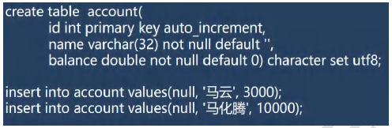
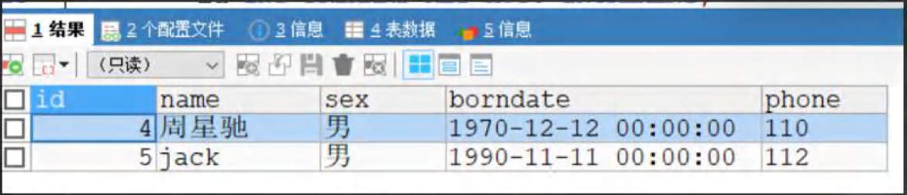
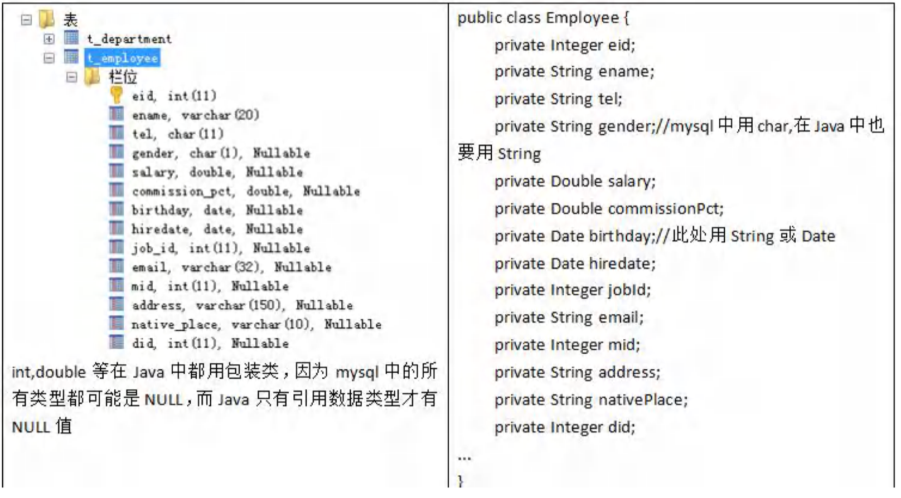
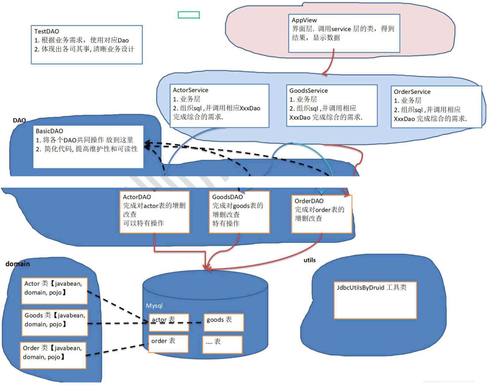
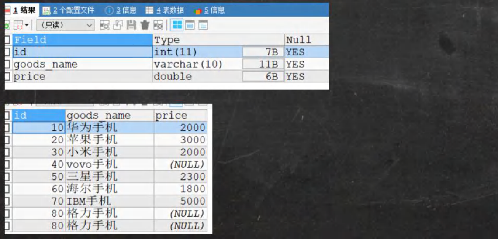

## 第 25 章 JDBC和数据库连接池

### 25.1 JDBC概述

#### 25.1.1 基本介绍

1. JDBC为访问不同的数据库提供了统一的接口，为使用者屏蔽了细节问题。
2. Java程序员使用JDBC，可以连接任何提供了JDBC驱动程序的数据库系统，从而完成对数据库的各种操作。
3. JDBC的基本原理图
4. 模拟JDBC[com.hspedu.jdbc.myjdbc]


#### 25.1.2 模拟JDBC

【JdbcInterface】


#### 25.1.3 JDBC带来的好处


#### 25.1.4 JDBC API

JDBC API是一些列的接口，它统一和规范了应用程序和数据库的连接、执行SQL语句，并到得到返回结果等各类操作，相关类和接口在java.sql与javax.sql包中


### 25.2 JDBC快速入门

#### 25.2.1 JDBC 程序编写步骤

1. 注册驱动 - 加载Driver类
2. 获取连接 - 得到Connection
3. 执行增删改查 - 发送SQL 给mysql执行
4. 释放资源 - 关闭相关连接

#### 25.2.2 JDBC 第一个程序

通过jdbc 对 表 actor 进行 添加，删除和修改操作

```sql
CREATE TABLE actor (
  id INT PRIMARY KEY AUTO_INCREMENT,
  name VARCHAR(32) NOT NULL DEFAULT '',
  sex CHAR(1) NOT NULL DEFAULT '女',
  borndate DATETIME,
  phone VARCHAR(12)
);
```

#### 25.2.3 JDBC 第一个程序

[com.hspedu.jdbc Jdbc01.java]

### 25.3 获取数据库连接 5 种 方式

#### 25.3.1 方式1

[com.hspedu.jdbc.conn JdbcConn.java]

```java
Driver driver = new com.mysql.cj.jdbc.Driver();

String url = "jdbc:mysql://localhost:3306/hsp_db02?serverTimezone=UTC";

Properties info = new Properties();
info.setProperty("user", "root");
info.setProperty("password", "123456");
Connection conn = driver.connect(url, info);
System.out.println(conn);
```

#### 25.3.2 方式2

[JdbcConn.java]

方式1 会直接使用 com.mysql.jdbc.Driver(),属于静态加载，灵活性差，依赖强

```java
//使用反射加载Driver类 , 动态加载，更加的灵活，减少依赖性
Class<?> aClass = Class.forName("com.mysql.cj.jdbc.Driver");
Driver driver = (Driver) aClass.newInstance();

String url = "jdbc:mysql://localhost:3306/hsp_db02?serverTimezone=UTC";
Properties info = new Properties();
info.setProperty("user", "root");
info.setProperty("password", "123456");

Connection connect = driver.connect(url, info);
System.out.println("方式二=" + connect);
```

#### 25.3.3 方式3

使用DriverManager替换Driver

```java
//使用反射加载Driver
Class<?> aClass = Class.forName("com.mysql.cj.jdbc.Driver");
Driver driver = (Driver) aClass.newInstance();

//创建url 和 user 和 password
String url = "jdbc:mysql://localhost:3306/hsp_db02?serverTimezone=UTC";
String user = "root";
String password = "123456";

DriverManager.registerDriver(driver);//注册Driver驱动

Connection connection = DriverManager.getConnection(url, user, password);
System.out.println("第三种方式=" + connection);
```

#### 25.3.4 方式4

使用Class.forName 自动完成注册驱动，简化代码

```java
 Class.forName("com.mysql.cj.jdbc.Driver");

//创建url 和 user 和 password
String url = "jdbc:mysql://localhost:3306/hsp_db02?serverTimezone=UTC";
String user = "root";
String password = "123456";

Connection connection = DriverManager.getConnection(url, user, password);
System.out.println("第四种方式=" + connection);
```

提示：

1. mysql驱动5.1.6可以无需Class.forName("com.mysql.cj.jdbc.Driver");
2. 从jdk1.5以后使用了jdbc4，不再需要显示调用Class.forName()注册驱动而是自动调用驱动jar包下META-INF\services\java.sql.Driver文本中的类名称去注册
3. 建议还是写上Class.foName("com.mysql.cj.jdbc.Driver"),更加明确

#### 25.3.5 方式5

使用配置文件，连接数据库更灵活

1. Connection connection = DriverManager.getConnection("jdbc:mysql://localhost:3306/testdb","root","root");中的字符串 各个值，比如端口，数据库，用户名，密码为了方便，我们可以将信息写入.properties 文件中，方便操作

2. jdbc.properties

   user=root

   password=root

   url=jdbc:mysql://localhost:3306/girls

   driver=com.mysql.cj.jdbc.Driver

#### 25.3.6 课堂练习

使用方式5 完成

1. 创建 news 表
2. 使用jdbc添加5条数据
3. 修改id = 1的记录，将content 改成 一个新的信息
4. 删除id = 3 的记录

### 25.4 ResultSet[结果集]

#### 25.4.1 基本介绍

1. 表示数据库结果集的数据表，通常通过执行查询数据库的语句生成
2. ResultSet对象保持一个光标指向其当前的数据行。最初，光标位于第一行之前
3. next方法将光标移动到下一行，并且由于在ResultSet对象中没有更多行时返回false，因此可以在while循环中使用循环来遍历结果集


#### 25.4.2 应用实例

[com.hspedu.jdbc.resultset_  ResultSet_.java]


### 25.5 Statement

#### 25.5.1 基本介绍

1. Statement对象 用于执行静态SQL语句并返回其生成的结果的对象
2. 在连接建立后，需要对数据库进行访问，执行 命名或是SQL 语句，可以通过
   - Statement[存在SQL注入]
   - PreparedStatement[预处理]
   - CallableStatement[存储过程]
3. Statement对象执行SQL语句，存在SQL注入风险
4. SQL注入是利用某些系统没有对用户输入的数据进行充分的检查，而在用户输入数据中注入非法的 SQL 语句段或命令，恶意攻击数据库。==sql_injection.sql==
5. 要防范SQL注入，只要用 PreparedStatement(从Statement扩展而来)取代 Statement就可以了。

#### 25.5.2 应用实例 【Statement_java】


### 25.6 PreparedStatement

#### 25.6.1 基本介绍

【com.hspedu.preparedstatement_ PreparedStatement_.java】

//编写sql

String sql = "select count(*) from admin where username = ? and password = ?";

1. PreparedStatement 执行的 SQL 语句中的参数用问号(?)来表示，调用PreparedStatement 对象的 setXxx() 方法来设置这些参数.setXxx() 方法有两个参数，第一个参数是要设置的SQL 语句中的参数的索引(从 1 开始),第二个是设置的SQL 语句中的参数的值
2. 调用 executeQuery()，返回 ResultSet 对象
3. 调用 executeUpdate()：执行更新，包括增、删、修改

#### 25.6.2 预处理好处

1. 不再使用+ 拼接sql语句，减少语法错误
2. 有效的解决了sql注入问题！
3. 大大减少了编译次数，效率较高

#### 25.6.3 应用案例

【PreparedStatement_.java】

#### 25.6.4 课堂练习

1. 创建admin表
2. 使用PreparedStatement 添加 5条数据
3. 删除 tom 的记录，将name 改成 king
4. 删除 一条 的记录
5. 查询全部记录，并显示在控制台

### 25.7 JDBC的相关API小结


### 25.8 封装  JDBCUtils 【关闭连接，得到连接】

#### 25.8.1 说明

在jdbc操作中，获取连接 和 释放资源 是经常使用到，可以将其封装JDBC连接的工具类JDBCUtils

#### 25.8.2 代码实现

【com.hspedu.jdbc.utils JDBCUtils.java】

#### 25.8.3 实际使用工具类 JDBCUtils

【JDBCUtils_Use.java】

### 25.9 事务

#### 25.9.1 基本介绍

1. JDBC程序中当一个Connection对象创建时，默认情况下是自动提交事务：每次执行一个 SQL 语句时，如果执行成功，会向数据库自动提交，而不能回滚。
2. JDBC程序中为了让多个 SQL 语句作为一个整体执行，需要使用事务
3. 调用Connection 的 setAutoCommit(false) 可以取消自动提交事务
4. 在所有的SQL 语句都成功执行后，调用 Connection 的 commit();方法提交事务
5. 在其中某个操作失败或出现异常时，调用 Connection 的 rollback();方法回滚事务

#### 25.9.2 应用实例

模拟经典的转账业务



#### 25.9.3 不使用事务可能出现的问题模拟-模拟经典的转账业务

【com.hspedu.jdbc.transaction_  Transaction_.java】

#### 25.9.4 使用事务解决上述问题-模拟经典的转账业务

#### 25.9.5 课后练习

1. 创建 account 表
2. 在表中先 添加 两条记录 tom 余额100，king余额200
3. 使用事务完成，tom 给 king 转 10 元钱。

### 25.10 批处理

#### 25.10.1 基本介绍

1. 当需要成批插入或者更新记录时。可以采用Java的批量更新机制，这一机制允许多条语句一次性提交给数据库批量处理。通常情况喜爱比单独提交处理更有效率。

2. JDBC的批量处理语句包括下面方法：

   addBatch()：添加需要批量处理的SQL语句或参数

   executeBatch()：执行批量处理语句;

   clearBatch()：清空批处理包的语句

3. JDBC连接MySQL时，如果要使用批处理功能，请在url中加参数？rewriteBatchedStatements=true

4. 批处理往往和PreparedStatements一起搭配使用，可以既减少编译次数，又减少运行次数，效率大大提高

#### 25.10.2 应用实例

【Batch_.java】

1. 向admin2表中添加5000条数据，看看使用批处理耗时多久
2. 注意：需要修改 配置文件 jdbc.properties url=jdbc:mysql://localhost:3306/数据库?rewriteBatchedStatements=true

### 25.11 数据库连接池

#### 25.11.1 5k 次连接数据库问题

[com.hspedu.jdbc.datasource COnQuestion.java]

1. 编写程序完成连接MySQL 5000次的操作
2. 看看有什么问题，耗时又是多久. => 数据库连接池

#### 25.11.2 传统获取 Connection 问题分析

1. 传统的JDBC数据库连接使用 DriverManager 来获取，每次向数据库建立连接的时候都要将 Connection 加载到内存中，再验证IP地址，用户和密码(0.05 ~ 1s时间)。需要数据连接的时候，就向数据库请求一个，频繁的进行数据库连接操作将占用很多的系统资源，容易造成服务器崩溃。
2. 每一次数据库连接，使用完后都得断开，如果程序出现异常而未能关闭，将导致数据库内存泄漏，最终将导致重启数据库。
3. 传统获取连接的方式，不能控制创建的连接数量，如连接过多，也可能导致内存泄漏，MySQL崩溃。
4. 解决传统开发中的数据库连接问题，可以采用数据库连接池技术(connection pool)。

#### 25.11.3 数据库连接池种类

1. JDBC的数据库连接池使用 javax.sql.DataSource 来表示，DataSource只是一个接口，该接口通常由第三方提供实现[提供.jar]
2. ==C3P0==数据库连接池，速度相对较慢，稳定性不错（hibernate，spring）
3. Proxool数据库连接池，有监控连接池状态的功能，稳定性较c3p0差一点
4. BoneCP数据库连接池，速度快
5. ==Druid==（德鲁伊）是阿里提供的数据库连接池，集BDCP、C3P0、Proxool优点于一身的数据库连接池

#### 25.11.4 C3P0 应用实例

使用代码实现c3p0 数据库连接池，配置文件放src目录下[C3P0_.java]

#### 25.11.5 Druid（德鲁伊）应用实例

使用代码实现Druid（德鲁伊）数据库连接池 [Druid_.java]

#### 25.11.6 将 JDBCUtils 工具类改成 Druid（德鲁伊）实现

通过德鲁伊数据库连接池获取连接对象 [JDBCUtilsByDruid.java]

### 25.13 Apache—DBUtils

#### 25.12.1 先分析一个问题

1. 关闭connection 后，resultSet 结果集无法使用
2. resultSet 不利于数据的管理
3. 示意图


#### 25.12.2 用自己的土方法来解决

[testSelectToArrayList.java]

#### 25.12.3 基本介绍

​	commons-dbutils 是 Apache 组织提供的一个开源JDBC工具类库，它是对JDBC的封装，使用dbutils能极大简化jdbc编码的工作量

- DbUtils类

1. QueryRunner类：该类封装了SQL的执行，是线程安全的。可以实现增、删、改、查、批处理
2. 使用QueryRunner类实现查询
3. ResultSetHandler接口：该接口用于处理java.sql.ResultSet，将数据按要求转换为另一种形式

> ArrayHandler：把结果集中的第一行数据转成对象数组。
>
> ArrayListHandler：把结果集中的每一行数据都转成一个数组，再存放到List中。
>
> BeanHandler：将结果集中的第一行数据封装到一个对应的JavaBean实例中。
>
> BeanListHander：将结果集中的每一行数据封装到一个对应的JavaBean实例中，存放到List里。
>
> ColumnListHanler：将结果集中某一列的数据存放到List中。
>
> KeyedHandler(name)：将结果集中每行数据都封装到Map里，再把这些map再存到一个map里，其key为指定的key。
>
> MapHandler：将结果集中的第一行数据封装到一个Map里，key是列名，value就是对应的值。
>
> MapListHandler：将结果集中的每一行数据都封装到一个Map里，然后再存放到List

#### 25.12.4 应用实例

使用DBUtils+数据连接池(德鲁伊)方式，完成对表actor的crud



[DBUtils_USE.java]

#### 25.12.5 表和JavaBean 的类型映射关系



### 25.13 DAO 和 增删改查 通用方法-BasicDao

#### 25.13.1 先分析一个问题

apache-dbutils+Druid 简化了JDBC开发，但还有不足：

1. SQL 语句是固定，不能通过参数传入，通用性不好，需要进行改进，更方便执行 ==增删改查==
2. 对于select 操作，如果有返回值，返回类型不能固定，需要使用泛型
3. 将来的表很多，业务需求复杂，不能只靠一个Java类完成
4. 引出 ==> BasicDAO 



#### 25.13.2 基本说明

1. DAO：data access object 数据访问对象
2. 这样的通用类，称为 BasicDao，专门和数据库交互的，即完成对数据库(表)的crud操作。
3. 在BasicDao 的基础上，实现一张表 对应一Dao，更好的完成功能，比如Customer表—Customer.java类(javabean)-CustomerDao.java

#### 25.13.3 BasicDAO 应该实例

完成一个简单设计

[com.hspedu.dao_]

1. com.hspedu.dao_.utils //工具类
2. com.hspedu.dao_.domain //javabean
3. com.hspedu.dao_.dao //存放XxxDAO 和 BasicDAO
4. com.hspedu.dao_.test //写测试类

#### 25.13.4 课后练习

开发GoodsDao和Goods，完成对goods表的crud


