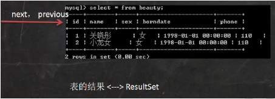
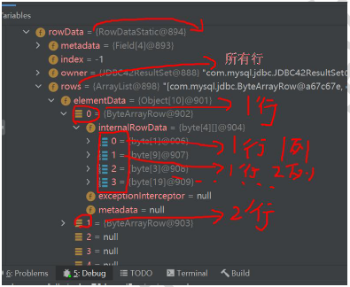
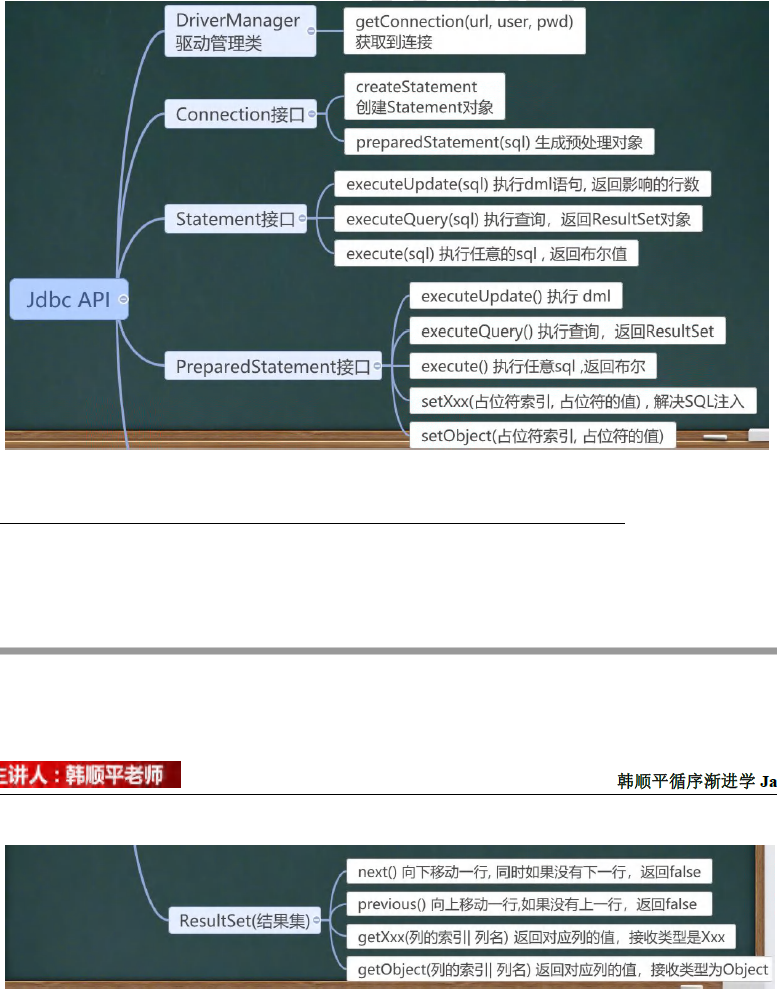

## 第 25 章 JDBC和数据库连接池

### 25.1 JDBC概述

#### 25.1.1 基本介绍

1. JDBC为访问不同的数据库提供了统一的接口，为使用者屏蔽了细节问题。
2. Java程序员使用JDBC，可以连接任何提供了JDBC驱动程序的数据库系统，从而完成对数据库的各种操作。
3. JDBC的基本原理图
4. 模拟JDBC[com.hspedu.jdbc.myjdbc]


#### 25.1.2 模拟JDBC

【JdbcInterface】


#### 25.1.3 JDBC带来的好处


#### 25.1.4 JDBC API

JDBC API是一些列的接口，它统一和规范了应用程序和数据库的连接、执行SQL语句，并到得到返回结果等各类操作，相关类和接口在java.sql与javax.sql包中


### 25.2 JDBC快速入门

#### 25.2.1 JDBC 程序编写步骤

1. 注册驱动 - 加载Driver类
2. 获取连接 - 得到Connection
3. 执行增删改查 - 发送SQL 给mysql执行
4. 释放资源 - 关闭相关连接

#### 25.2.2 JDBC 第一个程序

通过jdbc 对 表 actor 进行 添加，删除和修改操作

```sql
CREATE TABLE actor (
  id INT PRIMARY KEY AUTO_INCREMENT,
  name VARCHAR(32) NOT NULL DEFAULT '',
  sex CHAR(1) NOT NULL DEFAULT '女',
  borndate DATETIME,
  phone VARCHAR(12)
);
```

#### 25.2.3 JDBC 第一个程序

[com.hspedu.jdbc Jdbc01.java]

### 25.3 获取数据库连接 5 种 方式

#### 25.3.1 方式1

[com.hspedu.jdbc.conn JdbcConn.java]

```java
Driver driver = new com.mysql.cj.jdbc.Driver();

String url = "jdbc:mysql://localhost:3306/hsp_db02?serverTimezone=UTC";

Properties info = new Properties();
info.setProperty("user", "root");
info.setProperty("password", "123456");
Connection conn = driver.connect(url, info);
System.out.println(conn);
```

#### 25.3.2 方式2

[JdbcConn.java]

方式1 会直接使用 com.mysql.jdbc.Driver(),属于静态加载，灵活性差，依赖强

```java
//使用反射加载Driver类 , 动态加载，更加的灵活，减少依赖性
Class<?> aClass = Class.forName("com.mysql.cj.jdbc.Driver");
Driver driver = (Driver) aClass.newInstance();

String url = "jdbc:mysql://localhost:3306/hsp_db02?serverTimezone=UTC";
Properties info = new Properties();
info.setProperty("user", "root");
info.setProperty("password", "123456");

Connection connect = driver.connect(url, info);
System.out.println("方式二=" + connect);
```

#### 25.3.3 方式3

使用DriverManager替换Driver

```java
//使用反射加载Driver
Class<?> aClass = Class.forName("com.mysql.cj.jdbc.Driver");
Driver driver = (Driver) aClass.newInstance();

//创建url 和 user 和 password
String url = "jdbc:mysql://localhost:3306/hsp_db02?serverTimezone=UTC";
String user = "root";
String password = "123456";

DriverManager.registerDriver(driver);//注册Driver驱动

Connection connection = DriverManager.getConnection(url, user, password);
System.out.println("第三种方式=" + connection);
```

#### 25.3.4 方式4

使用Class.forName 自动完成注册驱动，简化代码

```java
 Class.forName("com.mysql.cj.jdbc.Driver");

//创建url 和 user 和 password
String url = "jdbc:mysql://localhost:3306/hsp_db02?serverTimezone=UTC";
String user = "root";
String password = "123456";

Connection connection = DriverManager.getConnection(url, user, password);
System.out.println("第四种方式=" + connection);
```

提示：

1. mysql驱动5.1.6可以无需Class.forName("com.mysql.cj.jdbc.Driver");
2. 从jdk1.5以后使用了jdbc4，不再需要显示调用Class.forName()注册驱动而是自动调用驱动jar包下META-INF\services\java.sql.Driver文本中的类名称去注册
3. 建议还是写上Class.foName("com.mysql.cj.jdbc.Driver"),更加明确

#### 25.3.5 方式5

使用配置文件，连接数据库更灵活

1. Connection connection = DriverManager.getConnection("jdbc:mysql://localhost:3306/testdb","root","root");中的字符串 各个值，比如端口，数据库，用户名，密码为了方便，我们可以将信息写入.properties 文件中，方便操作

2. jdbc.properties

   user=root

   password=root

   url=jdbc:mysql://localhost:3306/girls

   driver=com.mysql.cj.jdbc.Driver

#### 25.3.6 课堂练习

使用方式5 完成

1. 创建 news 表
2. 使用jdbc添加5条数据
3. 修改id = 1的记录，将content 改成 一个新的信息
4. 删除id = 3 的记录

### 25.4 ResultSet[结果集]

#### 25.4.1 基本介绍

1. 表示数据库结果集的数据表，通常通过执行查询数据库的语句生成
2. ResultSet对象保持一个光标指向其当前的数据行。最初，光标位于第一行之前
3. next方法将光标移动到下一行，并且由于在ResultSet对象中没有更多行时返回false，因此可以在while循环中使用循环来遍历结果集



#### 25.4.2 应用实例

[com.hspedu.jdbc.resultset_  ResultSet_.java]



### 25.5 Statement

#### 25.5.1 基本介绍

1. Statement对象 用于执行静态SQL语句并返回其生成的结果的对象
2. 在连接建立后，需要对数据库进行访问，执行 命名或是SQL 语句，可以通过
   - Statement[存在SQL注入]
   - PreparedStatement[预处理]
   - CallableStatement[存储过程]
3. Statement对象执行SQL语句，存在SQL注入风险
4. SQL注入是利用某些系统没有对用户输入的数据进行充分的检查，而在用户输入数据中注入非法的 SQL 语句段或命令，恶意攻击数据库。==sql_injection.sql==
5. 要防范SQL注入，只要用 PreparedStatement(从Statement扩展而来)取代 Statement就可以了。

#### 25.5.2 应用实例 【Statement_java】


### 25.6 PreparedStatement

#### 25.6.1 基本介绍

【com.hspedu.preparedstatement_ PreparedStatement_.java】

//编写sql

String sql = "select count(*) from admin where username = ? and password = ?";

1. PreparedStatement 执行的 SQL 语句中的参数用问号(?)来表示，调用PreparedStatement 对象的 setXxx() 方法来设置这些参数.setXxx() 方法有两个参数，第一个参数是要设置的SQL 语句中的参数的索引(从 1 开始),第二个是设置的SQL 语句中的参数的值
2. 调用 executeQuery()，返回 ResultSet 对象
3. 调用 executeUpdate()：执行更新，包括增、删、修改

#### 25.6.2 预处理好处

1. 不再使用+ 拼接sql语句，减少语法错误
2. 有效的解决了sql注入问题！
3. 大大减少了编译次数，效率较高

#### 25.6.3 应用案例

【PreparedStatement_.java】

#### 25.6.4 课堂练习

1. 创建admin表
2. 使用PreparedStatement 添加 5条数据
3. 删除 tom 的记录，将name 改成 king
4. 删除 一条 的记录
5. 查询全部记录，并显示在控制台

### 25.7 JDBC的相关API小结



### 25.8 封装  JDBCUtils 【关闭连接，得到连接】

#### 25.8.1 说明

