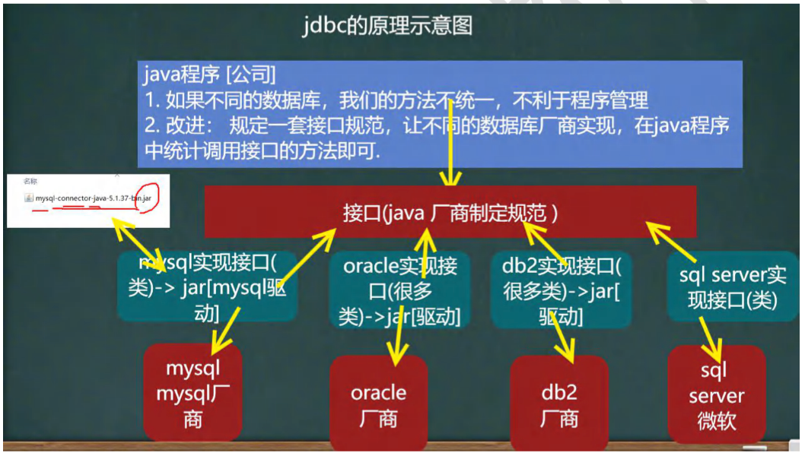
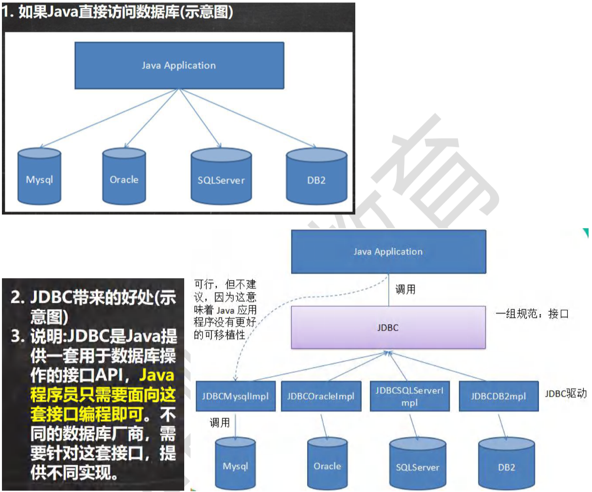
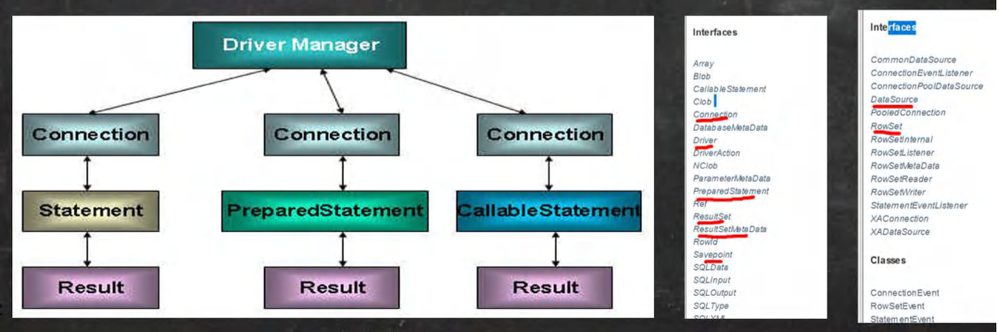

## 第 25 章 JDBC和数据库连接池

### 25.1 JDBC概述

#### 25.1.1 基本介绍

1. JDBC为访问不同的数据库提供了统一的接口，为使用者屏蔽了细节问题。
2. Java程序员使用JDBC，可以连接任何提供了JDBC驱动程序的数据库系统，从而完成对数据库的各种操作。
3. JDBC的基本原理图
4. 模拟JDBC[com.hspedu.jdbc.myjdbc]

#### 25.1.2 模拟JDBC

【JdbcInterface】

#### 25.1.3 JDBC带来的好处

#### 25.1.4 JDBC API

JDBC API是一些列的接口，它统一和规范了应用程序和数据库的连接、执行SQL语句，并到得到返回结果等各类操作，相关类和接口在java.sql与javax.sql包中

### 25.2 JDBC快速入门

#### 25.2.1 JDBC 程序编写步骤

1. 注册驱动 - 加载Driver类
2. 获取连接 - 