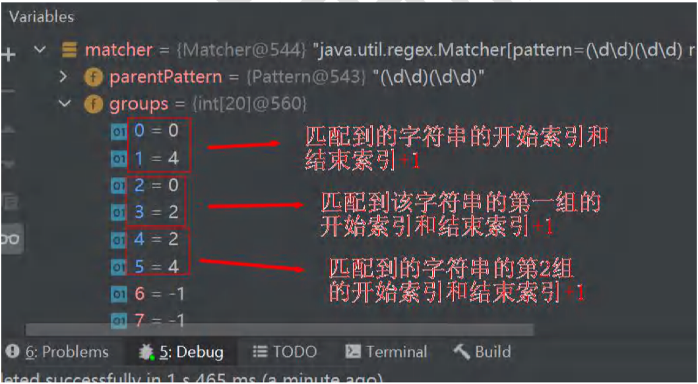
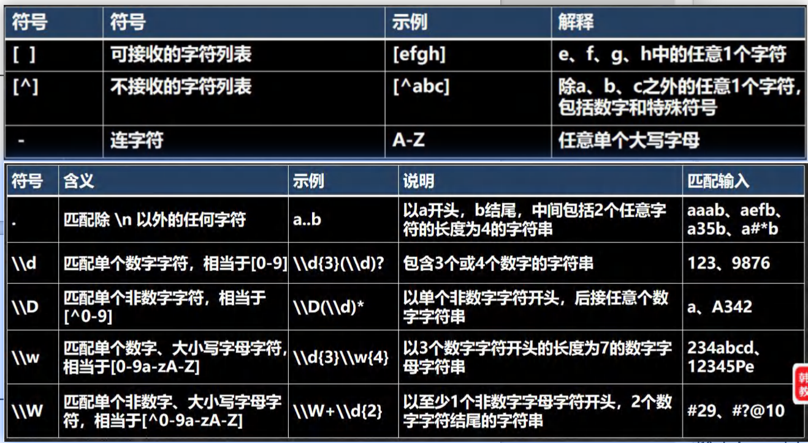
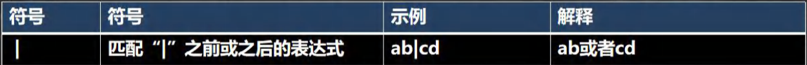
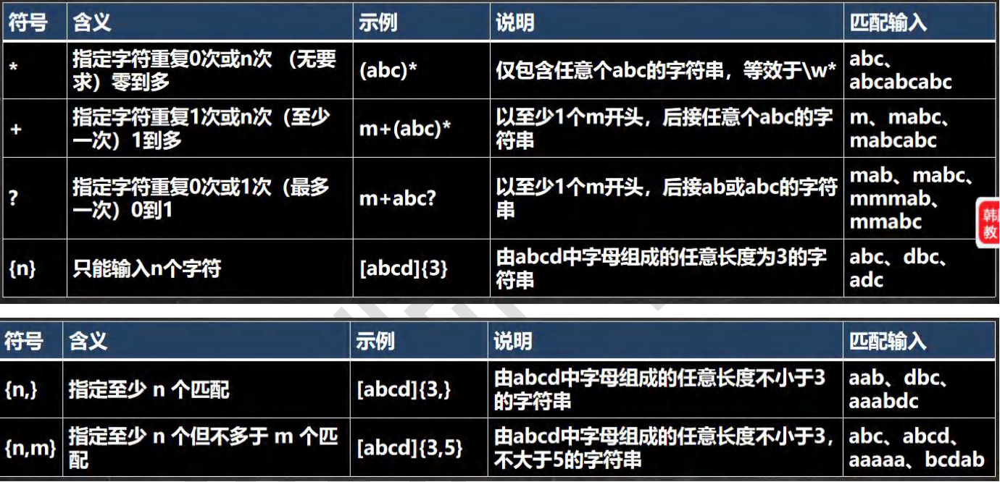
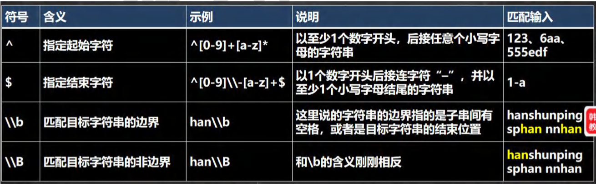
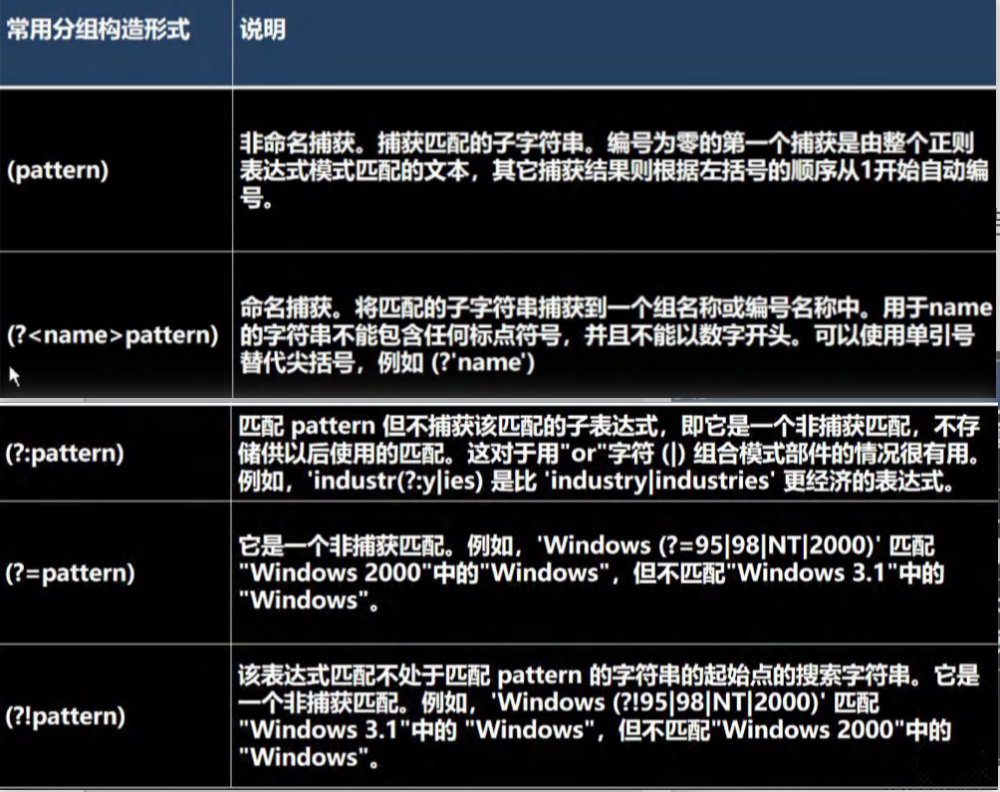

## 第 27 章 正则表达式

### 27.1 为什么要学习正则表达式

#### 27.1.1 极速体验正则表达式威力

[com.hspedu.regexp Regexp_.java]

1. 提取文章中所有的英文单词
2. 提取文章中所有的数字
3. 提取文章中所有的英文单词和数字
4. 提取百度热榜 标题

结论：正则表达式是处理文本的利器

### 27.2 再提出几个问题?

1. 给你一个字符串（或文章），请你找出所有四个数字连在一起的子串？
2. 给你一个字符串（或文章），请你找出所有四个数字连在一起的子串，我且这四个数字要满足：第一位与第四位相同，第二位与第三位相同，比如1221，5775
3. 请验证输入的邮件，是否符合电子邮件格式。
4. 请验证输入的手机号，是否符合手机号格式。

### 27.3 解决之道-正则表达式

1. 为了解决上述问题，Java提供了正则表达式技术，专门用于处理类似文本问题
2. 简单的说：正则表达式是对字符串执行模式匹配的技术
3. 正则表达式：regular expression => RegExp

### 27.4 正则表达式基本介绍

#### 27.4.1 介绍

1. 一个正则表达式，就是用某种模式去匹配字符串的一个公式。
2. 正则表达式不是只有Java才有，实际上很多编程语言都支持正则表达式进行字符串操作！

### 27.5 正则表达式底层实现(重要)

#### 27.5.1 实例分析

给你一段字符串(文本),请找出所有四个数字连在一起的子串， 比如: 应该找到 1998 1999 3443 9889 ===> 分析底层实现 [RegTheory.java]

### 27.6 正则表达式语法

#### 27.6.1 基本介绍

如果要想灵活的运用正则表达式，必须了解其中各种元字符的功能，元字符从功能上大致分为：

1. 限定符
2. 选择匹配符
3. 分组组合和反向引用符
4. 特殊字符
5. 字符匹配符
6. 定位符

#### 27.6.2 元字符(Metacharacter)-转义号 \\

\\ \ 符号 说明：在我们使用正则表达式检索某些特殊字符的时候，需要用到转义符号，否则检索不到结果，甚至会报错的。

提示：

在Java的正则表达式中，两个 \ \ 代表其他语言中的一个\

[RegExp02.java]

需要用到转义符号的字符有以下：. * + ( ) $ / \ ? [ ] ^ { }

#### 27.6.3 元字符-字符匹配符

[RegExp03.java]

#### 27.6.4 元字符-选择匹配符

在匹配某个字符串的时候是选择性的，即：既可以匹配这个，又可以匹配那个，这时需要用到 选择匹配符号 | 

[RegExp04.java]

#### 27.6.5 元字符-限定符

用于指定其前面的字符和组合项连续出现多少次

[RegExp05.java]

#### 27.6.6 元字符-定位符

定位符，规定要匹配的字符串出现的位置，比如在字符串的开始还是在结束的位置

[RegExp06.java]

#### 27.6.7 分组

前两个捕获分组 [RegExp07.java]

后三个非捕获分组 [RegExp08.java]